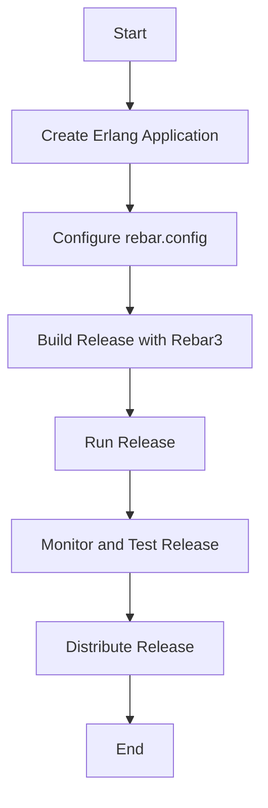

## 22.3 Release Handling with Relx and Rebar3 Releases

In the world of Erlang, managing application releases is a crucial aspect of deployment and operations. Releases encapsulate your application, its dependencies, and the Erlang runtime into a single package, making it easier to deploy and manage in production environments. In this section, we will delve into the process of creating and managing releases using Relx and Rebar3, two powerful tools in the Erlang ecosystem.

### Understanding Erlang Releases

**Releases** in Erlang are self-contained packages that include your application code, dependencies, and the Erlang runtime system. They are designed to simplify the deployment process by providing a consistent and repeatable way to deploy applications across different environments. Releases are particularly important in production settings where stability and reliability are paramount.

#### Importance of Releases

- **Consistency**: Releases ensure that the same version of your application is deployed across different environments, reducing the risk of discrepancies.
- **Isolation**: By packaging the Erlang runtime with your application, releases minimize dependencies on the host system.
- **Ease of Deployment**: Releases simplify the deployment process by providing a single package that can be easily distributed and installed.
- **Version Control**: Releases allow you to manage different versions of your application, making it easier to roll back to a previous version if necessary.

### Introducing Relx and Rebar3

[Relx](https://github.com/erlware/relx) is a release assembler for Erlang applications. It simplifies the process of creating releases by automating many of the tasks involved in packaging your application and its dependencies. Relx integrates seamlessly with Rebar3, a popular build tool for Erlang, to provide a comprehensive solution for building and managing releases.

#### Relx

Relx is designed to be flexible and extensible, allowing you to customize the release process to suit your needs. It supports a wide range of configuration options, enabling you to specify which applications and dependencies should be included in the release, as well as how the release should be structured.

#### Rebar3

Rebar3 is a build tool for Erlang that provides a wide range of features, including dependency management, project scaffolding, and release handling. It integrates with Relx to provide a seamless experience for building and managing releases.

### Creating a Release with Relx and Rebar3

Let's walk through the process of creating a release using Relx and Rebar3. We'll start by setting up a simple Erlang application and then use Relx and Rebar3 to create a release.

#### Step 1: Setting Up Your Erlang Application

First, let's create a new Erlang application using Rebar3. Open your terminal and run the following command:

```shell
rebar3 new app my_app
```

This command will create a new directory called `my_app` with the basic structure of an Erlang application. Navigate into the `my_app` directory:

```shell
cd my_app
```

#### Step 2: Configuring Your Application

Next, open the `rebar.config` file in your favorite text editor. This file is where you'll configure your application's dependencies and release settings. Add the following configuration to the `rebar.config` file:

```erlang
{erl_opts, [debug_info]}.
{deps, []}.

{relx, [
    {release, {my_app, "0.1.0"},
     [my_app,
      sasl]},  % Include the SASL application for logging
    {dev_mode, true},  % Enable development mode for faster iteration
    {include_erts, false},  % Exclude the Erlang runtime for development
    {extended_start_script, true}  % Generate an extended start script
]}.
```

#### Step 3: Building the Release

With your application configured, you can now build the release using Rebar3. Run the following command in your terminal:

```shell
rebar3 release
```

This command will compile your application and create a release in the `_build/default/rel/my_app` directory. The release will include your application, its dependencies, and a start script for running the application.

#### Step 4: Running the Release

To run the release, navigate to the `_build/default/rel/my_app/bin` directory and execute the start script:

```shell
./my_app console
```

This command will start your application in the Erlang shell, allowing you to interact with it and verify that everything is working as expected.

### Configuring Releases

Configuring releases involves specifying which applications and dependencies should be included in the release, as well as how the release should be structured. Relx provides a wide range of configuration options to help you customize the release process.

#### Specifying Applications and Dependencies

In the `rebar.config` file, you can specify which applications and dependencies should be included in the release using the `release` tuple. For example:

```erlang
{release, {my_app, "0.1.0"},
 [my_app,
  sasl,
  lager]}.
```

In this example, the release will include the `my_app`, `sasl`, and `lager` applications.

#### Including the Erlang Runtime

By default, Relx excludes the Erlang runtime from the release. However, in production environments, it's often desirable to include the runtime to ensure that the release is self-contained. You can include the runtime by setting the `include_erts` option to `true`:

```erlang
{include_erts, true}.
```

#### Customizing the Start Script

Relx generates a start script for your release, which you can customize using the `extended_start_script` option. This option enables additional features in the start script, such as support for environment variables and custom command-line arguments:

```erlang
{extended_start_script, true}.
```

### Best Practices for Managing and Distributing Releases

Managing and distributing releases effectively is crucial for ensuring the stability and reliability of your applications. Here are some best practices to consider:

#### Use Version Control

Always use version control to manage your releases. This allows you to track changes over time, roll back to previous versions if necessary, and collaborate with other developers more effectively.

#### Automate the Release Process

Automate the release process as much as possible to reduce the risk of human error. Tools like Rebar3 and Relx can help automate many aspects of the release process, from building and packaging to deployment.

#### Test Releases Thoroughly

Test your releases thoroughly before deploying them to production. This includes testing the application itself, as well as the release package and start script. Consider using automated testing tools and continuous integration pipelines to streamline the testing process.

#### Monitor Releases in Production

Monitor your releases in production to ensure that they are running smoothly and to detect any issues early. Use logging and monitoring tools to track the performance and health of your applications.

#### Keep Releases Small and Focused

Keep your releases small and focused to minimize the risk of introducing bugs and to make it easier to roll back changes if necessary. Consider using feature flags or other techniques to manage the rollout of new features.

### Visualizing the Release Process

To better understand the release process, let's visualize it using a flowchart. This flowchart illustrates the key steps involved in creating and managing a release with Relx and Rebar3.



This flowchart provides a high-level overview of the release process, highlighting the key steps involved in creating, testing, and distributing a release.

### Try It Yourself

Now that we've covered the basics of release handling with Relx and Rebar3, it's time to try it yourself. Here are some suggestions for experimenting with the concepts we've discussed:

- **Modify the `rebar.config` file** to include additional dependencies or customize the release configuration.
- **Create a new Erlang application** and follow the steps outlined in this guide to create a release.
- **Experiment with different configuration options** in Relx to see how they affect the release process.
- **Test your release in different environments** to ensure that it works as expected.

### References and Further Reading

- [Relx GitHub Repository](https://github.com/erlware/relx)
- [Rebar3 Documentation](https://rebar3.readme.io/)
- [Erlang Releases Documentation](https://erlang.org/doc/design_principles/release_structure.html)

### Knowledge Check

To reinforce your understanding of release handling with Relx and Rebar3, consider the following questions:

- What are the benefits of using releases in Erlang?
- How does Relx integrate with Rebar3 to simplify the release process?
- What are some best practices for managing and distributing releases?

### Embrace the Journey

Remember, mastering release handling in Erlang is a journey. As you gain experience, you'll become more proficient in creating and managing releases, ensuring that your applications are stable and reliable in production. Keep experimenting, stay curious, and enjoy the journey!

## Quiz: Release Handling with Relx and Rebar3 Releases



### What is the primary purpose of an Erlang release?

- [x] To package an application, its dependencies, and the Erlang runtime into a single deployable unit.
- [ ] To compile Erlang code into bytecode.
- [ ] To manage version control for Erlang projects.
- [ ] To automate testing of Erlang applications.

> **Explanation:** An Erlang release packages an application, its dependencies, and the Erlang runtime into a single deployable unit, simplifying deployment and ensuring consistency across environments.

### Which tool is used to automate the release process in Erlang?

- [ ] Dialyzer
- [x] Relx
- [ ] EUnit
- [ ] PropEr

> **Explanation:** Relx is used to automate the release process in Erlang, integrating with Rebar3 to simplify the creation and management of releases.

### What is the role of the `rebar.config` file in release handling?

- [x] It specifies the application's dependencies and release configuration.
- [ ] It contains the application's source code.
- [ ] It manages version control for the project.
- [ ] It automates testing of the application.

> **Explanation:** The `rebar.config` file specifies the application's dependencies and release configuration, guiding the release process.

### How can you include the Erlang runtime in a release?

- [ ] By setting `include_erts` to `false` in `rebar.config`.
- [x] By setting `include_erts` to `true` in `rebar.config`.
- [ ] By adding the runtime as a dependency.
- [ ] By compiling the runtime separately.

> **Explanation:** Setting `include_erts` to `true` in `rebar.config` includes the Erlang runtime in the release, making it self-contained.

### What is a best practice for managing releases?

- [x] Automate the release process to reduce human error.
- [ ] Manually compile and package each release.
- [ ] Exclude dependencies from the release package.
- [ ] Use a different version control system for each release.

> **Explanation:** Automating the release process reduces human error and ensures consistency, making it a best practice for managing releases.

### What is the benefit of using an extended start script in a release?

- [x] It supports environment variables and custom command-line arguments.
- [ ] It reduces the size of the release package.
- [ ] It simplifies the application's source code.
- [ ] It automates the testing process.

> **Explanation:** An extended start script supports environment variables and custom command-line arguments, providing flexibility in configuring and running the release.

### How can you test a release in the Erlang shell?

- [ ] By running `erl` with the release package.
- [x] By executing the start script in the release's `bin` directory.
- [ ] By compiling the release with `erlc`.
- [ ] By using the `observer` tool.

> **Explanation:** Executing the start script in the release's `bin` directory starts the application in the Erlang shell, allowing you to test the release.

### What is the purpose of the `dev_mode` option in `rebar.config`?

- [x] To enable faster iteration during development.
- [ ] To include the Erlang runtime in the release.
- [ ] To automate testing of the application.
- [ ] To manage version control for the project.

> **Explanation:** The `dev_mode` option enables faster iteration during development by excluding the Erlang runtime from the release.

### What should you do before deploying a release to production?

- [x] Test the release thoroughly to ensure stability and reliability.
- [ ] Manually compile the release package.
- [ ] Exclude dependencies from the release.
- [ ] Use a different version control system for each release.

> **Explanation:** Testing the release thoroughly ensures stability and reliability, making it a crucial step before deploying to production.

### True or False: Relx can only be used with Rebar3.

- [ ] True
- [x] False

> **Explanation:** While Relx integrates seamlessly with Rebar3, it can also be used independently or with other build tools.


