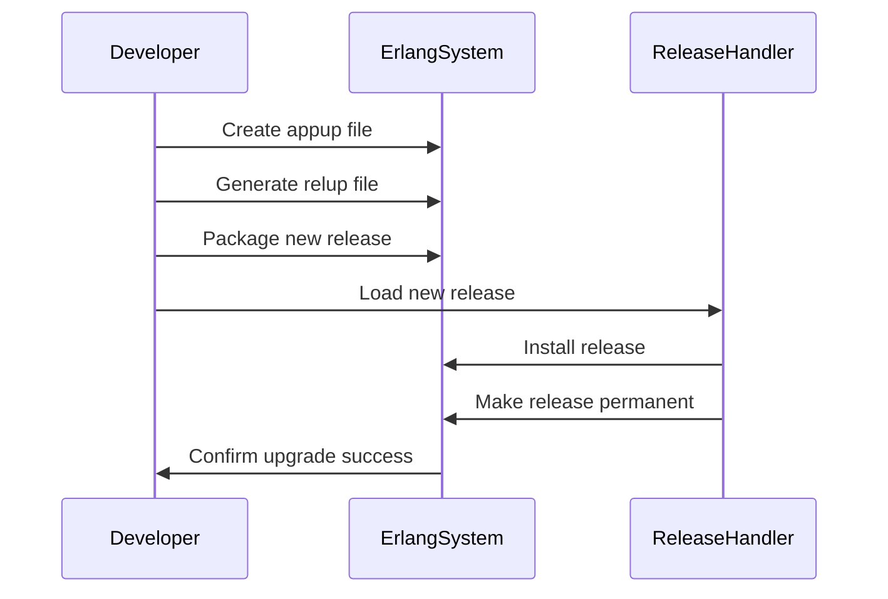

## 22.5 Hot Code Upgrades: Techniques and Best Practices

In the world of software development, minimizing downtime during updates is crucial for maintaining service availability and user satisfaction. Erlang, with its robust concurrency and fault-tolerance capabilities, offers a powerful feature known as hot code upgrades. This allows developers to update code in a running system without stopping it, ensuring continuous operation. In this section, we will explore the concepts, techniques, and best practices for performing hot code upgrades in Erlang.

### Understanding Hot Code Upgrades

Hot code upgrades refer to the process of updating the code of a running Erlang application without stopping the system. This capability is particularly valuable in environments where uptime is critical, such as telecommunications, financial systems, and online services.

#### How Hot Code Upgrades Work

Erlang's ability to perform hot code upgrades is rooted in its design. The Erlang runtime system supports multiple versions of a module to coexist, allowing for a seamless transition from one version to another. When a module is upgraded, the new version is loaded into the system, and processes can gradually switch to using the new code.

### Key Components: Appups and Relups

To facilitate hot code upgrades, Erlang uses two key files: `appup` and `relup`.

#### Appup Files

An `appup` file specifies how to upgrade and downgrade an application. It contains instructions for transitioning from one version of an application to another. The `appup` file is typically named `ModuleName.appup` and is placed in the `ebin` directory of the application.

**Example of an Appup File:**

```erlang
%% my_app.appup
{ "1.1.0", 
  [{ "1.0.0", 
     [ {update, my_module, {advanced, []}} ] 
  }], 
  [{ "1.0.0", 
     [ {update, my_module, {advanced, []}} ] 
  }]
}.
```

In this example, the `appup` file specifies an upgrade from version `1.0.0` to `1.1.0` and a downgrade path.

#### Relup Files

A `relup` file is generated from `appup` files and contains instructions for upgrading an entire release. It is created during the release packaging process and is used by the release handler to perform the upgrade.

### Preparing for a Hot Code Upgrade

Before executing a hot code upgrade, several preparatory steps are necessary to ensure a smooth transition.

#### Step 1: Version Compatibility

Ensure that the new version of your application is backward compatible with the old version. This involves maintaining consistent interfaces and data structures.

#### Step 2: Write Appup Instructions

Create an `appup` file with detailed instructions for upgrading and downgrading each module. Consider using the `advanced` upgrade strategy for complex transitions.

#### Step 3: Test the Upgrade

Thoroughly test the upgrade process in a staging environment. Simulate real-world scenarios to identify potential issues.

### Executing a Hot Code Upgrade

Once preparation is complete, follow these steps to execute the upgrade:

#### Step 1: Generate the Relup File

Use the `systools` module to generate a `relup` file from your `appup` files.

```erlang
systools:make_relup("my_app-1.1.0", ["my_app-1.0.0"], ["my_app-1.0.0"]).
```

#### Step 2: Package the Release

Create a new release package that includes the updated code and the `relup` file.

```shell
rebar3 release
```

#### Step 3: Load the New Release

Use the `release_handler` module to load the new release into the running system.

```erlang
release_handler:install_release("my_app-1.1.0").
```

#### Step 4: Perform the Upgrade

Execute the upgrade using the `release_handler`.

```erlang
release_handler:make_permanent("my_app-1.1.0").
```

### Best Practices for Hot Code Upgrades

To ensure successful hot code upgrades, adhere to the following best practices:

#### Maintain Version Compatibility

Design your application to be backward compatible. Avoid breaking changes in interfaces and data structures.

#### Use Advanced Upgrade Strategies

For complex upgrades, use the `advanced` strategy in your `appup` file to handle state transitions and process migrations.

#### Thoroughly Test Upgrades

Test the upgrade process in a controlled environment. Verify that the system behaves as expected after the upgrade.

#### Monitor the System

After performing an upgrade, monitor the system for any anomalies or performance issues. Be prepared to roll back if necessary.

#### Document the Upgrade Process

Maintain detailed documentation of the upgrade process, including instructions for handling potential issues.

### Limitations and When to Use Hot Code Upgrades

While hot code upgrades are powerful, they are not suitable for every situation. Consider the following limitations:

- **Complexity**: Hot code upgrades can be complex, especially for large systems with intricate dependencies.
- **State Management**: Managing state transitions during an upgrade can be challenging.
- **Testing**: Thorough testing is required to ensure a smooth upgrade.

Use hot code upgrades when uptime is critical, and the benefits outweigh the complexity. For simpler systems or non-critical updates, consider alternative deployment strategies.

### Visualizing the Hot Code Upgrade Process

To better understand the hot code upgrade process, let's visualize it using a sequence diagram.



This diagram illustrates the sequence of actions involved in performing a hot code upgrade, from creating the `appup` file to making the release permanent.

### Try It Yourself

To deepen your understanding, try performing a hot code upgrade on a simple Erlang application. Modify the code, create `appup` and `relup` files, and execute the upgrade process. Experiment with different upgrade strategies and observe the effects.

### Knowledge Check

- What are the key components of a hot code upgrade in Erlang?
- How does Erlang support multiple versions of a module?
- What is the purpose of an `appup` file?
- Why is version compatibility important in hot code upgrades?
- What are some best practices for testing hot code upgrades?

### Embrace the Journey

Remember, mastering hot code upgrades is a journey. As you gain experience, you'll become more adept at managing complex upgrades and ensuring seamless transitions. Keep experimenting, stay curious, and enjoy the process!

## Quiz: Hot Code Upgrades: Techniques and Best Practices



### What is a hot code upgrade in Erlang?

- [x] Updating code in a running system without stopping it
- [ ] Restarting the system to apply code changes
- [ ] Deploying a new version of the application
- [ ] Removing old code from the system

> **Explanation:** A hot code upgrade allows for updating code in a running system without stopping it, ensuring continuous operation.

### What is the purpose of an `appup` file?

- [x] To specify upgrade and downgrade instructions for an application
- [ ] To store application configuration settings
- [ ] To manage application dependencies
- [ ] To compile Erlang modules

> **Explanation:** An `appup` file contains instructions for upgrading and downgrading an application, facilitating hot code upgrades.

### Which module is used to generate a `relup` file?

- [x] `systools`
- [ ] `release_handler`
- [ ] `rebar3`
- [ ] `erl`

> **Explanation:** The `systools` module is used to generate a `relup` file from `appup` files.

### What is a best practice for ensuring successful hot code upgrades?

- [x] Thoroughly test the upgrade process in a staging environment
- [ ] Perform upgrades directly in the production environment
- [ ] Avoid using version control for code changes
- [ ] Ignore backward compatibility

> **Explanation:** Thoroughly testing the upgrade process in a staging environment helps identify potential issues before deploying to production.

### What is a limitation of hot code upgrades?

- [x] Complexity in managing state transitions
- [ ] Inability to update code without downtime
- [ ] Lack of support for multiple module versions
- [ ] Requirement to restart the system

> **Explanation:** Managing state transitions during an upgrade can be complex, making hot code upgrades challenging.

### What strategy should be used for complex upgrades?

- [x] Advanced upgrade strategy
- [ ] Basic upgrade strategy
- [ ] Manual upgrade strategy
- [ ] Automated upgrade strategy

> **Explanation:** The advanced upgrade strategy is recommended for handling complex transitions and process migrations.

### What should be done after performing a hot code upgrade?

- [x] Monitor the system for anomalies
- [ ] Immediately perform another upgrade
- [ ] Delete the old code version
- [ ] Disable system logging

> **Explanation:** Monitoring the system for anomalies helps ensure the upgrade was successful and allows for quick response to any issues.

### When is it appropriate to use hot code upgrades?

- [x] When uptime is critical and the benefits outweigh the complexity
- [ ] For non-critical updates
- [ ] When the system can be easily restarted
- [ ] For small, simple systems

> **Explanation:** Hot code upgrades are appropriate when uptime is critical and the benefits outweigh the complexity involved.

### What is the role of the `release_handler` module?

- [x] To load and install new releases in the running system
- [ ] To compile Erlang modules
- [ ] To manage application dependencies
- [ ] To generate `appup` files

> **Explanation:** The `release_handler` module is responsible for loading and installing new releases in the running system.

### True or False: Hot code upgrades are suitable for every situation.

- [ ] True
- [x] False

> **Explanation:** Hot code upgrades are not suitable for every situation due to their complexity and the challenges involved in managing state transitions.


