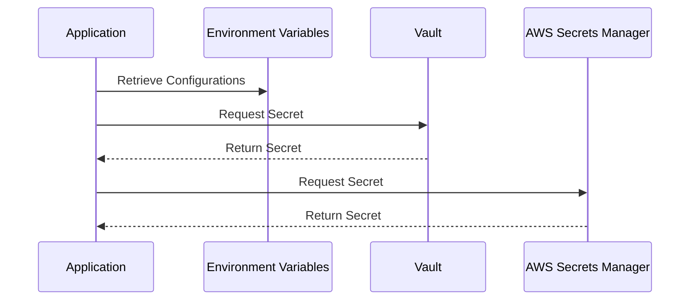

## 22.6 Managing Configuration and Secrets

In the realm of software deployment and operations, managing configuration and secrets securely is paramount. This section delves into the strategies and tools available for handling configuration data and secrets in Erlang applications, ensuring that sensitive information is protected throughout the application's lifecycle.

### Understanding Configuration and Secrets

Before diving into the methods and tools, let's clarify what we mean by configuration and secrets:

- **Configuration**: This refers to the settings and parameters that define how an application behaves. Examples include database connection strings, API endpoints, and feature flags.
- **Secrets**: These are sensitive pieces of information that need protection, such as passwords, API keys, and encryption keys.

### Storing and Retrieving Configuration Data

Managing configuration data effectively involves choosing the right storage mechanism and retrieval strategy. Here are some common approaches:

#### 1. Configuration Files

Configuration files are a traditional and straightforward method for storing application settings. They can be in formats like JSON, YAML, or INI. However, they must be handled with care to avoid exposing sensitive information.

**Example: JSON Configuration File**

```json
{
  "database": {
    "host": "localhost",
    "port": 5432,
    "username": "dbuser",
    "password": "securepassword"
  },
  "api": {
    "endpoint": "https://api.example.com",
    "key": "apikey123"
  }
}
```

**Best Practices:**

- **Avoid Hardcoding Secrets**: Never hardcode secrets directly in configuration files.
- **Use Environment Variables**: For sensitive data, consider using environment variables to override file-based configurations.

#### 2. Environment Variables

Environment variables provide a secure way to manage configuration data, especially secrets, without embedding them in code or configuration files.

**Example: Setting Environment Variables**

```bash
export DB_USERNAME=dbuser
export DB_PASSWORD=securepassword
```

**Erlang Code to Access Environment Variables:**

```erlang
% Accessing environment variables in Erlang
DbUsername = os:getenv("DB_USERNAME"),
DbPassword = os:getenv("DB_PASSWORD").
```

**Best Practices:**

- **Secure Access**: Ensure that only authorized processes can access these variables.
- **Use a Consistent Naming Convention**: This helps in managing and identifying variables easily.

#### 3. Configuration Management Tools

Tools like Ansible, Chef, and Puppet can automate the deployment and management of configuration files across environments, ensuring consistency and reducing manual errors.

### Managing Secrets with Tools

Managing secrets securely is crucial to prevent unauthorized access and data breaches. Let's explore some tools that can help:

#### 1. HashiCorp Vault

[Vault](https://www.vaultproject.io/) is a popular tool for managing secrets and protecting sensitive data. It provides a secure interface for accessing secrets and supports dynamic secrets, encryption as a service, and more.

**Key Features:**

- **Dynamic Secrets**: Generate secrets on-demand for short-lived access.
- **Encryption as a Service**: Encrypt data without managing encryption keys directly.
- **Access Control**: Fine-grained policies to control who can access what.

**Example: Using Vault with Erlang**

To integrate Vault with Erlang, you can use the `vault` Erlang client library. Here's a basic example of retrieving a secret:

```erlang
% Assuming you have a Vault server running and configured
{ok, Client} = vault:new([{host, "https://vault.example.com"}]),
{ok, Secret} = vault:read(Client, "secret/data/myapp").
```

**Best Practices:**

- **Use Policies**: Define policies to restrict access to secrets based on roles.
- **Audit Logs**: Enable auditing to track access and changes to secrets.

#### 2. Cloud-Based Secret Managers

Cloud providers offer secret management services that integrate seamlessly with their ecosystems. Examples include AWS Secrets Manager, Google Cloud Secret Manager, and Azure Key Vault.

**AWS Secrets Manager Example:**

AWS Secrets Manager allows you to store, retrieve, and manage secrets securely. Here's how you can use it with Erlang:

```erlang
% Using AWS SDK for Erlang to access Secrets Manager
{ok, SecretValue} = aws_secretsmanager:get_secret_value("my_secret_id").
```

**Best Practices:**

- **Rotate Secrets Regularly**: Automate the rotation of secrets to minimize the risk of exposure.
- **Use IAM Policies**: Control access to secrets using AWS Identity and Access Management (IAM) policies.

### Best Practices for Securing Sensitive Information

Securing sensitive information involves more than just using the right tools. Here are some best practices to follow:

#### 1. Encryption

- **Encrypt Data at Rest**: Use encryption to protect data stored in databases, files, and backups.
- **Encrypt Data in Transit**: Use TLS/SSL to secure data transmitted over networks.

#### 2. Access Control

- **Principle of Least Privilege**: Grant access only to those who need it.
- **Role-Based Access Control (RBAC)**: Use roles to manage permissions and access levels.

#### 3. Auditing and Monitoring

- **Enable Auditing**: Track access to secrets and configuration changes.
- **Monitor for Anomalies**: Set up alerts for unusual access patterns or changes.

### Visualizing Configuration and Secrets Management

To better understand the flow of managing configuration and secrets, let's visualize the process using a sequence diagram.



**Diagram Explanation:**

- The application retrieves configurations from environment variables.
- It requests secrets from Vault and AWS Secrets Manager, receiving them securely.

### Knowledge Check

Before we wrap up, let's reinforce what we've learned with a few questions:

- What are the advantages of using environment variables for configuration management?
- How does Vault enhance the security of managing secrets?
- Why is it important to encrypt data both at rest and in transit?

### Try It Yourself

Experiment with the examples provided by:

- Modifying the JSON configuration file to include additional settings.
- Setting up a local Vault server and retrieving secrets using the Erlang client.
- Using AWS Secrets Manager to store and retrieve a new secret.

### Conclusion

Managing configuration and secrets is a critical aspect of deploying and operating Erlang applications securely. By leveraging tools like Vault and cloud-based secret managers, and adhering to best practices for encryption and access control, we can protect sensitive information effectively.

Remember, this is just the beginning. As you continue to build and deploy applications, keep exploring and refining your approach to managing configuration and secrets. Stay curious, and enjoy the journey!

## Quiz: Managing Configuration and Secrets



### Which of the following is a benefit of using environment variables for configuration management?

- [x] They keep sensitive data out of source code.
- [ ] They are always encrypted by default.
- [ ] They automatically rotate secrets.
- [ ] They provide a graphical interface for management.

> **Explanation:** Environment variables help keep sensitive data out of source code, reducing the risk of exposure.

### What is a key feature of HashiCorp Vault?

- [x] Dynamic Secrets
- [ ] Built-in database management
- [ ] Automatic code deployment
- [ ] Real-time analytics

> **Explanation:** Vault's dynamic secrets feature allows for generating secrets on-demand, enhancing security.

### Why is it important to encrypt data in transit?

- [x] To protect data from being intercepted during transmission.
- [ ] To reduce storage costs.
- [ ] To improve application performance.
- [ ] To comply with all international laws.

> **Explanation:** Encrypting data in transit protects it from being intercepted and read by unauthorized parties.

### Which tool is used for managing secrets in AWS?

- [x] AWS Secrets Manager
- [ ] AWS CloudWatch
- [ ] AWS Lambda
- [ ] AWS S3

> **Explanation:** AWS Secrets Manager is specifically designed for managing secrets in AWS environments.

### What is the principle of least privilege?

- [x] Granting only the necessary access to users.
- [ ] Allowing all users full access by default.
- [ ] Encrypting all data at rest.
- [ ] Using environment variables for all configurations.

> **Explanation:** The principle of least privilege involves granting users only the access they need to perform their tasks.

### How can auditing enhance security in managing secrets?

- [x] By tracking access and changes to secrets.
- [ ] By automatically encrypting all data.
- [ ] By providing a user-friendly interface.
- [ ] By reducing the need for encryption.

> **Explanation:** Auditing tracks access and changes, helping to identify unauthorized access or modifications.

### What is a common format for configuration files?

- [x] JSON
- [ ] PDF
- [ ] DOCX
- [ ] MP3

> **Explanation:** JSON is a common format for configuration files due to its simplicity and readability.

### Which of the following is a cloud-based secret manager?

- [x] Google Cloud Secret Manager
- [ ] Google Cloud Storage
- [ ] Google Cloud Functions
- [ ] Google Cloud Pub/Sub

> **Explanation:** Google Cloud Secret Manager is used for managing secrets in Google Cloud environments.

### What is a benefit of using role-based access control (RBAC)?

- [x] It simplifies permission management by grouping users into roles.
- [ ] It automatically encrypts all data.
- [ ] It provides real-time analytics.
- [ ] It reduces the need for environment variables.

> **Explanation:** RBAC simplifies permission management by allowing permissions to be assigned to roles rather than individual users.

### True or False: Encrypting data at rest is only necessary for financial applications.

- [ ] True
- [x] False

> **Explanation:** Encrypting data at rest is important for all applications that handle sensitive information, not just financial ones.


