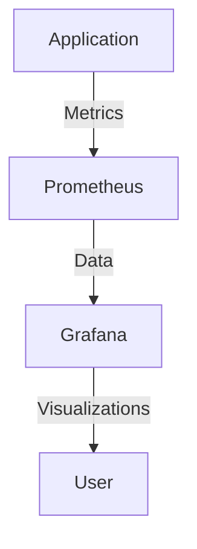

## 22.7 Monitoring Application Health with `observer` and Custom Tools

In the world of Erlang, where concurrency and fault tolerance are paramount, monitoring application health is crucial for maintaining optimal performance and reliability. This section delves into the use of the `observer` tool, a powerful built-in utility in Erlang, and explores how to create custom monitoring solutions to ensure your applications run smoothly.

### Introduction to `observer`

The [`observer`](http://erlang.org/doc/man/observer.html) tool is an essential part of the Erlang ecosystem, providing a graphical interface to monitor various aspects of your Erlang system. It offers insights into process lists, CPU and memory usage, message queues, and more. By leveraging `observer`, developers can gain a comprehensive understanding of their application's runtime behavior.

#### Key Features of `observer`

- **Process Monitoring**: View detailed information about running processes, including their state, memory usage, and message queue length.
- **System Statistics**: Monitor CPU and memory usage to identify potential bottlenecks.
- **Application Supervision**: Observe the supervision tree to ensure fault tolerance mechanisms are functioning correctly.
- **Network Monitoring**: Track network connections and traffic to diagnose connectivity issues.

### Using `observer` to Monitor Erlang Applications

Let's explore how to use `observer` to monitor various aspects of an Erlang application.

#### Monitoring Process Lists

The process list is a crucial component in understanding the state of your application. It provides information about each process, including its PID, registered name, current function, and memory usage.

```erlang
% Start the observer tool
observer:start().
```

Once `observer` is running, navigate to the "Processes" tab to view the list of all processes. Here, you can:

- **Identify Long-Running Processes**: Look for processes that have been running for an extended period, which may indicate a potential issue.
- **Analyze Memory Usage**: Check the memory consumption of each process to identify memory leaks or inefficient memory usage.
- **Examine Message Queues**: Processes with large message queues may be bottlenecks, requiring further investigation.

#### Monitoring CPU and Memory Usage

Understanding CPU and memory usage is vital for optimizing performance. The "System" tab in `observer` provides real-time statistics on CPU load and memory consumption.

- **CPU Usage**: Monitor the CPU load to ensure your application is not overloading the system. High CPU usage may indicate inefficient algorithms or excessive concurrency.
- **Memory Usage**: Keep an eye on memory consumption to prevent out-of-memory errors. Look for processes with unusually high memory usage.

#### Monitoring Message Queues

Message queues are a critical aspect of Erlang's concurrency model. The "Processes" tab in `observer` allows you to inspect the length of message queues for each process.

- **Identify Bottlenecks**: Processes with long message queues may be unable to process messages quickly enough, leading to performance degradation.
- **Optimize Message Handling**: Consider optimizing the message handling logic or increasing the process's processing capacity.

### Creating Custom Monitoring Tools

While `observer` provides a comprehensive overview of your Erlang system, custom monitoring tools can offer tailored insights specific to your application's needs. Erlang's rich set of APIs allows developers to create bespoke monitoring solutions.

#### Using Erlang APIs for Custom Monitoring

Erlang provides several built-in modules that can be leveraged to create custom monitoring tools:

- **`erlang:process_info/1`**: Retrieve information about a specific process, such as its state, memory usage, and message queue length.
- **`erlang:memory/0`**: Obtain detailed memory usage statistics for the entire system.
- **`erlang:statistics/1`**: Gather various system statistics, including CPU time and reductions.

Here's an example of a simple custom monitoring tool that logs process information:

```erlang
-module(custom_monitor).
-export([log_process_info/1]).

log_process_info(Pid) ->
    Info = erlang:process_info(Pid),
    io:format("Process ~p info: ~p~n", [Pid, Info]).
```

#### Proactive Monitoring and Alerting

Proactive monitoring involves setting up alerts to notify you of potential issues before they escalate into critical problems. Consider integrating your custom monitoring tools with alerting systems to receive notifications based on predefined thresholds.

- **CPU and Memory Alerts**: Set thresholds for CPU and memory usage to detect resource exhaustion early.
- **Message Queue Alerts**: Monitor message queue lengths and alert when they exceed acceptable limits.

### Incorporating Monitoring into Operational Workflows

Monitoring should be an integral part of your operational workflows. By incorporating monitoring into your development and deployment processes, you can ensure that your applications remain healthy and performant.

#### Best Practices for Monitoring

- **Regularly Review Monitoring Data**: Make it a habit to review monitoring data regularly to identify trends and potential issues.
- **Automate Monitoring Tasks**: Use automation tools to streamline monitoring tasks and reduce manual intervention.
- **Integrate with CI/CD Pipelines**: Incorporate monitoring checks into your continuous integration and deployment pipelines to catch issues early.

### Visualizing Monitoring Data

Visualizing monitoring data can provide valuable insights into your application's performance. Consider using tools like Grafana or Prometheus to create dashboards that display key metrics in real-time.



*Diagram: Visualizing Erlang Application Metrics with Prometheus and Grafana*

### Conclusion

Monitoring is a critical aspect of maintaining the health and performance of Erlang applications. By leveraging tools like `observer` and creating custom monitoring solutions, you can gain valuable insights into your application's behavior and proactively address potential issues. Remember, effective monitoring is not just about collecting data—it's about using that data to make informed decisions and improve your application's reliability.

## Quiz: Monitoring Application Health with `observer` and Custom Tools



### What is the primary purpose of the `observer` tool in Erlang?

- [x] To monitor the health and performance of Erlang applications
- [ ] To compile Erlang code
- [ ] To manage dependencies
- [ ] To deploy Erlang applications

> **Explanation:** The `observer` tool is used to monitor the health and performance of Erlang applications by providing insights into processes, CPU and memory usage, and more.

### Which tab in `observer` provides information about running processes?

- [x] Processes
- [ ] System
- [ ] Applications
- [ ] Network

> **Explanation:** The "Processes" tab in `observer` provides detailed information about running processes, including their state and memory usage.

### How can you identify bottlenecks in an Erlang application using `observer`?

- [x] By examining processes with long message queues
- [ ] By checking the application supervision tree
- [ ] By monitoring network connections
- [ ] By reviewing the codebase

> **Explanation:** Processes with long message queues may indicate bottlenecks, as they are unable to process messages quickly enough.

### What Erlang API can be used to retrieve information about a specific process?

- [x] `erlang:process_info/1`
- [ ] `erlang:memory/0`
- [ ] `erlang:statistics/1`
- [ ] `erlang:monitor/2`

> **Explanation:** The `erlang:process_info/1` API retrieves information about a specific process, such as its state and memory usage.

### What is a key benefit of proactive monitoring and alerting?

- [x] Detecting potential issues before they become critical
- [ ] Reducing application size
- [ ] Improving code readability
- [ ] Enhancing user interface design

> **Explanation:** Proactive monitoring and alerting help detect potential issues before they escalate into critical problems, ensuring application reliability.

### Which tool can be used to visualize Erlang application metrics in real-time?

- [x] Grafana
- [ ] Rebar3
- [ ] Dialyzer
- [ ] EDoc

> **Explanation:** Grafana is a popular tool for visualizing application metrics in real-time, providing valuable insights into performance.

### What should be incorporated into CI/CD pipelines to catch issues early?

- [x] Monitoring checks
- [ ] Code formatting
- [ ] Dependency updates
- [ ] User feedback

> **Explanation:** Incorporating monitoring checks into CI/CD pipelines helps catch issues early in the development and deployment processes.

### What is a common sign of a memory leak in an Erlang application?

- [x] Unusually high memory usage by a process
- [ ] Low CPU usage
- [ ] Short message queues
- [ ] Frequent process restarts

> **Explanation:** Unusually high memory usage by a process may indicate a memory leak, which requires further investigation.

### What is the role of the "System" tab in `observer`?

- [x] To provide real-time statistics on CPU and memory usage
- [ ] To display the supervision tree
- [ ] To list network connections
- [ ] To show application logs

> **Explanation:** The "System" tab in `observer` provides real-time statistics on CPU and memory usage, helping identify potential bottlenecks.

### True or False: Custom monitoring tools can be created using Erlang's built-in APIs.

- [x] True
- [ ] False

> **Explanation:** True. Erlang's built-in APIs, such as `erlang:process_info/1` and `erlang:memory/0`, can be used to create custom monitoring tools tailored to specific application needs.



Remember, this is just the beginning. As you progress, you'll build more complex and interactive monitoring solutions. Keep experimenting, stay curious, and enjoy the journey!
