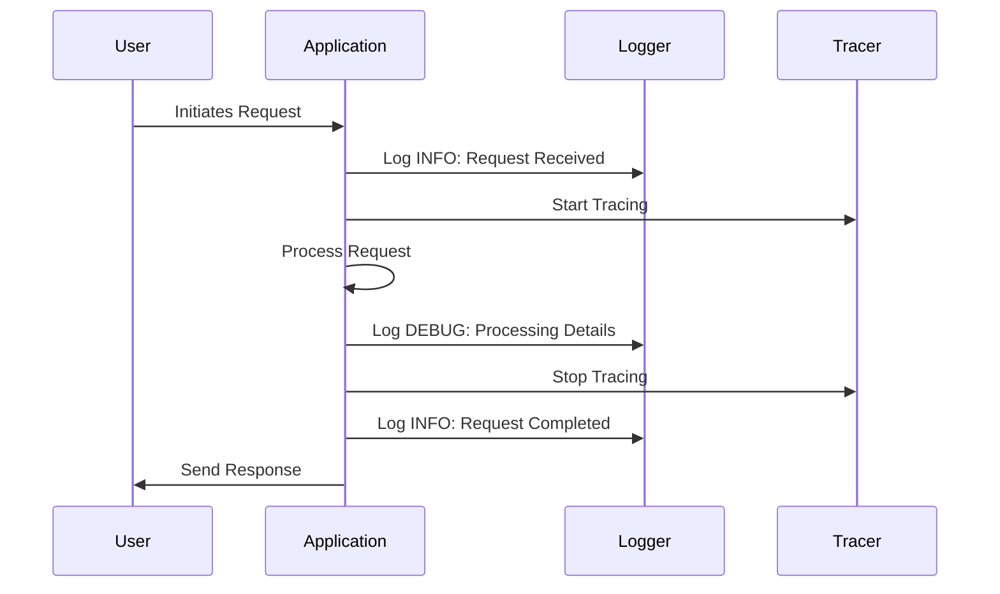

## 22.8 Logging and Tracing in Production Environments

In the realm of software development, especially in production environments, logging and tracing are indispensable tools. They provide insights into the behavior of applications, help in diagnosing issues, and ensure that systems run smoothly. In this section, we will delve into the best practices for logging and tracing in Erlang applications, focusing on structuring log messages, using appropriate log levels, and employing tools like `dbg` and `recon` for tracing. We will also discuss how to minimize performance impacts and ensure compliance with data privacy regulations.

### The Role of Logging and Tracing

Logging and tracing serve as the eyes and ears of a production system. They allow developers and operators to:

- **Monitor Application Health**: By continuously logging key metrics and events, you can monitor the health of your application and detect anomalies early.
- **Diagnose Issues**: When problems arise, logs and traces provide the necessary context to understand what went wrong and why.
- **Understand Application Behavior**: Tracing helps you understand the flow of execution and the interactions between different components of your application.
- **Ensure Compliance**: Proper logging can help ensure compliance with regulatory requirements by providing an audit trail of system activities.

### Structuring Log Messages and Log Levels

Effective logging starts with well-structured log messages and the appropriate use of log levels. Here are some guidelines:

#### Structuring Log Messages

1. **Include Contextual Information**: Ensure that each log message contains enough context to be useful. This might include timestamps, process IDs, module names, and relevant variable values.

2. **Use a Consistent Format**: Adopt a consistent format for log messages to make them easier to parse and analyze. Consider using structured logging formats like JSON for machine-readability.

3. **Be Descriptive but Concise**: Log messages should be descriptive enough to convey the necessary information but concise to avoid clutter.

4. **Include Unique Identifiers**: Use unique identifiers for requests or transactions to trace them across different components.

#### Log Levels

Log levels help categorize the importance and severity of log messages. Common log levels include:

- **DEBUG**: Detailed information, typically of interest only when diagnosing problems.
- **INFO**: Confirmation that things are working as expected.
- **WARN**: An indication that something unexpected happened, or indicative of some problem in the near future (e.g., ‘disk space low’). The software is still working as expected.
- **ERROR**: Due to a more serious problem, the software has not been able to perform some function.
- **FATAL**: Severe errors that cause premature termination. Expect these to be immediately visible on a status dashboard.

### Tools for Tracing in Erlang

Erlang provides several tools for tracing, which are crucial for understanding the flow of execution and diagnosing issues in production environments.

#### Using `dbg` for Tracing

The `dbg` module in Erlang is a powerful tool for tracing function calls, message passing, and process events. Here’s how you can use it:

```erlang
% Start the debugger
dbg:start().

% Tracing all function calls in a module
dbg:tpl(my_module, dbg:fun2ms(fun(_) -> return_trace() end)).

% Tracing message passing
dbg:tp(my_module, my_function, dbg:fun2ms(fun(_) -> return_trace() end)).

% Enable tracing
dbg:p(all, c).

% Stop tracing
dbg:stop().
```

**Key Points**:
- `dbg:start()` initializes the debugger.
- `dbg:tpl/2` sets a trace pattern for function calls.
- `dbg:tp/3` sets a trace pattern for specific functions.
- `dbg:p/2` enables tracing for all processes.
- `dbg:stop()` stops the tracing.

#### Leveraging `recon` for Advanced Tracing

`recon` is an Erlang library that provides advanced tracing capabilities with minimal performance impact. It is particularly useful for production environments. Here’s an example of using `recon`:

```erlang
% Install recon from Hex
% Add {:recon, "~> 2.5"} to your mix.exs dependencies

% Tracing a specific process
recon_trace:call(pid, my_module, my_function, [], 100).

% Tracing all processes for a specific function
recon_trace:call(my_module, my_function, [], 100).

% Stop tracing
recon_trace:clear().
```

**Key Points**:
- `recon_trace:call/4` traces function calls for a specific process or module.
- `recon_trace:clear()` stops the tracing.

### Best Practices for Minimizing Performance Impact

While logging and tracing are essential, they can introduce performance overhead. Here are some best practices to minimize this impact:

1. **Use Asynchronous Logging**: Asynchronous logging can help reduce the performance impact by offloading log writing to a separate process.

2. **Filter Logs at the Source**: Avoid logging unnecessary information by filtering logs at the source. Use log levels to control the verbosity.

3. **Batch Log Writes**: Batch log writes to reduce the frequency of I/O operations.

4. **Use Efficient Data Structures**: Use efficient data structures for storing and processing logs.

5. **Monitor Logging Overhead**: Continuously monitor the overhead introduced by logging and adjust configurations as needed.

### Compliance with Data Privacy Regulations

In production environments, it is crucial to ensure that logging and tracing practices comply with data privacy regulations such as GDPR or HIPAA. Here are some guidelines:

1. **Avoid Logging Sensitive Information**: Ensure that sensitive information, such as personal data or credentials, is not logged.

2. **Anonymize Data**: Anonymize or pseudonymize data where possible to protect user privacy.

3. **Implement Access Controls**: Restrict access to logs and traces to authorized personnel only.

4. **Retain Logs Securely**: Store logs securely and ensure they are encrypted both at rest and in transit.

5. **Define Retention Policies**: Define and enforce log retention policies to ensure logs are not kept longer than necessary.

### Try It Yourself

To get hands-on experience with logging and tracing in Erlang, try modifying the code examples provided above. Experiment with different log levels, trace patterns, and observe how they affect the performance and behavior of your application. Consider setting up a small Erlang application and use `dbg` and `recon` to trace its execution.

### Visualizing Erlang Tracing

Below is a sequence diagram illustrating the flow of tracing in an Erlang application using `dbg`:



**Diagram Description**: This sequence diagram shows the interaction between a user, an application, a logger, and a tracer. It highlights the key points where logging and tracing occur during the processing of a request.

### Knowledge Check

- **Question**: Why is it important to use different log levels in production environments?
- **Exercise**: Set up a simple Erlang application and implement logging with different log levels. Observe how changing the log level affects the output.

### Summary

In this section, we explored the importance of logging and tracing in production environments, focusing on Erlang applications. We discussed how to structure log messages, use appropriate log levels, and leverage tools like `dbg` and `recon` for tracing. We also highlighted best practices for minimizing performance impact and ensuring compliance with data privacy regulations. Remember, effective logging and tracing are crucial for maintaining robust and reliable production systems.

### Quiz: Logging and Tracing in Production Environments



### What is the primary purpose of logging in production environments?

- [x] To monitor application health and diagnose issues
- [ ] To increase application performance
- [ ] To replace documentation
- [ ] To reduce code complexity

> **Explanation:** Logging helps monitor application health and diagnose issues by providing insights into the application's behavior.

### Which log level is typically used for detailed information useful for diagnosing problems?

- [ ] INFO
- [ ] WARN
- [x] DEBUG
- [ ] ERROR

> **Explanation:** The DEBUG log level is used for detailed information that is typically of interest only when diagnosing problems.

### What is the role of the `dbg` module in Erlang?

- [x] To trace function calls, message passing, and process events
- [ ] To compile Erlang code
- [ ] To manage dependencies
- [ ] To handle HTTP requests

> **Explanation:** The `dbg` module in Erlang is used for tracing function calls, message passing, and process events.

### How can you minimize the performance impact of logging?

- [x] Use asynchronous logging
- [ ] Log everything at the DEBUG level
- [ ] Avoid using log levels
- [ ] Use synchronous logging

> **Explanation:** Asynchronous logging can help reduce the performance impact by offloading log writing to a separate process.

### What is a best practice for ensuring compliance with data privacy regulations in logging?

- [x] Avoid logging sensitive information
- [ ] Log all user data for auditing
- [ ] Share logs publicly
- [ ] Ignore data privacy regulations

> **Explanation:** Avoid logging sensitive information to ensure compliance with data privacy regulations.

### Which tool provides advanced tracing capabilities with minimal performance impact in Erlang?

- [ ] dbg
- [x] recon
- [ ] observer
- [ ] erl

> **Explanation:** `recon` is an Erlang library that provides advanced tracing capabilities with minimal performance impact.

### What should be included in a well-structured log message?

- [x] Contextual information
- [ ] Only error codes
- [ ] Random data
- [ ] User passwords

> **Explanation:** A well-structured log message should include contextual information such as timestamps, process IDs, and relevant variable values.

### What is the purpose of using unique identifiers in log messages?

- [x] To trace requests or transactions across different components
- [ ] To increase log size
- [ ] To confuse attackers
- [ ] To reduce log verbosity

> **Explanation:** Unique identifiers help trace requests or transactions across different components, making it easier to follow the flow of execution.

### Which of the following is NOT a common log level?

- [ ] DEBUG
- [ ] INFO
- [ ] WARN
- [x] TRACE

> **Explanation:** TRACE is not a commonly used log level; the common ones include DEBUG, INFO, WARN, ERROR, and FATAL.

### True or False: Logs should be retained indefinitely for future reference.

- [ ] True
- [x] False

> **Explanation:** Logs should not be retained indefinitely; retention policies should be defined and enforced to ensure logs are not kept longer than necessary.



Remember, this is just the beginning. As you progress, you'll build more complex and interactive systems. Keep experimenting, stay curious, and enjoy the journey!
