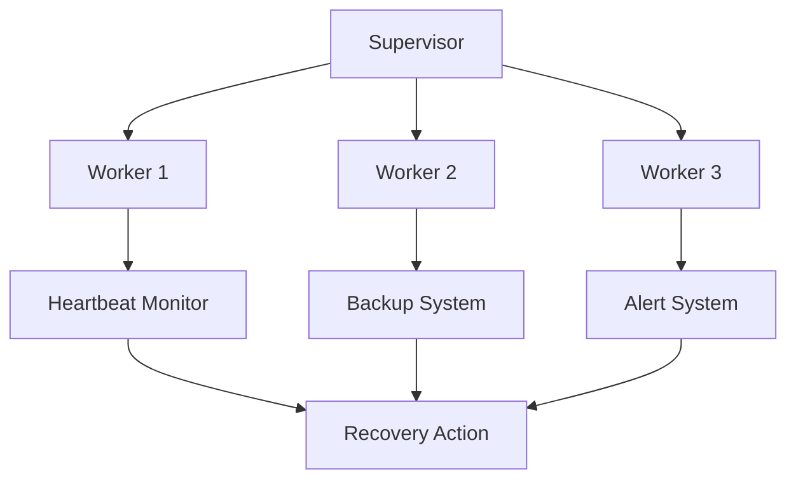

## 22.9 Handling Failures and Recovery Strategies

In the world of software development, failures are inevitable. Whether due to hardware malfunctions, network issues, or software bugs, systems will encounter problems. The key to maintaining robust applications lies in how we handle these failures and recover from them. Erlang, with its unique concurrency model and fault-tolerant design, provides powerful tools for building resilient systems. In this section, we will explore strategies for handling failures in Erlang applications and recovering them to a stable state.

### Understanding Common Types of Failures

Before we delve into recovery strategies, it's essential to understand the common types of failures that can occur in a system:

1. **Hardware Failures**: These include disk crashes, memory failures, and CPU malfunctions. Hardware failures can lead to data loss and system downtime.

2. **Network Failures**: Network issues such as latency, packet loss, and disconnections can disrupt communication between distributed components.

3. **Software Bugs**: Bugs in the application code can cause unexpected behavior, crashes, or data corruption.

4. **Resource Exhaustion**: Running out of memory, file handles, or other system resources can lead to application failures.

5. **External Service Failures**: Dependencies on external services or APIs can introduce points of failure if those services become unavailable.

### Designing for Resilience with Supervisors

Erlang's Open Telecom Platform (OTP) provides a robust framework for building fault-tolerant systems. At the heart of this framework are **supervisors**, which are processes designed to monitor other processes and take corrective actions when failures occur.

#### Supervisor Trees

A supervisor tree is a hierarchical structure where supervisors manage worker processes and other supervisors. This structure allows for organized fault recovery and isolation of failures.

```erlang
-module(my_supervisor).
-behaviour(supervisor).

%% API
-export([start_link/0]).

%% Supervisor callbacks
-export([init/1]).

start_link() ->
    supervisor:start_link({local, ?MODULE}, ?MODULE, []).

init([]) ->
    {ok, {{one_for_one, 5, 10},
          [{worker1, {worker1, start_link, []}, permanent, 5000, worker, [worker1]},
           {worker2, {worker2, start_link, []}, permanent, 5000, worker, [worker2]}]}}.
```

In this example, `my_supervisor` is a supervisor module that starts and monitors two worker processes, `worker1` and `worker2`. The `one_for_one` strategy means if a worker crashes, only that worker is restarted.

#### Strategies for Resilience

- **One-for-One**: Restart only the failed child process.
- **One-for-All**: Restart all child processes if one fails.
- **Rest-for-One**: Restart the failed child and any children started after it.

### Implementing Automatic Recovery Mechanisms

Automatic recovery mechanisms are crucial for minimizing downtime and maintaining service availability. Erlang's supervisors provide built-in support for automatic process restarts, but additional strategies can enhance recovery.

#### Using Heartbeat Mechanisms

Implement heartbeat mechanisms to monitor the health of processes and systems. If a heartbeat is missed, take corrective actions such as restarting the process or alerting an operator.

```erlang
-module(heartbeat).
-export([start/0, check_heartbeat/1]).

start() ->
    spawn(fun() -> loop() end).

loop() ->
    receive
        {heartbeat, From} ->
            From ! {ok, self()},
            loop();
        stop ->
            ok
    after 5000 ->
        %% If no heartbeat received in 5 seconds, take action
        io:format("Heartbeat missed! Taking action...~n"),
        loop()
    end.

check_heartbeat(Pid) ->
    Pid ! {heartbeat, self()},
    receive
        {ok, Pid} ->
            io:format("Heartbeat received from ~p~n", [Pid])
    after 1000 ->
        io:format("No heartbeat response from ~p~n", [Pid])
    end.
```

#### Leveraging Redundancy and Backups

Redundancy and backups are critical components of a robust recovery strategy. Ensure that critical data is backed up regularly and that redundant systems are in place to take over in case of failures.

- **Data Backups**: Regularly back up databases and critical files. Use automated scripts to ensure backups are consistent and up-to-date.
- **Redundant Systems**: Deploy redundant servers and services to handle failover scenarios. Use load balancers to distribute traffic and switch to backup systems seamlessly.

### Best Practices for Incident Response and Post-Mortem Analysis

Handling failures effectively requires not only technical solutions but also well-defined processes for incident response and analysis.

#### Incident Response

- **Monitoring and Alerts**: Set up monitoring tools to detect failures and trigger alerts. Use tools like `observer` and custom scripts to monitor system health.
- **Response Plans**: Develop incident response plans that outline steps to take when failures occur. Ensure that all team members are familiar with these plans.

#### Post-Mortem Analysis

Conduct post-mortem analysis after incidents to identify root causes and prevent future occurrences.

- **Root Cause Analysis**: Investigate the underlying causes of failures. Use logs, metrics, and other data to pinpoint issues.
- **Documentation**: Document the incident, response actions, and lessons learned. Share this information with the team to improve future responses.

### Visualizing Failure and Recovery Strategies

To better understand the flow of failure handling and recovery, let's visualize a typical supervisor tree and recovery process using a Mermaid.js diagram.



**Diagram Description**: This diagram illustrates a supervisor managing three worker processes. Each worker has associated recovery mechanisms, such as heartbeat monitoring, backup systems, and alert systems, which feed into a central recovery action node.

### Try It Yourself

Experiment with the provided code examples by modifying the supervisor strategies and heartbeat intervals. Observe how changes affect the system's resilience and recovery behavior.

### References and Further Reading

- [Erlang OTP Design Principles](https://erlang.org/doc/design_principles/des_princ.html)
- [Erlang Supervisors](https://erlang.org/doc/man/supervisor.html)
- [Fault-Tolerant Systems](https://en.wikipedia.org/wiki/Fault-tolerant_system)

### Knowledge Check

- What are the common types of failures in software systems?
- How do supervisors contribute to system resilience in Erlang?
- What is the difference between one-for-one and one-for-all supervisor strategies?
- Why are redundancy and backups important for recovery?
- What steps should be included in an incident response plan?

### Embrace the Journey

Remember, building resilient systems is an ongoing journey. As you implement these strategies, you'll gain insights into your system's behavior and improve its robustness. Keep experimenting, stay curious, and enjoy the process of creating fault-tolerant applications!

## Quiz: Handling Failures and Recovery Strategies



### What are common types of failures in software systems?

- [x] Hardware failures, network failures, software bugs, resource exhaustion, external service failures
- [ ] Only hardware and network failures
- [ ] Only software bugs and resource exhaustion
- [ ] Only external service failures

> **Explanation:** Software systems can encounter various types of failures, including hardware, network, software bugs, resource exhaustion, and external service failures.

### How do supervisors contribute to system resilience in Erlang?

- [x] By monitoring processes and restarting them upon failure
- [ ] By preventing any failures from occurring
- [ ] By logging errors without taking action
- [ ] By shutting down the system upon failure

> **Explanation:** Supervisors in Erlang monitor processes and automatically restart them when they fail, contributing to system resilience.

### What is the difference between one-for-one and one-for-all supervisor strategies?

- [x] One-for-one restarts only the failed process, while one-for-all restarts all child processes
- [ ] One-for-one restarts all child processes, while one-for-all restarts only the failed process
- [ ] Both strategies restart all child processes
- [ ] Both strategies restart only the failed process

> **Explanation:** In the one-for-one strategy, only the failed process is restarted, whereas in the one-for-all strategy, all child processes are restarted if one fails.

### Why are redundancy and backups important for recovery?

- [x] They ensure data availability and system continuity in case of failures
- [ ] They are not necessary if the system is well-designed
- [ ] They only add unnecessary complexity
- [ ] They are only useful for debugging

> **Explanation:** Redundancy and backups are crucial for ensuring data availability and system continuity, allowing systems to recover from failures.

### What steps should be included in an incident response plan?

- [x] Monitoring, alerts, response actions, documentation
- [ ] Only monitoring and alerts
- [ ] Only response actions and documentation
- [ ] Only documentation

> **Explanation:** An incident response plan should include monitoring, alerts, response actions, and documentation to effectively handle failures.

### What is the purpose of a heartbeat mechanism?

- [x] To monitor the health of processes and systems
- [ ] To increase system performance
- [ ] To reduce system complexity
- [ ] To log errors without taking action

> **Explanation:** Heartbeat mechanisms are used to monitor the health of processes and systems, allowing for timely recovery actions if issues are detected.

### How can post-mortem analysis help in failure recovery?

- [x] By identifying root causes and preventing future occurrences
- [ ] By increasing system complexity
- [ ] By reducing system performance
- [ ] By logging errors without taking action

> **Explanation:** Post-mortem analysis helps identify root causes of failures and provides insights to prevent future occurrences, improving system resilience.

### What is the role of documentation in incident response?

- [x] To record incidents, response actions, and lessons learned
- [ ] To increase system complexity
- [ ] To reduce system performance
- [ ] To log errors without taking action

> **Explanation:** Documentation in incident response records incidents, response actions, and lessons learned, aiding in future responses and system improvements.

### What is a supervisor tree in Erlang?

- [x] A hierarchical structure where supervisors manage worker processes and other supervisors
- [ ] A flat structure where all processes are independent
- [ ] A single process managing all other processes
- [ ] A structure where processes manage themselves

> **Explanation:** A supervisor tree in Erlang is a hierarchical structure where supervisors manage worker processes and other supervisors, facilitating organized fault recovery.

### True or False: Erlang's "let it crash" philosophy encourages handling all errors within the process.

- [ ] True
- [x] False

> **Explanation:** Erlang's "let it crash" philosophy encourages allowing processes to fail and relying on supervisors to handle recovery, rather than handling all errors within the process.


