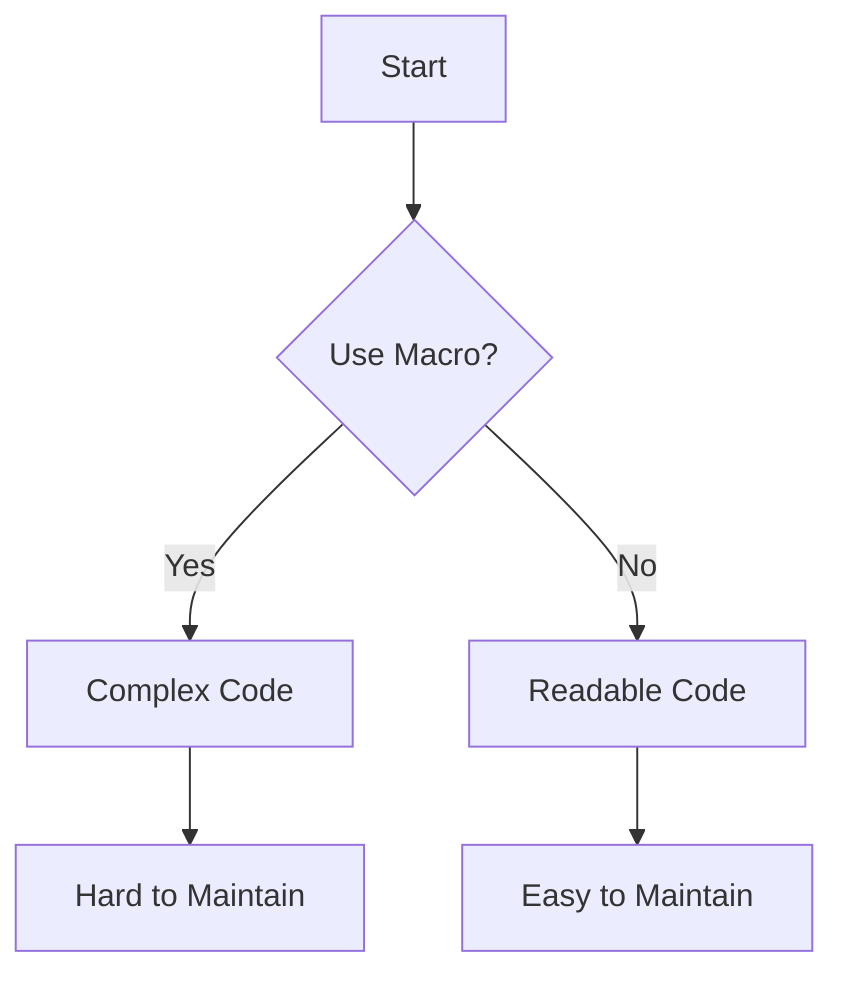
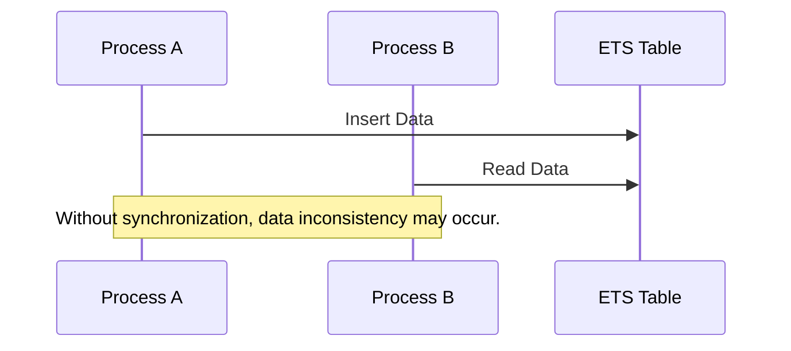

## 23.1 Recognizing Anti-Patterns in Erlang

In the world of software development, design patterns are well-known solutions to common problems. However, not all patterns are beneficial. Anti-patterns, in contrast, are common responses to recurring problems that are ineffective and counterproductive. In this section, we will delve into the concept of anti-patterns, particularly in the context of Erlang programming, and explore how recognizing and avoiding them can significantly enhance code quality and maintainability.

### Understanding Anti-Patterns

**Anti-patterns** are essentially the opposite of design patterns. While design patterns provide a template for solving problems effectively, anti-patterns represent poor solutions that can lead to more problems than they solve. They often arise from a lack of understanding of the problem domain, misapplication of design principles, or simply from bad habits.

#### Key Characteristics of Anti-Patterns

1. **Recurring Solutions**: Anti-patterns are often repeated solutions to common problems, but unlike design patterns, they do not solve the problem effectively.
2. **Negative Consequences**: They typically lead to negative outcomes such as increased complexity, reduced performance, and poor maintainability.
3. **Recognizable Symptoms**: Anti-patterns often have identifiable symptoms that can be recognized and addressed.

### The Impact of Anti-Patterns on Code Quality

Anti-patterns can severely impact the quality of your codebase. Here are some ways they can affect your projects:

- **Increased Complexity**: Anti-patterns often introduce unnecessary complexity, making the code harder to understand and maintain.
- **Reduced Performance**: Inefficient solutions can lead to performance bottlenecks, slowing down your application.
- **Poor Maintainability**: Code that is difficult to read and understand is also difficult to maintain, leading to higher costs and more bugs over time.
- **Technical Debt**: Anti-patterns contribute to technical debt, which can accumulate and become a significant burden on future development efforts.

### Encouraging Critical Evaluation

To effectively recognize and avoid anti-patterns, it's crucial to adopt a mindset of critical evaluation. Here are some strategies to help you identify potential anti-patterns in your code:

- **Code Reviews**: Regular code reviews can help identify anti-patterns early in the development process.
- **Refactoring**: Continuously refactor your code to improve its structure and eliminate anti-patterns.
- **Learning and Adaptation**: Stay informed about best practices and be willing to adapt your approach as you learn more about effective design patterns.

### Common Anti-Patterns in Erlang

Erlang, with its unique functional and concurrent programming paradigms, has its own set of common anti-patterns. Let's explore some of these:

#### 1. Overusing Macros and Parse Transformations

Macros and parse transformations can be powerful tools in Erlang, but overusing them can lead to code that is difficult to read and maintain. It's important to use these features judiciously and only when they provide a clear benefit.

```erlang
% Example of overusing macros
-define(SQUARE(X), (X) * (X)).

calculate_area(Side) ->
    ?SQUARE(Side).
```

**Key Point**: While macros can simplify repetitive code, they can also obscure the logic, making it harder for others to understand.

#### 2. Shared Mutable State via ETS without Proper Synchronization

Erlang's ETS (Erlang Term Storage) tables are a powerful feature for storing large amounts of data in memory. However, using ETS for shared mutable state without proper synchronization can lead to race conditions and data inconsistencies.

```erlang
% Example of improper use of ETS
store_data(Key, Value) ->
    ets:insert(my_table, {Key, Value}).

retrieve_data(Key) ->
    case ets:lookup(my_table, Key) of
        [{_, Value}] -> Value;
        [] -> undefined
    end.
```

**Key Point**: Always ensure proper synchronization when using ETS for shared state to avoid race conditions.

#### 3. Inefficient Use of Recursion and Non-Tail Calls

Recursion is a fundamental concept in functional programming, but inefficient use of recursion, especially non-tail recursive functions, can lead to stack overflow errors and performance issues.

```erlang
% Example of non-tail recursive function
factorial(0) -> 1;
factorial(N) -> N * factorial(N - 1).
```

**Key Point**: Use tail recursion whenever possible to optimize performance and avoid stack overflow.

### Visualizing Anti-Patterns

To better understand how anti-patterns manifest in Erlang, let's visualize some common scenarios using Mermaid.js diagrams.

#### Diagram: Overusing Macros and Parse Transformations



*Caption*: This flowchart illustrates the decision-making process when considering the use of macros. Overuse can lead to complex and hard-to-maintain code.

#### Diagram: Shared Mutable State via ETS



*Caption*: This sequence diagram shows how multiple processes interacting with an ETS table without proper synchronization can lead to data inconsistencies.

### References and Further Reading

- [Erlang Programming Language](https://www.erlang.org/)
- [Erlang Term Storage (ETS)](https://erlang.org/doc/man/ets.html)
- [Functional Programming Concepts](https://en.wikipedia.org/wiki/Functional_programming)

### Knowledge Check

To reinforce your understanding of anti-patterns in Erlang, consider the following questions:

1. What are anti-patterns, and how do they differ from design patterns?
2. How can anti-patterns negatively impact code quality and maintainability?
3. What strategies can you use to identify and eliminate anti-patterns in your code?

### Embrace the Journey

Recognizing and avoiding anti-patterns is a crucial skill for any Erlang developer. By understanding the common pitfalls and adopting best practices, you can write more efficient, maintainable, and high-quality code. Remember, this is just the beginning. As you progress, you'll become more adept at identifying and addressing anti-patterns in your projects. Keep experimenting, stay curious, and enjoy the journey!

## Quiz: Recognizing Anti-Patterns in Erlang



### What is an anti-pattern?

- [x] A common but ineffective solution to a recurring problem
- [ ] A well-known solution to a common problem
- [ ] A design pattern used in functional programming
- [ ] A pattern that improves code performance

> **Explanation:** An anti-pattern is a common but ineffective solution to a recurring problem, often leading to negative consequences.

### How can anti-patterns affect code quality?

- [x] They can increase complexity and reduce maintainability
- [ ] They always improve performance
- [ ] They make code easier to read
- [ ] They have no impact on code quality

> **Explanation:** Anti-patterns can increase complexity, reduce maintainability, and lead to poor code quality.

### What is a common symptom of an anti-pattern?

- [x] Increased complexity and reduced performance
- [ ] Improved readability and maintainability
- [ ] Enhanced code efficiency
- [ ] Simplified code structure

> **Explanation:** Anti-patterns often lead to increased complexity and reduced performance, making code harder to maintain.

### Why is it important to recognize anti-patterns?

- [x] To improve code quality and maintainability
- [ ] To introduce more complexity
- [ ] To make code less readable
- [ ] To increase technical debt

> **Explanation:** Recognizing anti-patterns is important to improve code quality and maintainability, and to reduce technical debt.

### What is a strategy to identify anti-patterns in code?

- [x] Conduct regular code reviews
- [ ] Avoid refactoring
- [ ] Ignore best practices
- [ ] Increase code complexity

> **Explanation:** Conducting regular code reviews is a strategy to identify and address anti-patterns in code.

### What is a potential consequence of overusing macros in Erlang?

- [x] Code becomes difficult to read and maintain
- [ ] Code becomes more efficient
- [ ] Code becomes easier to understand
- [ ] Code performance improves

> **Explanation:** Overusing macros can make code difficult to read and maintain, obscuring the logic.

### How can improper use of ETS lead to issues?

- [x] It can cause race conditions and data inconsistencies
- [ ] It always improves data access speed
- [ ] It simplifies data management
- [ ] It enhances data security

> **Explanation:** Improper use of ETS without synchronization can lead to race conditions and data inconsistencies.

### What is a benefit of using tail recursion?

- [x] It optimizes performance and avoids stack overflow
- [ ] It increases code complexity
- [ ] It reduces code readability
- [ ] It decreases code efficiency

> **Explanation:** Tail recursion optimizes performance and avoids stack overflow, making it a preferred approach in functional programming.

### True or False: Anti-patterns are beneficial for code quality.

- [ ] True
- [x] False

> **Explanation:** Anti-patterns are not beneficial for code quality; they often lead to negative consequences such as increased complexity and reduced maintainability.

### What is the role of refactoring in dealing with anti-patterns?

- [x] It helps improve code structure and eliminate anti-patterns
- [ ] It introduces more anti-patterns
- [ ] It decreases code quality
- [ ] It complicates the codebase

> **Explanation:** Refactoring helps improve code structure and eliminate anti-patterns, enhancing code quality.


