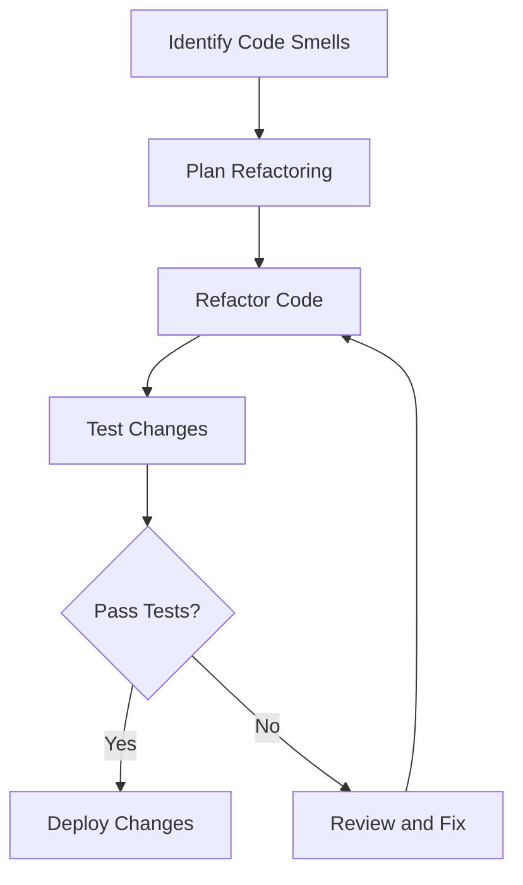

## 23.10 Strategies to Refactor and Avoid Pitfalls

Refactoring is an essential practice in software development that involves restructuring existing code without changing its external behavior. In Erlang, refactoring is crucial for maintaining code quality, improving readability, and ensuring the system's robustness, especially given its concurrent and distributed nature. This section delves into effective strategies for refactoring Erlang code, identifying and eliminating anti-patterns, and avoiding common pitfalls.

### Understanding Refactoring in Erlang

Refactoring is not just about cleaning up code; it's about making the codebase more understandable and maintainable. In Erlang, this often involves:

- **Improving Code Readability**: Making the code easier to read and understand by others, which is particularly important in a concurrent environment.
- **Enhancing Modularity**: Breaking down complex functions into smaller, reusable components.
- **Optimizing Performance**: Ensuring that the code runs efficiently, especially in a concurrent setting.
- **Ensuring Consistency**: Maintaining a consistent coding style and structure across the codebase.

#### When to Refactor

Refactoring should be a continuous process rather than a one-time event. Consider refactoring when:

- **Code Smells**: You notice code smells such as duplicated code, long functions, or complex conditionals.
- **New Features**: You're adding new features that require changes to existing code.
- **Bug Fixes**: You're fixing bugs and notice areas for improvement.
- **Code Reviews**: During code reviews, suggestions for improvement are made.
- **Performance Issues**: Performance bottlenecks are identified.

### Common Anti-Patterns in Erlang

Before diving into refactoring strategies, it's important to recognize common anti-patterns in Erlang:

- **Overusing Macros and Parse Transformations**: These can make code difficult to read and understand.
- **Shared Mutable State**: Using ETS tables without proper synchronization can lead to race conditions.
- **Inefficient Recursion**: Non-tail recursive functions can lead to stack overflow errors.
- **Blocking Operations**: Performing blocking operations in concurrent processes can degrade performance.
- **Ignoring OTP Principles**: Not leveraging OTP's design principles can lead to less robust applications.

### Refactoring Approaches in Erlang

#### 1. Simplifying Complex Functions

Break down large, complex functions into smaller, more manageable ones. This not only improves readability but also makes testing easier.

```erlang
% Before refactoring
complex_function(A, B, C) ->
    Result1 = do_something(A, B),
    Result2 = do_something_else(Result1, C),
    final_step(Result2).

% After refactoring
complex_function(A, B, C) ->
    Result1 = intermediate_step(A, B),
    final_step(Result1, C).

intermediate_step(A, B) ->
    do_something_else(do_something(A, B)).
```

#### 2. Eliminating Code Duplication

Identify and extract common code into separate functions or modules.

```erlang
% Before refactoring
function_one(A) ->
    Result = common_logic(A),
    do_something(Result).

function_two(B) ->
    Result = common_logic(B),
    do_something_else(Result).

% After refactoring
common_logic(X) ->
    % Common logic here
    X + 1.

function_one(A) ->
    Result = common_logic(A),
    do_something(Result).

function_two(B) ->
    Result = common_logic(B),
    do_something_else(Result).
```

#### 3. Improving Pattern Matching

Use pattern matching effectively to simplify code and improve performance.

```erlang
% Before refactoring
process_message(Msg) ->
    case Msg of
        {ok, Data} -> handle_ok(Data);
        {error, Reason} -> handle_error(Reason);
        _ -> handle_unknown(Msg)
    end.

% After refactoring
process_message({ok, Data}) -> handle_ok(Data);
process_message({error, Reason}) -> handle_error(Reason);
process_message(Msg) -> handle_unknown(Msg).
```

#### 4. Utilizing Higher-Order Functions

Leverage higher-order functions to reduce boilerplate code and enhance flexibility.

```erlang
% Before refactoring
apply_to_list([], _Func) -> [];
apply_to_list([H|T], Func) ->
    [Func(H) | apply_to_list(T, Func)].

% After refactoring using lists:map/2
apply_to_list(List, Func) ->
    lists:map(Func, List).
```

### Tools for Refactoring in Erlang

Several tools can aid in the refactoring process:

- **Dialyzer**: A static analysis tool that identifies type errors and discrepancies in Erlang code.
- **Code Formatters**: Tools like `erlfmt` help maintain consistent code formatting.
- **Erlang Shell (REPL)**: Useful for testing small code changes interactively.
- **Version Control Systems**: Git and other VCSs allow you to track changes and revert if necessary.

### Encouraging Incremental Improvements

Refactoring should be an incremental process. Instead of attempting to refactor the entire codebase at once, focus on small, manageable sections. This approach minimizes risk and allows for continuous improvement.

- **Start Small**: Begin with small, isolated changes that have a significant impact.
- **Test Frequently**: Ensure that changes do not introduce new bugs by running tests frequently.
- **Review Regularly**: Conduct regular code reviews to identify areas for improvement.

### Positive Impact on Code Quality and Team Productivity

Effective refactoring leads to:

- **Improved Code Quality**: Cleaner, more maintainable code that is easier to understand and modify.
- **Enhanced Team Productivity**: Developers can work more efficiently with a well-organized codebase.
- **Reduced Technical Debt**: Addressing code smells and anti-patterns reduces the accumulation of technical debt.

### Visualizing the Refactoring Process

Below is a flowchart illustrating the refactoring process in Erlang:



### Try It Yourself

Experiment with the provided code examples by:

- Modifying the functions to handle additional cases.
- Refactoring the code to use different Erlang features.
- Testing the refactored code in the Erlang shell.

### Knowledge Check

- What are some common anti-patterns in Erlang?
- How can you use pattern matching to simplify code?
- What tools can assist in the refactoring process?

### Embrace the Journey

Remember, refactoring is an ongoing journey. As you continue to refactor and improve your code, you'll gain deeper insights into Erlang's capabilities and best practices. Keep experimenting, stay curious, and enjoy the process of crafting high-quality Erlang applications.

## Quiz: Strategies to Refactor and Avoid Pitfalls



### What is the primary goal of refactoring in Erlang?

- [x] To improve code readability and maintainability
- [ ] To add new features
- [ ] To increase the number of lines of code
- [ ] To make the code more complex

> **Explanation:** Refactoring aims to improve code readability and maintainability without changing its external behavior.

### When should you consider refactoring your Erlang code?

- [x] When you notice code smells
- [x] When adding new features
- [ ] Only during major releases
- [ ] When the code is perfect

> **Explanation:** Refactoring should be considered whenever code smells are detected or when adding new features to ensure code quality.

### Which tool is used for static analysis in Erlang?

- [x] Dialyzer
- [ ] Rebar3
- [ ] EDoc
- [ ] Observer

> **Explanation:** Dialyzer is a static analysis tool used to identify type errors and discrepancies in Erlang code.

### How can pattern matching improve Erlang code?

- [x] By simplifying code and improving performance
- [ ] By making code more complex
- [ ] By increasing the number of lines
- [ ] By adding more conditional statements

> **Explanation:** Pattern matching simplifies code and can improve performance by reducing the need for complex conditional statements.

### What is a common anti-pattern in Erlang?

- [x] Overusing macros and parse transformations
- [ ] Using pattern matching
- [ ] Writing short functions
- [ ] Leveraging OTP principles

> **Explanation:** Overusing macros and parse transformations can make code difficult to read and understand, making it an anti-pattern.

### What is the benefit of using higher-order functions in Erlang?

- [x] Reducing boilerplate code and enhancing flexibility
- [ ] Making code more complex
- [ ] Increasing the number of lines
- [ ] Adding more conditional statements

> **Explanation:** Higher-order functions reduce boilerplate code and enhance flexibility by allowing functions to be passed as arguments.

### What is a key benefit of refactoring?

- [x] Improved code quality
- [x] Enhanced team productivity
- [ ] Increased complexity
- [ ] More lines of code

> **Explanation:** Refactoring improves code quality and enhances team productivity by making the codebase more understandable and maintainable.

### What is a common pitfall when using ETS in Erlang?

- [x] Shared mutable state without proper synchronization
- [ ] Using pattern matching
- [ ] Writing short functions
- [ ] Leveraging OTP principles

> **Explanation:** Shared mutable state via ETS without proper synchronization can lead to race conditions, making it a common pitfall.

### How can you ensure that refactoring does not introduce new bugs?

- [x] By testing changes frequently
- [ ] By avoiding tests
- [ ] By making large changes at once
- [ ] By ignoring code reviews

> **Explanation:** Testing changes frequently ensures that refactoring does not introduce new bugs.

### True or False: Refactoring should be a one-time event.

- [ ] True
- [x] False

> **Explanation:** Refactoring should be a continuous process, not a one-time event, to ensure ongoing code quality and maintainability.




