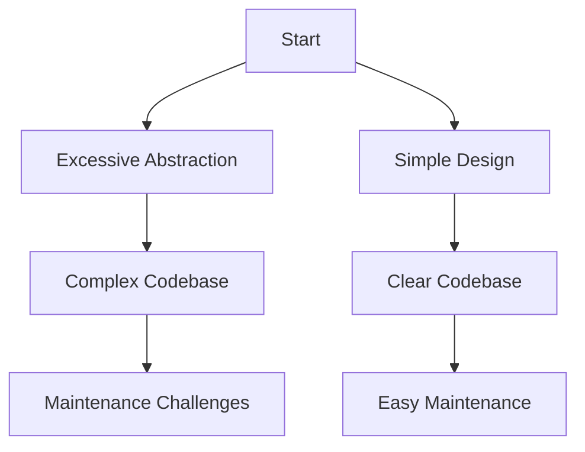

## 23.11 Overcomplicating with Unnecessary Abstractions

In the world of software development, abstraction is a powerful tool that allows us to manage complexity by hiding the intricate details of a system. However, when used excessively or inappropriately, abstraction can lead to overcomplicated code that is difficult to understand, maintain, and extend. This section explores the balance between abstraction and complexity in Erlang, providing insights into how to avoid the pitfalls of over-engineering.

### Understanding Abstraction in Erlang

Abstraction in programming is the process of reducing complexity by hiding the unnecessary details of an implementation. In Erlang, abstraction is often achieved through the use of modules, functions, and behaviors. While abstraction can make code more modular and reusable, it can also introduce unnecessary complexity if not applied judiciously.

#### The Balance Between Abstraction and Complexity

Finding the right balance between abstraction and complexity is crucial. Too little abstraction can lead to code duplication and a lack of modularity, while too much abstraction can result in code that is difficult to understand and maintain. The key is to abstract only when it adds value, such as improving code readability, reusability, or maintainability.

### Examples of Over-Engineering in Erlang

Over-engineering occurs when developers introduce unnecessary complexity into their code, often in the form of excessive abstraction. This can happen when developers anticipate future requirements that may never materialize or when they try to make their code overly generic.

#### Example 1: Overuse of Behaviors

Behaviors in Erlang are a powerful way to define common patterns for modules, such as `gen_server` or `gen_statem`. However, creating custom behaviors for every conceivable scenario can lead to unnecessary complexity.

```erlang
-module(my_custom_behavior).
-behaviour(gen_server).

% Over-engineered behavior with too many callbacks
-export([init/1, handle_call/3, handle_cast/2, terminate/2, code_change/3]).

init(Args) ->
    {ok, Args}.

handle_call(_Request, _From, State) ->
    {reply, ok, State}.

handle_cast(_Msg, State) ->
    {noreply, State}.

terminate(_Reason, _State) ->
    ok.

code_change(_OldVsn, State, _Extra) ->
    {ok, State}.
```

In this example, the custom behavior introduces unnecessary callbacks that may never be used, complicating the codebase without providing tangible benefits.

#### Example 2: Excessive Modularity

While modularity is generally a good practice, breaking down a system into too many small modules can make it difficult to understand the overall flow of the application.

```erlang
% Over-modularized code with too many small modules
-module(user_auth).
-export([authenticate/2]).

authenticate(User, Password) ->
    % Authentication logic here
    ok.

-module(user_profile).
-export([get_profile/1]).

get_profile(UserId) ->
    % Profile retrieval logic here
    ok.

-module(user_settings).
-export([update_settings/2]).

update_settings(UserId, Settings) ->
    % Settings update logic here
    ok.
```

In this example, the user-related functionalities are split into too many modules, making it harder to track how they interact with each other.

### The Perils of "Gold Plating" and Designing for Hypothetical Scenarios

"Gold plating" refers to the practice of adding unnecessary features or complexity to a system in anticipation of future needs. This often results in a bloated codebase that is difficult to maintain.

#### Designing for Hypothetical Scenarios

Designing for hypothetical scenarios can lead to over-engineering. It's important to focus on the current requirements and avoid adding features that may never be used.

```erlang
% Over-engineered function with unnecessary parameters
-spec process_data(binary(), [atom()]) -> ok.
process_data(Data, Options) ->
    case lists:member(verbose, Options) of
        true -> io:format("Processing data: ~p~n", [Data]);
        false -> ok
    end.
```

In this example, the `Options` parameter introduces unnecessary complexity by allowing for a verbose mode that may not be needed.

### Encouraging Simplicity and Designing for Current Requirements

Simplicity is a core principle in software design. By focusing on the current requirements and avoiding unnecessary abstractions, we can create code that is easier to understand and maintain.

#### The YAGNI Principle

The YAGNI ("You Aren't Gonna Need It") principle is a reminder to avoid adding functionality until it is necessary. By adhering to this principle, we can prevent over-engineering and keep our codebase lean and focused.

```erlang
% Simple function without unnecessary parameters
-spec process_data(binary()) -> ok.
process_data(Data) ->
    io:format("Processing data: ~p~n", [Data]).
```

In this example, the function is simplified by removing the unnecessary `Options` parameter, making it easier to understand and use.

### Visualizing the Impact of Overcomplication

To better understand the impact of overcomplicating with unnecessary abstractions, let's visualize the flow of a system with excessive abstraction versus a simpler design.



In this diagram, we see how excessive abstraction leads to a complex codebase and maintenance challenges, while a simple design results in a clear codebase and easier maintenance.

### Erlang's Unique Features and Abstraction

Erlang's unique features, such as its lightweight processes and message-passing model, provide powerful tools for abstraction. However, it's important to use these features judiciously to avoid overcomplicating the system.

#### Lightweight Processes

Erlang's lightweight processes allow for concurrent execution, but creating too many processes for trivial tasks can lead to unnecessary complexity.

```erlang
% Overuse of processes for simple tasks
start_processes(DataList) ->
    [spawn(fun() -> process_data(Data) end) || Data <- DataList].

process_data(Data) ->
    io:format("Processing: ~p~n", [Data]).
```

In this example, spawning a process for each data item introduces unnecessary complexity. A simpler approach would be to process the data sequentially or in batches.

### Differences and Similarities with Other Patterns

Overcomplicating with unnecessary abstractions is often confused with other anti-patterns, such as premature optimization and feature creep. While these patterns share similarities, they differ in their focus.

- **Premature Optimization**: Focuses on optimizing code before it's necessary, often leading to complex and unreadable code.
- **Feature Creep**: Involves adding unnecessary features, leading to a bloated codebase.

### Design Considerations

When designing a system, consider the following to avoid overcomplicating with unnecessary abstractions:

- **Focus on Current Requirements**: Design for the present, not hypothetical future needs.
- **Adopt the YAGNI Principle**: Avoid adding features until they are necessary.
- **Simplify Where Possible**: Use abstraction to simplify, not complicate.
- **Review and Refactor**: Regularly review your code to identify and remove unnecessary abstractions.

### Try It Yourself

To better understand the impact of unnecessary abstractions, try modifying the code examples provided. Simplify the over-engineered examples by removing unnecessary parameters or modules, and observe how this affects the readability and maintainability of the code.

### Knowledge Check

- What is the YAGNI principle, and how does it help prevent over-engineering?
- How can excessive abstraction lead to maintenance challenges?
- What are some signs that a codebase may be over-engineered?

### Embrace the Journey

Remember, simplicity is key to creating maintainable and understandable code. As you continue your journey in Erlang development, focus on designing for current requirements and avoid the temptation to overcomplicate with unnecessary abstractions. Keep experimenting, stay curious, and enjoy the process of learning and growing as a developer.

## Quiz: Overcomplicating with Unnecessary Abstractions



### What is the main goal of abstraction in programming?

- [x] To reduce complexity by hiding unnecessary details
- [ ] To increase the number of modules in a system
- [ ] To make code more difficult to understand
- [ ] To add more features to a program

> **Explanation:** Abstraction aims to reduce complexity by hiding unnecessary details, making the code easier to manage and understand.

### What is a common pitfall of over-engineering in Erlang?

- [x] Introducing unnecessary complexity
- [ ] Improving code readability
- [ ] Enhancing code maintainability
- [ ] Simplifying the codebase

> **Explanation:** Over-engineering often introduces unnecessary complexity, making the code harder to understand and maintain.

### How does the YAGNI principle help in software development?

- [x] It prevents adding unnecessary features
- [ ] It encourages adding as many features as possible
- [ ] It focuses on optimizing code prematurely
- [ ] It promotes the use of complex abstractions

> **Explanation:** The YAGNI principle helps prevent adding unnecessary features, keeping the codebase lean and focused on current requirements.

### What is "gold plating" in software development?

- [x] Adding unnecessary features or complexity
- [ ] Simplifying the codebase
- [ ] Improving code readability
- [ ] Enhancing code maintainability

> **Explanation:** "Gold plating" refers to adding unnecessary features or complexity to a system, often in anticipation of future needs.

### What is a sign of excessive abstraction in a codebase?

- [x] Too many small modules with unclear interactions
- [ ] Clear and concise code
- [ ] Well-documented functions
- [ ] Simplified code structure

> **Explanation:** Excessive abstraction can lead to too many small modules with unclear interactions, making the codebase difficult to understand.

### How can unnecessary abstractions affect code maintenance?

- [x] They make the code harder to understand and maintain
- [ ] They improve code readability
- [ ] They enhance code maintainability
- [ ] They simplify the codebase

> **Explanation:** Unnecessary abstractions can make the code harder to understand and maintain, leading to increased maintenance challenges.

### What is a benefit of focusing on current requirements in design?

- [x] It prevents over-engineering
- [ ] It encourages adding unnecessary features
- [ ] It leads to a bloated codebase
- [ ] It complicates the code structure

> **Explanation:** Focusing on current requirements helps prevent over-engineering, keeping the codebase simple and focused.

### What is a potential downside of creating too many processes in Erlang?

- [x] It introduces unnecessary complexity
- [ ] It simplifies the codebase
- [ ] It improves code readability
- [ ] It enhances code maintainability

> **Explanation:** Creating too many processes for trivial tasks can introduce unnecessary complexity, making the system harder to manage.

### How can regular code review help in managing abstractions?

- [x] By identifying and removing unnecessary abstractions
- [ ] By adding more features to the codebase
- [ ] By complicating the code structure
- [ ] By increasing the number of modules

> **Explanation:** Regular code review helps identify and remove unnecessary abstractions, keeping the codebase clean and manageable.

### True or False: The YAGNI principle encourages designing for hypothetical future needs.

- [ ] True
- [x] False

> **Explanation:** The YAGNI principle discourages designing for hypothetical future needs, focusing instead on current requirements.


