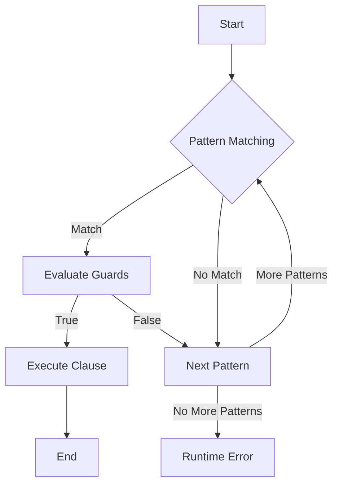

## 23.12 Misusing Pattern Matching and Guards

In Erlang, pattern matching and guards are powerful tools that allow developers to write concise and expressive code. However, misusing these features can lead to unexpected behavior and runtime errors. In this section, we will explore common mistakes in using pattern matching and guards, discuss the importance of exhaustive pattern matching and proper guard usage, and provide tips and best practices to write clear and correct patterns and guards.

### Understanding Pattern Matching in Erlang

Pattern matching is a fundamental concept in Erlang, allowing you to destructure data and bind variables in a concise manner. It is used extensively in function definitions, case expressions, and receive blocks. Let's start by understanding the basics of pattern matching.

#### Basic Pattern Matching

Pattern matching in Erlang involves matching a pattern against a value. If the pattern matches the value, variables in the pattern are bound to corresponding parts of the value.

```erlang
% Basic pattern matching example
{X, Y} = {1, 2}.
% X is bound to 1, Y is bound to 2
```

#### Incomplete Patterns

One common mistake is using incomplete patterns, which can lead to runtime errors if the pattern does not match the value.

```erlang
% Incomplete pattern example
{X, Y} = {1, 2, 3}.
% This will result in a runtime error: no match of right hand side value {1,2,3}
```

To avoid such errors, ensure that your patterns are complete and match the structure of the data you are working with.

### Common Mistakes in Pattern Matching

#### Improper Order of Patterns

The order of patterns in function clauses or case expressions matters. Erlang evaluates patterns from top to bottom, and the first matching pattern is selected. Misordering patterns can lead to unexpected behavior.

```erlang
% Improper order of patterns
f({a, _}) -> "Matched a";
f({b, _}) -> "Matched b";
f(_) -> "Default case".

% Calling f({b, 1}) will return "Matched b"
% Calling f({a, 1}) will return "Matched a"
% Calling f({c, 1}) will return "Default case"
```

Ensure that more specific patterns are placed before more general ones to avoid unintended matches.

#### Overlapping Patterns

Overlapping patterns occur when multiple patterns can match the same value. This can lead to ambiguity and make code harder to understand.

```erlang
% Overlapping patterns example
g({X, Y}) when X > 0 -> "Positive X";
g({X, Y}) when Y > 0 -> "Positive Y";
g(_) -> "Default case".

% Calling g({1, 1}) will return "Positive X"
% The second clause is never reached for positive X values
```

To prevent overlapping patterns, ensure that each pattern is distinct and covers a unique set of values.

### Understanding Guards in Erlang

Guards are additional conditions that can be used in conjunction with pattern matching to refine matches. They are used in function clauses, case expressions, and receive blocks.

#### Basic Guard Usage

Guards are written after the `when` keyword and consist of one or more boolean expressions.

```erlang
% Basic guard example
h(X) when X > 0 -> "Positive";
h(X) when X < 0 -> "Negative";
h(0) -> "Zero".
```

#### Common Pitfalls with Guards

##### Side Effects in Guards

Guards should be free of side effects. Using expressions with side effects in guards can lead to unpredictable behavior.

```erlang
% Side effects in guards (incorrect)
i(X) when io:format("Checking X: ~p~n", [X]), X > 0 -> "Positive".

% This will print "Checking X: ..." every time the guard is evaluated
```

Avoid using functions with side effects in guards. Instead, use pure expressions that evaluate to a boolean value.

##### Improper Expressions in Guards

Guards should only contain valid guard expressions. Using improper expressions can lead to compilation errors.

```erlang
% Improper expressions in guards
j(X) when X + 1 -> "Valid"; % Incorrect, '+' is not a valid guard expression
j(_) -> "Invalid".
```

Refer to the [Erlang documentation](https://www.erlang.org/doc/reference_manual/expressions.html#guards) for a list of valid guard expressions.

### Importance of Exhaustive Pattern Matching

Exhaustive pattern matching ensures that all possible cases are covered, preventing runtime errors due to unmatched patterns.

#### Example of Non-Exhaustive Pattern Matching

```erlang
% Non-exhaustive pattern matching
k(1) -> "One";
k(2) -> "Two".

% Calling k(3) will result in a runtime error
```

To avoid such errors, include a catch-all pattern to handle unexpected cases.

```erlang
% Exhaustive pattern matching
l(1) -> "One";
l(2) -> "Two";
l(_) -> "Other".
```

### Tips for Writing Clear and Correct Patterns and Guards

1. **Use Descriptive Variable Names**: Choose variable names that convey meaning, making your code easier to understand.

2. **Avoid Overlapping Patterns**: Ensure that each pattern is distinct and covers a unique set of values.

3. **Place Specific Patterns First**: Order patterns from most specific to least specific to avoid unintended matches.

4. **Use Guards Wisely**: Keep guards simple and free of side effects. Use them to refine matches, not to perform complex computations.

5. **Ensure Exhaustiveness**: Always include a catch-all pattern to handle unexpected cases and prevent runtime errors.

6. **Test Thoroughly**: Write tests to cover all possible cases and ensure that your patterns and guards behave as expected.

### Best Practices to Prevent Runtime Errors

- **Review Patterns and Guards**: Regularly review your patterns and guards to ensure they are complete and correct.
- **Use Static Analysis Tools**: Leverage tools like Dialyzer to catch potential issues in your code.
- **Refactor Regularly**: Refactor your code to improve clarity and maintainability, especially as your codebase grows.

### Visualizing Pattern Matching and Guards

To better understand the flow of pattern matching and guards, let's visualize the process using a flowchart.



**Figure 1**: Flowchart illustrating the process of pattern matching and guards in Erlang.

### Try It Yourself

Experiment with the following code examples to reinforce your understanding of pattern matching and guards. Try modifying the patterns and guards to see how the behavior changes.

```erlang
% Try modifying the patterns and guards
-module(try_patterns).
-export([test/1]).

test({a, X}) when X > 0 -> io:format("Matched a with positive X: ~p~n", [X]);
test({b, Y}) when Y < 0 -> io:format("Matched b with negative Y: ~p~n", [Y]);
test(_) -> io:format("Default case~n").
```

### Knowledge Check

- What is the importance of exhaustive pattern matching?
- Why should guards be free of side effects?
- How can you prevent overlapping patterns?

### Conclusion

Pattern matching and guards are powerful features in Erlang, but they must be used correctly to avoid common pitfalls. By understanding the importance of exhaustive pattern matching, using guards wisely, and following best practices, you can write robust and error-free Erlang code. Remember, this is just the beginning. As you progress, you'll build more complex and interactive applications. Keep experimenting, stay curious, and enjoy the journey!

## Quiz: Misusing Pattern Matching and Guards



### What is a common mistake when using pattern matching in Erlang?

- [x] Using incomplete patterns
- [ ] Using too many variables
- [ ] Using too few variables
- [ ] Using patterns without guards

> **Explanation:** Incomplete patterns can lead to runtime errors if the pattern does not match the value.

### Why is the order of patterns important in Erlang?

- [x] Patterns are evaluated from top to bottom
- [ ] Patterns are evaluated randomly
- [ ] Patterns are evaluated from bottom to top
- [ ] Patterns are evaluated based on complexity

> **Explanation:** Erlang evaluates patterns from top to bottom, and the first matching pattern is selected.

### What should guards in Erlang be free of?

- [x] Side effects
- [ ] Variables
- [ ] Constants
- [ ] Functions

> **Explanation:** Guards should be free of side effects to ensure predictable behavior.

### What is a valid guard expression in Erlang?

- [x] X > 0
- [ ] X + 1
- [ ] io:format("X: ~p", [X])
- [ ] X =:= 0

> **Explanation:** X > 0 is a valid guard expression, while X + 1 and io:format are not.

### How can you ensure exhaustive pattern matching?

- [x] Include a catch-all pattern
- [ ] Use only specific patterns
- [ ] Avoid using guards
- [ ] Use overlapping patterns

> **Explanation:** Including a catch-all pattern ensures that all possible cases are covered.

### What is the risk of overlapping patterns?

- [x] Ambiguity and unintended matches
- [ ] Increased performance
- [ ] Reduced code readability
- [ ] Compilation errors

> **Explanation:** Overlapping patterns can lead to ambiguity and make code harder to understand.

### What is a best practice for writing guards?

- [x] Keep them simple and free of side effects
- [ ] Use complex computations
- [ ] Include side effects
- [ ] Avoid using them

> **Explanation:** Guards should be simple and free of side effects to ensure predictable behavior.

### What tool can help catch potential issues in Erlang code?

- [x] Dialyzer
- [ ] Compiler
- [ ] Formatter
- [ ] Debugger

> **Explanation:** Dialyzer is a static analysis tool that can catch potential issues in Erlang code.

### What is a benefit of using descriptive variable names in patterns?

- [x] Improved code readability
- [ ] Increased performance
- [ ] Reduced memory usage
- [ ] Faster compilation

> **Explanation:** Descriptive variable names make code easier to understand and maintain.

### True or False: Guards can contain any Erlang expression.

- [ ] True
- [x] False

> **Explanation:** Guards can only contain valid guard expressions, not any Erlang expression.


