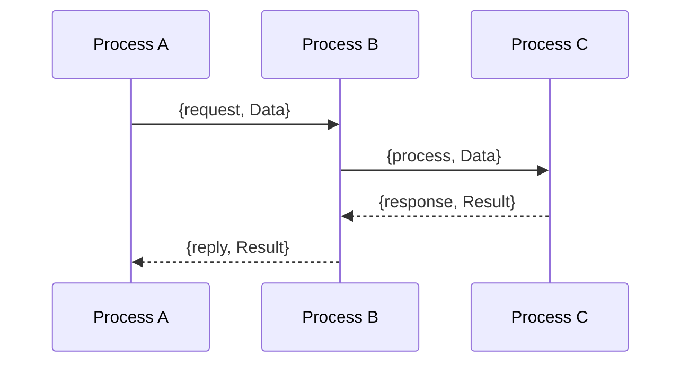

## 23.13 Common Mistakes with Process Communication

In Erlang, process communication is a cornerstone of building concurrent and distributed systems. However, improper handling of process communication can lead to system failures, inefficiencies, and difficult-to-debug errors. In this section, we will explore common mistakes developers make when dealing with process communication in Erlang and provide strategies to avoid these pitfalls.

### Introduction to Process Communication in Erlang

Erlang's concurrency model is based on the actor model, where processes communicate through message passing. Each process has a unique process identifier (PID) and can send and receive messages asynchronously. This model allows for building highly concurrent and fault-tolerant systems. However, it also introduces challenges in ensuring that messages are correctly sent, received, and processed.

### Common Mistakes in Process Communication

#### 1. Sending Messages to the Wrong PID

One of the most common mistakes is sending messages to the wrong PID. This can happen due to incorrect PID references or changes in process lifecycle that are not accounted for.

**Incorrect Example:**

```erlang
% Assume we have a PID stored in a variable
Pid = spawn(fun() -> receive loop() end end),

% Later in the code, we mistakenly use a different PID
WrongPid = spawn(fun() -> receive loop() end end),
WrongPid ! {message, "Hello, World!"}.
```

**Correct Example:**

```erlang
% Correctly use the stored PID
Pid ! {message, "Hello, World!"}.
```

**Solution:**

- **Use Registered Names:** Register processes with unique names using `register(Name, Pid)`. This allows you to send messages using the registered name instead of the PID, reducing the risk of errors.

```erlang
register(my_process, Pid),
my_process ! {message, "Hello, World!"}.
```

- **Monitor Process Lifecycle:** Use process monitoring to handle cases where a process might have terminated unexpectedly.

#### 2. Unhandled Messages

Failing to handle all possible messages can lead to message queue overload and unresponsive systems.

**Incorrect Example:**

```erlang
loop() ->
    receive
        {message, Text} ->
            io:format("Received: ~s~n", [Text]),
            loop()
    end.
```

**Correct Example:**

```erlang
loop() ->
    receive
        {message, Text} ->
            io:format("Received: ~s~n", [Text]),
            loop();
        _ ->
            io:format("Unhandled message~n"),
            loop()
    end.
```

**Solution:**

- **Implement Catch-All Clauses:** Always include a catch-all clause in your receive blocks to handle unexpected messages gracefully.

#### 3. Message Overload

Processes can become overloaded with messages if they are not processed in a timely manner, leading to increased memory usage and potential crashes.

**Solution:**

- **Rate Limiting and Backpressure:** Implement rate limiting and backpressure mechanisms to control the flow of messages to a process.

- **Load Balancing:** Distribute work across multiple processes to prevent any single process from becoming a bottleneck.

#### 4. Improper Use of Registered Names

Using registered names without proper management can lead to conflicts and unexpected behavior.

**Solution:**

- **Unique Naming Conventions:** Use unique naming conventions for registered processes to avoid conflicts.

- **Deregister When Done:** Always deregister a process when it is no longer needed using `unregister(Name)`.

#### 5. Lack of Robust Messaging Protocols

Without a well-defined messaging protocol, processes may misinterpret messages, leading to incorrect behavior.

**Solution:**

- **Define Clear Protocols:** Establish clear and consistent messaging protocols for communication between processes.

- **Versioning:** Consider versioning your protocols to handle changes over time.

### Best Practices for Process Communication

#### 1. Use Monitors and Links

Monitors and links are powerful tools for managing process lifecycles and ensuring fault tolerance.

- **Monitors:** Use `erlang:monitor/2` to monitor processes without creating bidirectional dependencies.

- **Links:** Use `link/1` to create bidirectional links between processes, allowing them to terminate together in case of failure.

#### 2. Handle All Possible Messages

Ensure that your processes can handle all possible messages, including unexpected ones.

- **Catch-All Clauses:** Use catch-all clauses in receive blocks to handle unexpected messages.

- **Logging:** Log unexpected messages for debugging and analysis.

#### 3. Implement Timeouts

Use timeouts in receive blocks to prevent processes from waiting indefinitely for messages.

```erlang
receive
    {message, Text} ->
        io:format("Received: ~s~n", [Text])
after 5000 ->
    io:format("Timeout waiting for message~n")
end.
```

#### 4. Optimize Message Passing

Optimize message passing to reduce overhead and improve performance.

- **Batch Messages:** Batch multiple messages into a single message when possible to reduce the number of messages sent.

- **Avoid Large Messages:** Avoid sending large messages between processes. Instead, use references to shared data structures.

### Visualizing Process Communication

Below is a sequence diagram illustrating a typical process communication scenario in Erlang, highlighting the flow of messages between processes.



**Description:** This diagram shows Process A sending a request to Process B, which then forwards the data to Process C for processing. Process C returns a response to Process B, which in turn replies to Process A.

### Try It Yourself

Experiment with the following code snippets to better understand process communication in Erlang. Modify the examples to see how different scenarios affect message handling.

```erlang
-module(process_communication).
-export([start/0, loop/0]).

start() ->
    Pid = spawn(fun loop/0),
    Pid ! {message, "Hello, World!"},
    Pid ! {unknown, "This is an unknown message"}.

loop() ->
    receive
        {message, Text} ->
            io:format("Received: ~s~n", [Text]),
            loop();
        _ ->
            io:format("Unhandled message~n"),
            loop()
    end.
```

### Knowledge Check

- What are the potential consequences of sending messages to the wrong PID?
- How can you ensure that all messages are handled by a process?
- What strategies can be used to prevent message overload in a process?

### Conclusion

Effective process communication is crucial for building robust and scalable Erlang applications. By avoiding common mistakes and implementing best practices, you can ensure that your systems are resilient and efficient. Remember, the key to successful process communication lies in understanding the nuances of Erlang's concurrency model and leveraging its powerful features to your advantage.

## Quiz: Common Mistakes with Process Communication



### What is a common mistake when sending messages in Erlang?

- [x] Sending messages to the wrong PID
- [ ] Using too many processes
- [ ] Not using enough processes
- [ ] Overusing pattern matching

> **Explanation:** Sending messages to the wrong PID is a common mistake that can lead to unexpected behavior.

### How can you prevent sending messages to the wrong PID?

- [x] Use registered names for processes
- [ ] Avoid using PIDs altogether
- [ ] Use random PIDs
- [ ] Send messages to all processes

> **Explanation:** Using registered names helps ensure that messages are sent to the correct process.

### What is a consequence of unhandled messages in a process?

- [x] Message queue overload
- [ ] Faster message processing
- [ ] Increased system performance
- [ ] Reduced memory usage

> **Explanation:** Unhandled messages can lead to message queue overload and increased memory usage.

### How can you handle unexpected messages in a receive block?

- [x] Use a catch-all clause
- [ ] Ignore them
- [ ] Log them and continue
- [ ] Terminate the process

> **Explanation:** A catch-all clause ensures that unexpected messages are handled gracefully.

### What is the purpose of using monitors in process communication?

- [x] To monitor process lifecycles without bidirectional dependencies
- [ ] To create bidirectional links between processes
- [ ] To terminate processes
- [ ] To increase message passing speed

> **Explanation:** Monitors allow you to observe process lifecycles without creating dependencies.

### Why should you avoid sending large messages between processes?

- [x] To reduce overhead and improve performance
- [ ] To increase message passing speed
- [ ] To decrease system performance
- [ ] To increase memory usage

> **Explanation:** Large messages can increase overhead and reduce performance.

### What is a benefit of using timeouts in receive blocks?

- [x] Prevents processes from waiting indefinitely
- [ ] Increases message passing speed
- [ ] Decreases system performance
- [ ] Increases memory usage

> **Explanation:** Timeouts prevent processes from waiting indefinitely for messages.

### How can you optimize message passing in Erlang?

- [x] Batch multiple messages into a single message
- [ ] Send messages as quickly as possible
- [ ] Use large messages
- [ ] Avoid using message passing

> **Explanation:** Batching messages reduces the number of messages sent and improves performance.

### What is a common mistake when using registered names?

- [x] Not deregistering a process when it's no longer needed
- [ ] Using too many registered names
- [ ] Using random names
- [ ] Avoiding registered names

> **Explanation:** Failing to deregister a process can lead to conflicts and unexpected behavior.

### True or False: Implementing robust messaging protocols is unnecessary in Erlang.

- [ ] True
- [x] False

> **Explanation:** Robust messaging protocols are essential for ensuring correct and efficient process communication.



Remember, mastering process communication in Erlang is a journey. Keep experimenting, stay curious, and enjoy the process of building resilient and scalable systems!
