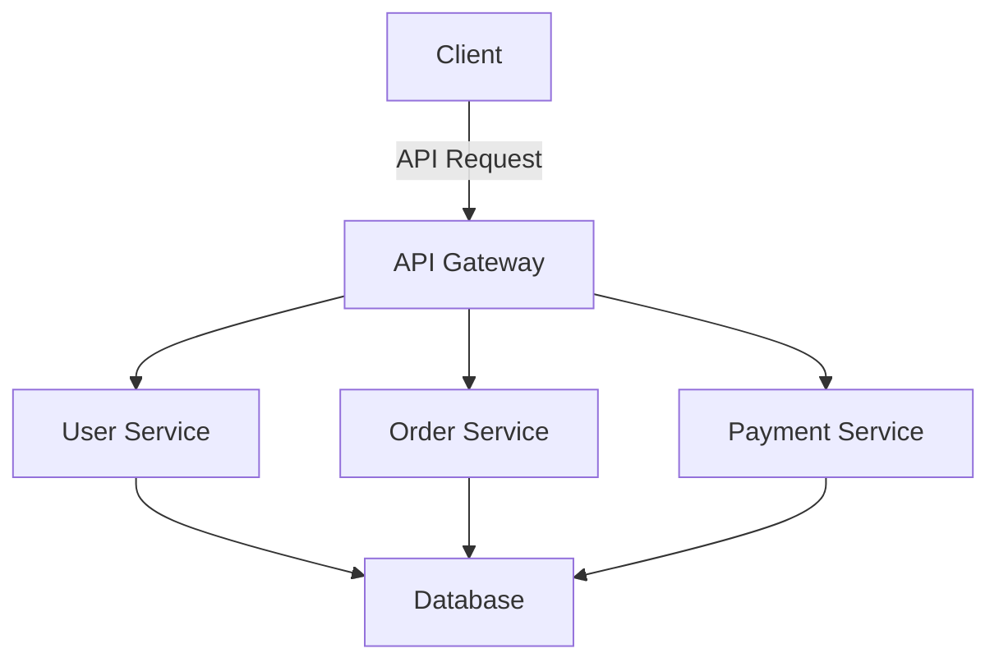

## 23.14 Avoiding Monolithic Applications

In the world of software development, the architecture of an application plays a crucial role in its scalability, maintainability, and flexibility. Monolithic applications, while straightforward to start with, often become cumbersome as they grow. In this section, we will explore the drawbacks of monolithic application design and how Erlang's features can be leveraged to build modular, scalable systems.

### Understanding Monolithic Applications

A **monolithic application** is a single-tiered software application in which different components are combined into a single program from a single platform. These applications are typically characterized by:

- **Tight Coupling**: All components are interconnected, making it difficult to isolate and modify individual parts.
- **Single Codebase**: The entire application is built and deployed as a single unit.
- **Shared Resources**: Components often share the same resources and dependencies, leading to potential conflicts.

#### Drawbacks of Monolithic Design

Monolithic applications may seem appealing due to their simplicity in the initial stages of development. However, as the application grows, several challenges arise:

1. **Scalability Issues**: Scaling a monolithic application often means replicating the entire application, which can be inefficient and costly.
2. **Limited Flexibility**: Making changes to one part of the application can require rebuilding and redeploying the entire system.
3. **Complexity in Maintenance**: As the codebase grows, understanding and maintaining the application becomes increasingly difficult.
4. **Risk of Downtime**: A failure in one component can potentially bring down the entire application.

### Strategies for Decomposing Monolithic Applications

To overcome the limitations of monolithic applications, consider decomposing them into smaller, more manageable modules or services. Here are some strategies to achieve this:

#### 1. **Identify Boundaries**

Start by identifying logical boundaries within your application. These could be based on functionality, business domains, or data ownership. Once identified, these boundaries can guide the separation of components into distinct modules or services.

#### 2. **Use Erlang's Concurrency Model**

Erlang's lightweight process model is ideal for building modular applications. Each module or service can be implemented as an independent process, communicating with others through message passing. This approach not only enhances modularity but also improves fault tolerance.

#### 3. **Adopt a Microservices Architecture**

Consider adopting a microservices architecture, where each service is responsible for a specific piece of functionality. This allows for independent development, deployment, and scaling of services. Erlang's distributed nature makes it well-suited for microservices.

#### 4. **Leverage OTP Framework**

The OTP (Open Telecom Platform) framework in Erlang provides a set of libraries and design principles for building robust applications. Use OTP behaviors like `gen_server`, `supervisor`, and `application` to structure your application into reusable components.

#### 5. **Implement API Gateways**

Use API gateways to manage communication between services. This allows you to abstract the complexity of service interactions and provides a single entry point for clients.

### Benefits of Modular Design in Erlang

By decomposing your application into modules or services, you can reap several benefits:

- **Improved Scalability**: Scale individual services independently based on demand.
- **Enhanced Maintainability**: Smaller codebases are easier to understand and maintain.
- **Increased Flexibility**: Modify or replace individual services without affecting the entire system.
- **Fault Isolation**: Failures in one service do not impact others, improving overall system reliability.

### Designing for Flexibility and Future Growth

When designing your application, it's important to keep flexibility and future growth in mind. Here are some tips:

- **Design for Change**: Anticipate changes and design your system to accommodate them with minimal disruption.
- **Use Interfaces and Abstractions**: Define clear interfaces and abstractions to decouple components and facilitate changes.
- **Embrace Continuous Integration and Deployment**: Implement CI/CD practices to streamline the development and deployment process.

### Code Example: Modular Design in Erlang

Let's look at a simple example of how to structure a modular application in Erlang using OTP behaviors.

```erlang
-module(user_service).
-behaviour(gen_server).

%% API
-export([start_link/0, get_user/1, add_user/2]).

%% gen_server callbacks
-export([init/1, handle_call/3, handle_cast/2, terminate/2, code_change/3]).

-record(state, {users = #{}}).

%% Start the server
start_link() ->
    gen_server:start_link({local, ?MODULE}, ?MODULE, [], []).

%% Initialize the server state
init([]) ->
    {ok, #state{}}.

%% Handle synchronous calls
handle_call({get_user, UserId}, _From, State) ->
    User = maps:get(UserId, State#state.users, undefined),
    {reply, User, State};

handle_call({add_user, UserId, UserData}, _From, State) ->
    NewUsers = maps:put(UserId, UserData, State#state.users),
    {reply, ok, State#state{users = NewUsers}}.

%% Handle asynchronous messages
handle_cast(_Msg, State) ->
    {noreply, State}.

%% Handle termination
terminate(_Reason, _State) ->
    ok.

%% Handle code changes
code_change(_OldVsn, State, _Extra) ->
    {ok, State}.

%% Public API
get_user(UserId) ->
    gen_server:call(?MODULE, {get_user, UserId}).

add_user(UserId, UserData) ->
    gen_server:call(?MODULE, {add_user, UserId, UserData}).
```

In this example, we define a `user_service` module using the `gen_server` behavior. This module manages user data and provides a simple API for adding and retrieving users. By encapsulating user management in a separate module, we can easily modify or extend its functionality without impacting other parts of the application.

### Visualizing Modular Architecture

To better understand the concept of modular architecture, let's visualize it using a simple diagram.



In this diagram, the client interacts with the application through an API gateway, which routes requests to the appropriate service. Each service is responsible for a specific domain, such as user management, order processing, or payment handling. This separation of concerns allows for independent scaling and development of each service.

### Try It Yourself

Now that we've explored the concept of modular design, try modifying the code example to add new functionality or services. Consider implementing additional services, such as an order service or payment service, and see how they can interact with the user service.

### Knowledge Check

- What are the main drawbacks of monolithic applications?
- How can Erlang's concurrency model help in building modular applications?
- What are the benefits of using OTP behaviors in Erlang?
- How does a microservices architecture improve scalability and maintainability?

### Summary

Avoiding monolithic applications is crucial for building scalable, maintainable, and flexible systems. By leveraging Erlang's strengths, such as its concurrency model and OTP framework, you can design modular applications that are well-suited for future growth. Remember to design with change in mind, use clear interfaces, and embrace continuous integration and deployment practices.

## Quiz: Avoiding Monolithic Applications



### What is a monolithic application?

- [x] A single-tiered software application where all components are combined into a single program.
- [ ] An application with multiple independent services.
- [ ] A distributed system with loosely coupled components.
- [ ] A cloud-native application with microservices.

> **Explanation:** A monolithic application is characterized by its single-tiered architecture, where all components are tightly coupled and combined into a single program.

### Which of the following is a drawback of monolithic applications?

- [x] Scalability issues due to the need to replicate the entire application.
- [ ] Easier maintenance due to a single codebase.
- [ ] Independent deployment of components.
- [ ] Enhanced flexibility in modifying individual parts.

> **Explanation:** Monolithic applications face scalability issues because scaling requires replicating the entire application, which is inefficient and costly.

### How can Erlang's concurrency model benefit modular applications?

- [x] By allowing each module or service to be implemented as an independent process.
- [ ] By enforcing tight coupling between components.
- [ ] By requiring all components to share the same resources.
- [ ] By limiting the number of processes that can run concurrently.

> **Explanation:** Erlang's concurrency model allows each module or service to be implemented as an independent process, enhancing modularity and fault tolerance.

### What is the role of an API gateway in a modular architecture?

- [x] To manage communication between services and provide a single entry point for clients.
- [ ] To enforce tight coupling between services.
- [ ] To replicate the entire application for scaling.
- [ ] To limit the number of services that can be deployed.

> **Explanation:** An API gateway manages communication between services, providing a single entry point for clients and abstracting the complexity of service interactions.

### Which OTP behavior is used to structure applications into reusable components?

- [x] `gen_server`
- [ ] `gen_event`
- [ ] `gen_statem`
- [ ] `supervisor`

> **Explanation:** The `gen_server` behavior is commonly used to structure applications into reusable components, providing a framework for implementing server processes.

### What is a benefit of modular design in Erlang?

- [x] Improved scalability by allowing independent scaling of services.
- [ ] Increased complexity in maintenance.
- [ ] Limited flexibility in modifying individual services.
- [ ] Higher risk of downtime due to service failures.

> **Explanation:** Modular design in Erlang improves scalability by allowing each service to be scaled independently based on demand.

### How can you design for flexibility and future growth?

- [x] By anticipating changes and designing the system to accommodate them.
- [ ] By enforcing tight coupling between components.
- [ ] By limiting the number of services that can be deployed.
- [ ] By replicating the entire application for scaling.

> **Explanation:** Designing for flexibility and future growth involves anticipating changes and designing the system to accommodate them with minimal disruption.

### What is the benefit of using interfaces and abstractions in modular design?

- [x] To decouple components and facilitate changes.
- [ ] To enforce tight coupling between components.
- [ ] To limit the number of services that can be deployed.
- [ ] To replicate the entire application for scaling.

> **Explanation:** Using interfaces and abstractions helps decouple components, making it easier to modify or replace individual parts without affecting the entire system.

### What is a key characteristic of a microservices architecture?

- [x] Independent development, deployment, and scaling of services.
- [ ] A single-tiered architecture with tightly coupled components.
- [ ] A shared codebase for all services.
- [ ] A single entry point for all client requests.

> **Explanation:** A microservices architecture allows for independent development, deployment, and scaling of services, enhancing flexibility and scalability.

### True or False: Monolithic applications are easier to maintain as they grow.

- [ ] True
- [x] False

> **Explanation:** As monolithic applications grow, they become more complex and difficult to maintain due to the tightly coupled nature of their components.



Remember, this is just the beginning. As you progress, you'll build more complex and interactive systems. Keep experimenting, stay curious, and enjoy the journey!
