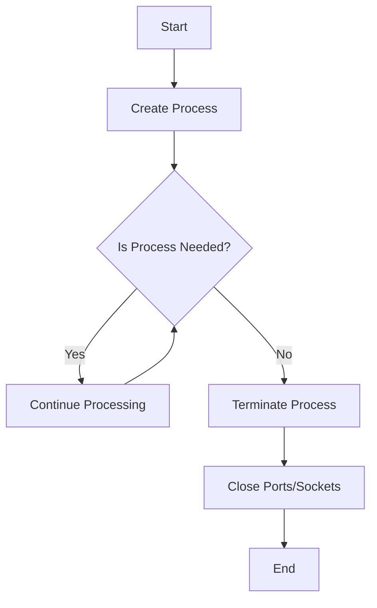

## 23.15 Mismanagement of Resources (Processes, Ports, Sockets)

In the realm of Erlang programming, effective resource management is crucial to building robust and scalable applications. Mismanagement of resources such as processes, ports, and sockets can lead to memory leaks, application crashes, and degraded performance. This section delves into the common pitfalls associated with resource mismanagement and provides guidance on best practices for managing these resources effectively.

### Understanding Resource Management in Erlang

Erlang's concurrency model is built around lightweight processes, which are central to its ability to handle massive concurrency. However, with great power comes great responsibility. Mismanaging these processes, along with other resources like ports and sockets, can lead to significant issues.

#### Common Resources Requiring Careful Management

1. **Processes**: Erlang processes are lightweight and can be created in large numbers. However, failing to terminate unused processes can lead to resource exhaustion.
2. **Ports**: Ports allow Erlang to communicate with external programs. Improper handling can lead to resource leaks and security vulnerabilities.
3. **Sockets**: Sockets are used for network communication. Leaving sockets open can exhaust system resources and lead to performance degradation.

### Risks of Resource Mismanagement

#### Processes

- **Zombie Processes**: Processes that are no longer needed but are not terminated can consume memory and CPU resources.
- **Process Leaks**: Creating processes without proper cleanup can lead to memory leaks and eventual system crashes.

#### Ports

- **Port Leaks**: Failing to close ports after use can lead to resource exhaustion.
- **Security Risks**: Open ports can be exploited by malicious actors if not managed properly.

#### Sockets

- **Socket Leaks**: Leaving sockets open can exhaust file descriptors and degrade system performance.
- **Network Congestion**: Improper socket management can lead to network congestion and increased latency.

### Best Practices for Resource Management

#### Processes

1. **Terminate Unused Processes**: Always ensure that processes are terminated when no longer needed. Use `exit/1` or `exit/2` to terminate processes gracefully.

   ```erlang
   %% Terminating a process
   exit(Pid, normal).
   ```

2. **Use Supervision Trees**: Leverage OTP's supervision trees to manage process lifecycles. Supervisors can automatically restart failed processes, ensuring system resilience.

   ```erlang
   %% Example of a simple supervisor
   -module(my_supervisor).
   -behaviour(supervisor).

   init([]) ->
       {ok, {{one_for_one, 5, 10},
             [{worker, my_worker, [], permanent, 5000, worker, [my_worker]}]}}.
   ```

3. **Monitor Process Usage**: Use tools like `observer` and `etop` to monitor process usage and identify potential leaks.

#### Ports

1. **Close Ports Properly**: Always close ports when they are no longer needed using `port_close/1`.

   ```erlang
   %% Closing a port
   port_close(Port).
   ```

2. **Limit Port Usage**: Restrict the number of open ports to prevent resource exhaustion.

3. **Secure Port Communication**: Use secure communication protocols and validate data to prevent security vulnerabilities.

#### Sockets

1. **Close Sockets After Use**: Ensure sockets are closed after communication is complete to free up resources.

   ```erlang
   %% Closing a socket
   gen_tcp:close(Socket).
   ```

2. **Handle Socket Errors**: Implement error handling for socket operations to manage unexpected failures gracefully.

3. **Monitor Network Usage**: Use tools like `tcpdump` and `Wireshark` to monitor network traffic and identify potential issues.

### Tools for Monitoring Resource Usage

1. **Observer**: A graphical tool for monitoring Erlang systems, providing insights into process usage, memory consumption, and more.

2. **etop**: A command-line tool similar to `top`, providing real-time information about process usage and system performance.

3. **recon**: A library for Erlang that provides advanced introspection capabilities, allowing you to analyze process states and resource usage.

### Implementing Cleanup Mechanisms

1. **Use `after` Clauses**: In `receive` blocks, use `after` clauses to ensure resources are released even if no messages are received.

   ```erlang
   receive
       {ok, Data} ->
           %% Process data
           ok
   after 5000 ->
       %% Timeout, perform cleanup
       cleanup()
   end.
   ```

2. **Link Processes**: Use process linking to ensure that related processes are terminated together, preventing resource leaks.

   ```erlang
   %% Linking processes
   link(Pid).
   ```

3. **Use `try...catch` for Error Handling**: Implement `try...catch` blocks to handle exceptions and ensure resources are released in case of errors.

   ```erlang
   try
       %% Code that may fail
   catch
       _:_ -> 
           %% Handle error and cleanup
           cleanup()
   end.
   ```

### Encouraging Supervision and Monitoring

1. **Design with Supervision in Mind**: Always design systems with supervision in mind, using OTP principles to manage process lifecycles effectively.

2. **Regularly Monitor Systems**: Continuously monitor systems to identify potential resource leaks and address them proactively.

3. **Implement Logging**: Use logging to track resource usage and identify patterns that may indicate mismanagement.

### Visualizing Resource Management



*Diagram: A flowchart illustrating the process of managing resources in Erlang, from process creation to termination and closing of ports/sockets.*

### Conclusion

Effective resource management is crucial for building robust and scalable Erlang applications. By understanding the common pitfalls associated with processes, ports, and sockets, and implementing best practices for resource management, you can ensure your applications remain performant and resilient. Remember, the key to successful resource management is proactive monitoring, effective supervision, and diligent cleanup.

### Try It Yourself

Experiment with the code examples provided in this section. Try modifying the process termination logic, implement additional error handling, or explore the use of supervision trees in your own projects. By actively engaging with these concepts, you'll gain a deeper understanding of resource management in Erlang.

## Quiz: Mismanagement of Resources (Processes, Ports, Sockets)



### Which of the following is a common risk associated with mismanaging Erlang processes?

- [x] Zombie processes consuming resources
- [ ] Increased network latency
- [ ] Data serialization issues
- [ ] Secure communication vulnerabilities

> **Explanation:** Zombie processes are a common risk when Erlang processes are not properly terminated, leading to resource consumption.

### What is the purpose of using supervision trees in Erlang?

- [x] To manage process lifecycles and ensure system resilience
- [ ] To serialize data for network transmission
- [ ] To encrypt communication between nodes
- [ ] To monitor network traffic

> **Explanation:** Supervision trees are used to manage process lifecycles, automatically restarting failed processes to ensure system resilience.

### How can you close a port in Erlang?

- [x] Using the `port_close/1` function
- [ ] Using the `exit/1` function
- [ ] Using the `gen_tcp:close/1` function
- [ ] Using the `link/1` function

> **Explanation:** The `port_close/1` function is used to close ports in Erlang.

### What tool can be used to monitor Erlang systems graphically?

- [x] Observer
- [ ] tcpdump
- [ ] Wireshark
- [ ] Dialyzer

> **Explanation:** Observer is a graphical tool for monitoring Erlang systems, providing insights into process usage and memory consumption.

### Which of the following is a best practice for managing sockets in Erlang?

- [x] Closing sockets after use
- [ ] Leaving sockets open for reuse
- [ ] Using sockets for process communication
- [ ] Encrypting socket data with `crypto`

> **Explanation:** Closing sockets after use is a best practice to free up resources and prevent resource exhaustion.

### What is the role of `after` clauses in `receive` blocks?

- [x] To ensure resources are released even if no messages are received
- [ ] To encrypt data before sending
- [ ] To monitor process usage
- [ ] To serialize data for network transmission

> **Explanation:** `after` clauses in `receive` blocks ensure resources are released even if no messages are received, preventing resource leaks.

### How can you link processes in Erlang?

- [x] Using the `link/1` function
- [ ] Using the `exit/1` function
- [ ] Using the `gen_tcp:close/1` function
- [ ] Using the `port_close/1` function

> **Explanation:** The `link/1` function is used to link processes in Erlang, ensuring related processes are terminated together.

### What is a common tool for monitoring network traffic?

- [x] tcpdump
- [ ] Observer
- [ ] Dialyzer
- [ ] EUnit

> **Explanation:** tcpdump is a common tool for monitoring network traffic and identifying potential issues.

### Which of the following is a risk of leaving sockets open?

- [x] Exhausting file descriptors
- [ ] Increased data serialization time
- [ ] Secure communication vulnerabilities
- [ ] Data encryption issues

> **Explanation:** Leaving sockets open can exhaust file descriptors, leading to resource exhaustion and degraded performance.

### True or False: Supervision trees can automatically restart failed processes.

- [x] True
- [ ] False

> **Explanation:** True. Supervision trees in Erlang can automatically restart failed processes, ensuring system resilience.


