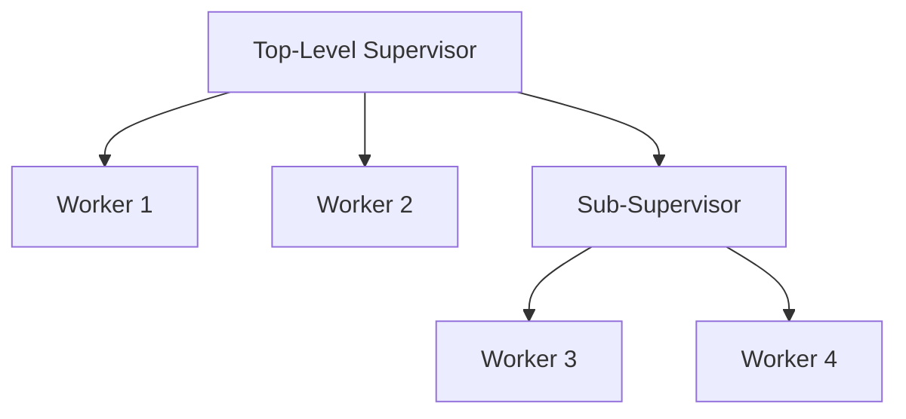

## 23.16 Not Embracing the "Let It Crash" Philosophy Correctly

Erlang's "Let It Crash" philosophy is a cornerstone of its approach to building robust, fault-tolerant systems. However, this philosophy is often misunderstood or misapplied, leading to systems that fail to leverage Erlang's full potential. In this section, we will explore the correct interpretation of "Let It Crash," discuss common misapplications, and provide guidance on balancing fault tolerance with critical error management. We will also emphasize the role of supervisors in Erlang's fault-tolerance model and encourage thoughtful application of this philosophy for system reliability.

### Understanding the "Let It Crash" Philosophy

The "Let It Crash" philosophy in Erlang is based on the idea that systems should be designed to handle failures gracefully by allowing processes to fail and restart rather than trying to prevent every possible error. This approach is rooted in the following principles:

1. **Isolation of Failures**: Each process in Erlang runs independently, and failures in one process do not directly affect others. This isolation allows the system to contain failures and prevent them from cascading.

2. **Supervision Trees**: Erlang uses supervision trees to manage process lifecycles. Supervisors monitor worker processes and restart them if they fail, ensuring that the system can recover from errors automatically.

3. **Simplicity and Clarity**: By allowing processes to crash and restart, developers can write simpler code without complex error handling logic. This simplicity leads to more maintainable and understandable codebases.

4. **Focus on Recovery**: Instead of trying to anticipate and handle every possible error, Erlang encourages developers to focus on recovery strategies, such as restarting processes or rolling back to a known good state.

### Common Misapplications of "Let It Crash"

Despite its advantages, the "Let It Crash" philosophy can be misapplied, leading to systems that are less robust than intended. Some common misapplications include:

1. **Neglecting Critical Error Handling**: While "Let It Crash" encourages letting non-critical processes fail, it is essential to handle critical errors that could compromise system integrity or data consistency. Failing to do so can lead to data loss or corruption.

2. **Over-Reliance on Restarting**: Relying solely on process restarts without addressing underlying issues can lead to repeated failures and degraded performance. It is crucial to identify and fix root causes of errors.

3. **Inadequate Supervision Strategies**: Poorly designed supervision trees can result in ineffective error recovery. For example, using a one-for-one restart strategy when a one-for-all strategy is needed can lead to incomplete recovery.

4. **Ignoring Resource Leaks**: Allowing processes to crash without cleaning up resources (e.g., file handles, network connections) can lead to resource exhaustion and system instability.

5. **Misunderstanding Process Isolation**: Assuming that process isolation means no need for coordination or state management can lead to inconsistent system behavior.

### Balancing Fault Tolerance with Critical Error Management

To apply the "Let It Crash" philosophy effectively, it is essential to balance fault tolerance with critical error management. Here are some strategies to achieve this balance:

1. **Identify Critical Processes**: Determine which processes are critical to system operation and require additional error handling. For these processes, implement safeguards to prevent data loss or corruption.

2. **Implement Comprehensive Logging**: Use logging to capture detailed information about process failures. This information can help diagnose issues and improve system reliability.

3. **Use Supervisors Effectively**: Design supervision trees carefully, choosing appropriate restart strategies for different types of processes. Consider using custom supervision strategies for complex systems.

4. **Monitor System Health**: Implement monitoring tools to track system performance and detect anomalies. Use this data to proactively address potential issues before they lead to failures.

5. **Conduct Regular Testing**: Test the system under various failure scenarios to ensure that it can recover gracefully. Use tools like QuickCheck for property-based testing to explore edge cases.

### The Role of Supervisors in Erlang's Fault-Tolerance Model

Supervisors play a crucial role in Erlang's fault-tolerance model by managing process lifecycles and ensuring system stability. Here are some key aspects of supervisors:

1. **Process Monitoring**: Supervisors monitor worker processes and take corrective actions (e.g., restarting) when failures occur.

2. **Restart Strategies**: Supervisors can use different restart strategies, such as one-for-one, one-for-all, or rest-for-one, to control how processes are restarted after failures.

3. **Hierarchy and Nesting**: Supervisors can be nested to create complex supervision trees, allowing for fine-grained control over process management.

4. **Customization**: Developers can implement custom supervisors to handle specific failure scenarios or integrate with external monitoring systems.

### Code Example: Implementing a Supervisor

Let's explore a simple example of implementing a supervisor in Erlang to manage worker processes.

```erlang
-module(my_supervisor).
-behaviour(supervisor).

%% API
-export([start_link/0]).

%% Supervisor callbacks
-export([init/1]).

start_link() ->
    supervisor:start_link({local, ?MODULE}, ?MODULE, []).

init([]) ->
    %% Define child processes
    Children = [
        {my_worker, {my_worker, start_link, []}, permanent, 5000, worker, [my_worker]}
    ],

    %% Define supervisor strategy
    {ok, {{one_for_one, 10, 100}, Children}}.
```

In this example, we define a supervisor module `my_supervisor` that manages a single worker process `my_worker`. The supervisor uses a `one_for_one` strategy, meaning that if the worker process crashes, only that process will be restarted.

### Try It Yourself

Experiment with the supervisor example by modifying the worker process to introduce a failure condition. Observe how the supervisor handles the failure and restarts the process. Consider changing the restart strategy to see how it affects system behavior.

### Visualizing Supervision Trees

To better understand supervision trees, let's visualize a simple supervision hierarchy using Mermaid.js.



In this diagram, the top-level supervisor manages two workers and a sub-supervisor. The sub-supervisor, in turn, manages two additional workers. This hierarchy allows for flexible and scalable process management.

### References and Further Reading

- [Erlang's "Let It Crash" Philosophy](https://erlang.org/doc/design_principles/des_princ.html)
- [Erlang/OTP Design Principles](https://erlang.org/doc/design_principles/des_princ.html)
- [Erlang Supervision Trees](https://learnyousomeerlang.com/supervisors)

### Knowledge Check

- What is the primary goal of the "Let It Crash" philosophy?
- How do supervisors contribute to Erlang's fault-tolerance model?
- What are some common misapplications of the "Let It Crash" philosophy?

### Summary

In this section, we explored the correct interpretation of Erlang's "Let It Crash" philosophy and discussed common misapplications that can lead to less robust systems. We emphasized the importance of balancing fault tolerance with critical error management and highlighted the role of supervisors in Erlang's fault-tolerance model. By applying these principles thoughtfully, developers can build reliable and resilient systems that leverage Erlang's strengths.

Remember, this is just the beginning. As you continue to explore Erlang, keep experimenting, stay curious, and embrace the journey!

## Quiz: Not Embracing the "Let It Crash" Philosophy Correctly



### What is the primary goal of the "Let It Crash" philosophy in Erlang?

- [x] To allow processes to fail and restart, ensuring system robustness
- [ ] To prevent all possible errors through extensive error handling
- [ ] To minimize the number of processes in a system
- [ ] To avoid using supervisors in process management

> **Explanation:** The "Let It Crash" philosophy focuses on allowing processes to fail and restart, leveraging Erlang's fault-tolerance capabilities.

### Which of the following is a common misapplication of the "Let It Crash" philosophy?

- [x] Neglecting critical error handling
- [ ] Using supervisors to manage process lifecycles
- [ ] Implementing comprehensive logging
- [ ] Conducting regular testing

> **Explanation:** Neglecting critical error handling can lead to data loss or corruption, which is a common misapplication of the philosophy.

### How do supervisors contribute to Erlang's fault-tolerance model?

- [x] By monitoring worker processes and restarting them upon failure
- [ ] By preventing processes from crashing
- [ ] By reducing the number of processes in a system
- [ ] By eliminating the need for error handling

> **Explanation:** Supervisors monitor worker processes and restart them upon failure, ensuring system stability.

### What is a key benefit of using supervision trees in Erlang?

- [x] They provide a structured way to manage process lifecycles
- [ ] They eliminate the need for logging
- [ ] They prevent all possible errors
- [ ] They reduce system complexity by minimizing processes

> **Explanation:** Supervision trees provide a structured way to manage process lifecycles, contributing to system robustness.

### What should developers focus on when applying the "Let It Crash" philosophy?

- [x] Balancing fault tolerance with critical error management
- [ ] Preventing all possible errors
- [ ] Minimizing the number of processes
- [ ] Avoiding the use of supervisors

> **Explanation:** Developers should focus on balancing fault tolerance with critical error management to ensure system reliability.

### Which restart strategy allows only the failed process to be restarted?

- [x] One-for-one
- [ ] One-for-all
- [ ] Rest-for-one
- [ ] All-for-one

> **Explanation:** The one-for-one strategy restarts only the failed process, leaving others unaffected.

### What is a potential consequence of over-relying on process restarts?

- [x] Repeated failures and degraded performance
- [ ] Complete prevention of errors
- [ ] Elimination of the need for supervisors
- [ ] Reduction in system complexity

> **Explanation:** Over-relying on restarts without addressing root causes can lead to repeated failures and degraded performance.

### How can developers identify critical processes in a system?

- [x] By determining which processes are essential for system operation
- [ ] By minimizing the number of processes
- [ ] By eliminating all error handling
- [ ] By avoiding the use of supervisors

> **Explanation:** Identifying critical processes involves determining which processes are essential for system operation and require additional error handling.

### What role do supervisors play in process isolation?

- [x] They manage process lifecycles and ensure isolation
- [ ] They prevent processes from crashing
- [ ] They eliminate the need for error handling
- [ ] They reduce the number of processes

> **Explanation:** Supervisors manage process lifecycles and ensure isolation, contributing to system robustness.

### True or False: The "Let It Crash" philosophy eliminates the need for error handling in Erlang.

- [ ] True
- [x] False

> **Explanation:** While the "Let It Crash" philosophy focuses on allowing processes to fail and restart, it does not eliminate the need for error handling, especially for critical errors.


