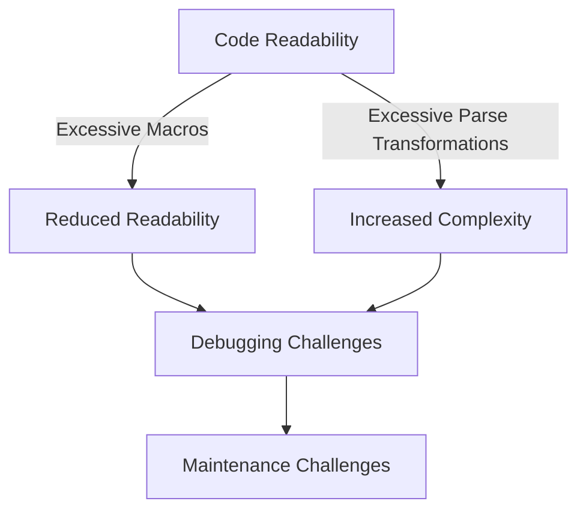

## 23.2 Overusing Macros and Parse Transformations

In the world of Erlang programming, macros and parse transformations are powerful tools that can enhance code flexibility and reduce redundancy. However, like any powerful tool, they come with the risk of misuse. Overusing macros and parse transformations can lead to code that is difficult to read, understand, and maintain. In this section, we will explore the proper use of these features, discuss common pitfalls, and provide guidelines for using them judiciously.

### Understanding Macros in Erlang

Macros in Erlang are a form of code abstraction that allows developers to define reusable code snippets. They are similar to macros in C and are defined using the `-define` directive. Macros can be used to simplify repetitive code patterns and make code more concise.

#### Proper Use of Macros

- **Simplifying Repetitive Code**: Use macros to encapsulate repetitive code patterns that occur frequently in your codebase. This can reduce the risk of errors and make your code easier to maintain.
- **Configuration Constants**: Define configuration constants that are used throughout your application. This centralizes configuration and makes it easier to update.
- **Conditional Compilation**: Use macros to include or exclude code based on compilation conditions, which can be useful for debugging or platform-specific code.

#### Example of Proper Macro Usage

```erlang
% Define a macro for a common error message
-define(ERROR_MSG, "An unexpected error occurred").

% Use the macro in a function
handle_error() ->
    io:format("~s~n", [?ERROR_MSG]).
```

### The Risks of Overusing Macros

While macros can be beneficial, overusing them can lead to several issues:

- **Reduced Readability**: Excessive use of macros can make code difficult to read and understand, especially for developers who are not familiar with the macro definitions.
- **Debugging Challenges**: Macros can obscure the actual code being executed, making it harder to trace and debug issues.
- **Complexity**: Overuse of macros can lead to complex and convoluted code structures that are difficult to maintain.

#### Example of Macro Overuse

```erlang
% Overuse of macros leading to complex code
-define(ADD(X, Y), X + Y).
-define(SUB(X, Y), X - Y).
-define(MUL(X, Y), X * Y).
-define(DIV(X, Y), X / Y).

calculate() ->
    Result = ?ADD(?MUL(5, 3), ?SUB(10, 2)),
    io:format("Result: ~p~n", [Result]).
```

In this example, the use of macros for basic arithmetic operations adds unnecessary complexity and reduces code readability.

### Parse Transformations in Erlang

Parse transformations are a more advanced feature in Erlang that allows developers to manipulate the abstract syntax tree (AST) of a module during compilation. This can be used to implement domain-specific languages or to introduce new language constructs.

#### Proper Use of Parse Transformations

- **Domain-Specific Languages**: Implement domain-specific languages that simplify complex operations within a specific domain.
- **Code Instrumentation**: Use parse transformations to instrument code for logging, profiling, or debugging purposes.

#### Example of Proper Parse Transformation Usage

```erlang
% A simple parse transformation that logs function calls
-module(log_transform).
-export([parse_transform/2]).

parse_transform(Forms, _Options) ->
    [transform_form(Form) || Form <- Forms].

transform_form({function, Line, Name, Arity, Clauses}) ->
    {function, Line, Name, Arity, [transform_clause(Clause) || Clause <- Clauses]};
transform_form(Other) ->
    Other.

transform_clause({clause, Line, Patterns, Guards, Body}) ->
    {clause, Line, Patterns, Guards, [{call, Line, {remote, Line, {atom, Line, io}, {atom, Line, format}}, [{string, Line, "Calling function~n"}]} | Body]}.
```

### The Risks of Overusing Parse Transformations

- **Complexity**: Parse transformations can introduce significant complexity into the codebase, making it difficult for developers to understand the code flow.
- **Maintenance Challenges**: As the codebase evolves, maintaining parse transformations can become challenging, especially if they are not well-documented.
- **Unexpected Behavior**: Parse transformations can lead to unexpected behavior if not implemented carefully, as they modify the code at a fundamental level.

### Guidelines for Using Macros and Parse Transformations Judiciously

1. **Favor Simplicity**: Always prioritize simple and straightforward code over clever solutions that rely heavily on macros or parse transformations.
2. **Limit Scope**: Use macros and parse transformations sparingly and limit their scope to specific use cases where they provide clear benefits.
3. **Document Thoroughly**: Ensure that all macros and parse transformations are well-documented, explaining their purpose and usage.
4. **Review and Refactor**: Regularly review and refactor code to identify and eliminate unnecessary macros and parse transformations.
5. **Encourage Code Readability**: Aim for code that is easy to read and understand, even if it means writing a few extra lines of code.

### Try It Yourself

To better understand the impact of macros and parse transformations, try modifying the examples provided:

- **Experiment with Macros**: Create a macro that encapsulates a common pattern in your codebase and observe how it affects readability and maintainability.
- **Implement a Simple Parse Transformation**: Write a parse transformation that adds logging to function calls and see how it changes the code execution.

### Visualizing the Impact of Macros and Parse Transformations

To visualize the impact of macros and parse transformations, consider the following diagram that illustrates how these features can affect code readability and complexity:



**Diagram Description**: This diagram shows how excessive use of macros and parse transformations can lead to reduced readability, increased complexity, and ultimately result in debugging and maintenance challenges.

### References and Further Reading

- [Erlang Macros](https://erlang.org/doc/reference_manual/macros.html)
- [Parse Transformations](https://erlang.org/doc/man/compile.html#parse_transform-2)
- [Erlang Programming Best Practices](https://erlang.org/doc/design_principles/des_princ.html)

### Knowledge Check

- **What are the benefits of using macros in Erlang?**
- **How can overusing macros lead to code complexity?**
- **What are parse transformations, and when should they be used?**
- **Why is it important to document macros and parse transformations?**

### Embrace the Journey

Remember, the goal is to write code that is not only functional but also maintainable and easy to understand. As you continue to explore Erlang, keep experimenting with different features, stay curious, and enjoy the journey of learning and growth!

## Quiz: Overusing Macros and Parse Transformations



### What is a primary benefit of using macros in Erlang?

- [x] Simplifying repetitive code patterns
- [ ] Increasing code execution speed
- [ ] Enhancing security
- [ ] Reducing memory usage

> **Explanation:** Macros are primarily used to simplify repetitive code patterns, making the code more concise and maintainable.

### What is a common risk associated with overusing macros?

- [ ] Improved code readability
- [x] Reduced code readability
- [ ] Enhanced performance
- [ ] Increased security

> **Explanation:** Overusing macros can lead to reduced code readability, making it difficult for developers to understand the code.

### What is a parse transformation in Erlang?

- [ ] A tool for optimizing memory usage
- [ ] A method for encrypting data
- [x] A way to manipulate the abstract syntax tree during compilation
- [ ] A technique for improving network communication

> **Explanation:** Parse transformations allow developers to manipulate the abstract syntax tree of a module during compilation.

### When should parse transformations be used?

- [ ] For every function call
- [x] For implementing domain-specific languages
- [ ] For basic arithmetic operations
- [ ] For simple logging

> **Explanation:** Parse transformations are best used for implementing domain-specific languages and complex code instrumentation.

### How can overusing parse transformations affect a codebase?

- [ ] It makes the codebase easier to maintain
- [ ] It improves code readability
- [x] It introduces complexity and maintenance challenges
- [ ] It enhances code security

> **Explanation:** Overusing parse transformations can introduce significant complexity and maintenance challenges.

### What is a guideline for using macros judiciously?

- [ ] Use macros for every function
- [x] Limit their scope to specific use cases
- [ ] Avoid documenting macros
- [ ] Use macros to replace all variables

> **Explanation:** Macros should be used sparingly and limited to specific use cases where they provide clear benefits.

### Why is it important to document macros and parse transformations?

- [ ] To increase code execution speed
- [ ] To reduce memory usage
- [x] To explain their purpose and usage
- [ ] To enhance security

> **Explanation:** Documenting macros and parse transformations helps explain their purpose and usage, making the code easier to understand.

### What is a potential outcome of excessive macro usage?

- [x] Debugging challenges
- [ ] Improved performance
- [ ] Simplified code structure
- [ ] Enhanced security

> **Explanation:** Excessive macro usage can lead to debugging challenges due to obscured code execution.

### How can developers avoid the pitfalls of overusing macros?

- [ ] By using macros for all operations
- [x] By favoring straightforward code
- [ ] By avoiding documentation
- [ ] By increasing code complexity

> **Explanation:** Developers should favor straightforward code over overly clever solutions that rely heavily on macros.

### True or False: Parse transformations should be used for every function call.

- [ ] True
- [x] False

> **Explanation:** Parse transformations should not be used for every function call; they are best suited for specific, complex use cases.


