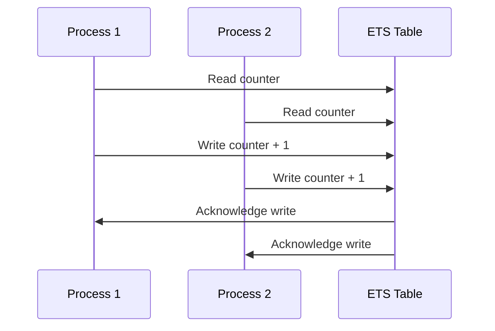

## 23.3 Shared Mutable State via ETS without Proper Synchronization

In the world of concurrent programming, managing shared state is a critical challenge. Erlang, with its robust concurrency model, provides several tools to handle shared state, one of which is the Erlang Term Storage (ETS). ETS tables allow processes to share data efficiently, but they also introduce potential pitfalls when it comes to synchronization. In this section, we will delve into the intricacies of using ETS for shared mutable state, explore the risks of concurrent access, and discuss best practices to avoid common pitfalls.

### Understanding ETS and Shared State

Erlang Term Storage (ETS) is a powerful feature in Erlang that allows for the storage of large amounts of data in memory. ETS tables are capable of storing tuples and can be accessed by multiple processes concurrently. This makes ETS an attractive option for scenarios where data needs to be shared across different processes.

#### How ETS Allows Processes to Share Data

ETS tables are created using the `ets:new/2` function, which returns a table identifier. This identifier can be used by any process to read from or write to the table. Here's a simple example of creating and using an ETS table:

```erlang
% Create a new ETS table
Table = ets:new(my_table, [set, public]),

% Insert a key-value pair
ets:insert(Table, {key, value}),

% Retrieve the value associated with a key
[{key, Value}] = ets:lookup(Table, key),

% Output the value
io:format("The value is: ~p~n", [Value]).
```

In this example, the ETS table `my_table` is created with the `public` option, allowing any process to access it. This is where the potential for shared mutable state arises.

### Risks of Concurrent Access

While ETS provides a convenient way to share data, it does not inherently handle synchronization. This means that concurrent access to the same data can lead to race conditions, where the outcome depends on the timing of the processes involved.

#### Race Conditions and Synchronization Issues

A race condition occurs when two or more processes attempt to read or write shared data simultaneously, leading to unpredictable results. Consider the following scenario:

```erlang
% Process 1
ets:insert(Table, {counter, 1}).

% Process 2
[{counter, Value}] = ets:lookup(Table, counter),
ets:insert(Table, {counter, Value + 1}).

% Process 3
[{counter, Value}] = ets:lookup(Table, counter),
ets:insert(Table, {counter, Value + 1}).
```

In this example, both Process 2 and Process 3 attempt to increment the same counter. Without proper synchronization, the final value of the counter is indeterminate, as both processes may read the same initial value before either has a chance to update it.

### Solutions for Synchronization

To avoid race conditions and ensure data consistency, it is essential to implement synchronization mechanisms when using ETS for shared mutable state. Here are some strategies to consider:

#### Using Locking Mechanisms

One approach to synchronization is to use locks to control access to the ETS table. This can be achieved by implementing a locking mechanism using Erlang processes. Here's an example:

```erlang
% Locking process
lock(Table) ->
    receive
        {lock, Pid} ->
            Pid ! {locked, self()},
            lock(Table);
        {unlock, Pid} ->
            Pid ! {unlocked, self()},
            lock(Table)
    end.

% Process 2
lock_pid ! {lock, self()},
receive
    {locked, _} ->
        [{counter, Value}] = ets:lookup(Table, counter),
        ets:insert(Table, {counter, Value + 1}),
        lock_pid ! {unlock, self()}
end.
```

In this example, a separate process acts as a lock, ensuring that only one process can access the ETS table at a time.

#### Serialized Access

Another approach is to serialize access to the ETS table by funneling all operations through a single process. This process acts as a gatekeeper, ensuring that only one operation is performed at a time:

```erlang
% Serialized access process
serialized_access(Table) ->
    receive
        {operation, Fun, Pid} ->
            Result = Fun(Table),
            Pid ! {result, Result},
            serialized_access(Table)
    end.

% Process 2
serialized_pid ! {operation, fun(Table) ->
    [{counter, Value}] = ets:lookup(Table, counter),
    ets:insert(Table, {counter, Value + 1})
end, self()},
receive
    {result, _} -> ok
end.
```

This approach simplifies synchronization by centralizing access control, but it can become a bottleneck if the process becomes overloaded.

### Best Practices for Shared State Management

When using ETS for shared mutable state, it is crucial to follow best practices to ensure data consistency and avoid common pitfalls. Here are some guidelines to consider:

1. **Minimize Shared State**: Whenever possible, minimize the amount of shared state to reduce the complexity of synchronization.

2. **Use Appropriate Table Types**: Choose the right type of ETS table (`set`, `ordered_set`, `bag`, or `duplicate_bag`) based on your use case to optimize performance and avoid unnecessary complexity.

3. **Implement Synchronization**: Always implement synchronization mechanisms, such as locks or serialized access, to prevent race conditions.

4. **Monitor Performance**: Keep an eye on the performance of your synchronization mechanisms to ensure they do not become bottlenecks.

5. **Test Thoroughly**: Test your application under various conditions to identify and resolve potential synchronization issues.

### Visualizing Synchronization Challenges

To better understand the challenges of synchronization with ETS, let's visualize a scenario where multiple processes access shared state without proper synchronization:



In this diagram, both Process 1 and Process 2 read the same initial value of the counter and then write back an incremented value. Without synchronization, the final value of the counter is unpredictable.

### Try It Yourself

To gain a deeper understanding of synchronization with ETS, try modifying the code examples provided. Experiment with different synchronization mechanisms and observe how they affect the outcome. Consider implementing a more complex scenario with multiple shared state variables and processes.

### References and Further Reading

For more information on ETS and synchronization in Erlang, consider the following resources:

- [Erlang Documentation on ETS](https://www.erlang.org/doc/man/ets.html)
- [Concurrency in Erlang](https://erlang.org/doc/reference_manual/concurrent.html)
- [Erlang Programming: A Concurrent Approach to Software Development](https://www.oreilly.com/library/view/erlang-programming/9780596518189/)

### Knowledge Check

Before moving on, let's reinforce what we've learned:

- What are the risks of using ETS for shared mutable state without synchronization?
- How can locking mechanisms help prevent race conditions?
- What are the benefits and drawbacks of serialized access?

### Embrace the Journey

Remember, mastering synchronization with ETS is just one step in your journey to becoming an expert in Erlang concurrency. Keep experimenting, stay curious, and enjoy the process of learning and discovery!

## Quiz: Shared Mutable State via ETS without Proper Synchronization



### What is a primary risk of using ETS for shared mutable state without synchronization?

- [x] Race conditions
- [ ] Memory leaks
- [ ] Deadlocks
- [ ] Stack overflow

> **Explanation:** Race conditions occur when multiple processes access and modify shared data simultaneously without proper synchronization.


### Which of the following is a method to prevent race conditions in ETS?

- [x] Locking mechanisms
- [ ] Increasing memory allocation
- [ ] Using more processes
- [ ] Disabling garbage collection

> **Explanation:** Locking mechanisms ensure that only one process can access the shared state at a time, preventing race conditions.


### What is serialized access in the context of ETS?

- [x] Centralizing all operations through a single process
- [ ] Using multiple tables for different processes
- [ ] Encrypting data before storage
- [ ] Disabling concurrent access

> **Explanation:** Serialized access involves funneling all operations through a single process to ensure that only one operation is performed at a time.


### What is a potential drawback of serialized access?

- [x] It can become a bottleneck
- [ ] It increases memory usage
- [ ] It causes data corruption
- [ ] It leads to deadlocks

> **Explanation:** Serialized access can become a bottleneck if the central process becomes overloaded with requests.


### Which ETS table type is best for ensuring unique keys?

- [x] `set`
- [ ] `bag`
- [ ] `duplicate_bag`
- [ ] `ordered_set`

> **Explanation:** The `set` table type ensures that each key is unique, which is useful for scenarios where unique keys are required.


### What is the purpose of the `public` option in ETS?

- [x] To allow any process to access the table
- [ ] To encrypt the data in the table
- [ ] To increase the table's size limit
- [ ] To disable synchronization

> **Explanation:** The `public` option allows any process to access the ETS table, enabling shared state across processes.


### How can you monitor the performance of synchronization mechanisms?

- [x] By profiling and testing under various conditions
- [ ] By increasing the number of processes
- [ ] By disabling garbage collection
- [ ] By using more memory

> **Explanation:** Profiling and testing under various conditions help identify performance bottlenecks and ensure efficient synchronization.


### What is a race condition?

- [x] A situation where the outcome depends on the timing of processes
- [ ] A condition where processes run out of memory
- [ ] A state where processes are permanently blocked
- [ ] A scenario where data is encrypted

> **Explanation:** A race condition occurs when the outcome of a process depends on the timing of other processes accessing shared data.


### What is the role of a locking process in synchronization?

- [x] To control access to shared resources
- [ ] To increase memory allocation
- [ ] To disable concurrent access
- [ ] To encrypt data

> **Explanation:** A locking process controls access to shared resources, ensuring that only one process can access the resource at a time.


### True or False: ETS inherently handles synchronization for shared state.

- [ ] True
- [x] False

> **Explanation:** False. ETS does not inherently handle synchronization; it must be implemented by the developer to prevent race conditions.




