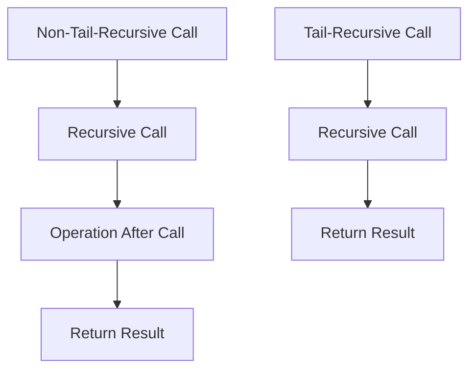

## 23.4 Inefficient Use of Recursion and Non-Tail Calls

Recursion is a fundamental concept in functional programming languages like Erlang. However, inefficient use of recursion, particularly non-tail-recursive functions, can lead to performance issues and stack overflows. In this section, we will explore the differences between tail-recursive and non-tail-recursive functions, discuss the performance implications of non-tail calls, and provide strategies for refactoring code to be tail-recursive. We will also highlight tools and techniques for detecting recursion issues and encourage writing efficient recursive functions.

### Understanding Recursion in Erlang

Recursion is a technique where a function calls itself to solve a problem. In Erlang, recursion is often used to iterate over data structures, perform calculations, or manage state. However, not all recursive functions are created equal. The efficiency of a recursive function largely depends on whether it is tail-recursive or non-tail-recursive.

#### Tail-Recursive vs. Non-Tail-Recursive Functions

**Tail-Recursive Functions**: A function is tail-recursive if the recursive call is the last operation in the function. This allows the Erlang runtime to optimize the recursion by reusing the current function's stack frame, effectively transforming the recursion into iteration. This optimization prevents stack overflow and improves performance.

**Non-Tail-Recursive Functions**: In contrast, a non-tail-recursive function performs additional operations after the recursive call. This means each recursive call requires a new stack frame, leading to increased memory usage and potential stack overflow for deep recursions.

### Performance Implications of Non-Tail Calls

Non-tail-recursive functions can significantly impact performance due to their stack usage. Each recursive call adds a new frame to the call stack, which can quickly exhaust available memory for deep recursions. This not only leads to stack overflow errors but also results in slower execution due to the overhead of managing multiple stack frames.

#### Example of Non-Tail Recursion

Consider the following example of a non-tail-recursive function that calculates the factorial of a number:

```erlang
% Non-tail-recursive factorial function
factorial(0) -> 1;
factorial(N) when N > 0 -> N * factorial(N - 1).
```

In this example, the multiplication operation occurs after the recursive call, making it non-tail-recursive. Each call to `factorial` requires a new stack frame, which can lead to stack overflow for large values of `N`.

### Refactoring to Tail Recursion

To optimize recursive functions, we can refactor them to be tail-recursive. This involves ensuring that the recursive call is the last operation in the function. Let's refactor the factorial function to be tail-recursive:

```erlang
% Tail-recursive factorial function
factorial(N) -> factorial(N, 1).

factorial(0, Acc) -> Acc;
factorial(N, Acc) when N > 0 -> factorial(N - 1, N * Acc).
```

In the tail-recursive version, we introduce an accumulator (`Acc`) to carry the result of the multiplication. The recursive call is now the last operation, allowing the Erlang runtime to optimize the recursion.

### Tools and Techniques for Detecting Recursion Issues

Detecting inefficient recursion can be challenging, but several tools and techniques can help:

- **Dialyzer**: Erlang's static analysis tool can detect potential recursion issues and suggest optimizations.
- **Profiling Tools**: Use tools like `fprof` and `eprof` to analyze function call patterns and identify inefficient recursion.
- **Code Review**: Regular code reviews can help identify non-tail-recursive functions and suggest refactoring strategies.

### Encouraging Efficient Recursive Functions

Writing efficient recursive functions requires careful consideration of the problem and the data structures involved. Here are some tips to encourage efficient recursion:

- **Use Tail Recursion**: Always strive to write tail-recursive functions to leverage Erlang's optimization capabilities.
- **Limit Recursion Depth**: Avoid deep recursion by breaking problems into smaller, manageable parts.
- **Use Accumulators**: Introduce accumulators to carry intermediate results and reduce stack usage.
- **Consider Iterative Solutions**: For problems that do not naturally fit recursion, consider using iterative solutions.

### Visualizing Recursion

To better understand the differences between tail-recursive and non-tail-recursive functions, let's visualize the call stack for each type of recursion.



In the diagram above, the non-tail-recursive call involves additional operations after the recursive call, leading to a deeper call stack. In contrast, the tail-recursive call allows the runtime to optimize the recursion by reusing the stack frame.

### Try It Yourself

To gain a deeper understanding of recursion in Erlang, try modifying the tail-recursive factorial function to calculate the sum of a list of numbers. Experiment with different data structures and recursion strategies to see how they affect performance.

### Knowledge Check

Before we conclude, let's reinforce our understanding of recursion in Erlang with a few questions:

- What is the main difference between tail-recursive and non-tail-recursive functions?
- How does tail recursion improve performance in Erlang?
- What tools can help detect inefficient recursion in Erlang code?

### Summary

In this section, we explored the inefficient use of recursion in Erlang, focusing on non-tail-recursive functions and their impact on performance. We discussed the differences between tail-recursive and non-tail-recursive functions, provided examples of refactoring code to be tail-recursive, and highlighted tools and techniques for detecting recursion issues. By writing efficient recursive functions, we can improve the performance and reliability of our Erlang applications.

Remember, recursion is a powerful tool in functional programming, but it must be used wisely. By understanding the implications of non-tail calls and adopting best practices for recursion, we can harness the full potential of Erlang's functional programming capabilities.

## Quiz: Inefficient Use of Recursion and Non-Tail Calls



### What is a tail-recursive function?

- [x] A function where the recursive call is the last operation
- [ ] A function that calls itself multiple times
- [ ] A function that does not use recursion
- [ ] A function that uses an accumulator

> **Explanation:** A tail-recursive function is one where the recursive call is the last operation, allowing for optimization.

### Why are non-tail-recursive functions inefficient?

- [x] They require additional stack frames for each call
- [ ] They execute faster than tail-recursive functions
- [ ] They do not use recursion
- [ ] They are easier to write

> **Explanation:** Non-tail-recursive functions require additional stack frames, leading to increased memory usage and potential stack overflow.

### How can you refactor a non-tail-recursive function to be tail-recursive?

- [x] Use an accumulator to carry intermediate results
- [ ] Remove all recursive calls
- [ ] Add more operations after the recursive call
- [ ] Use a different programming language

> **Explanation:** Introducing an accumulator allows the recursive call to be the last operation, making the function tail-recursive.

### Which tool can help detect recursion issues in Erlang?

- [x] Dialyzer
- [ ] Git
- [ ] Docker
- [ ] Kubernetes

> **Explanation:** Dialyzer is a static analysis tool that can detect potential recursion issues in Erlang code.

### What is the benefit of tail recursion in Erlang?

- [x] It allows the runtime to optimize recursion by reusing stack frames
- [ ] It makes the code harder to read
- [ ] It increases the number of stack frames
- [ ] It requires more memory

> **Explanation:** Tail recursion allows the runtime to optimize recursion by reusing stack frames, improving performance.

### What is a common pitfall of non-tail-recursive functions?

- [x] Stack overflow
- [ ] Faster execution
- [ ] Simplicity
- [ ] Reduced memory usage

> **Explanation:** Non-tail-recursive functions can lead to stack overflow due to increased stack usage.

### How can you limit recursion depth in Erlang?

- [x] Break problems into smaller parts
- [ ] Use more recursive calls
- [ ] Avoid using accumulators
- [ ] Increase stack size

> **Explanation:** Breaking problems into smaller parts can help limit recursion depth and prevent stack overflow.

### What is an accumulator in the context of recursion?

- [x] A variable that carries intermediate results
- [ ] A tool for detecting recursion issues
- [ ] A type of non-tail-recursive function
- [ ] A programming language feature

> **Explanation:** An accumulator is a variable used to carry intermediate results in a tail-recursive function.

### What is the main advantage of using tail recursion?

- [x] Improved performance and prevention of stack overflow
- [ ] Increased complexity
- [ ] More stack frames
- [ ] Easier to write

> **Explanation:** Tail recursion improves performance by preventing stack overflow and optimizing recursion.

### True or False: Non-tail-recursive functions are always more efficient than tail-recursive functions.

- [ ] True
- [x] False

> **Explanation:** Non-tail-recursive functions are less efficient due to increased stack usage and potential stack overflow.




