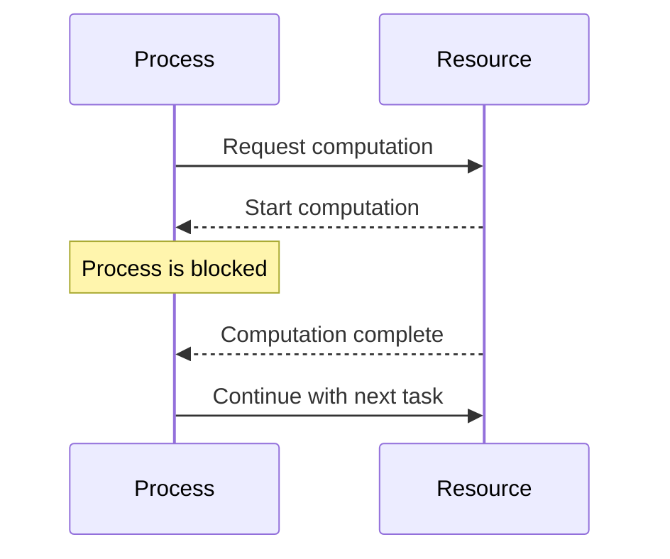

## 23.5 Blocking Operations in Concurrent Processes

In the world of concurrent programming, especially in a language like Erlang, understanding and managing blocking operations is crucial for building efficient and responsive systems. Blocking operations can significantly hinder the performance of concurrent processes, leading to bottlenecks and degraded system responsiveness. In this section, we will explore common blocking operations, their impact on process scheduling, and strategies to avoid them.

### Understanding Blocking Operations

Blocking operations are those that halt the execution of a process until a certain condition is met or an operation is completed. These can include:

- **Long Computations**: Intensive calculations that take a significant amount of time to complete.
- **I/O Operations**: Reading from or writing to files, databases, or network sockets without asynchronous handling.
- **Waiting for External Resources**: Such as waiting for a lock to be released or a resource to become available.

#### Impact on Concurrency

In Erlang, processes are lightweight and designed to run concurrently. However, when a process encounters a blocking operation, it can no longer proceed until the operation is complete. This can lead to:

- **Reduced Throughput**: As processes are blocked, fewer tasks can be handled concurrently.
- **Increased Latency**: Blocking can delay the response time of processes, affecting the overall system performance.
- **Resource Contention**: Blocking operations can lead to contention for resources, further degrading performance.

### Common Blocking Operations in Erlang

Let's delve into some common blocking operations that can occur in Erlang processes:

#### Long Computations

Erlang is not inherently designed for heavy computational tasks. Long-running computations can block a process, preventing it from handling other tasks. Consider the following example:

```erlang
% A function that performs a long computation
long_computation(N) when N > 0 ->
    lists:foldl(fun(X, Acc) -> X * Acc end, 1, lists:seq(1, N));
long_computation(0) -> 1.
```

In this example, the `long_computation/1` function performs a factorial calculation, which can be time-consuming for large values of `N`.

#### I/O Operations

I/O operations, such as reading from or writing to a file, can block a process if not handled asynchronously. For instance:

```erlang
% Blocking file read operation
read_file(FileName) ->
    {ok, Binary} = file:read_file(FileName),
    Binary.
```

This operation blocks the process until the file is completely read.

#### Waiting for External Resources

Processes may need to wait for external resources, such as locks or network responses, which can introduce blocking. For example:

```erlang
% Simulating a blocking wait for a resource
wait_for_resource(Resource) ->
    receive
        {resource_available, Resource} -> ok
    after 5000 ->
        {error, timeout}
    end.
```

### Avoiding Blocking Operations

To maintain the responsiveness of Erlang processes, it's essential to avoid blocking operations. Here are some strategies:

#### Asynchronous I/O

Use asynchronous I/O operations to prevent blocking. Erlang provides libraries and techniques to handle I/O asynchronously. For example, using `gen_tcp` for non-blocking network communication:

```erlang
% Non-blocking TCP connection
start_client(Host, Port) ->
    {ok, Socket} = gen_tcp:connect(Host, Port, [binary, {active, false}]),
    gen_tcp:send(Socket, <<"Hello, server!">>),
    receive_data(Socket).

receive_data(Socket) ->
    case gen_tcp:recv(Socket, 0) of
        {ok, Data} ->
            io:format("Received: ~p~n", [Data]),
            receive_data(Socket);
        {error, closed} ->
            io:format("Connection closed~n")
    end.
```

#### Breaking Down Long Computations

Divide long computations into smaller tasks that can be processed incrementally. This approach allows processes to remain responsive and handle other tasks concurrently.

```erlang
% Breaking down a long computation
factorial(N) -> factorial(N, 1).

factorial(0, Acc) -> Acc;
factorial(N, Acc) when N > 0 ->
    receive
        continue -> factorial(N - 1, N * Acc)
    after 0 ->
        factorial(N - 1, N * Acc)
    end.
```

In this example, the computation is broken down, allowing the process to handle messages in between calculations.

#### Using Erlang's Concurrency Model

Leverage Erlang's concurrency model to offload blocking tasks to separate processes. This way, the main process remains responsive while the blocking task is handled independently.

```erlang
% Offloading a blocking task to a separate process
start_task() ->
    spawn(fun() -> perform_task() end).

perform_task() ->
    % Simulate a blocking operation
    timer:sleep(5000),
    io:format("Task completed~n").
```

### Best Practices for Keeping Processes Responsive

To ensure processes remain responsive, consider the following best practices:

- **Monitor and Profile**: Regularly monitor and profile your system to identify blocking operations. Tools like `observer` and `etop` can help visualize process activity and detect bottlenecks.
- **Use Timeouts**: Implement timeouts for operations that may block indefinitely. This prevents processes from being stuck waiting for a resource.
- **Optimize Resource Usage**: Ensure efficient use of resources, such as memory and CPU, to prevent contention and blocking.
- **Design for Concurrency**: Structure your application to maximize concurrency, using Erlang's lightweight processes to handle tasks independently.

### Visualizing Blocking Operations

To better understand the impact of blocking operations, let's visualize a scenario where a process is blocked due to a long computation:



In this diagram, the `Process` requests a computation from the `Resource`. During the computation, the process is blocked and cannot handle other tasks until the computation is complete.

### Encouraging Monitoring and Profiling

Monitoring and profiling are essential for detecting and resolving blocking issues. Use tools like `observer` to visualize process activity and identify bottlenecks. Profiling tools such as `fprof` and `eprof` can help analyze performance and pinpoint blocking operations.

### Try It Yourself

To reinforce your understanding, try modifying the code examples provided:

- **Experiment with Asynchronous I/O**: Modify the TCP client example to handle multiple connections concurrently.
- **Break Down Computations**: Implement a function that calculates Fibonacci numbers incrementally, allowing for message handling between calculations.
- **Offload Tasks**: Create a process that performs a blocking task and sends a message to the main process upon completion.

### Summary

Blocking operations can significantly impact the performance and responsiveness of concurrent processes in Erlang. By understanding common blocking operations and employing strategies to avoid them, you can build more efficient and responsive systems. Remember to monitor and profile your applications regularly to detect and resolve blocking issues.

## Quiz: Blocking Operations in Concurrent Processes



### Which of the following is a common blocking operation in Erlang?

- [x] Long computations
- [ ] Pattern matching
- [ ] List comprehensions
- [ ] Module loading

> **Explanation:** Long computations can block a process, preventing it from handling other tasks.

### How can asynchronous I/O help in avoiding blocking operations?

- [x] By allowing processes to continue execution while waiting for I/O operations
- [ ] By increasing the speed of I/O operations
- [ ] By reducing the size of I/O data
- [ ] By eliminating the need for I/O operations

> **Explanation:** Asynchronous I/O allows processes to continue execution without being blocked by I/O operations.

### What is a potential consequence of blocking operations in concurrent processes?

- [x] Increased latency
- [ ] Decreased memory usage
- [ ] Faster execution
- [ ] Improved concurrency

> **Explanation:** Blocking operations can increase latency by delaying the response time of processes.

### Which Erlang tool can be used to monitor process activity and detect bottlenecks?

- [x] observer
- [ ] rebar3
- [ ] dialyzer
- [ ] edoc

> **Explanation:** The `observer` tool can visualize process activity and help detect bottlenecks.

### What is a best practice for handling operations that may block indefinitely?

- [x] Implement timeouts
- [ ] Increase process priority
- [ ] Use larger data structures
- [ ] Avoid using processes

> **Explanation:** Implementing timeouts prevents processes from being stuck waiting for a resource indefinitely.

### How can long computations be broken down to avoid blocking?

- [x] By dividing them into smaller tasks
- [ ] By using larger data structures
- [ ] By increasing process priority
- [ ] By avoiding computations

> **Explanation:** Breaking down long computations into smaller tasks allows processes to remain responsive.

### What is the benefit of offloading blocking tasks to separate processes?

- [x] The main process remains responsive
- [ ] The blocking task is completed faster
- [ ] The system uses less memory
- [ ] The blocking task is eliminated

> **Explanation:** Offloading blocking tasks to separate processes allows the main process to remain responsive.

### Which of the following is NOT a strategy to avoid blocking operations?

- [ ] Asynchronous I/O
- [ ] Breaking down computations
- [ ] Using timeouts
- [x] Increasing process priority

> **Explanation:** Increasing process priority does not avoid blocking operations.

### What is the impact of blocking operations on resource contention?

- [x] Blocking operations can lead to resource contention
- [ ] Blocking operations reduce resource contention
- [ ] Blocking operations eliminate resource contention
- [ ] Blocking operations have no impact on resource contention

> **Explanation:** Blocking operations can lead to contention for resources, further degrading performance.

### True or False: Monitoring and profiling are essential for detecting blocking issues.

- [x] True
- [ ] False

> **Explanation:** Monitoring and profiling help detect and resolve blocking issues, ensuring system performance.



Remember, understanding and managing blocking operations is key to building efficient and responsive Erlang systems. Keep experimenting, stay curious, and enjoy the journey of mastering concurrency in Erlang!
