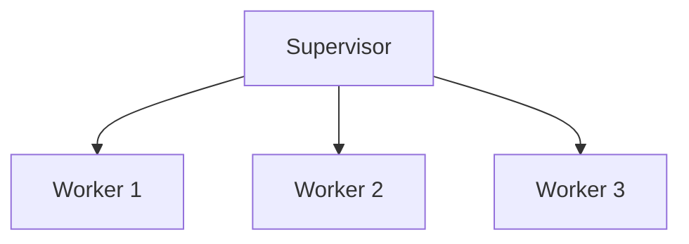

## 23.6 Poor Error Handling and Lack of Supervision

In the world of Erlang, error handling and supervision are not just features—they are fundamental principles that underpin the language's renowned fault-tolerant capabilities. This section delves into the importance of these concepts, the consequences of neglecting them, and how to effectively implement them in your Erlang applications.

### The Importance of Proper Error Handling

Erlang's design philosophy is heavily influenced by the need to build systems that can run continuously and recover from errors gracefully. This is achieved through a combination of error handling strategies and the "Let It Crash" philosophy.

#### The "Let It Crash" Philosophy

Erlang encourages developers to let processes fail when they encounter errors, rather than trying to handle every possible exception within the process itself. This approach simplifies code and leverages Erlang's robust supervision mechanisms to restart failed processes automatically.

```erlang
% Example of a simple process that might crash
start() ->
    spawn(fun() -> loop() end).

loop() ->
    receive
        {divide, A, B} ->
            Result = A / B,
            io:format("Result: ~p~n", [Result]),
            loop();
        _Other ->
            io:format("Unknown message~n"),
            loop()
    end.
```

In this example, if a division by zero occurs, the process will crash. Instead of handling the error within the process, we rely on a supervisor to restart it.

### Consequences of Neglecting Supervision

Failing to implement proper supervision can lead to unstable systems. Without supervision, a crashed process remains down, potentially leading to cascading failures if other processes depend on it.

#### Common Mistakes in Error Handling

1. **Ignoring Crash Reports**: Developers often overlook crash reports, which are crucial for diagnosing and fixing issues.
2. **Overcomplicating Error Handling**: Attempting to handle every possible error within a process can lead to complex and hard-to-maintain code.
3. **Lack of Supervision Trees**: Not using supervision trees means missing out on automatic process recovery.

### Implementing Effective Supervision Strategies

Supervision trees are a core component of Erlang's fault-tolerant architecture. They define how processes are monitored and restarted in case of failure.

#### Designing a Supervision Tree

A supervision tree consists of a supervisor process that manages worker processes. The supervisor's role is to restart workers when they fail.

```erlang
% Define a simple supervisor
-module(my_supervisor).
-behaviour(supervisor).

-export([start_link/0, init/1]).

start_link() ->
    supervisor:start_link({local, ?MODULE}, ?MODULE, []).

init([]) ->
    {ok, {{one_for_one, 5, 10},
          [{worker, my_worker, [], permanent, 5000, worker, [my_worker]}]}}.
```

In this example, the supervisor is configured with a `one_for_one` strategy, meaning if a worker process crashes, only that process is restarted.

#### Supervision Strategies

1. **One for One**: Restarts only the failed process.
2. **One for All**: Restarts all child processes if one fails.
3. **Rest for One**: Restarts the failed process and any processes started after it.

### Benefits of Embracing Erlang's "Let It Crash" Philosophy

By embracing the "Let It Crash" philosophy, developers can create systems that are simpler, more robust, and easier to maintain. This approach allows developers to focus on the normal operation of processes, while supervisors handle error recovery.

#### Key Benefits

- **Simplified Code**: Reduces the need for complex error handling logic within processes.
- **Automatic Recovery**: Supervisors automatically restart failed processes, ensuring system continuity.
- **Improved Fault Tolerance**: Systems can recover from unexpected errors without manual intervention.

### Visualizing Supervision Trees

To better understand supervision trees, let's visualize a simple supervision hierarchy using Mermaid.js:



This diagram illustrates a supervisor managing three worker processes. If any worker fails, the supervisor will restart it according to the defined strategy.

### Try It Yourself

Experiment with the provided code examples by modifying the worker process to introduce different types of errors. Observe how the supervisor handles these errors and restarts the processes.

### Knowledge Check

- What is the "Let It Crash" philosophy, and how does it benefit Erlang applications?
- How does a supervision tree enhance fault tolerance in Erlang systems?
- What are the differences between the "one for one" and "one for all" supervision strategies?

### Summary

In this section, we've explored the critical role of error handling and supervision in Erlang applications. By understanding and implementing these concepts, you can build systems that are robust, fault-tolerant, and easier to maintain. Remember, embracing Erlang's "Let It Crash" philosophy is key to leveraging its full potential.

## Quiz: Poor Error Handling and Lack of Supervision



### What is the primary benefit of Erlang's "Let It Crash" philosophy?

- [x] Simplifies code by reducing complex error handling
- [ ] Ensures processes never crash
- [ ] Eliminates the need for supervision trees
- [ ] Guarantees no errors occur

> **Explanation:** The "Let It Crash" philosophy simplifies code by allowing processes to fail and relying on supervision for recovery.

### Which supervision strategy restarts only the failed process?

- [x] One for One
- [ ] One for All
- [ ] Rest for One
- [ ] All for One

> **Explanation:** The "One for One" strategy restarts only the failed process, leaving others unaffected.

### What is a common mistake in Erlang error handling?

- [x] Ignoring crash reports
- [ ] Using supervision trees
- [ ] Embracing the "Let It Crash" philosophy
- [ ] Implementing one for one strategy

> **Explanation:** Ignoring crash reports is a common mistake that can lead to unresolved issues.

### How does a supervision tree contribute to system stability?

- [x] By automatically restarting failed processes
- [ ] By preventing processes from crashing
- [ ] By eliminating the need for error handling
- [ ] By ensuring no processes fail

> **Explanation:** Supervision trees enhance stability by automatically restarting failed processes.

### What is the role of a supervisor in Erlang?

- [x] To manage and restart worker processes
- [ ] To execute worker tasks
- [ ] To handle all errors within processes
- [ ] To prevent any process from crashing

> **Explanation:** A supervisor manages worker processes and restarts them upon failure.

### Which strategy restarts all child processes if one fails?

- [ ] One for One
- [x] One for All
- [ ] Rest for One
- [ ] All for One

> **Explanation:** The "One for All" strategy restarts all child processes if one fails.

### What should you do if a process crashes in Erlang?

- [x] Let it crash and rely on supervision
- [ ] Handle every error within the process
- [ ] Ignore the crash
- [ ] Restart the entire system

> **Explanation:** In Erlang, it's best to let processes crash and rely on supervision for recovery.

### What is a benefit of using supervision trees?

- [x] Improved fault tolerance
- [ ] Increased complexity
- [ ] Manual error recovery
- [ ] Elimination of process failures

> **Explanation:** Supervision trees improve fault tolerance by managing process recovery.

### What does the "Rest for One" strategy do?

- [x] Restarts the failed process and subsequent ones
- [ ] Restarts only the failed process
- [ ] Restarts all processes
- [ ] Prevents any process from failing

> **Explanation:** The "Rest for One" strategy restarts the failed process and any processes started after it.

### True or False: Erlang's "Let It Crash" philosophy eliminates the need for error handling.

- [ ] True
- [x] False

> **Explanation:** While it simplifies error handling, it doesn't eliminate the need for supervision and recovery mechanisms.



Remember, this is just the beginning. As you progress, you'll build more complex and resilient Erlang applications. Keep experimenting, stay curious, and enjoy the journey!
