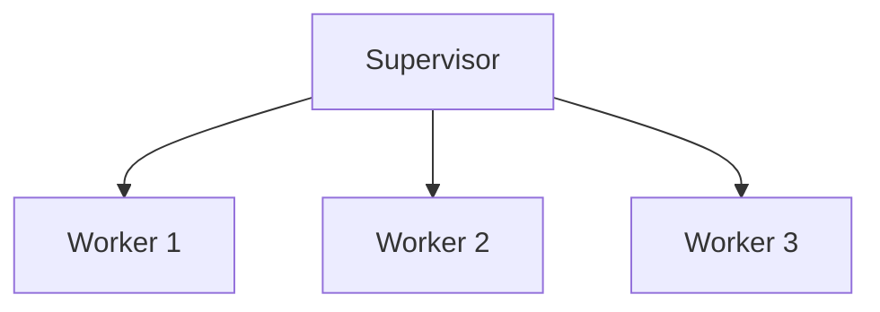

## 23.7 Ignoring OTP Principles and Conventions

In the world of Erlang, the Open Telecom Platform (OTP) is not just a library or a framework; it is a set of design principles and conventions that guide the development of robust, scalable, and maintainable applications. Ignoring these principles can lead to code that is inconsistent, unreliable, and difficult to maintain. In this section, we will explore the role of OTP in structuring Erlang applications, discuss the drawbacks of implementing custom solutions instead of using OTP, and provide examples of code that violates OTP conventions. We will also encourage following established patterns for maintainability and highlight resources for learning OTP best practices.

### Understanding OTP: The Backbone of Erlang Applications

OTP provides a set of libraries and design principles that are essential for building concurrent and distributed systems in Erlang. It includes a collection of middleware, libraries, and tools that facilitate the development of complex systems. OTP's design principles are centered around the concepts of processes, message passing, and fault tolerance, which are fundamental to Erlang's concurrency model.

#### Key Components of OTP

1. **Behaviours**: OTP behaviours such as `gen_server`, `gen_statem`, `gen_event`, and `supervisor` provide templates for implementing common patterns in Erlang applications. They encapsulate best practices for process management, state handling, and fault tolerance.

2. **Supervision Trees**: Supervision trees are a hierarchical structure of processes that monitor each other. They are designed to handle failures gracefully by restarting failed processes, ensuring system reliability.

3. **Applications**: An OTP application is a component that can be started and stopped as a unit. It defines the entry point for the system and manages the lifecycle of its processes.

4. **Release Handling**: OTP provides tools for packaging and deploying applications, including support for hot code upgrades, which allow systems to be updated without downtime.

### The Pitfalls of Ignoring OTP Principles

Ignoring OTP principles can lead to several issues in Erlang applications. Let's explore some of the common pitfalls:

#### 1. Reinventing the Wheel

Developers who ignore OTP often end up reinventing solutions for problems that OTP has already solved. This can lead to:

- **Inconsistent Implementations**: Custom solutions may lack the consistency and reliability of OTP's well-tested components.
- **Increased Complexity**: Custom implementations can introduce unnecessary complexity, making the codebase harder to understand and maintain.

#### 2. Lack of Fault Tolerance

One of the core strengths of OTP is its focus on fault tolerance. Ignoring OTP principles can result in:

- **Unreliable Systems**: Without supervision trees and proper error handling, systems may fail unpredictably.
- **Difficult Debugging**: Custom error handling mechanisms can make it harder to diagnose and fix issues.

#### 3. Poor Process Management

OTP provides robust patterns for process management. Ignoring these can lead to:

- **Resource Leaks**: Improperly managed processes can lead to resource leaks and degraded performance.
- **Concurrency Issues**: Without OTP's process management patterns, concurrency issues such as race conditions and deadlocks are more likely to occur.

### Code Examples: Violating OTP Conventions

Let's look at some examples of code that violate OTP conventions and discuss how they can be improved.

#### Example 1: Custom Process Management

```erlang
-module(custom_process).
-export([start/0, loop/0]).

start() ->
    spawn(fun loop/0).

loop() ->
    receive
        {stop, Reason} ->
            io:format("Stopping with reason: ~p~n", [Reason]);
        Message ->
            io:format("Received message: ~p~n", [Message]),
            loop()
    end.
```

**Issues**:
- This code implements a custom process management loop, ignoring OTP's `gen_server` behaviour.
- It lacks fault tolerance and supervision, making it difficult to manage process failures.

**Improvement**:
- Use `gen_server` to handle process management and message handling.
- Implement a supervisor to manage process lifecycle and handle failures.

#### Example 2: Ignoring Supervision

```erlang
-module(standalone_process).
-export([start/0]).

start() ->
    spawn(fun() -> process_loop() end).

process_loop() ->
    receive
        {crash, Reason} ->
            exit(Reason);
        _ ->
            process_loop()
    end.
```

**Issues**:
- This code spawns a process without any supervision, leading to potential system instability if the process crashes.

**Improvement**:
- Use a supervisor to monitor the process and restart it if it crashes, ensuring system reliability.

### Embracing OTP: Best Practices

To build maintainable and reliable Erlang applications, it is crucial to embrace OTP principles and conventions. Here are some best practices:

#### 1. Use OTP Behaviours

- **Adopt `gen_server`, `gen_statem`, and `gen_event`**: These behaviours provide a structured way to implement common patterns, reducing boilerplate code and improving maintainability.

#### 2. Implement Supervision Trees

- **Design robust supervision trees**: Use supervisors to manage process lifecycles and handle failures gracefully. This ensures that your system can recover from errors without manual intervention.

#### 3. Follow OTP Application Structure

- **Organize your code into OTP applications**: This provides a clear structure for your codebase and facilitates deployment and management.

#### 4. Leverage OTP Tools

- **Use OTP tools for release handling**: Take advantage of OTP's tools for packaging, deploying, and upgrading applications. This simplifies the deployment process and reduces downtime.

### Resources for Learning OTP Best Practices

To deepen your understanding of OTP and its best practices, consider exploring the following resources:

- **[Erlang/OTP Documentation](https://www.erlang.org/doc/)**: The official documentation provides comprehensive information on OTP principles and components.
- **[Learn You Some Erlang for Great Good!](http://learnyousomeerlang.com/)**: This book offers a beginner-friendly introduction to Erlang and OTP.
- **[Erlang Central](http://erlangcentral.org/)**: A community-driven resource with tutorials, videos, and discussions on Erlang and OTP.

### Visualizing OTP Principles

To better understand the structure and flow of OTP applications, let's visualize a simple supervision tree using Mermaid.js:



**Description**: This diagram represents a basic supervision tree with a supervisor managing three worker processes. If any worker fails, the supervisor can restart it, ensuring system reliability.

### Knowledge Check

Let's reinforce our understanding with a few questions:

- **What are the key components of OTP?**
- **Why is it important to use OTP behaviours instead of custom implementations?**
- **How do supervision trees contribute to system reliability?**

### Try It Yourself

Experiment with the code examples provided by modifying them to use OTP behaviours and supervision trees. Observe how these changes improve the reliability and maintainability of your application.

### Conclusion

Ignoring OTP principles and conventions can lead to significant challenges in building reliable and maintainable Erlang applications. By embracing OTP's design patterns and best practices, you can leverage Erlang's strengths to build robust, scalable systems. Remember, this is just the beginning. As you progress, you'll build more complex and interactive applications. Keep experimenting, stay curious, and enjoy the journey!

## Quiz: Ignoring OTP Principles and Conventions



### What is the primary role of OTP in Erlang applications?

- [x] To provide design principles and libraries for building robust systems
- [ ] To replace the need for Erlang's standard library
- [ ] To simplify syntax for Erlang programming
- [ ] To offer a graphical user interface for Erlang applications

> **Explanation:** OTP provides design principles and libraries that are essential for building robust, scalable, and maintainable systems in Erlang.

### Which OTP component is responsible for managing process lifecycles and handling failures?

- [x] Supervisor
- [ ] gen_server
- [ ] gen_event
- [ ] Application

> **Explanation:** Supervisors are responsible for managing process lifecycles and handling failures by restarting failed processes.

### What is a common pitfall of ignoring OTP principles?

- [x] Reinventing solutions for problems already solved by OTP
- [ ] Simplifying code complexity
- [ ] Enhancing system performance
- [ ] Reducing code readability

> **Explanation:** Ignoring OTP principles often leads to reinventing solutions for problems that OTP has already solved, resulting in inconsistent implementations.

### How do supervision trees contribute to system reliability?

- [x] By monitoring and restarting failed processes
- [ ] By reducing the number of processes in the system
- [ ] By simplifying the code structure
- [ ] By eliminating the need for error handling

> **Explanation:** Supervision trees monitor and restart failed processes, ensuring system reliability and fault tolerance.

### What is the benefit of using OTP behaviours like `gen_server`?

- [x] They provide structured patterns for common tasks
- [ ] They eliminate the need for message passing
- [ ] They increase code verbosity
- [ ] They replace the need for supervision trees

> **Explanation:** OTP behaviours like `gen_server` provide structured patterns for implementing common tasks, reducing boilerplate code and improving maintainability.

### Why is it important to follow OTP application structure?

- [x] It provides a clear structure for code organization and deployment
- [ ] It reduces the need for documentation
- [ ] It simplifies syntax for Erlang programming
- [ ] It eliminates the need for testing

> **Explanation:** Following OTP application structure provides a clear organization for code and facilitates deployment and management.

### What tool does OTP provide for packaging and deploying applications?

- [x] Release handling tools
- [ ] gen_statem
- [ ] gen_event
- [ ] Supervisor

> **Explanation:** OTP provides release handling tools for packaging and deploying applications, simplifying the deployment process.

### Which resource is recommended for learning OTP best practices?

- [x] Erlang/OTP Documentation
- [ ] A random blog post
- [ ] A YouTube video
- [ ] A forum discussion

> **Explanation:** The Erlang/OTP Documentation is a comprehensive resource for learning OTP principles and best practices.

### True or False: Custom process management is preferred over using OTP behaviours.

- [ ] True
- [x] False

> **Explanation:** Using OTP behaviours is preferred over custom process management as they provide well-tested patterns for process management and fault tolerance.

### What is the main advantage of using supervision trees?

- [x] They ensure system reliability by managing process failures
- [ ] They reduce the number of processes in the system
- [ ] They simplify code syntax
- [ ] They eliminate the need for message passing

> **Explanation:** Supervision trees ensure system reliability by managing process failures and restarting failed processes.


