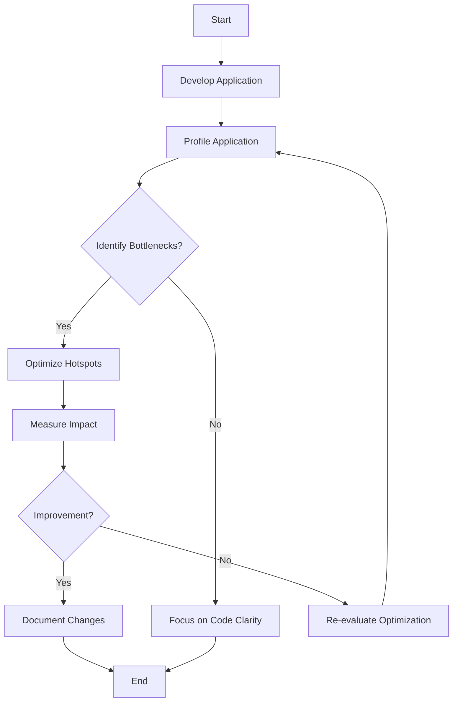

## 23.8 Premature Optimization without Profiling

In the world of software development, the allure of optimization is ever-present. Developers often feel the urge to make their code run faster or consume fewer resources. However, this well-intentioned drive can lead to premature optimization, a common pitfall that can result in wasted effort, increased complexity, and even degraded performance. In this section, we will explore the dangers of premature optimization in Erlang, the importance of profiling, and how to focus on code clarity and simplicity first.

### The Temptation of Premature Optimization

Premature optimization refers to the practice of attempting to improve the performance of a program before it is clear where the actual bottlenecks lie. This often stems from assumptions about what parts of the code are slow or resource-intensive. While the desire to write efficient code is commendable, optimizing too early can lead to several issues:

- **Wasted Effort**: Developers may spend significant time optimizing parts of the code that do not significantly impact overall performance.
- **Increased Complexity**: Optimization often introduces complexity, making the code harder to read, maintain, and debug.
- **Potential Bugs**: Changes made for optimization can introduce new bugs, especially if the code is not thoroughly tested.
- **Neglected Features**: Focusing on optimization too early can divert attention from implementing essential features or improving user experience.

### The Importance of Profiling

Profiling is the process of measuring the performance of a program to identify areas that are consuming the most resources or taking the most time. It provides data-driven insights into where optimization efforts should be focused. In Erlang, profiling is crucial due to its concurrent nature and the potential for complex interactions between processes.

#### Benefits of Profiling

- **Data-Driven Decisions**: Profiling provides concrete data, allowing developers to make informed decisions about where to optimize.
- **Identifying True Bottlenecks**: It helps pinpoint the actual performance bottlenecks, which may not be where developers initially suspect.
- **Resource Allocation**: By understanding where the program spends most of its time or resources, developers can allocate their efforts more effectively.
- **Performance Baseline**: Profiling establishes a baseline performance metric, making it easier to measure the impact of optimizations.

#### Profiling Tools in Erlang

Erlang offers several tools for profiling and performance analysis:

- **fprof**: A profiling tool that provides detailed information about function calls and execution time.
- **eprof**: A time profiling tool that measures the time spent in each function.
- **percept**: A graphical tool for visualizing process interactions and identifying bottlenecks in concurrent applications.

### Misguided Optimizations: Examples and Consequences

To illustrate the pitfalls of premature optimization, let's consider some common misguided optimizations in Erlang:

#### Example 1: Over-Optimizing Data Structures

Developers might assume that using a more complex data structure will improve performance. For instance, replacing a list with a more sophisticated data structure like a tree or a hash table without evidence can lead to unnecessary complexity.

```erlang
% Original simple list usage
-module(data_example).
-export([process_data/1]).

process_data(Data) ->
    lists:map(fun(X) -> X * 2 end, Data).

% Misguided optimization with a more complex data structure
-module(data_example_optimized).
-export([process_data/1]).

process_data(Data) ->
    Tree = lists:foldl(fun(X, Acc) -> insert_tree(X, Acc) end, empty_tree(), Data),
    map_tree(fun(X) -> X * 2 end, Tree).

% Note: insert_tree and map_tree are hypothetical functions for demonstration.
```

**Consequence**: The optimized version introduces complexity without clear evidence of performance gain. Profiling might reveal that the list processing was not a bottleneck.

#### Example 2: Unnecessary Parallelization

Erlang's concurrency model encourages parallel processing, but not all tasks benefit from parallelization. Prematurely parallelizing tasks can lead to increased overhead and synchronization issues.

```erlang
% Original sequential processing
-module(parallel_example).
-export([compute/1]).

compute(Data) ->
    lists:map(fun(X) -> heavy_computation(X) end, Data).

% Misguided parallelization
-module(parallel_example_optimized).
-export([compute/1]).

compute(Data) ->
    Pids = lists:map(fun(X) -> spawn(fun() -> heavy_computation(X) end) end, Data),
    lists:map(fun(Pid) -> receive {Pid, Result} -> Result end end, Pids).

% Note: heavy_computation is a placeholder for a computationally intensive function.
```

**Consequence**: The parallelized version may introduce process management overhead without significant performance improvement, especially if `heavy_computation` is not the bottleneck.

### Optimizing Based on Data and Evidence

The key to effective optimization is to base decisions on data and evidence rather than assumptions. Here are some principles to guide this process:

- **Profile First**: Always profile the application to identify real bottlenecks before attempting any optimization.
- **Focus on Hotspots**: Concentrate optimization efforts on the parts of the code that consume the most resources or time.
- **Measure Impact**: After making optimizations, measure their impact to ensure they provide the desired performance improvements.
- **Iterate**: Optimization is an iterative process. Continuously profile and optimize as the application evolves.

### Code Clarity and Simplicity First

Before diving into optimization, prioritize code clarity and simplicity. Clear and simple code is easier to maintain, debug, and extend. It also provides a solid foundation for future optimizations. Here are some tips to maintain clarity and simplicity:

- **Write Readable Code**: Use descriptive variable names, consistent formatting, and clear logic.
- **Avoid Premature Abstractions**: Implement abstractions only when they provide clear benefits.
- **Document Assumptions**: Clearly document any assumptions made during development, especially those related to performance.
- **Refactor Regularly**: Regularly refactor code to improve clarity and remove unnecessary complexity.

### Try It Yourself: Experiment with Profiling

To gain hands-on experience with profiling and optimization, try the following exercise:

1. **Create a Simple Erlang Application**: Write a simple Erlang application that performs a computationally intensive task, such as calculating Fibonacci numbers.

2. **Profile the Application**: Use Erlang's profiling tools (`fprof`, `eprof`, or `percept`) to identify performance bottlenecks.

3. **Optimize Based on Data**: Make targeted optimizations based on the profiling data. Focus on the parts of the code that consume the most resources.

4. **Measure the Impact**: Re-profile the application to measure the impact of your optimizations. Ensure that the changes lead to a measurable performance improvement.

5. **Reflect on the Process**: Consider what you learned from the profiling and optimization process. How did the data influence your decisions? What challenges did you encounter?

### Visualizing the Optimization Process

To better understand the optimization process, let's visualize it using a flowchart. This diagram outlines the steps involved in profiling and optimizing an Erlang application.



**Description**: This flowchart illustrates the iterative nature of profiling and optimization. It emphasizes the importance of focusing on code clarity when no significant bottlenecks are identified.

### References and Further Reading

For more information on profiling and optimization in Erlang, consider exploring the following resources:

- [Erlang Efficiency Guide](https://erlang.org/doc/efficiency_guide/introduction.html)
- [Erlang Profiling Tools](https://erlang.org/doc/man/fprof.html)
- [The Art of Profiling](https://www.brendangregg.com/)

### Knowledge Check

To reinforce your understanding of premature optimization and profiling, consider the following questions:

1. Why is premature optimization considered a pitfall in software development?
2. What are the benefits of profiling an application before optimizing it?
3. How can misguided optimizations lead to increased complexity in code?
4. Why is it important to measure the impact of optimizations?
5. What steps can developers take to maintain code clarity and simplicity?

### Embrace the Journey

Remember, optimization is a journey, not a destination. By focusing on profiling and data-driven decisions, you can avoid the pitfalls of premature optimization and create efficient, maintainable Erlang applications. Keep experimenting, stay curious, and enjoy the process of continuous improvement!

---

## Quiz: Premature Optimization without Profiling



### Why is premature optimization considered a pitfall in software development?

- [x] It can lead to wasted effort and increased complexity.
- [ ] It always results in faster code.
- [ ] It simplifies the codebase.
- [ ] It is the best way to ensure code quality.

> **Explanation:** Premature optimization can lead to wasted effort and increased complexity without significant performance gains.

### What is the primary benefit of profiling an application before optimizing it?

- [x] Identifying actual performance bottlenecks.
- [ ] Making the code more readable.
- [ ] Ensuring the application is bug-free.
- [ ] Reducing the number of lines of code.

> **Explanation:** Profiling helps identify actual performance bottlenecks, allowing for targeted optimizations.

### How can misguided optimizations lead to increased complexity in code?

- [x] By introducing unnecessary abstractions and changes.
- [ ] By making the code easier to read.
- [ ] By reducing the number of functions.
- [ ] By simplifying the logic.

> **Explanation:** Misguided optimizations can introduce unnecessary abstractions and changes, increasing code complexity.

### Why is it important to measure the impact of optimizations?

- [x] To ensure they provide the desired performance improvements.
- [ ] To make the code look more complex.
- [ ] To increase the number of lines of code.
- [ ] To reduce the need for documentation.

> **Explanation:** Measuring the impact of optimizations ensures they provide the desired performance improvements.

### What steps can developers take to maintain code clarity and simplicity?

- [x] Write readable code and avoid premature abstractions.
- [ ] Focus solely on optimization.
- [ ] Use complex data structures unnecessarily.
- [ ] Ignore documentation.

> **Explanation:** Writing readable code and avoiding premature abstractions help maintain code clarity and simplicity.

### What is the role of profiling tools like `fprof` in Erlang?

- [x] To provide detailed information about function calls and execution time.
- [ ] To automatically optimize the code.
- [ ] To simplify the codebase.
- [ ] To reduce the number of functions.

> **Explanation:** Profiling tools like `fprof` provide detailed information about function calls and execution time, aiding in optimization.

### How can developers ensure their optimizations are effective?

- [x] By profiling before and after optimizations to measure impact.
- [ ] By making as many changes as possible.
- [ ] By focusing on code aesthetics.
- [ ] By reducing the number of comments.

> **Explanation:** Profiling before and after optimizations helps measure their impact and ensure effectiveness.

### What is a common consequence of unnecessary parallelization in Erlang?

- [x] Increased overhead and synchronization issues.
- [ ] Simplified process management.
- [ ] Reduced execution time.
- [ ] Improved code readability.

> **Explanation:** Unnecessary parallelization can lead to increased overhead and synchronization issues without significant performance gains.

### Why should developers focus on code clarity before optimization?

- [x] Clear code is easier to maintain and provides a solid foundation for future optimizations.
- [ ] Clear code is always the fastest.
- [ ] Clear code requires no documentation.
- [ ] Clear code eliminates the need for testing.

> **Explanation:** Clear code is easier to maintain and provides a solid foundation for future optimizations.

### True or False: Profiling should be done after every code change.

- [x] True
- [ ] False

> **Explanation:** Profiling should be done after significant code changes to ensure optimizations are effective and do not introduce new bottlenecks.




