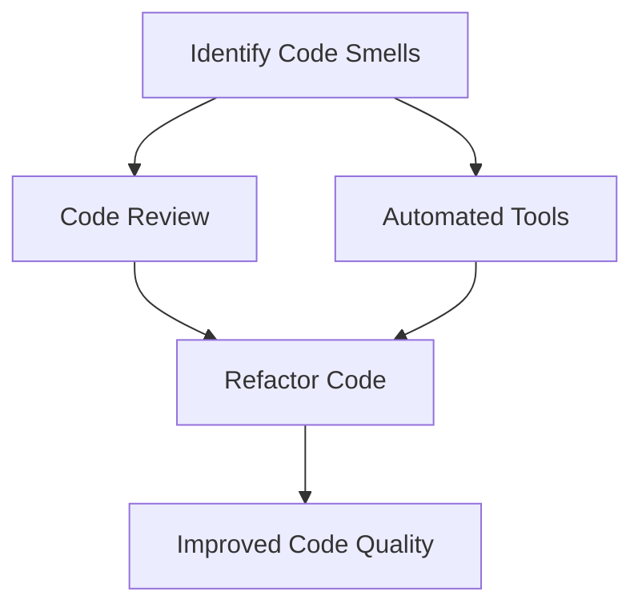

## 23.9 Code Smells in Erlang

In the world of software development, maintaining a clean and efficient codebase is crucial for the long-term success of any project. Code smells are indicators of potential problems in the code that may hinder its readability, maintainability, and scalability. In this section, we will delve into the concept of code smells, explore common examples in Erlang, and discuss techniques for identifying and addressing these issues. By the end of this guide, you will be equipped with the knowledge to recognize code smells in your Erlang projects and take proactive steps to refactor and improve your code.

### Understanding Code Smells

**Code smells** are not bugs or errors; rather, they are symptoms of deeper issues within the codebase. They are often indicative of poor design choices or practices that can lead to more significant problems if left unaddressed. Recognizing code smells is the first step towards improving code quality and ensuring that your software remains robust and adaptable to change.

#### Significance of Code Smells

- **Maintainability**: Code smells can make the codebase difficult to understand and modify, leading to increased maintenance costs.
- **Readability**: Smelly code is often hard to read, which can slow down development and lead to misunderstandings among team members.
- **Scalability**: Poorly designed code may not scale well, causing performance issues as the application grows.
- **Bug Introduction**: Code smells can increase the likelihood of introducing bugs when making changes or adding new features.

### Common Code Smells in Erlang

Erlang, with its functional and concurrent programming paradigms, presents unique challenges and opportunities for identifying code smells. Let's explore some common code smells specific to Erlang and how they manifest in the code.

#### 1. Overly Long Functions

Functions that are too long can be difficult to understand and maintain. In Erlang, it's essential to keep functions concise and focused on a single responsibility.

```erlang
% Example of an overly long function
long_function(Arg1, Arg2, Arg3) ->
    % Complex logic spanning multiple lines
    Result1 = complex_calculation(Arg1, Arg2),
    Result2 = another_calculation(Result1, Arg3),
    % More logic
    FinalResult = yet_another_calculation(Result2),
    % Even more logic
    FinalResult.
```

**Solution**: Break down long functions into smaller, more manageable functions. This not only improves readability but also promotes code reuse.

```erlang
% Refactored version with smaller functions
long_function(Arg1, Arg2, Arg3) ->
    Result1 = calculate_part1(Arg1, Arg2),
    Result2 = calculate_part2(Result1, Arg3),
    calculate_final(Result2).

calculate_part1(Arg1, Arg2) ->
    % Logic for part 1
    Result1.

calculate_part2(Result1, Arg3) ->
    % Logic for part 2
    Result2.

calculate_final(Result2) ->
    % Final calculation
    FinalResult.
```

#### 2. Excessive Nesting

Excessive nesting of conditional statements or function calls can make the code difficult to follow and understand.

```erlang
% Example of excessive nesting
nested_function(Condition1, Condition2, Condition3) ->
    if
        Condition1 ->
            if
                Condition2 ->
                    if
                        Condition3 ->
                            do_something();
                        true ->
                            do_something_else()
                    end;
                true ->
                    handle_condition2_false()
            end;
        true ->
            handle_condition1_false()
    end.
```

**Solution**: Flatten the code by using guard clauses, pattern matching, or separating logic into different functions.

```erlang
% Refactored version with reduced nesting
nested_function(Condition1, Condition2, Condition3) when Condition1, Condition2, Condition3 ->
    do_something();
nested_function(Condition1, Condition2, _) when Condition1, Condition2 ->
    do_something_else();
nested_function(Condition1, _, _) when Condition1 ->
    handle_condition2_false();
nested_function(_, _, _) ->
    handle_condition1_false().
```

#### 3. Magic Numbers and Strings

Using hard-coded numbers or strings without explanation can lead to confusion and errors.

```erlang
% Example of magic numbers
calculate_discount(Price) ->
    DiscountedPrice = Price * 0.9, % What does 0.9 represent?
    DiscountedPrice.
```

**Solution**: Use named constants or configuration files to provide context and improve readability.

```erlang
% Refactored version with named constants
-define(DISCOUNT_RATE, 0.9).

calculate_discount(Price) ->
    DiscountedPrice = Price * ?DISCOUNT_RATE,
    DiscountedPrice.
```

#### 4. Duplicated Code

Duplicated code can lead to inconsistencies and make maintenance more challenging.

```erlang
% Example of duplicated code
calculate_area(Rectangle) ->
    Width = rectangle_width(Rectangle),
    Height = rectangle_height(Rectangle),
    Width * Height.

calculate_perimeter(Rectangle) ->
    Width = rectangle_width(Rectangle),
    Height = rectangle_height(Rectangle),
    2 * (Width + Height).
```

**Solution**: Extract common logic into separate functions to promote code reuse.

```erlang
% Refactored version with extracted common logic
rectangle_dimensions(Rectangle) ->
    {rectangle_width(Rectangle), rectangle_height(Rectangle)}.

calculate_area(Rectangle) ->
    {Width, Height} = rectangle_dimensions(Rectangle),
    Width * Height.

calculate_perimeter(Rectangle) ->
    {Width, Height} = rectangle_dimensions(Rectangle),
    2 * (Width + Height).
```

#### 5. Inconsistent Naming Conventions

Inconsistent naming can confuse developers and lead to misunderstandings.

```erlang
% Example of inconsistent naming
calculate_area(Rect) ->
    Width = rect_width(Rect),
    Height = rect_height(Rect),
    Width * Height.
```

**Solution**: Establish and adhere to a consistent naming convention throughout the codebase.

```erlang
% Refactored version with consistent naming
calculate_area(Rectangle) ->
    Width = rectangle_width(Rectangle),
    Height = rectangle_height(Rectangle),
    Width * Height.
```

### Techniques for Identifying and Addressing Code Smells

#### 1. Code Reviews

Regular code reviews are an effective way to identify code smells. Encourage team members to review each other's code and provide constructive feedback.

#### 2. Automated Tools

Utilize automated tools and linters to detect common code smells and enforce coding standards.

#### 3. Refactoring

Refactoring is the process of restructuring existing code without changing its external behavior. Regular refactoring helps eliminate code smells and improve code quality.

#### 4. Pair Programming

Pair programming involves two developers working together on the same code. This practice can help identify code smells early and promote knowledge sharing.

#### 5. Continuous Learning

Stay updated with best practices and design patterns in Erlang. Continuous learning helps developers recognize and avoid code smells.

### Benefits of Maintaining Clean Code

- **Improved Readability**: Clean code is easier to read and understand, reducing the cognitive load on developers.
- **Enhanced Maintainability**: A clean codebase is easier to maintain and extend, leading to faster development cycles.
- **Reduced Bugs**: By addressing code smells, you reduce the likelihood of introducing bugs and errors.
- **Better Collaboration**: Clean code fosters better collaboration among team members, as it is easier to understand and modify.

### Try It Yourself

Experiment with the code examples provided in this section. Try refactoring the code to improve readability and maintainability. Consider introducing new code smells and practice identifying and addressing them.

### Visualizing Code Smells

Below is a simple flowchart illustrating the process of identifying and addressing code smells in an Erlang project.



### Knowledge Check

- Can you identify any code smells in your current projects?
- How would you refactor a function that is too long?
- What are the benefits of using named constants instead of magic numbers?

### Embrace the Journey

Remember, maintaining clean code is an ongoing process. As you progress in your Erlang journey, continue to refine your skills in identifying and addressing code smells. Keep experimenting, stay curious, and enjoy the journey!

## Quiz: Code Smells in Erlang



### What is a code smell?

- [x] An indicator of potential problems in the codebase
- [ ] A syntax error in the code
- [ ] A runtime exception
- [ ] A type of bug

> **Explanation:** Code smells are indicators of potential problems in the codebase, not actual errors or bugs.

### Which of the following is a common code smell in Erlang?

- [x] Overly long functions
- [ ] Proper use of pattern matching
- [ ] Consistent naming conventions
- [ ] Use of guard clauses

> **Explanation:** Overly long functions are a common code smell that can make code difficult to understand and maintain.

### How can you address the issue of magic numbers in your code?

- [x] Use named constants
- [ ] Ignore them
- [ ] Use more magic numbers
- [ ] Replace them with strings

> **Explanation:** Using named constants provides context and improves readability, addressing the issue of magic numbers.

### What is the benefit of regular code reviews?

- [x] Identifying code smells
- [ ] Increasing code complexity
- [ ] Introducing more bugs
- [ ] Reducing code readability

> **Explanation:** Regular code reviews help identify code smells and improve code quality.

### Which practice involves two developers working together on the same code?

- [x] Pair programming
- [ ] Solo programming
- [ ] Code golfing
- [ ] Code obfuscation

> **Explanation:** Pair programming involves two developers working together on the same code, promoting knowledge sharing and early identification of code smells.

### What is refactoring?

- [x] Restructuring existing code without changing its external behavior
- [ ] Adding new features to the code
- [ ] Writing new code from scratch
- [ ] Removing comments from the code

> **Explanation:** Refactoring is the process of restructuring existing code without changing its external behavior to improve its quality.

### Which tool can help detect common code smells automatically?

- [x] Linters
- [ ] Debuggers
- [ ] Compilers
- [ ] Text editors

> **Explanation:** Linters are automated tools that can help detect common code smells and enforce coding standards.

### What is the result of addressing code smells?

- [x] Improved code quality
- [ ] Increased code complexity
- [ ] More bugs
- [ ] Slower development cycles

> **Explanation:** Addressing code smells leads to improved code quality, making the codebase more maintainable and readable.

### Why is it important to maintain clean code?

- [x] It improves readability and maintainability
- [ ] It makes the code harder to understand
- [ ] It increases the likelihood of bugs
- [ ] It slows down development

> **Explanation:** Maintaining clean code improves readability and maintainability, reducing the likelihood of bugs and speeding up development.

### True or False: Code smells are actual bugs in the code.

- [ ] True
- [x] False

> **Explanation:** Code smells are not actual bugs; they are indicators of potential problems in the codebase.




