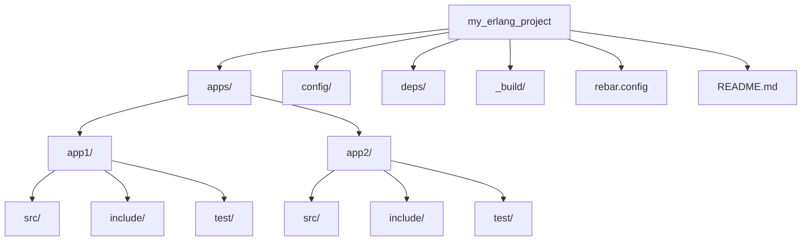

## 24.1 Project Structure and Organization

In the world of software development, the organization of a project can significantly impact its maintainability, scalability, and the ease with which a team can collaborate. Erlang, with its unique features and paradigms, offers specific guidelines and tools to help developers structure their projects effectively. In this section, we will delve into the best practices for organizing Erlang projects, focusing on standard structures, directory layouts, and tools like Rebar3.

### Understanding Erlang Project Structure

Before diving into the specifics, it's essential to understand why project structure matters. A well-organized project:

- **Enhances Readability**: Clear organization makes it easier for developers to understand the project and locate files quickly.
- **Facilitates Collaboration**: Consistent structure allows team members to work together more efficiently.
- **Supports Scalability**: As projects grow, a solid structure helps manage complexity.
- **Improves Maintainability**: Easier navigation and understanding lead to more straightforward maintenance and updates.

### Standard Project Structures

Erlang projects typically follow a standard directory layout that aligns with community conventions and tools like Rebar3. Here's a typical structure:

```
my_erlang_project/
├── apps/
│   ├── app1/
│   │   ├── src/
│   │   ├── include/
│   │   └── test/
│   └── app2/
│       ├── src/
│       ├── include/
│       └── test/
├── config/
├── deps/
├── _build/
├── rebar.config
└── README.md
```

#### Key Directories and Files

- **`apps/`**: Contains individual applications. Each application has its own `src/`, `include/`, and `test/` directories.
- **`config/`**: Stores configuration files, often used for environment-specific settings.
- **`deps/`**: Holds dependencies managed by Rebar3.
- **`_build/`**: Contains build artifacts, generated by Rebar3.
- **`rebar.config`**: The configuration file for Rebar3, specifying dependencies, build options, and more.
- **`README.md`**: Provides an overview of the project, setup instructions, and other essential information.

### Grouping Modules and Applications

In Erlang, grouping modules and applications logically is crucial for clarity and maintainability. Here are some guidelines:

- **Modular Design**: Break down functionality into separate modules and applications. Each module should have a single responsibility.
- **Logical Grouping**: Group related modules into applications. For example, a web server might have separate applications for handling HTTP requests, managing sessions, and interfacing with a database.
- **Consistent Naming**: Use consistent naming conventions for modules and functions to enhance readability and predictability.

### Tools for Project Organization

#### Rebar3

Rebar3 is the standard build tool for Erlang projects. It automates many tasks, including dependency management, compilation, and testing. Here's how Rebar3 assists with project organization:

- **Dependency Management**: Rebar3 handles dependencies, ensuring they are correctly fetched and compiled.
- **Build Automation**: Automates the build process, reducing manual errors and inconsistencies.
- **Project Templates**: Provides templates for creating new projects, ensuring a consistent starting point.
- **Release Handling**: Manages application releases, including packaging and deployment.

##### Example: Creating a New Project with Rebar3

To create a new Erlang project using Rebar3, follow these steps:

1. **Install Rebar3**: If not already installed, download and install Rebar3 from [Rebar3 GitHub](https://github.com/erlang/rebar3).

2. **Create a New Project**: Use the following command to create a new project:

   ```bash
   rebar3 new release my_erlang_project
   ```

   This command generates a new project with a standard directory layout.

3. **Navigate the Structure**: Explore the generated directories and files to understand the layout.

4. **Build the Project**: Use Rebar3 to build the project:

   ```bash
   cd my_erlang_project
   rebar3 compile
   ```

5. **Run Tests**: Execute tests to ensure everything is set up correctly:

   ```bash
   rebar3 eunit
   ```

#### Other Tools

- **EDoc**: For generating documentation from comments in the code.
- **Dialyzer**: For static analysis and type checking.
- **EUnit**: For unit testing Erlang code.

### Consistency and Community Conventions

Adhering to community conventions and maintaining consistency across projects is vital. Here are some tips:

- **Follow Conventions**: Use established conventions for naming, directory structure, and coding style.
- **Document Decisions**: Clearly document any deviations from standard practices and the reasons behind them.
- **Code Reviews**: Regular code reviews help ensure consistency and adherence to best practices.

### Impact on Team Productivity

A well-structured project can significantly boost team productivity. Here's how:

- **Reduced Onboarding Time**: New team members can quickly understand the project structure and start contributing.
- **Easier Collaboration**: Team members can work on different parts of the project without stepping on each other's toes.
- **Faster Debugging**: A clear structure makes it easier to locate and fix bugs.

### Try It Yourself: Experiment with Project Structure

To solidify your understanding, try modifying the project structure:

- **Add a New Application**: Use Rebar3 to add a new application to your project. Observe how it integrates with the existing structure.
- **Reorganize Modules**: Experiment with reorganizing modules within an application. Consider the impact on readability and maintainability.
- **Customize Configuration**: Modify configuration files to see how they affect the build and runtime behavior.

### Visualizing Project Structure

To better understand the relationships between different parts of an Erlang project, let's visualize the structure using a Mermaid.js diagram.



**Diagram Explanation**: This diagram illustrates the hierarchical structure of a typical Erlang project, highlighting the main directories and their relationships.

### References and Links

For further reading and resources, consider the following links:

- [Rebar3 Documentation](https://rebar3.readme.io/)
- [Erlang/OTP Documentation](https://www.erlang.org/docs)
- [Erlang Community Style Guide](https://github.com/inaka/erlang_guidelines)

### Knowledge Check

To reinforce your understanding, consider these questions:

- What are the benefits of a well-organized project structure?
- How does Rebar3 assist with project organization?
- Why is consistency important in project structure?

### Embrace the Journey

Remember, organizing an Erlang project is just the beginning. As you progress, you'll encounter more complex scenarios that require thoughtful structuring. Keep experimenting, stay curious, and enjoy the journey!

### Summary of Key Takeaways

- A well-structured project enhances readability, collaboration, scalability, and maintainability.
- Standard directory layouts, such as those provided by Rebar3, are crucial for consistency.
- Tools like Rebar3 automate many aspects of project management, from dependency handling to testing.
- Consistency and adherence to community conventions are vital for team productivity.

## Quiz: Project Structure and Organization



### What is the primary benefit of a well-organized project structure?

- [x] Enhances readability and maintainability
- [ ] Increases code execution speed
- [ ] Reduces the need for documentation
- [ ] Guarantees bug-free code

> **Explanation:** A well-organized project structure makes it easier to understand and maintain the codebase.

### Which tool is commonly used for managing Erlang project dependencies?

- [ ] EDoc
- [x] Rebar3
- [ ] Dialyzer
- [ ] EUnit

> **Explanation:** Rebar3 is the standard tool for managing dependencies in Erlang projects.

### What is the purpose of the `apps/` directory in an Erlang project?

- [x] To contain individual applications with their own modules
- [ ] To store configuration files
- [ ] To hold build artifacts
- [ ] To manage dependencies

> **Explanation:** The `apps/` directory contains individual applications, each with its own modules and structure.

### How does Rebar3 assist with project organization?

- [x] By automating build processes and managing dependencies
- [ ] By providing a graphical user interface
- [ ] By enforcing coding standards
- [ ] By generating documentation

> **Explanation:** Rebar3 automates build processes and manages dependencies, aiding in project organization.

### Why is consistency important in project structure?

- [x] It facilitates collaboration and reduces onboarding time
- [ ] It increases code execution speed
- [ ] It eliminates the need for testing
- [ ] It guarantees bug-free code

> **Explanation:** Consistency in project structure makes it easier for team members to collaborate and for new members to onboard quickly.

### What is the role of the `rebar.config` file?

- [x] To specify dependencies and build options
- [ ] To store test results
- [ ] To manage user authentication
- [ ] To contain application logs

> **Explanation:** The `rebar.config` file specifies dependencies, build options, and other configurations for the project.

### Which directory typically holds build artifacts in an Erlang project?

- [ ] `apps/`
- [ ] `config/`
- [x] `_build/`
- [ ] `deps/`

> **Explanation:** The `_build/` directory holds build artifacts generated by Rebar3.

### What is the benefit of using Rebar3 templates?

- [x] They provide a consistent starting point for new projects
- [ ] They increase code execution speed
- [ ] They eliminate the need for testing
- [ ] They guarantee bug-free code

> **Explanation:** Rebar3 templates provide a consistent starting point, ensuring a standard project structure.

### True or False: A well-structured project guarantees bug-free code.

- [ ] True
- [x] False

> **Explanation:** While a well-structured project aids in maintainability and readability, it does not guarantee bug-free code.

### What is the impact of a well-structured project on team productivity?

- [x] It boosts productivity by reducing onboarding time and facilitating collaboration
- [ ] It decreases productivity by adding unnecessary complexity
- [ ] It has no impact on productivity
- [ ] It guarantees bug-free code

> **Explanation:** A well-structured project boosts productivity by making it easier for team members to collaborate and for new members to onboard quickly.




