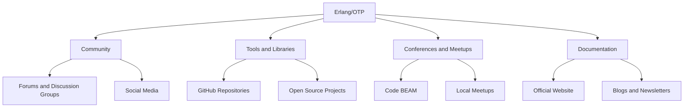

## 24.10 Keeping Up with the Erlang Ecosystem

In the rapidly evolving world of software development, staying updated with the latest trends, tools, and updates is crucial for maintaining a competitive edge. The Erlang ecosystem, known for its robust concurrency and fault-tolerant capabilities, is no exception. This section provides a comprehensive guide on how to keep up with the Erlang ecosystem, ensuring you remain at the forefront of functional and concurrent programming.

### Strategies for Tracking Erlang Updates and Enhancements

To effectively keep up with the Erlang ecosystem, it's essential to adopt a proactive approach. Here are some strategies to help you stay informed:

1. **Follow Official Announcements**: The Erlang/OTP team regularly releases updates and announcements. Subscribe to the official Erlang mailing list and follow the [Erlang/OTP GitHub repository](https://github.com/erlang/otp) to receive notifications about new releases and changes.

2. **Engage with the Community**: Join Erlang forums and discussion groups such as [Erlang Forums](https://erlangforums.com/) and [Erlang Reddit](https://www.reddit.com/r/erlang/). Engaging with the community allows you to learn from others, share knowledge, and stay updated on the latest trends.

3. **Attend Conferences and Meetups**: Participate in Erlang conferences like [Code BEAM](https://codesync.global/conferences/code-beam/) and local meetups. These events provide opportunities to learn from experts, network with peers, and discover new tools and techniques.

4. **Subscribe to Newsletters and Blogs**: Stay informed by subscribing to Erlang-focused newsletters and blogs. Some popular ones include [Erlang Solutions Blog](https://www.erlang-solutions.com/blog.html) and [The Erlang Factory Blog](https://www.erlang-factory.com/blog).

5. **Follow Influential Figures**: Follow influential figures in the Erlang community on social media platforms like Twitter and LinkedIn. They often share insights, updates, and resources related to Erlang development.

### Sources of News and Information

Keeping up with the Erlang ecosystem requires accessing reliable sources of news and information. Here are some recommended sources:

- **Official Erlang Website**: The [official Erlang website](https://www.erlang.org/) is a primary source for official announcements, documentation, and resources.

- **GitHub Repositories**: Explore Erlang-related GitHub repositories to discover new projects, libraries, and tools. The [Erlang/OTP repository](https://github.com/erlang/otp) is a great starting point.

- **Erlang Forums and Discussion Groups**: Engage with the community through forums and discussion groups. These platforms provide a space for developers to share knowledge, ask questions, and discuss the latest trends.

- **News Aggregators**: Use news aggregators like [Hacker News](https://news.ycombinator.com/) and [Reddit](https://www.reddit.com/r/erlang/) to find Erlang-related articles, discussions, and updates.

- **Podcasts and Webinars**: Listen to Erlang-focused podcasts and webinars to gain insights from experts and stay updated on the latest developments.

### Participating in Beta Testing and Providing Feedback

Participating in beta testing is an excellent way to stay ahead of the curve and contribute to the Erlang ecosystem. Here's how you can get involved:

- **Join Beta Programs**: Many Erlang projects and libraries offer beta programs for new releases. Joining these programs allows you to test new features and provide valuable feedback to the developers.

- **Contribute to Open Source Projects**: Contributing to open source projects is a great way to stay engaged with the community and help improve Erlang tools and libraries. Explore projects on GitHub and contribute by reporting issues, submitting pull requests, or writing documentation.

- **Provide Feedback**: Share your feedback and suggestions with the developers of Erlang tools and libraries. Your input can help shape the future of the ecosystem and ensure that tools meet the needs of the community.

### Adapting to Changes and Remaining Relevant

In the ever-evolving world of software development, adapting to changes is crucial for remaining relevant. Here are some tips for staying adaptable:

- **Embrace Continuous Learning**: Stay curious and open to learning new concepts, tools, and techniques. Regularly update your skills by taking online courses, reading books, and attending workshops.

- **Experiment with New Tools**: Don't be afraid to try out new tools and libraries. Experimenting with new technologies can help you discover more efficient ways to solve problems and improve your workflow.

- **Stay Informed About Industry Trends**: Keep an eye on industry trends and emerging technologies. Understanding the broader landscape can help you anticipate changes and adapt your skills accordingly.

- **Network with Peers**: Build a network of peers and mentors who can provide guidance and support as you navigate changes in the ecosystem. Networking can also open up opportunities for collaboration and learning.

### Integrating New Tools and Practices into Workflows

Integrating new tools and practices into your workflow can enhance productivity and efficiency. Here are some tips for successful integration:

- **Evaluate Tools Carefully**: Before adopting a new tool, evaluate its features, compatibility, and community support. Consider how it fits into your existing workflow and whether it addresses your specific needs.

- **Start Small**: When integrating a new tool or practice, start with a small project or team. This allows you to test its effectiveness and make adjustments before rolling it out on a larger scale.

- **Provide Training and Support**: Ensure that your team has the necessary training and support to use new tools effectively. Provide resources, documentation, and training sessions to facilitate a smooth transition.

- **Monitor and Adjust**: Continuously monitor the impact of new tools and practices on your workflow. Gather feedback from your team and make adjustments as needed to optimize performance.

### Visualizing the Erlang Ecosystem

To better understand the Erlang ecosystem, let's visualize its components and interactions using a Mermaid.js diagram:

**Diagram Description**: This diagram illustrates the key components of the Erlang ecosystem, including the Erlang/OTP platform, community, tools and libraries, conferences and meetups, and documentation. Each component interacts with others, creating a dynamic and interconnected ecosystem.

### Knowledge Check

To reinforce your understanding of the Erlang ecosystem, consider the following questions:

- What are some strategies for staying updated with the Erlang ecosystem?
- How can you participate in beta testing and contribute to open source projects?
- Why is it important to adapt to changes in the software development landscape?
- What are some tips for integrating new tools and practices into your workflow?

### Embrace the Journey

Remember, keeping up with the Erlang ecosystem is an ongoing journey. As you explore new tools, engage with the community, and adapt to changes, you'll continue to grow as a developer. Stay curious, embrace continuous learning, and enjoy the journey!

## Quiz: Keeping Up with the Erlang Ecosystem



### What is a primary source for official Erlang announcements and updates?

- [x] The official Erlang website
- [ ] Hacker News
- [ ] Reddit
- [ ] Twitter

> **Explanation:** The official Erlang website is the primary source for official announcements and updates.

### Which platform is recommended for engaging with the Erlang community?

- [ ] LinkedIn
- [x] Erlang Forums
- [ ] Instagram
- [ ] Facebook

> **Explanation:** Erlang Forums is a recommended platform for engaging with the Erlang community.

### What is a benefit of participating in beta testing for Erlang projects?

- [x] Access to new features before official release
- [ ] Guaranteed bug-free software
- [ ] Financial compensation
- [ ] Reduced workload

> **Explanation:** Participating in beta testing provides access to new features before their official release.

### Why is it important to adapt to changes in the software development landscape?

- [x] To remain relevant and competitive
- [ ] To avoid learning new skills
- [ ] To maintain the status quo
- [ ] To reduce workload

> **Explanation:** Adapting to changes is important to remain relevant and competitive in the software development landscape.

### What is a recommended strategy for integrating new tools into your workflow?

- [x] Start with a small project or team
- [ ] Implement immediately across the organization
- [ ] Avoid training and support
- [ ] Ignore feedback from the team

> **Explanation:** Starting with a small project or team allows for testing and adjustments before a larger rollout.

### Which of the following is a key component of the Erlang ecosystem?

- [x] Tools and Libraries
- [ ] Fashion Trends
- [ ] Cooking Recipes
- [ ] Travel Guides

> **Explanation:** Tools and Libraries are a key component of the Erlang ecosystem.

### How can you contribute to open source Erlang projects?

- [x] Submitting pull requests
- [ ] Ignoring issues
- [ ] Avoiding documentation
- [ ] Withholding feedback

> **Explanation:** Contributing to open source projects can be done by submitting pull requests, among other activities.

### What is a recommended source for Erlang-related articles and discussions?

- [ ] Instagram
- [ ] Pinterest
- [x] Hacker News
- [ ] TikTok

> **Explanation:** Hacker News is a recommended source for Erlang-related articles and discussions.

### What is the benefit of attending Erlang conferences and meetups?

- [x] Networking with peers and learning from experts
- [ ] Guaranteed job offers
- [ ] Free merchandise
- [ ] Reduced workload

> **Explanation:** Attending conferences and meetups provides networking opportunities and learning experiences.

### True or False: Continuous learning is essential for staying updated with the Erlang ecosystem.

- [x] True
- [ ] False

> **Explanation:** Continuous learning is essential for staying updated with the Erlang ecosystem and adapting to changes.


