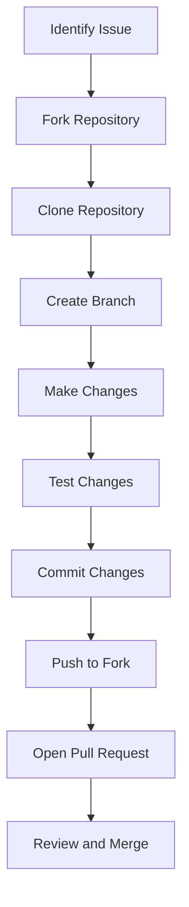

## 24.11 Contributing to Open Source Projects

Contributing to open-source projects is a rewarding endeavor that not only enhances your skills as a developer but also benefits the broader community. In this section, we will explore the myriad benefits of open-source contributions, provide guidelines on how to find and select projects, discuss best practices for submitting issues and patches, and highlight the importance of collaboration and communication with maintainers. We will also encourage mentoring and supporting newcomers to open source.

### Benefits of Contributing to Open Source

#### Personal Growth

1. **Skill Enhancement**: Engaging with open-source projects allows you to work on real-world problems, thereby honing your coding skills and understanding of complex systems.
2. **Learning Opportunities**: Exposure to diverse codebases and development practices broadens your knowledge and introduces you to new tools and technologies.
3. **Portfolio Building**: Contributions to open-source projects serve as a testament to your skills and dedication, enhancing your professional portfolio.

#### Community Growth

1. **Knowledge Sharing**: By contributing, you share your expertise and insights, helping others learn and grow.
2. **Fostering Innovation**: Open-source projects thrive on collaboration and diverse perspectives, leading to innovative solutions and advancements.
3. **Building Relationships**: Engaging with the community helps you build a network of like-minded individuals and potential collaborators.

### Finding and Selecting Projects

#### Identifying Interests

1. **Passion Projects**: Choose projects that align with your interests or areas you wish to explore further.
2. **Skill Level**: Select projects that match your current skill level while offering opportunities for growth.

#### Researching Projects

1. **Community Activity**: Look for projects with active communities, regular updates, and responsive maintainers.
2. **Documentation Quality**: Well-documented projects are easier to understand and contribute to.
3. **Contribution Guidelines**: Ensure the project has clear guidelines for contributors, which indicates a welcoming and organized environment.

#### Tools for Discovery

1. **GitHub Explore**: Use GitHub's Explore feature to find trending projects and repositories.
2. **Open Source Platforms**: Platforms like GitLab, Bitbucket, and SourceForge offer a plethora of open-source projects.
3. **Community Forums**: Engage with forums and communities like Reddit, Stack Overflow, and Erlang-specific groups to discover projects.

### Best Practices for Contributing

#### Submitting Issues

1. **Clear Descriptions**: Provide detailed descriptions of issues, including steps to reproduce, expected outcomes, and actual results.
2. **Relevant Information**: Include relevant logs, screenshots, or code snippets to aid in understanding the issue.
3. **Respectful Communication**: Maintain a respectful tone and be open to feedback or requests for additional information.

#### Submitting Patches and Pull Requests

1. **Follow Guidelines**: Adhere to the project's contribution guidelines, coding standards, and commit message conventions.
2. **Small, Focused Changes**: Submit small, focused changes that are easier to review and integrate.
3. **Testing**: Ensure your changes are thoroughly tested and do not introduce new issues.
4. **Documentation Updates**: Update documentation to reflect any changes or new features introduced by your contribution.

#### Collaboration and Communication

1. **Engage with Maintainers**: Communicate with project maintainers to understand priorities and areas needing attention.
2. **Participate in Discussions**: Join discussions on issues, pull requests, and community forums to share insights and learn from others.
3. **Be Open to Feedback**: Accept constructive criticism gracefully and use it as an opportunity to improve.

### Mentoring and Supporting Newcomers

#### Encouraging Participation

1. **Welcoming Environment**: Foster a welcoming environment for newcomers by being patient and supportive.
2. **Onboarding Resources**: Provide resources and documentation to help newcomers get started with the project.

#### Mentorship Programs

1. **Pair Programming**: Engage in pair programming sessions to guide newcomers through the contribution process.
2. **Code Reviews**: Offer constructive feedback during code reviews to help newcomers improve their skills.

#### Community Building

1. **Organize Events**: Host events like hackathons, meetups, or webinars to engage with the community and attract new contributors.
2. **Recognition and Appreciation**: Recognize and appreciate the efforts of contributors to motivate continued participation.

### Code Example: Submitting a Pull Request

Let's walk through a simple example of submitting a pull request to an open-source Erlang project. We'll assume you have identified a small bug in a project and want to fix it.

```erlang
% Assume we have a simple Erlang module with a bug in the add function
-module(math_utils).
-export([add/2]).

% Incorrect implementation
add(A, B) ->
    A - B.  % Bug: Should be addition, not subtraction

% Correct the bug
% Step 1: Fork the repository on GitHub
% Step 2: Clone your fork locally
% git clone https://github.com/yourusername/math_utils.git

% Step 3: Create a new branch for your fix
% git checkout -b fix-add-function

% Step 4: Make the necessary changes
add(A, B) ->
    A + B.  % Corrected to perform addition

% Step 5: Test your changes
% erl
% 1> c(math_utils).
% {ok,math_utils}
% 2> math_utils:add(2, 3).
% 5

% Step 6: Commit your changes
% git add math_utils.erl
% git commit -m "Fix add function to perform addition"

% Step 7: Push your changes to your fork
% git push origin fix-add-function

% Step 8: Open a pull request on GitHub
% Navigate to your fork on GitHub and click "Compare & pull request"
% Provide a clear description of the changes and submit the pull request
```

### Visualizing the Contribution Process

Below is a diagram illustrating the typical workflow for contributing to an open-source project.



**Diagram Description**: This flowchart outlines the steps involved in contributing to an open-source project, from identifying an issue to having your changes reviewed and merged.

### Knowledge Check

- **Question**: What are the benefits of contributing to open-source projects?
- **Challenge**: Find an open-source Erlang project on GitHub and identify a small bug or enhancement you can work on.

### Embrace the Journey

Remember, contributing to open-source projects is a journey of continuous learning and growth. As you engage with the community, you'll not only enhance your skills but also make meaningful contributions that benefit others. Keep experimenting, stay curious, and enjoy the journey!

### Quiz: Contributing to Open Source Projects



### What is a key benefit of contributing to open-source projects?

- [x] Enhancing coding skills
- [ ] Gaining financial rewards
- [ ] Avoiding collaboration
- [ ] Working in isolation

> **Explanation:** Contributing to open-source projects enhances coding skills through real-world problem-solving and exposure to diverse codebases.

### How can you find open-source projects to contribute to?

- [x] Using GitHub Explore
- [ ] Only through personal contacts
- [ ] By purchasing access
- [ ] Through closed forums

> **Explanation:** GitHub Explore is a tool that helps discover trending projects and repositories for contribution.

### What should you include when submitting an issue?

- [x] Detailed description and relevant information
- [ ] Only a brief statement
- [ ] Personal opinions
- [ ] Irrelevant data

> **Explanation:** A detailed description and relevant information help maintainers understand and address the issue effectively.

### What is a best practice when submitting a pull request?

- [x] Follow the project's contribution guidelines
- [ ] Ignore testing
- [ ] Submit large, unfocused changes
- [ ] Avoid updating documentation

> **Explanation:** Following the project's contribution guidelines ensures your pull request aligns with the project's standards and is more likely to be accepted.

### Why is collaboration important in open-source projects?

- [x] It fosters innovation and builds relationships
- [ ] It leads to isolation
- [ ] It discourages knowledge sharing
- [ ] It limits learning opportunities

> **Explanation:** Collaboration fosters innovation, builds relationships, and encourages knowledge sharing, which are essential for the success of open-source projects.

### How can you support newcomers to open source?

- [x] Provide onboarding resources and mentorship
- [ ] Ignore their questions
- [ ] Criticize their efforts
- [ ] Discourage participation

> **Explanation:** Providing onboarding resources and mentorship helps newcomers feel welcome and supported, encouraging their continued participation.

### What is an effective way to engage with project maintainers?

- [x] Communicate priorities and areas needing attention
- [ ] Avoid all communication
- [ ] Demand immediate responses
- [ ] Ignore their feedback

> **Explanation:** Effective communication with maintainers helps align contributions with project priorities and fosters a collaborative environment.

### What should you do before submitting a pull request?

- [x] Test your changes thoroughly
- [ ] Submit without testing
- [ ] Ignore potential issues
- [ ] Avoid documentation updates

> **Explanation:** Thoroughly testing your changes ensures they work as intended and do not introduce new issues, increasing the likelihood of acceptance.

### How can you participate in open-source discussions?

- [x] Join discussions on issues and pull requests
- [ ] Only observe without contributing
- [ ] Criticize without offering solutions
- [ ] Avoid all discussions

> **Explanation:** Joining discussions on issues and pull requests allows you to share insights, learn from others, and contribute to the project's development.

### True or False: Contributing to open-source projects is only beneficial for experienced developers.

- [ ] True
- [x] False

> **Explanation:** Contributing to open-source projects is beneficial for developers of all experience levels, offering opportunities for learning, growth, and community engagement.



By following these guidelines and embracing the open-source ethos, you'll not only enhance your skills but also make a meaningful impact on the community. Happy coding!
