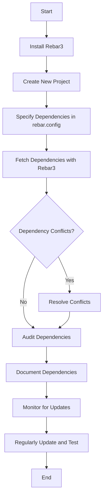

## 24.12 Managing Dependencies Effectively

In the world of software development, managing dependencies is crucial for maintaining the stability, security, and functionality of your applications. Erlang, with its robust ecosystem, offers tools and practices that can help developers manage dependencies effectively. This section will guide you through the best practices and tools available for managing dependencies in Erlang projects.

### Understanding Dependency Management in Erlang

Dependency management involves tracking, updating, and resolving the libraries and packages your project relies on. In Erlang, this is primarily handled through tools like Rebar3, which simplifies the process of managing dependencies, building projects, and more.

### Using Rebar3 for Dependency Management

Rebar3 is the de facto build tool for Erlang projects. It automates the process of fetching, compiling, and managing dependencies, making it easier for developers to focus on writing code rather than managing libraries manually.

#### Setting Up Rebar3

To get started with Rebar3, you need to install it. You can download the latest version from the [Rebar3 GitHub repository](https://github.com/erlang/rebar3) or use package managers like Homebrew on macOS.

```bash
# Install Rebar3 using Homebrew
brew install rebar3
```

Once installed, you can create a new Erlang project with Rebar3:

```bash
# Create a new Erlang project
rebar3 new app my_app
```

This command generates a basic project structure with a `rebar.config` file, which is where you'll specify your dependencies.

#### Specifying Dependencies in `rebar.config`

The `rebar.config` file is the heart of your project's dependency management. Here, you define the libraries your project depends on, along with their versions.

```erlang
{deps, [
    {cowboy, "2.9.0"},
    {jsx, "3.0.0"}
]}.
```

In this example, we're specifying dependencies on the Cowboy web server and the JSX JSON parser. Rebar3 will automatically fetch these libraries and their dependencies.

### Guidelines for Specifying Version Constraints

Version constraints are essential for ensuring compatibility and stability. They help prevent breaking changes from affecting your project. Here are some guidelines for specifying version constraints:

1. **Use Semantic Versioning**: Most Erlang libraries follow semantic versioning (SemVer), which uses a versioning scheme of `MAJOR.MINOR.PATCH`. Understanding this helps you specify constraints effectively.

2. **Pin Specific Versions**: For critical dependencies, pinning to a specific version can prevent unexpected changes. However, this can also lead to outdated dependencies if not regularly updated.

3. **Use Version Ranges**: Specify version ranges to allow for minor updates and patches while avoiding breaking changes. For example, `">= 2.0.0, < 3.0.0"` allows any version from 2.0.0 up to, but not including, 3.0.0.

4. **Regularly Review and Update**: Regularly review your dependencies and update them to benefit from bug fixes and new features.

### Handling Dependency Conflicts and Updates

Dependency conflicts occur when different libraries require incompatible versions of the same dependency. Rebar3 provides tools to help resolve these conflicts.

#### Resolving Conflicts

1. **Analyze the Dependency Tree**: Use Rebar3's `deps` command to visualize the dependency tree and identify conflicts.

   ```bash
   rebar3 deps
   ```

2. **Override Conflicting Versions**: Use the `override` option in `rebar.config` to specify which version should be used when conflicts arise.

   ```erlang
   {overrides, [
       {override, cowboy, "2.9.0"}
   ]}.
   ```

3. **Communicate with Library Maintainers**: If conflicts persist, consider reaching out to library maintainers for guidance or updates.

#### Updating Dependencies

1. **Use Rebar3's Update Command**: Rebar3 provides an `upgrade` command to update dependencies to their latest versions within specified constraints.

   ```bash
   rebar3 upgrade
   ```

2. **Test Thoroughly**: After updating, thoroughly test your application to ensure that updates haven't introduced any issues.

### Best Practices for Auditing and Monitoring Dependencies

Auditing and monitoring dependencies are crucial for maintaining security and stability. Here are some best practices:

1. **Regularly Audit Dependencies**: Use tools like [Hex](https://hex.pm/) to audit your dependencies for known vulnerabilities.

2. **Monitor for Updates**: Subscribe to mailing lists or RSS feeds for your dependencies to stay informed about updates and security patches.

3. **Automate Audits**: Integrate dependency audits into your CI/CD pipeline to automatically check for vulnerabilities and outdated packages.

4. **Document Dependencies**: Maintain a comprehensive list of dependencies, their versions, and their purposes. This documentation aids in understanding the impact of updates and potential vulnerabilities.

### Encouraging Documentation of Dependencies

Documenting dependencies is often overlooked but is vital for long-term project maintenance. Here are some tips for effective documentation:

1. **Create a Dependency Manifest**: Maintain a document listing all dependencies, their versions, and why they are used. This helps new team members understand the project's architecture.

2. **Use Comments in `rebar.config`**: Add comments in your `rebar.config` file to explain the purpose of each dependency.

   ```erlang
   {deps, [
       % Cowboy is used as the HTTP server
       {cowboy, "2.9.0"},
       % JSX is used for JSON parsing
       {jsx, "3.0.0"}
   ]}.
   ```

3. **Regularly Update Documentation**: As dependencies change, ensure your documentation is updated to reflect these changes.

### Visualizing Dependency Management Workflow

To better understand the workflow of managing dependencies in Erlang, let's visualize it using a flowchart.



**Figure 1**: Workflow for Managing Dependencies in Erlang Projects

### Try It Yourself

Now that we've covered the essentials of managing dependencies in Erlang, it's time to put your knowledge into practice. Try creating a new Erlang project with Rebar3, specify some dependencies, and experiment with version constraints. Consider introducing a conflict and resolving it using the techniques discussed.

### References and Further Reading

- [Rebar3 Documentation](https://rebar3.org/docs)
- [Semantic Versioning](https://semver.org/)
- [Hex Package Manager](https://hex.pm/)

### Knowledge Check

- What is the purpose of the `rebar.config` file in an Erlang project?
- How can you specify a version range for a dependency in Rebar3?
- What are some best practices for auditing dependencies?

### Embrace the Journey

Managing dependencies effectively is a continuous process that requires vigilance and proactive measures. Remember, this is just the beginning. As you progress, you'll develop a deeper understanding of how dependencies impact your projects. Keep experimenting, stay curious, and enjoy the journey!

## Quiz: Managing Dependencies Effectively



### What tool is primarily used for managing dependencies in Erlang projects?

- [x] Rebar3
- [ ] Mix
- [ ] Maven
- [ ] Gradle

> **Explanation:** Rebar3 is the primary tool used for managing dependencies in Erlang projects.

### How can you specify a version range for a dependency in Rebar3?

- [x] Using semantic versioning constraints
- [ ] By listing all possible versions
- [ ] By specifying only the major version
- [ ] By using a wildcard

> **Explanation:** Version ranges can be specified using semantic versioning constraints, such as `">= 2.0.0, < 3.0.0"`.

### What command is used to update dependencies in Rebar3?

- [x] rebar3 upgrade
- [ ] rebar3 update
- [ ] rebar3 fetch
- [ ] rebar3 install

> **Explanation:** The `rebar3 upgrade` command is used to update dependencies to their latest versions within specified constraints.

### What is a best practice for handling dependency conflicts?

- [x] Use the override option in rebar.config
- [ ] Ignore the conflicts
- [ ] Remove the conflicting dependency
- [ ] Manually edit the library code

> **Explanation:** Using the `override` option in `rebar.config` allows you to specify which version should be used when conflicts arise.

### Why is it important to document dependencies?

- [x] To understand their purpose and impact
- [ ] To increase the project's size
- [ ] To make the code more complex
- [ ] To confuse new developers

> **Explanation:** Documenting dependencies helps understand their purpose and impact, aiding in maintenance and updates.

### What is a recommended practice for auditing dependencies?

- [x] Integrate audits into the CI/CD pipeline
- [ ] Perform audits manually once a year
- [ ] Ignore audits
- [ ] Only audit major dependencies

> **Explanation:** Integrating audits into the CI/CD pipeline ensures regular checks for vulnerabilities and outdated packages.

### What should you do after updating dependencies?

- [x] Thoroughly test the application
- [ ] Immediately deploy to production
- [ ] Remove old dependencies
- [ ] Ignore the changes

> **Explanation:** Thoroughly testing the application after updating dependencies ensures that updates haven't introduced any issues.

### What is the purpose of the `rebar.config` file?

- [x] To specify project dependencies and configurations
- [ ] To store application logs
- [ ] To compile the Erlang code
- [ ] To manage user authentication

> **Explanation:** The `rebar.config` file is used to specify project dependencies and configurations.

### What is a common issue when managing dependencies?

- [x] Dependency conflicts
- [ ] Lack of dependencies
- [ ] Too many dependencies
- [ ] No version control

> **Explanation:** Dependency conflicts occur when different libraries require incompatible versions of the same dependency.

### True or False: Semantic versioning is not important for managing dependencies.

- [ ] True
- [x] False

> **Explanation:** Semantic versioning is crucial for managing dependencies as it helps specify constraints and avoid breaking changes.


