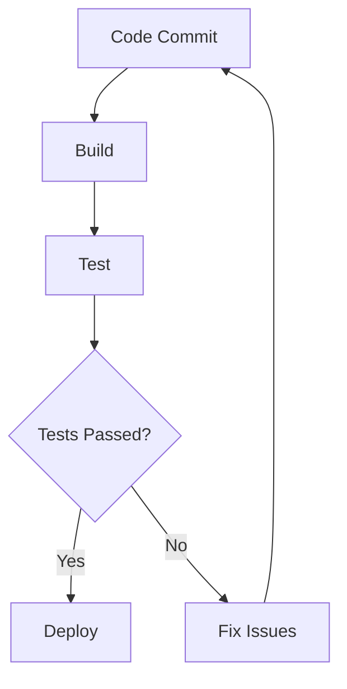

## 24.13 Automated Testing and Deployment Practices

In the world of software development, automation is a key driver of efficiency and reliability. This section delves into the significance of automated testing and deployment practices in Erlang, a language renowned for its robustness and concurrency capabilities. We will explore the benefits of automated testing frameworks, demonstrate how to set up Continuous Integration and Continuous Deployment (CI/CD) pipelines, and highlight tools like Jenkins, Travis CI, and GitHub Actions. By integrating automated deployment with testing, we can catch issues early and ensure consistent, repeatable processes.

### The Importance of Automated Testing

Automated testing is a cornerstone of modern software development. It allows developers to verify that their code behaves as expected without manual intervention. This is particularly crucial in Erlang, where concurrent and distributed systems can introduce complex interactions that are difficult to test manually.

#### Benefits of Automated Testing

1. **Consistency and Repeatability**: Automated tests provide a consistent way to verify code behavior, reducing human error and ensuring that tests are repeatable across different environments.

2. **Early Bug Detection**: By running tests automatically with every code change, developers can catch bugs early in the development process, reducing the cost and effort required to fix them.

3. **Faster Feedback**: Automated tests provide immediate feedback to developers, allowing them to quickly identify and address issues.

4. **Improved Code Quality**: Regular testing encourages developers to write cleaner, more maintainable code, as they can easily verify that changes do not introduce regressions.

5. **Documentation**: Automated tests serve as a form of documentation, illustrating how the code is expected to behave.

### Setting Up Automated Testing in Erlang

To implement automated testing in Erlang, we can use tools like EUnit and Common Test. These frameworks are designed to integrate seamlessly with Erlang's ecosystem, providing powerful capabilities for testing concurrent and distributed applications.

#### EUnit: Lightweight Unit Testing

EUnit is a lightweight unit testing framework for Erlang. It is well-suited for testing individual functions and modules.

```erlang
-module(math_tests).
-include_lib("eunit/include/eunit.hrl").

add_test() ->
    ?assertEqual(5, math:add(2, 3)).

subtract_test() ->
    ?assertEqual(1, math:subtract(3, 2)).
```

In this example, we define a simple test module `math_tests` that tests the `add` and `subtract` functions from a hypothetical `math` module. The `?assertEqual` macro is used to verify that the functions return the expected results.

#### Common Test: Comprehensive Testing Framework

Common Test is a more comprehensive testing framework that supports integration and system testing. It is particularly useful for testing distributed systems.

```erlang
-module(my_app_SUITE).
-include_lib("common_test/include/ct.hrl").

init_per_suite(Config) ->
    {ok, Config}.

end_per_suite(_Config) ->
    ok.

all() ->
    [simple_test].

simple_test(Config) ->
    {ok, _Pid} = my_app:start_link(),
    ?assertMatch({ok, _}, my_app:do_something()),
    my_app:stop().
```

Here, we define a Common Test suite `my_app_SUITE` that tests a simple application. The `init_per_suite` and `end_per_suite` functions are used to set up and tear down the test environment, while the `simple_test` function contains the actual test logic.

### Continuous Integration and Continuous Deployment (CI/CD)

CI/CD is a set of practices that automate the integration and deployment of code changes. By continuously integrating and deploying code, teams can deliver software more reliably and efficiently.

#### Setting Up a CI/CD Pipeline

A typical CI/CD pipeline consists of several stages, including code compilation, testing, and deployment. Let's explore how to set up a CI/CD pipeline for an Erlang application using popular tools.

##### Jenkins: The Open-Source Automation Server

Jenkins is a widely-used open-source automation server that supports building, deploying, and automating projects.

1. **Install Jenkins**: Follow the [official installation guide](https://www.jenkins.io/doc/book/installing/) to set up Jenkins on your server.

2. **Create a New Job**: In Jenkins, create a new job for your Erlang project. Choose "Freestyle project" as the job type.

3. **Configure Source Code Management**: Connect Jenkins to your version control system (e.g., Git) by specifying the repository URL and credentials.

4. **Define Build Steps**: Add build steps to compile your Erlang code and run tests using EUnit or Common Test.

5. **Set Up Post-Build Actions**: Configure post-build actions to deploy your application if the tests pass.

```groovy
pipeline {
    agent any
    stages {
        stage('Build') {
            steps {
                sh 'rebar3 compile'
            }
        }
        stage('Test') {
            steps {
                sh 'rebar3 eunit'
            }
        }
        stage('Deploy') {
            steps {
                sh './deploy.sh'
            }
        }
    }
}
```

This Jenkins pipeline script defines three stages: Build, Test, and Deploy. The `rebar3` tool is used to compile the code and run tests, while a custom `deploy.sh` script handles deployment.

##### Travis CI: Cloud-Based CI/CD

Travis CI is a cloud-based CI/CD service that integrates with GitHub repositories.

1. **Sign Up for Travis CI**: Create an account on [Travis CI](https://travis-ci.com/) and link it to your GitHub account.

2. **Create a `.travis.yml` File**: In your repository, create a `.travis.yml` file to define the build configuration.

```yaml
language: erlang
otp_release:
  - 23.0
  - 24.0
script:
  - rebar3 compile
  - rebar3 eunit
```

This configuration specifies the Erlang versions to test against and the commands to run during the build.

3. **Enable Travis CI for Your Repository**: In the Travis CI dashboard, enable CI for your repository.

##### GitHub Actions: Integrated CI/CD

GitHub Actions is a CI/CD platform integrated directly into GitHub.

1. **Create a Workflow File**: In your repository, create a `.github/workflows/ci.yml` file to define the workflow.

```yaml
name: CI

on:
  push:
    branches:
      - main

jobs:
  build:
    runs-on: ubuntu-latest

    steps:
    - uses: actions/checkout@v2
    - name: Set up Erlang
      uses: erlef/setup-beam@v1
      with:
        otp-version: 24.0
    - name: Build
      run: rebar3 compile
    - name: Test
      run: rebar3 eunit
```

This workflow runs on every push to the `main` branch, checking out the code, setting up Erlang, and running the build and test commands.

### Integrating Automated Deployment

Automated deployment is the process of automatically deploying code changes to production or staging environments. By integrating deployment with testing, we can ensure that only tested and verified code is deployed.

#### Benefits of Automated Deployment

1. **Reduced Manual Effort**: Automated deployment eliminates the need for manual intervention, reducing the risk of human error.

2. **Faster Release Cycles**: By automating deployment, teams can release new features and bug fixes more quickly.

3. **Consistent Environments**: Automated deployment ensures that code is deployed consistently across different environments, reducing configuration drift.

4. **Improved Collaboration**: With automated deployment, developers, testers, and operations teams can collaborate more effectively, as they share a common understanding of the deployment process.

#### Implementing Automated Deployment

To implement automated deployment, we can use tools like Ansible, Chef, or Puppet to manage infrastructure and deploy applications.

##### Example: Deploying with Ansible

Ansible is an open-source automation tool that simplifies application deployment, configuration management, and orchestration.

1. **Install Ansible**: Follow the [official installation guide](https://docs.ansible.com/ansible/latest/installation_guide/intro_installation.html) to set up Ansible on your control node.

2. **Create an Inventory File**: Define the hosts to which you want to deploy your application.

```ini
[webservers]
web1.example.com
web2.example.com
```

3. **Write a Playbook**: Create an Ansible playbook to define the deployment tasks.

```yaml
- name: Deploy Erlang Application
  hosts: webservers
  tasks:
    - name: Copy application files
      copy:
        src: /path/to/app
        dest: /var/www/myapp

    - name: Restart application service
      service:
        name: myapp
        state: restarted
```

4. **Run the Playbook**: Execute the playbook to deploy your application.

```bash
ansible-playbook -i inventory deploy.yml
```

### Best Practices for Automated Testing and Deployment

To maximize the benefits of automated testing and deployment, consider the following best practices:

1. **Keep Tests Fast and Reliable**: Ensure that automated tests run quickly and reliably to provide timely feedback.

2. **Use Version Control**: Store all code, including deployment scripts and configuration files, in version control to track changes and facilitate collaboration.

3. **Monitor and Log Deployments**: Implement monitoring and logging to track deployment progress and identify issues.

4. **Implement Rollback Mechanisms**: Design deployment processes to support easy rollback in case of failures.

5. **Continuously Improve**: Regularly review and improve your testing and deployment processes to adapt to changing requirements and technologies.

### Visualizing CI/CD Workflow

To better understand the CI/CD workflow, let's visualize it using a Mermaid.js diagram.



**Diagram Description**: This diagram illustrates a typical CI/CD workflow. It starts with a code commit, followed by build and test stages. If the tests pass, the code is deployed; otherwise, issues are fixed, and the process repeats.

### Knowledge Check

Before we conclude, let's reinforce our understanding with a few questions:

- What are the benefits of automated testing in Erlang?
- How can we set up a CI/CD pipeline using Jenkins?
- What role does Ansible play in automated deployment?

### Embrace the Journey

Remember, mastering automated testing and deployment is a journey. As you progress, you'll discover new tools and techniques to enhance your processes. Keep experimenting, stay curious, and enjoy the journey!

## Quiz: Automated Testing and Deployment Practices



### What is a key benefit of automated testing?

- [x] Consistency and repeatability
- [ ] Increased manual effort
- [ ] Slower feedback
- [ ] Reduced code quality

> **Explanation:** Automated testing provides consistency and repeatability, reducing human error and ensuring tests are reliable.

### Which tool is used for lightweight unit testing in Erlang?

- [x] EUnit
- [ ] Common Test
- [ ] Jenkins
- [ ] Ansible

> **Explanation:** EUnit is a lightweight unit testing framework for Erlang, suitable for testing individual functions and modules.

### What is the purpose of a CI/CD pipeline?

- [x] Automate integration and deployment of code changes
- [ ] Increase manual testing
- [ ] Reduce collaboration
- [ ] Slow down release cycles

> **Explanation:** A CI/CD pipeline automates the integration and deployment of code changes, enabling faster and more reliable software delivery.

### Which tool is a cloud-based CI/CD service?

- [ ] Jenkins
- [x] Travis CI
- [ ] Ansible
- [ ] Common Test

> **Explanation:** Travis CI is a cloud-based CI/CD service that integrates with GitHub repositories.

### What is the role of Ansible in automated deployment?

- [x] Simplify application deployment and configuration management
- [ ] Increase manual deployment effort
- [ ] Reduce automation
- [ ] Slow down deployment

> **Explanation:** Ansible is an automation tool that simplifies application deployment, configuration management, and orchestration.

### What should be included in a CI/CD pipeline?

- [x] Build, test, and deploy stages
- [ ] Only build stage
- [ ] Only test stage
- [ ] Only deploy stage

> **Explanation:** A CI/CD pipeline typically includes build, test, and deploy stages to ensure code changes are integrated and deployed reliably.

### Which tool is integrated directly into GitHub for CI/CD?

- [ ] Jenkins
- [ ] Travis CI
- [x] GitHub Actions
- [ ] Ansible

> **Explanation:** GitHub Actions is a CI/CD platform integrated directly into GitHub, allowing workflows to be defined in the repository.

### What is a benefit of automated deployment?

- [x] Reduced manual effort
- [ ] Increased manual intervention
- [ ] Slower release cycles
- [ ] Inconsistent environments

> **Explanation:** Automated deployment reduces manual effort, enabling faster release cycles and consistent environments.

### What is a best practice for automated testing?

- [x] Keep tests fast and reliable
- [ ] Store code outside version control
- [ ] Avoid monitoring deployments
- [ ] Implement complex rollback mechanisms

> **Explanation:** Keeping tests fast and reliable ensures timely feedback and efficient testing processes.

### True or False: Automated testing serves as a form of documentation.

- [x] True
- [ ] False

> **Explanation:** Automated tests illustrate how the code is expected to behave, serving as a form of documentation.


