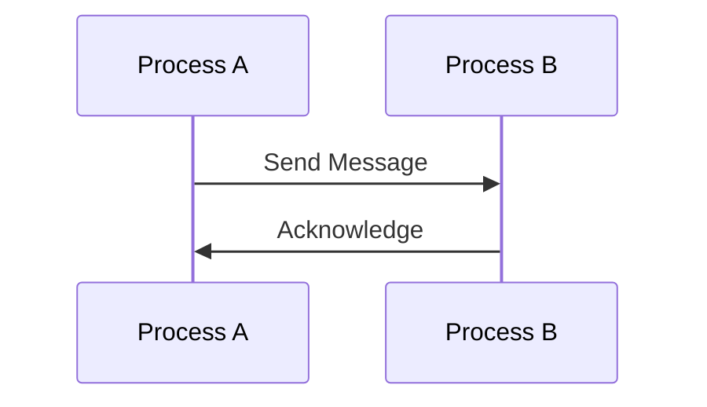
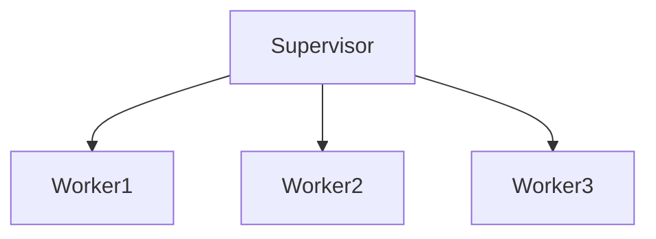

## 24.14 Embracing the Erlang Philosophy and Culture

Erlang is not just a programming language; it is a philosophy and a culture that has shaped the way developers approach software development. At its core, Erlang promotes principles such as concurrency, fault tolerance, and the "Let It Crash" philosophy. These principles, along with a focus on simplicity and minimalism, have made Erlang a powerful tool for building robust and efficient systems. In this section, we will explore these core principles, discuss their importance, and provide examples of how embracing them can lead to better software. We will also encourage a mindset of openness to learning and experimentation, inviting readers to contribute to and shape the evolving Erlang culture.

### Understanding the Core Principles of Erlang

#### Concurrency

Concurrency is one of the foundational principles of Erlang. It allows multiple processes to run simultaneously, enabling systems to handle numerous tasks at once. Erlang's lightweight process model makes it particularly well-suited for concurrent programming. Each process in Erlang is isolated, with its own memory space, and communicates with other processes through message passing.

**Example:**

```erlang
-module(concurrent_example).
-export([start/0, process/1]).

start() ->
    Pid1 = spawn(?MODULE, process, [1]),
    Pid2 = spawn(?MODULE, process, [2]),
    Pid3 = spawn(?MODULE, process, [3]),
    Pid1 ! {self(), "Hello from process 1"},
    Pid2 ! {self(), "Hello from process 2"},
    Pid3 ! {self(), "Hello from process 3"},
    receive_messages().

process(Id) ->
    receive
        {From, Message} ->
            io:format("Process ~p received message: ~p~n", [Id, Message]),
            From ! {self(), "Acknowledged"}
    end.

receive_messages() ->
    receive
        {From, Response} ->
            io:format("Received response: ~p~n", [Response]),
            receive_messages()
    after 5000 ->
        io:format("No more messages~n")
    end.
```

In this example, we spawn three concurrent processes, each capable of receiving and responding to messages independently. This demonstrates Erlang's ability to handle concurrency with ease.

#### Fault Tolerance

Fault tolerance is another key aspect of Erlang's philosophy. Erlang systems are designed to continue operating even in the presence of errors. This is achieved through process isolation and supervision trees, where supervisors monitor worker processes and restart them if they fail.

**Example:**

```erlang
-module(supervisor_example).
-behaviour(supervisor).

-export([start_link/0, init/1]).

start_link() ->
    supervisor:start_link({local, ?MODULE}, ?MODULE, []).

init([]) ->
    {ok, {{one_for_one, 5, 10},
          [{worker, {worker_example, start_link, []}, permanent, 5000, worker, [worker_example]}]}}.
```

In this example, we define a simple supervisor that manages a worker process. If the worker process crashes, the supervisor will automatically restart it, ensuring the system remains operational.

#### The "Let It Crash" Philosophy

The "Let It Crash" philosophy is a unique aspect of Erlang's culture. Instead of trying to handle every possible error within a process, Erlang encourages developers to let processes crash and rely on supervisors to handle recovery. This approach simplifies error handling and leads to more robust systems.

**Example:**

```erlang
-module(crash_example).
-export([start/0, risky_operation/0]).

start() ->
    try risky_operation() of
        Result -> io:format("Operation succeeded: ~p~n", [Result])
    catch
        _:_ -> io:format("Operation failed, but that's okay!~n")
    end.

risky_operation() ->
    1 / 0. % This will cause a crash
```

In this example, we deliberately cause a crash with a division by zero. Instead of handling the error within the process, we allow it to crash and handle the recovery at a higher level.

### Simplicity and Minimalism in Design

Erlang emphasizes simplicity and minimalism in design. By keeping systems simple, developers can reduce complexity and improve maintainability. This principle is reflected in Erlang's syntax and its approach to problem-solving.

**Example:**

```erlang
-module(simple_example).
-export([factorial/1]).

factorial(0) -> 1;
factorial(N) when N > 0 -> N * factorial(N - 1).
```

This simple implementation of a factorial function demonstrates Erlang's concise syntax and its focus on clear, straightforward solutions.

### Encouraging Openness to Learning and Experimentation

Erlang's culture encourages developers to be open to learning and experimentation. The language's design and community support a mindset of continuous improvement and exploration.

**Example:**

Try experimenting with the following code to see how Erlang handles different scenarios:

```erlang
-module(experiment_example).
-export([experiment/0]).

experiment() ->
    io:format("Experimenting with Erlang~n"),
    spawn(fun() -> io:format("Hello from a new process!~n") end).
```

By modifying this code and observing the results, you can gain a deeper understanding of Erlang's capabilities and behavior.

### Contributing to and Shaping the Erlang Culture

The Erlang community is vibrant and welcoming, with many opportunities for developers to contribute and shape the culture. Whether through open-source projects, community events, or online forums, there are numerous ways to get involved and make a difference.

**Example:**

Consider contributing to an open-source Erlang project on GitHub or participating in an Erlang user group meeting. These activities can help you connect with other developers and learn from their experiences.

### Visualizing Erlang's Core Principles

To better understand Erlang's core principles, let's visualize the process communication and supervision tree concepts using Mermaid.js diagrams.

#### Process Communication



This sequence diagram illustrates the message-passing mechanism between two Erlang processes, highlighting the simplicity and effectiveness of Erlang's concurrency model.

#### Supervision Tree



This graph represents a basic supervision tree, where a supervisor manages multiple worker processes, ensuring fault tolerance and system reliability.

### Key Takeaways

- **Concurrency**: Erlang's lightweight processes and message-passing model make it ideal for concurrent programming.
- **Fault Tolerance**: Process isolation and supervision trees ensure systems remain operational even in the presence of errors.
- **"Let It Crash" Philosophy**: Simplifies error handling by allowing processes to crash and relying on supervisors for recovery.
- **Simplicity and Minimalism**: Emphasizing clear, straightforward solutions improves maintainability and reduces complexity.
- **Openness to Learning**: Encourages continuous improvement and experimentation, fostering a vibrant developer community.

### Embrace the Journey

Remember, embracing the Erlang philosophy and culture is a journey. As you explore these principles and apply them to your projects, you'll discover new ways to build robust and efficient software. Stay curious, keep experimenting, and enjoy the process of learning and growing as a developer.

## Quiz: Embracing the Erlang Philosophy and Culture



### What is a core principle of Erlang that allows multiple processes to run simultaneously?

- [x] Concurrency
- [ ] Serialization
- [ ] Synchronization
- [ ] Compilation

> **Explanation:** Concurrency is a core principle of Erlang that enables multiple processes to run simultaneously, allowing systems to handle numerous tasks at once.

### How does Erlang achieve fault tolerance?

- [x] Through process isolation and supervision trees
- [ ] By using global variables
- [ ] Through manual error handling
- [ ] By avoiding errors altogether

> **Explanation:** Erlang achieves fault tolerance through process isolation and supervision trees, where supervisors monitor and restart worker processes if they fail.

### What does the "Let It Crash" philosophy encourage?

- [x] Allowing processes to crash and relying on supervisors for recovery
- [ ] Writing extensive error-handling code within each process
- [ ] Avoiding any potential errors at all costs
- [ ] Using global error handlers

> **Explanation:** The "Let It Crash" philosophy encourages allowing processes to crash and relying on supervisors to handle recovery, simplifying error handling.

### What is the benefit of simplicity and minimalism in Erlang design?

- [x] Improved maintainability and reduced complexity
- [ ] Increased code size
- [ ] More complex error handling
- [ ] Slower execution

> **Explanation:** Simplicity and minimalism in Erlang design lead to improved maintainability and reduced complexity, making systems easier to understand and manage.

### How can developers contribute to the Erlang culture?

- [x] By participating in open-source projects and community events
- [ ] By keeping their knowledge to themselves
- [ ] By avoiding collaboration
- [ ] By focusing solely on personal projects

> **Explanation:** Developers can contribute to the Erlang culture by participating in open-source projects, community events, and online forums, sharing knowledge and experiences.

### What is the primary communication method between Erlang processes?

- [x] Message passing
- [ ] Shared memory
- [ ] Global variables
- [ ] Direct function calls

> **Explanation:** Erlang processes communicate primarily through message passing, which ensures process isolation and concurrency.

### What does a supervision tree in Erlang represent?

- [x] A hierarchy of processes where supervisors manage worker processes
- [ ] A list of global variables
- [ ] A sequence of function calls
- [ ] A collection of unrelated processes

> **Explanation:** A supervision tree in Erlang represents a hierarchy of processes where supervisors manage worker processes, ensuring fault tolerance.

### What mindset does Erlang's culture encourage among developers?

- [x] Openness to learning and experimentation
- [ ] Resistance to change
- [ ] Avoidance of new technologies
- [ ] Focus on individual work

> **Explanation:** Erlang's culture encourages a mindset of openness to learning and experimentation, fostering continuous improvement and innovation.

### What is the role of a supervisor in Erlang?

- [x] To monitor and restart worker processes if they fail
- [ ] To execute all processes
- [ ] To handle all errors manually
- [ ] To manage global variables

> **Explanation:** A supervisor in Erlang monitors and restarts worker processes if they fail, ensuring system reliability and fault tolerance.

### True or False: Erlang encourages writing extensive error-handling code within each process.

- [ ] True
- [x] False

> **Explanation:** False. Erlang encourages the "Let It Crash" philosophy, where processes are allowed to crash, and supervisors handle recovery, reducing the need for extensive error-handling code within each process.




