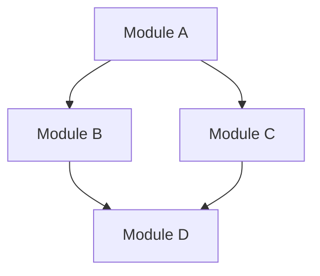

## 24.2 Code Readability and Maintainability

In the world of software development, code readability and maintainability are paramount. As developers, we often spend more time reading code than writing it. Therefore, writing code that is easy to understand and maintain is crucial for long-term project success. In this section, we will delve into best practices for enhancing code readability and maintainability in Erlang, focusing on naming conventions, code formatting, self-documenting code, and the use of comments.

### Importance of Naming Conventions

Naming conventions are the foundation of readable code. They provide context and meaning, making it easier for developers to understand the purpose of variables, functions, and modules. In Erlang, following consistent naming conventions can significantly enhance code clarity.

#### Guidelines for Naming Conventions

1. **Descriptive Names**: Use descriptive names that convey the purpose of the variable or function. For example, instead of naming a variable `X`, use `user_count` if it represents the number of users.

2. **Consistency**: Maintain consistency in naming conventions across the codebase. For instance, if you use camelCase for function names, stick to it throughout the project.

3. **Avoid Abbreviations**: While abbreviations can save time, they often lead to confusion. Use full words unless the abbreviation is widely understood (e.g., `HTTP`).

4. **Use of Underscores**: In Erlang, it's common to use underscores to separate words in variable names, such as `user_count` or `total_sum`.

5. **Module and Function Names**: Start module names with lowercase letters and use underscores to separate words. Function names should also be lowercase and descriptive.

### Code Formatting and Indentation

Proper code formatting and indentation are essential for readability. They help in visually organizing code, making it easier to follow the logic and structure.

#### Tips for Code Formatting

- **Indentation**: Use consistent indentation to delineate code blocks. In Erlang, two spaces per indentation level is a common practice.

- **Line Length**: Keep line lengths reasonable, typically around 80 characters, to ensure code is easily viewable on different screens.

- **Whitespace**: Use whitespace to separate logical sections of code. This can help in visually grouping related code blocks.

- **Align Related Code**: Align related code elements, such as function arguments or list elements, to improve readability.

#### Tools for Code Formatting

Erlang offers tools like `erlfmt` to automate code formatting. `erlfmt` enforces a consistent style across your codebase, reducing the cognitive load on developers.

```erlang
% Example of using erlfmt for consistent formatting
-module(example).
-export([sum/1]).

sum(List) ->
    lists:foldl(fun(X, Acc) -> X + Acc end, 0, List).
```

### Writing Self-Documenting Code

Self-documenting code is code that is clear and understandable without requiring extensive comments. It relies on meaningful names and straightforward logic.

#### Strategies for Self-Documenting Code

- **Meaningful Names**: As discussed earlier, use descriptive names for variables and functions.

- **Simplicity**: Write simple and straightforward code. Avoid complex logic that requires additional explanation.

- **Function Decomposition**: Break down large functions into smaller, more manageable ones. Each function should perform a single task.

- **Avoid Magic Numbers**: Replace magic numbers with named constants to provide context.

```erlang
% Example of self-documenting code
-module(circle).
-export([area/1]).

-define(PI, 3.14159).

area(Radius) ->
    ?PI * Radius * Radius.
```

### Appropriate Use of Comments

While self-documenting code is ideal, comments are still necessary in certain situations. They provide context and explanations that code alone cannot convey.

#### When to Use Comments

- **Complex Logic**: Use comments to explain complex algorithms or logic that may not be immediately clear.

- **Intent**: Explain the intent behind a particular piece of code, especially if it's not obvious.

- **TODOs and FIXMEs**: Use comments to mark areas of code that require further attention or improvement.

#### Best Practices for Comments

- **Keep Comments Up-to-Date**: Ensure comments accurately reflect the code. Outdated comments can be misleading.

- **Avoid Redundant Comments**: Do not state the obvious. Comments should add value, not repeat what the code already says.

- **Use Comments Sparingly**: Rely on self-documenting code as much as possible, using comments only when necessary.

```erlang
% Example of appropriate use of comments
-module(factorial).
-export([calculate/1]).

% Calculate the factorial of a number using recursion
calculate(0) -> 1;
calculate(N) when N > 0 -> N * calculate(N - 1).
```

### Encouraging Simplicity

Simplicity is a key aspect of maintainable code. Simple code is easier to understand, test, and modify.

#### Tips for Keeping Code Simple

- **Avoid Over-Engineering**: Implement only what is necessary. Avoid adding features or complexity that are not needed.

- **Use Built-in Functions**: Leverage Erlang's rich set of built-in functions instead of reinventing the wheel.

- **Refactor Regularly**: Continuously refactor code to improve clarity and reduce complexity.

- **Limit Function Size**: Keep functions small and focused. A function should ideally fit within a single screen.

### Tools and Practices for Code Readability

In addition to `erlfmt`, several other tools and practices can assist in maintaining code readability and quality.

#### Static Analysis Tools

- **Dialyzer**: Use Dialyzer for static code analysis to catch type errors and discrepancies.

- **Credo**: Although primarily for Elixir, Credo can be adapted for Erlang to enforce coding standards and best practices.

#### Code Review

- **Peer Reviews**: Conduct regular code reviews to ensure adherence to coding standards and identify areas for improvement.

- **Automated Code Review Tools**: Use tools like `Hound` or `SonarQube` to automate code quality checks.

### Visualizing Code Structure

Visualizing code structure can aid in understanding complex systems. Use diagrams to represent module interactions, process flows, and data structures.



### Knowledge Check

- **What are the benefits of using descriptive names in code?**
- **How can `erlfmt` assist in maintaining code quality?**
- **Why is it important to keep comments up-to-date?**

### Embrace the Journey

Remember, writing readable and maintainable code is a continuous journey. As you gain experience, you'll develop a deeper understanding of what works best for your projects. Keep experimenting, stay curious, and enjoy the process of crafting clean, efficient code.

## Quiz: Code Readability and Maintainability



### What is the primary benefit of using descriptive names in code?

- [x] They provide context and meaning, making the code easier to understand.
- [ ] They reduce the number of lines in the code.
- [ ] They improve the performance of the code.
- [ ] They make the code more secure.

> **Explanation:** Descriptive names help convey the purpose of variables and functions, enhancing code readability.

### Which tool is commonly used in Erlang for code formatting?

- [x] erlfmt
- [ ] Dialyzer
- [ ] Credo
- [ ] Hound

> **Explanation:** `erlfmt` is a tool used for consistent code formatting in Erlang.

### What is a key characteristic of self-documenting code?

- [x] It is clear and understandable without requiring extensive comments.
- [ ] It contains many comments explaining each line.
- [ ] It uses complex logic to achieve functionality.
- [ ] It relies heavily on abbreviations.

> **Explanation:** Self-documenting code uses meaningful names and straightforward logic to be understandable on its own.

### When should comments be used in code?

- [x] To explain complex logic or the intent behind code.
- [ ] To repeat what the code already says.
- [ ] To fill empty lines in the code.
- [ ] To increase the file size.

> **Explanation:** Comments should provide context or explanations that the code alone cannot convey.

### What is a benefit of keeping functions small and focused?

- [x] They are easier to understand and test.
- [ ] They increase the complexity of the code.
- [x] They fit within a single screen.
- [ ] They require more comments.

> **Explanation:** Small, focused functions improve readability and maintainability by being easier to understand and test.

### Why is it important to avoid magic numbers in code?

- [x] They can be replaced with named constants to provide context.
- [ ] They make the code run faster.
- [ ] They are easier to remember.
- [ ] They reduce the number of lines in the code.

> **Explanation:** Magic numbers should be replaced with named constants to make the code more understandable.

### What is the role of static analysis tools like Dialyzer?

- [x] To catch type errors and discrepancies in code.
- [ ] To format the code.
- [x] To enforce coding standards.
- [ ] To increase the file size.

> **Explanation:** Static analysis tools help identify errors and enforce coding standards, improving code quality.

### How can peer reviews contribute to code quality?

- [x] They ensure adherence to coding standards and identify areas for improvement.
- [ ] They increase the number of lines in the code.
- [ ] They make the code run faster.
- [ ] They reduce the need for comments.

> **Explanation:** Peer reviews help maintain coding standards and improve code quality through collaborative feedback.

### What is a common practice for maintaining code readability?

- [x] Use consistent indentation and formatting.
- [ ] Use as many abbreviations as possible.
- [ ] Avoid using whitespace.
- [ ] Write long, complex functions.

> **Explanation:** Consistent indentation and formatting help organize code and improve readability.

### True or False: Comments should be used to state the obvious in code.

- [ ] True
- [x] False

> **Explanation:** Comments should add value by providing context or explanations, not repeating what the code already says.


