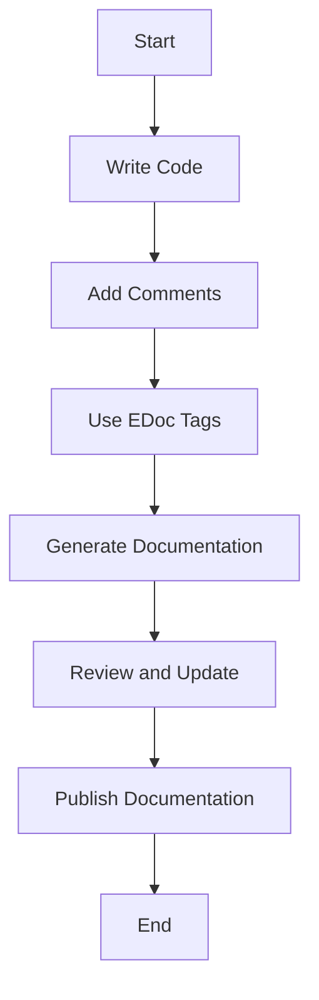

## 24.3 Effective Use of Documentation

In the world of software development, documentation is a crucial component that bridges the gap between code and its users. Whether you're working on a small project or a large-scale system, effective documentation can significantly enhance understanding, usability, and collaboration. In this section, we will explore the various types of documentation, guidelines for writing clear and helpful documentation using EDoc, and the importance of maintaining documentation alongside code updates. We'll also highlight the benefits of good documentation for onboarding and collaboration and encourage a culture that values and prioritizes documentation.

### Types of Documentation

Before diving into the specifics of creating effective documentation, let's first understand the different types of documentation that are commonly used in software development:

1. **API Documentation**: This type of documentation provides detailed information about the functions, modules, and interfaces available in a codebase. It is essential for developers who need to understand how to interact with the code.

2. **Guides and Tutorials**: These are step-by-step instructions that help users understand how to use the software or a particular feature. They are often written in a narrative style and include examples and explanations.

3. **Comments in Code**: Comments are annotations within the code that explain what the code is doing. They are useful for developers who are reading the code and need to understand its logic and purpose.

4. **Technical Specifications**: These documents provide detailed information about the system architecture, design decisions, and technical requirements. They are often used during the planning and design phases of a project.

5. **User Manuals**: These are comprehensive guides that provide instructions on how to use the software from an end-user perspective. They often include screenshots, diagrams, and troubleshooting tips.

6. **Release Notes**: These documents provide information about the changes, improvements, and bug fixes in a new version of the software. They are useful for users who want to know what has changed in the latest release.

### Writing Clear and Helpful Documentation with EDoc

Erlang provides a powerful tool called EDoc for generating documentation from source code. EDoc is a documentation generator for Erlang that extracts comments from the source code and produces HTML documentation. Here are some guidelines for writing clear and helpful documentation using EDoc:

#### 1. Use Descriptive Comments

When writing comments in your code, aim to be descriptive and concise. Explain the purpose of the function, the parameters it takes, and the expected return value. Avoid stating the obvious or repeating what the code already conveys.

```erlang
%% @doc
%% Calculates the factorial of a given number.
%% @spec factorial(integer()) -> integer().
factorial(0) -> 1;
factorial(N) when N > 0 -> N * factorial(N - 1).
```

#### 2. Leverage EDoc Tags

EDoc provides several tags that you can use to enhance your documentation. Some of the most commonly used tags include:

- `@doc`: Provides a description of the function or module.
- `@spec`: Specifies the types of the function's parameters and return value.
- `@author`: Indicates the author of the code.
- `@since`: Specifies the version of the software when the function or module was introduced.

#### 3. Organize Documentation Logically

Structure your documentation in a logical manner, grouping related functions and modules together. Use headings and subheadings to break down complex information and make it easier to navigate.

#### 4. Provide Examples

Include examples in your documentation to illustrate how the code should be used. Examples can help users understand the context and application of the code.

```erlang
%% @doc
%% Example usage:
%% factorial(5).
%% Returns: 120
```

#### 5. Keep Documentation Up-to-Date

As your code evolves, it's important to keep your documentation up-to-date. Regularly review and update your documentation to reflect changes in the codebase. This ensures that users have access to accurate and relevant information.

### Maintaining Documentation Alongside Code Updates

Maintaining documentation alongside code updates is crucial for ensuring that your documentation remains accurate and useful. Here are some strategies for keeping your documentation in sync with your code:

1. **Integrate Documentation into Your Development Workflow**

Make documentation a part of your development process. Encourage developers to update documentation as they write or modify code. This can be achieved by incorporating documentation tasks into your version control system and code review process.

2. **Use Automated Tools**

Leverage automated tools to generate and update documentation. Tools like EDoc can automatically extract comments from your code and generate documentation, reducing the manual effort required.

3. **Conduct Regular Documentation Reviews**

Schedule regular documentation reviews to ensure that your documentation is accurate and up-to-date. This can be done as part of your sprint planning or release process.

4. **Encourage Collaboration**

Foster a culture of collaboration where team members are encouraged to contribute to documentation. This can be achieved by creating a shared documentation repository and providing guidelines for contributing.

### Benefits of Good Documentation for Onboarding and Collaboration

Good documentation can have a significant impact on onboarding new team members and facilitating collaboration among existing team members. Here are some of the key benefits:

1. **Accelerates Onboarding**

Comprehensive documentation can help new team members get up to speed quickly. It provides them with the information they need to understand the codebase and start contributing effectively.

2. **Enhances Collaboration**

Documentation serves as a common reference point for team members, facilitating communication and collaboration. It helps team members understand each other's work and reduces the likelihood of misunderstandings.

3. **Improves Code Quality**

Well-documented code is easier to read, understand, and maintain. It encourages developers to write clean and well-structured code, leading to improved code quality.

4. **Reduces Knowledge Silos**

Documentation helps capture and share knowledge across the team, reducing the risk of knowledge silos. This ensures that critical information is not lost when team members leave or move to different projects.

### Encouraging a Culture that Values and Prioritizes Documentation

Creating a culture that values and prioritizes documentation is essential for ensuring that documentation remains a priority in your organization. Here are some strategies for fostering such a culture:

1. **Lead by Example**

Encourage leaders and senior team members to lead by example by prioritizing documentation in their work. This sets a positive example for the rest of the team to follow.

2. **Recognize and Reward Documentation Efforts**

Acknowledge and reward team members who contribute to documentation. This can be done through recognition programs, performance reviews, or other incentives.

3. **Provide Training and Resources**

Offer training and resources to help team members improve their documentation skills. This can include workshops, online courses, or access to documentation tools and templates.

4. **Set Clear Expectations**

Establish clear expectations for documentation as part of your development process. This can include guidelines for what should be documented, how it should be documented, and when it should be updated.

### Try It Yourself

To practice writing effective documentation, try the following exercise:

1. Choose a small Erlang project or module that you are familiar with.
2. Write comprehensive documentation for the project, including API documentation, guides, and comments.
3. Use EDoc to generate HTML documentation from your comments.
4. Review and update the documentation to ensure it is clear, accurate, and up-to-date.

### Visualizing the Documentation Process

To better understand the documentation process, let's visualize it using a flowchart:



**Figure 1: Documentation Process Flowchart**

This flowchart illustrates the steps involved in creating and maintaining documentation. It begins with writing code, adding comments, and using EDoc tags. The documentation is then generated, reviewed, updated, and published.

### References and Links

For further reading on documentation best practices and tools, consider the following resources:

- [EDoc Documentation](http://erlang.org/doc/apps/edoc/chapter.html)
- [Erlang Programming Language](https://www.erlang.org/)
- [Writing Great Documentation](https://www.writethedocs.org/guide/writing/)

### Knowledge Check

To reinforce your understanding of effective documentation practices, consider the following questions:

1. What are the different types of documentation commonly used in software development?
2. How can EDoc be used to generate documentation from Erlang source code?
3. Why is it important to maintain documentation alongside code updates?
4. What are the benefits of good documentation for onboarding and collaboration?
5. How can you encourage a culture that values and prioritizes documentation?

### Embrace the Journey

Remember, effective documentation is an ongoing process that requires commitment and collaboration. As you continue to develop your skills, you'll find that good documentation not only enhances your code but also empowers your team and users. Keep experimenting, stay curious, and enjoy the journey!

## Quiz: Effective Use of Documentation



### What is the primary purpose of API documentation?

- [x] To provide detailed information about the functions, modules, and interfaces available in a codebase.
- [ ] To offer step-by-step instructions for using the software.
- [ ] To annotate the code with comments.
- [ ] To provide information about changes in a new version of the software.

> **Explanation:** API documentation is designed to give developers detailed information about how to interact with the codebase, including functions, modules, and interfaces.

### Which EDoc tag is used to specify the types of a function's parameters and return value?

- [ ] @doc
- [x] @spec
- [ ] @author
- [ ] @since

> **Explanation:** The `@spec` tag in EDoc is used to define the types of a function's parameters and its return value, providing clarity on how the function should be used.

### Why is it important to keep documentation up-to-date?

- [x] To ensure users have access to accurate and relevant information.
- [ ] To increase the size of the documentation.
- [ ] To make the codebase look more complex.
- [ ] To reduce the need for code comments.

> **Explanation:** Keeping documentation up-to-date ensures that users and developers have access to accurate and relevant information, which is crucial for effective use and maintenance of the software.

### What is one benefit of good documentation for onboarding new team members?

- [x] It helps new team members get up to speed quickly.
- [ ] It makes the codebase more complex.
- [ ] It reduces the need for code reviews.
- [ ] It eliminates the need for training sessions.

> **Explanation:** Good documentation provides new team members with the information they need to understand the codebase and start contributing effectively, accelerating the onboarding process.

### How can you encourage a culture that values documentation?

- [x] Recognize and reward documentation efforts.
- [ ] Ignore documentation in performance reviews.
- [ ] Discourage collaboration on documentation.
- [ ] Limit access to documentation tools.

> **Explanation:** Recognizing and rewarding documentation efforts can help foster a culture that values and prioritizes documentation, encouraging team members to contribute.

### What is the role of comments in code?

- [x] To explain the logic and purpose of the code.
- [ ] To increase the complexity of the code.
- [ ] To replace the need for documentation.
- [ ] To make the code harder to read.

> **Explanation:** Comments in code are used to explain the logic and purpose of the code, making it easier for developers to understand and maintain.

### What tool can be used to generate documentation from Erlang source code?

- [x] EDoc
- [ ] Javadoc
- [ ] Doxygen
- [ ] Sphinx

> **Explanation:** EDoc is a tool specifically designed for generating documentation from Erlang source code, extracting comments and producing HTML documentation.

### Which of the following is NOT a type of documentation?

- [ ] API Documentation
- [ ] User Manuals
- [x] Code Obfuscation
- [ ] Release Notes

> **Explanation:** Code obfuscation is not a type of documentation. It is a technique used to make code harder to understand, often for security purposes.

### What is a key benefit of maintaining documentation alongside code updates?

- [x] It ensures documentation remains accurate and useful.
- [ ] It makes the codebase more complex.
- [ ] It reduces the need for code comments.
- [ ] It increases the size of the documentation.

> **Explanation:** Maintaining documentation alongside code updates ensures that it remains accurate and useful, providing users and developers with up-to-date information.

### True or False: Good documentation can improve code quality.

- [x] True
- [ ] False

> **Explanation:** True. Well-documented code is easier to read, understand, and maintain, which encourages developers to write clean and well-structured code, leading to improved code quality.


