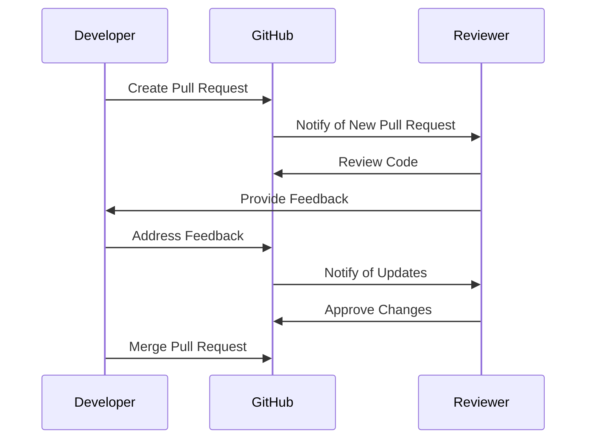

## 24.4 Collaboration and Code Review

In the realm of software development, collaboration and code review are pivotal processes that ensure the delivery of high-quality, maintainable, and efficient code. This section delves into the best practices for fostering effective collaboration within development teams and the integral role of code reviews in enhancing code quality. We will also explore tools that facilitate collaboration and encourage a supportive, learning-focused team environment.

### Effective Communication Within Development Teams

Effective communication is the backbone of successful collaboration in any development team. It involves not only the exchange of information but also the understanding and interpretation of that information. Here are some strategies to enhance communication within your team:

- **Regular Meetings**: Schedule regular meetings to discuss project progress, roadblocks, and future plans. This ensures everyone is on the same page and can contribute to problem-solving.
- **Clear Documentation**: Maintain clear and concise documentation for code, processes, and decisions. This helps team members understand the context and rationale behind certain choices.
- **Open Channels**: Use communication tools like Slack, Microsoft Teams, or Discord to keep channels open for quick discussions and clarifications.
- **Feedback Culture**: Encourage a culture where feedback is welcomed and seen as an opportunity for growth rather than criticism.

### The Role of Code Reviews in Improving Code Quality

Code reviews are a critical component of the software development lifecycle. They serve multiple purposes, from catching bugs early to ensuring code consistency and fostering knowledge sharing among team members. Here’s why code reviews are indispensable:

- **Error Detection**: Code reviews help identify bugs and logical errors that might have been overlooked during development.
- **Knowledge Sharing**: They provide an opportunity for team members to learn from each other’s code, promoting best practices and innovative solutions.
- **Consistency**: Reviews ensure that the code adheres to the team’s coding standards and style guides, which is crucial for maintainability.
- **Improved Design**: They encourage developers to think critically about their code design and architecture, leading to more robust and scalable solutions.

### Guidelines for Conducting Constructive Code Reviews

Conducting effective code reviews requires a structured approach and a positive mindset. Here are some guidelines to ensure your code reviews are constructive and beneficial:

1. **Set Clear Objectives**: Define what you aim to achieve with the code review. This could be error detection, adherence to coding standards, or design improvement.
2. **Focus on the Code, Not the Developer**: Critique the code, not the person who wrote it. This helps maintain a positive and respectful environment.
3. **Be Specific and Objective**: Provide specific feedback with examples and references to coding standards or best practices.
4. **Encourage Discussion**: Use the review as a platform for discussion and learning. Encourage the developer to explain their thought process and reasoning.
5. **Limit the Scope**: Avoid overwhelming the developer with too much feedback at once. Focus on the most critical issues.
6. **Use Tools**: Leverage code review tools to streamline the process and keep track of feedback and changes.

### Tools That Facilitate Collaboration

Several tools can enhance collaboration and streamline the code review process. Here are some popular ones:

- **GitHub**: Offers a robust platform for version control and collaboration, with features like pull requests and inline comments for code reviews.
- **GitLab**: Similar to GitHub, GitLab provides comprehensive tools for code collaboration, CI/CD, and project management.
- **Bitbucket**: Integrates with Jira and offers powerful code review and collaboration features.
- **Phabricator**: An open-source suite of tools for peer code review, task management, and project planning.

### Encouraging a Supportive and Learning-Focused Team Environment

Creating a supportive and learning-focused environment is crucial for team morale and productivity. Here’s how you can foster such an environment:

- **Celebrate Successes**: Acknowledge and celebrate team achievements, both big and small.
- **Encourage Experimentation**: Allow team members to experiment and explore new ideas without fear of failure.
- **Provide Learning Opportunities**: Offer training sessions, workshops, and access to learning resources to help team members grow their skills.
- **Mentorship Programs**: Pair less experienced developers with mentors to guide them and provide support.

### Code Example: Implementing a Code Review Process in Erlang

Let's look at a simple example of how you might implement a code review process in an Erlang project using GitHub.

```erlang
-module(code_review_example).
-export([start_review/1, submit_feedback/2]).

% Start a code review by creating a pull request
start_review(BranchName) ->
    io:format("Creating a pull request for branch: ~s~n", [BranchName]),
    % Simulate creating a pull request
    ok.

% Submit feedback on the pull request
submit_feedback(PullRequestId, Feedback) ->
    io:format("Submitting feedback for PR#~p: ~s~n", [PullRequestId, Feedback]),
    % Simulate submitting feedback
    ok.
```

In this example, the `start_review/1` function simulates creating a pull request for a specific branch, while the `submit_feedback/2` function simulates submitting feedback on a pull request. This is a simplified representation, but it illustrates the basic idea of how code reviews can be integrated into your workflow.

### Try It Yourself

Experiment with the code example by modifying the branch name or feedback message. Consider how you might extend this example to include additional features, such as tracking review status or integrating with a CI/CD pipeline.

### Visualizing the Code Review Process

Below is a Mermaid.js diagram illustrating a typical code review process using GitHub:



This diagram shows the interaction between the developer, GitHub, and the reviewer during the code review process.

### References and Links

- [GitHub Documentation](https://docs.github.com/en)
- [GitLab Documentation](https://docs.gitlab.com/)
- [Bitbucket Documentation](https://support.atlassian.com/bitbucket/)
- [Phabricator Documentation](https://secure.phabricator.com/book/phabricator/)

### Knowledge Check

- What are the key benefits of conducting code reviews?
- How can you ensure feedback during code reviews is constructive?
- What tools can facilitate collaboration and code reviews in Erlang development?

### Embrace the Journey

Remember, collaboration and code review are ongoing processes that evolve with your team. As you continue to refine these practices, you'll find that they not only improve code quality but also strengthen team dynamics and foster a culture of continuous learning. Keep experimenting, stay curious, and enjoy the journey of collaborative development!

## Quiz: Collaboration and Code Review



### What is a primary benefit of code reviews?

- [x] Error detection and knowledge sharing
- [ ] Increasing code complexity
- [ ] Reducing team communication
- [ ] Limiting developer creativity

> **Explanation:** Code reviews help in detecting errors early and facilitate knowledge sharing among team members.

### Which tool is commonly used for version control and collaboration?

- [x] GitHub
- [ ] Microsoft Word
- [ ] Excel
- [ ] PowerPoint

> **Explanation:** GitHub is a widely used platform for version control and collaboration in software development.

### What should be the focus during a code review?

- [x] The code, not the developer
- [ ] The developer's personality
- [ ] The developer's past mistakes
- [ ] The developer's coding speed

> **Explanation:** Code reviews should focus on the code itself, not the person who wrote it, to maintain a positive environment.

### How can you encourage a supportive team environment?

- [x] Celebrate successes and encourage experimentation
- [ ] Criticize mistakes harshly
- [ ] Limit access to learning resources
- [ ] Discourage feedback

> **Explanation:** Celebrating successes and encouraging experimentation fosters a supportive and learning-focused environment.

### What is a guideline for providing feedback during code reviews?

- [x] Be specific and objective
- [ ] Be vague and subjective
- [ ] Focus on personal opinions
- [ ] Avoid giving feedback

> **Explanation:** Feedback should be specific and objective, with examples and references to best practices.

### Which of the following is not a code review tool?

- [x] Microsoft Word
- [ ] GitHub
- [ ] GitLab
- [ ] Bitbucket

> **Explanation:** Microsoft Word is not a tool for code review; GitHub, GitLab, and Bitbucket are.

### What is an effective way to maintain open communication in a team?

- [x] Use communication tools like Slack or Teams
- [ ] Avoid regular meetings
- [ ] Limit communication to emails
- [ ] Discourage questions

> **Explanation:** Tools like Slack or Teams help maintain open communication channels for quick discussions and clarifications.

### Why is it important to limit the scope of feedback in code reviews?

- [x] To avoid overwhelming the developer
- [ ] To ensure all feedback is given at once
- [ ] To focus on minor issues
- [ ] To criticize the developer

> **Explanation:** Limiting the scope of feedback helps avoid overwhelming the developer and focuses on critical issues.

### What is a benefit of regular team meetings?

- [x] Ensures everyone is on the same page
- [ ] Reduces team communication
- [ ] Increases project delays
- [ ] Limits problem-solving

> **Explanation:** Regular meetings help ensure that all team members are aligned and can contribute to problem-solving.

### True or False: Code reviews should focus on the developer's personality.

- [ ] True
- [x] False

> **Explanation:** Code reviews should focus on the code itself, not the developer's personality, to maintain a constructive environment.


