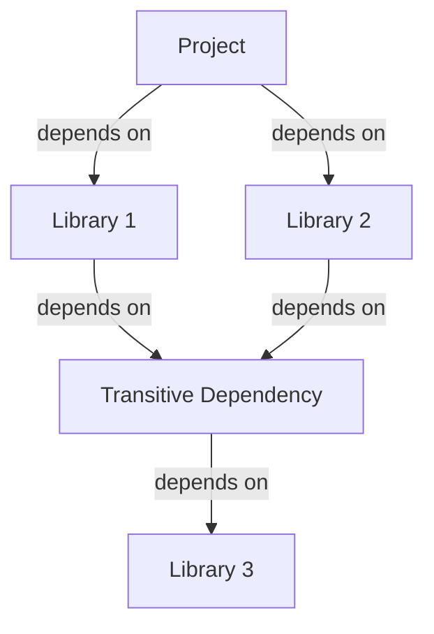

## 24.5 Utilizing Community Libraries and Tools

In the world of software development, leveraging community libraries and tools is a powerful strategy to accelerate development, enhance productivity, and avoid reinventing the wheel. Erlang, with its rich ecosystem, offers a plethora of libraries and tools that can be harnessed to build robust applications efficiently. In this section, we will explore popular Erlang libraries and frameworks, discuss how to find and evaluate community packages on [Hex](https://hex.pm/), provide examples of integrating third-party libraries into projects, and highlight the benefits of contributing back to the community. We will also emphasize the importance of cautious use of dependencies, with attention to licensing and maintenance.

### Introduction to Erlang Community Libraries

Erlang's ecosystem is vibrant and continuously growing, thanks to the contributions of developers worldwide. Community libraries and tools are essential resources that can significantly reduce development time and effort. These libraries cover a wide range of functionalities, from web development and database interaction to testing and debugging.

#### Popular Erlang Libraries and Frameworks

1. **Cowboy**: A small, fast, and modern HTTP server for Erlang/OTP. Cowboy is widely used for building web applications and APIs due to its simplicity and performance.

2. **Ecto**: While primarily associated with Elixir, Ecto is a database wrapper and query generator that can be used in Erlang projects for interacting with databases.

3. **Rebar3**: The standard build tool for Erlang, Rebar3 simplifies the process of compiling, testing, and managing dependencies in Erlang projects.

4. **Lager**: A logging framework for Erlang that provides a structured way to handle log messages, making it easier to debug and monitor applications.

5. **PropEr**: A property-based testing tool that allows developers to specify properties that their code should satisfy, automatically generating test cases to validate these properties.

6. **RabbitMQ**: A message broker that implements the Advanced Message Queuing Protocol (AMQP). It is used for building distributed systems and handling asynchronous communication.

7. **Mnesia**: A distributed database management system that is part of the Erlang standard library, suitable for applications requiring high availability and fault tolerance.

8. **Dialyzer**: A static analysis tool that identifies software discrepancies such as type errors, unreachable code, and unnecessary tests.

### Finding and Evaluating Community Packages on Hex

Hex is the package manager for the Erlang and Elixir ecosystems, providing a centralized repository for discovering and managing libraries. To effectively utilize Hex, follow these steps:

1. **Search for Packages**: Use the search functionality on [Hex](https://hex.pm/) to find packages relevant to your project needs. You can search by keywords, categories, or specific library names.

2. **Evaluate Package Quality**: Assess the quality of a package by reviewing its documentation, checking the number of downloads, and examining the maintenance status. Look for packages with active maintainers and recent updates.

3. **Read User Reviews and Ratings**: User feedback can provide insights into the package's reliability and ease of use. Consider the experiences of other developers when evaluating a package.

4. **Check Licensing**: Ensure that the package's license is compatible with your project's requirements. Pay attention to any restrictions or obligations imposed by the license.

5. **Review Source Code**: If possible, review the package's source code to understand its implementation and ensure it meets your quality standards.

### Integrating Third-Party Libraries into Projects

Integrating third-party libraries into your Erlang projects can streamline development and add valuable functionality. Here's how to do it effectively:

1. **Add Dependencies in Rebar.config**: Use Rebar3 to manage dependencies by adding the desired library to your `rebar.config` file. Specify the library name and version to ensure compatibility.

   ```erlang
   {deps, [
       {cowboy, "2.9.0"},
       {lager, "3.9.2"}
   ]}.
   ```

2. **Compile and Fetch Dependencies**: Run `rebar3 compile` to fetch and compile the specified dependencies. Rebar3 will automatically resolve any transitive dependencies.

3. **Use the Library in Your Code**: Import the library modules and use their functions in your application. Ensure you understand the library's API and follow best practices for integration.

   ```erlang
   -module(my_app).
   -export([start/0]).

   start() ->
       lager:start(),
       cowboy:start_http(my_http_listener, 100, [{port, 8080}], []),
       io:format("Server started on port 8080~n").
   ```

4. **Test the Integration**: Thoroughly test your application to ensure the integrated library functions as expected. Consider writing unit tests to validate the library's behavior within your application.

### Benefits of Contributing Back to the Community

Contributing to open-source projects is a rewarding experience that benefits both the individual developer and the broader community. Here are some reasons to contribute back:

1. **Improve Your Skills**: Working on open-source projects exposes you to different coding styles, architectures, and problem-solving approaches, enhancing your skills and knowledge.

2. **Gain Recognition**: Contributions to popular projects can increase your visibility in the developer community and enhance your professional reputation.

3. **Foster Collaboration**: Open-source projects encourage collaboration and knowledge sharing, allowing you to learn from others and contribute your expertise.

4. **Support the Ecosystem**: By contributing to libraries and tools you use, you help ensure their continued development and maintenance, benefiting the entire community.

5. **Give Back**: Contributing to open-source is a way to give back to the community that has provided you with valuable resources and support.

### Cautious Use of Dependencies

While using community libraries can accelerate development, it's essential to be cautious with dependencies. Here are some considerations:

1. **Dependency Management**: Regularly review and update your dependencies to ensure compatibility and security. Use tools like `rebar3 outdated` to identify outdated packages.

2. **Licensing Compliance**: Ensure that all dependencies comply with your project's licensing requirements. Be aware of any obligations imposed by the licenses.

3. **Security Risks**: Evaluate the security implications of using third-party libraries. Monitor for known vulnerabilities and apply patches promptly.

4. **Maintenance and Support**: Choose libraries with active maintainers and a supportive community. Avoid relying on unmaintained or poorly supported packages.

5. **Performance Considerations**: Assess the performance impact of adding dependencies. Ensure that the library's benefits outweigh any potential performance costs.

### Try It Yourself

To get hands-on experience with integrating community libraries, try the following exercise:

1. **Choose a Library**: Select a library from Hex that interests you and is relevant to your project.

2. **Integrate the Library**: Follow the steps outlined above to integrate the library into a simple Erlang application.

3. **Experiment**: Modify the library's usage in your application to explore its features and capabilities. Try different configurations and settings.

4. **Contribute**: If you encounter any issues or have ideas for improvements, consider contributing back to the library's repository.

### Visualizing Dependency Management

To better understand how dependencies are managed in Erlang projects, consider the following diagram:



**Diagram Description**: This diagram illustrates a typical dependency graph in an Erlang project. The project depends on two libraries, each of which has its own dependencies. Understanding this structure is crucial for effective dependency management.

### Knowledge Check

- What are the benefits of using community libraries in Erlang projects?
- How can you evaluate the quality of a package on Hex?
- What are some best practices for integrating third-party libraries into your projects?
- Why is it important to contribute back to the open-source community?
- What precautions should you take when using dependencies in your projects?

### Summary

In this section, we've explored the importance of utilizing community libraries and tools in Erlang development. By leveraging existing resources, developers can accelerate their projects, enhance functionality, and avoid redundant work. We've also discussed how to find and evaluate packages on Hex, integrate third-party libraries, and contribute back to the community. Remember to use dependencies cautiously, considering licensing, security, and maintenance. As you continue your Erlang journey, embrace the power of community collaboration and open-source contributions.

## Quiz: Utilizing Community Libraries and Tools



### What is the primary benefit of using community libraries in Erlang projects?

- [x] Accelerating development and avoiding redundant work
- [ ] Increasing code complexity
- [ ] Reducing application performance
- [ ] Limiting functionality

> **Explanation:** Community libraries provide pre-built solutions that can speed up development and reduce the need to reinvent solutions.

### How can you evaluate the quality of a package on Hex?

- [x] By reviewing documentation, checking downloads, and examining maintenance status
- [ ] By looking at the package name only
- [ ] By checking the package size
- [ ] By counting the number of contributors

> **Explanation:** Evaluating documentation, downloads, and maintenance status helps determine the package's reliability and quality.

### What is a key consideration when integrating third-party libraries into projects?

- [x] Ensuring compatibility and understanding the library's API
- [ ] Ignoring the library's documentation
- [ ] Using outdated versions
- [ ] Avoiding testing the integration

> **Explanation:** Compatibility and understanding the API are crucial for successful integration.

### Why should developers contribute back to the open-source community?

- [x] To improve skills, gain recognition, and support the ecosystem
- [ ] To increase project complexity
- [ ] To reduce collaboration
- [ ] To limit knowledge sharing

> **Explanation:** Contributing back enhances skills, recognition, and supports the open-source ecosystem.

### What is a potential risk of using third-party dependencies?

- [x] Security vulnerabilities and maintenance issues
- [ ] Improved application security
- [ ] Increased code readability
- [ ] Enhanced performance

> **Explanation:** Dependencies can introduce security vulnerabilities and maintenance challenges.

### Which tool is used for managing dependencies in Erlang projects?

- [x] Rebar3
- [ ] Cowboy
- [ ] Lager
- [ ] PropEr

> **Explanation:** Rebar3 is the standard build tool for managing dependencies in Erlang projects.

### What should you check before using a library from Hex?

- [x] Licensing compliance and security implications
- [ ] The library's logo
- [ ] The library's color scheme
- [ ] The library's mascot

> **Explanation:** Licensing compliance and security implications are critical considerations.

### What is a benefit of using Hex for Erlang projects?

- [x] Centralized repository for discovering and managing libraries
- [ ] Decentralized package management
- [ ] Limited library availability
- [ ] Reduced community support

> **Explanation:** Hex provides a centralized platform for discovering and managing libraries.

### How can you contribute to an open-source library?

- [x] By submitting bug fixes, improvements, or documentation updates
- [ ] By deleting the repository
- [ ] By ignoring community guidelines
- [ ] By withholding feedback

> **Explanation:** Contributions can include bug fixes, improvements, and documentation updates.

### True or False: It is important to regularly update dependencies to ensure compatibility and security.

- [x] True
- [ ] False

> **Explanation:** Regular updates help maintain compatibility and address security vulnerabilities.



Remember, this is just the beginning. As you progress, you'll build more complex and interactive applications. Keep experimenting, stay curious, and enjoy the journey!
