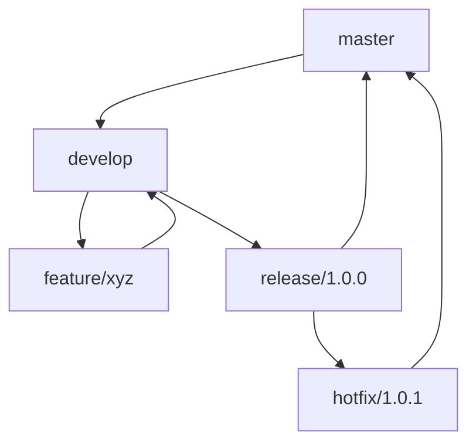

## 24.6 Version Control and Release Management

In the world of software development, version control and release management are crucial components that ensure the stability, reliability, and scalability of applications. For Erlang developers, mastering these practices is essential to maintain the integrity of codebases and streamline the deployment process. In this section, we will delve into the best practices for using version control systems like Git, explore effective branching strategies, and discuss tools and techniques for managing releases in Erlang applications.

### Understanding Version Control Systems

Version control systems (VCS) are tools that help developers manage changes to source code over time. They allow multiple developers to collaborate on a project without overwriting each other's work. Git is the most widely used VCS today, known for its distributed architecture and robust branching capabilities.

#### Key Concepts in Git

- **Repository**: A repository (or repo) is a directory that contains all the project files and the entire history of changes made to those files.
- **Commit**: A commit is a snapshot of the project's files at a specific point in time. Each commit has a unique identifier (SHA) and a commit message describing the changes.
- **Branch**: A branch is a parallel version of the repository. It allows developers to work on different features or fixes simultaneously.
- **Merge**: Merging is the process of integrating changes from one branch into another.
- **Tag**: Tags are used to mark specific points in the repository's history, often used for releases.

### Best Practices for Using Git

To effectively use Git in Erlang development, consider the following best practices:

#### 1. Write Clear and Descriptive Commit Messages

Commit messages should be concise yet informative, providing context for the changes made. A good commit message helps other developers understand the purpose of the commit without having to read the code.

**Example of a Good Commit Message:**

```
feat: Add support for JSON serialization in user module

- Implement JSON encoding and decoding functions
- Update user module tests to cover JSON serialization
```

#### 2. Adopt a Consistent Branching Strategy

A well-defined branching strategy helps manage the development workflow and ensures that features, bug fixes, and releases are organized. Some popular branching strategies include:

- **Git Flow**: A robust branching model that uses feature branches, release branches, and a master branch for production-ready code.
- **GitHub Flow**: A simpler model with a single master branch and short-lived feature branches.
- **Trunk-Based Development**: A model where developers work directly on the main branch, with short-lived branches for features.

#### 3. Use Tags for Release Management

Tags in Git are useful for marking release points in your project. They provide a way to reference specific versions of the codebase, making it easier to track changes and roll back if necessary.

**Creating a Tag in Git:**

```bash
git tag -a v1.0.0 -m "Release version 1.0.0"
git push origin v1.0.0
```

### Managing Releases and Versioning in Erlang

Release management involves planning, scheduling, and controlling the build, test, and deployment of releases. In Erlang, tools like Rebar3 facilitate this process by automating many aspects of release management.

#### Using Rebar3 for Release Management

Rebar3 is a build tool for Erlang that simplifies the process of managing dependencies, compiling code, and creating releases. It provides a standardized way to build and deploy Erlang applications.

**Basic Rebar3 Commands:**

- **Compile the Project**: `rebar3 compile`
- **Run Tests**: `rebar3 eunit`
- **Create a Release**: `rebar3 release`

#### Versioning Strategies

Versioning is the process of assigning unique version numbers to different states of the software. A common versioning scheme is Semantic Versioning (SemVer), which uses a three-part number: `MAJOR.MINOR.PATCH`.

- **MAJOR**: Incremented for incompatible API changes.
- **MINOR**: Incremented for backward-compatible functionality.
- **PATCH**: Incremented for backward-compatible bug fixes.

### Tools for Release Management

Several tools can assist with release management in Erlang:

- **Rebar3**: As mentioned, Rebar3 is a powerful tool for building and managing Erlang projects.
- **Git Flow**: A set of Git extensions that provide high-level repository operations for managing releases.
- **CI/CD Pipelines**: Tools like Jenkins, GitLab CI, and GitHub Actions automate the build, test, and deployment process.

### Regular Reviews of Version Control Practices

It's important to regularly review and refine your version control practices to ensure they remain effective. Consider conducting periodic audits of your Git workflow, branching strategy, and release management processes to identify areas for improvement.

### Try It Yourself

To solidify your understanding of version control and release management, try the following exercises:

1. **Experiment with Branching**: Create a new feature branch in a Git repository, make some changes, and merge it back into the main branch.
2. **Tag a Release**: Use Git to tag a specific commit as a release and push the tag to a remote repository.
3. **Create a Release with Rebar3**: Set up a simple Erlang project with Rebar3, compile it, and create a release.

### Visualizing Version Control and Release Management

Below is a diagram illustrating a typical Git Flow branching strategy:



**Diagram Description**: This diagram shows the flow of branches in a Git Flow strategy, where feature branches are merged into the develop branch, release branches are created from develop, and hotfixes are applied directly to the master branch.

### Knowledge Check

- **What is the purpose of a commit message?**
- **How does Semantic Versioning help in release management?**
- **What are the benefits of using Rebar3 in Erlang development?**

### Summary

In this section, we've explored the importance of version control and release management in Erlang development. By adopting best practices for using Git, implementing effective branching strategies, and leveraging tools like Rebar3, developers can ensure their applications are stable, reliable, and easy to maintain. Remember, regular reviews of your version control practices are key to continuous improvement.

## Quiz: Version Control and Release Management



### What is the primary purpose of a version control system?

- [x] To manage changes to source code over time
- [ ] To compile code
- [ ] To deploy applications
- [ ] To write documentation

> **Explanation:** Version control systems help manage changes to source code, allowing multiple developers to collaborate without overwriting each other's work.

### Which of the following is a key feature of Git?

- [x] Distributed architecture
- [ ] Centralized server
- [ ] Automatic code compilation
- [ ] Built-in IDE

> **Explanation:** Git is known for its distributed architecture, allowing each developer to have a complete copy of the repository.

### What is a commit in Git?

- [x] A snapshot of the project's files at a specific point in time
- [ ] A branch of the repository
- [ ] A tag marking a release
- [ ] A merge of two branches

> **Explanation:** A commit is a snapshot of the project's files, representing a specific state of the codebase.

### What is the purpose of a Git tag?

- [x] To mark specific points in the repository's history
- [ ] To create a new branch
- [ ] To delete a commit
- [ ] To merge branches

> **Explanation:** Tags are used to mark specific points in the repository's history, often used for releases.

### Which branching strategy involves working directly on the main branch?

- [x] Trunk-Based Development
- [ ] Git Flow
- [ ] GitHub Flow
- [ ] Feature Branching

> **Explanation:** Trunk-Based Development involves working directly on the main branch, with short-lived branches for features.

### What is Semantic Versioning?

- [x] A versioning scheme using MAJOR.MINOR.PATCH
- [ ] A tool for managing Git branches
- [ ] A method for compiling Erlang code
- [ ] A strategy for writing commit messages

> **Explanation:** Semantic Versioning is a versioning scheme that uses a three-part number: MAJOR.MINOR.PATCH.

### What tool is commonly used for building and managing Erlang projects?

- [x] Rebar3
- [ ] Maven
- [ ] Gradle
- [ ] NPM

> **Explanation:** Rebar3 is a build tool specifically designed for Erlang projects, simplifying dependency management and release creation.

### What is the purpose of a release branch in Git Flow?

- [x] To prepare a new release for production
- [ ] To develop new features
- [ ] To fix bugs in the main branch
- [ ] To delete old branches

> **Explanation:** A release branch is used to prepare a new release for production, allowing final testing and bug fixes.

### What command is used to create a tag in Git?

- [x] `git tag -a v1.0.0 -m "Release version 1.0.0"`
- [ ] `git branch -a v1.0.0`
- [ ] `git commit -m "Release version 1.0.0"`
- [ ] `git merge v1.0.0`

> **Explanation:** The `git tag` command is used to create a tag, marking a specific commit as a release.

### True or False: Rebar3 can automate the release creation process for Erlang applications.

- [x] True
- [ ] False

> **Explanation:** Rebar3 automates many aspects of release management, including dependency management, compilation, and release creation.



Remember, mastering version control and release management is a journey. As you continue to develop your skills, you'll find new ways to optimize your workflow and improve your Erlang applications. Keep experimenting, stay curious, and enjoy the journey!
