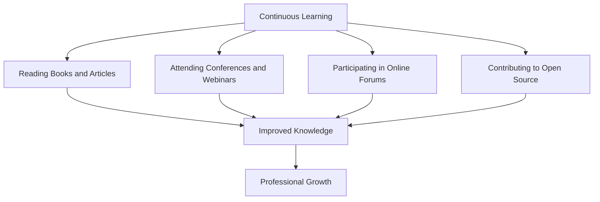

## 24.7 Continuous Learning and Community Engagement

In the ever-evolving landscape of software development, staying updated with the latest advancements and engaging with the community are crucial for personal and professional growth. This is especially true in the Erlang ecosystem, where continuous learning and active participation can significantly enhance your skills and career prospects. In this section, we will explore the importance of continuous learning, the resources available for Erlang developers, and the benefits of engaging with the community.

### The Importance of Continuous Learning

Continuous learning is the process of constantly acquiring new knowledge and skills throughout your career. In the context of Erlang development, this means staying informed about the latest language features, libraries, tools, and best practices. Here are some reasons why continuous learning is essential:

- **Adaptability**: The software industry is dynamic, with new technologies and methodologies emerging regularly. By continuously learning, you can adapt to these changes and remain relevant in your field.
- **Innovation**: Learning new concepts and techniques can spark creativity and innovation, enabling you to solve problems more effectively and develop better solutions.
- **Career Advancement**: Employers value individuals who are proactive about their professional development. Continuous learning can open up new career opportunities and lead to promotions or salary increases.
- **Personal Satisfaction**: Learning can be intrinsically rewarding, providing a sense of accomplishment and fulfillment.

### Staying Updated with Erlang Developments

To stay updated with the latest Erlang developments, consider the following strategies:

1. **Follow Official Erlang Announcements**: Keep an eye on official Erlang announcements and release notes to stay informed about new features and updates.

2. **Subscribe to Erlang Newsletters**: Subscribe to newsletters and mailing lists that provide regular updates on Erlang-related news and events.

3. **Participate in Erlang Conferences and Webinars**: Attend conferences, webinars, and workshops to learn from experts and gain insights into the latest trends and technologies.

4. **Join Online Forums and Communities**: Engage with online forums and communities where Erlang developers discuss topics, share knowledge, and collaborate on projects.

5. **Read Blogs and Articles**: Follow blogs and articles written by experienced Erlang developers to gain insights into best practices and real-world applications.

### Learning Resources for Erlang Developers

There are numerous resources available for Erlang developers to enhance their skills and knowledge. Here are some recommended resources:

- **Books**: Books are a valuable resource for in-depth learning. Some popular Erlang books include "Programming Erlang" by Joe Armstrong and "Erlang and OTP in Action" by Martin Logan, Eric Merritt, and Richard Carlsson.

- **Online Courses**: Online platforms like Coursera, Udemy, and Pluralsight offer courses on Erlang programming and related topics.

- **Documentation**: The official Erlang documentation is an essential resource for understanding the language's features and libraries.

- **Tutorials and Guides**: Many websites and blogs offer tutorials and guides on various Erlang topics, from beginner to advanced levels.

- **Podcasts and Videos**: Podcasts and video tutorials provide an engaging way to learn about Erlang and its ecosystem.

### Engaging with the Erlang Community

Engaging with the Erlang community can provide numerous benefits, including networking opportunities, knowledge sharing, and collaboration. Here are some ways to get involved:

- **Join Erlang Forums and Mailing Lists**: Participate in forums and mailing lists to connect with other Erlang developers, ask questions, and share your experiences.

- **Attend Meetups and Conferences**: Attend local meetups and international conferences to meet other developers, learn from experts, and stay updated on the latest trends.

- **Contribute to Open Source Projects**: Contributing to open-source projects is a great way to improve your skills, gain recognition, and give back to the community.

- **Share Your Knowledge**: Write blog posts, create tutorials, or give talks to share your knowledge and experiences with others.

- **Collaborate on Projects**: Collaborate with other developers on projects to learn from each other and build something meaningful together.

### Benefits of Community Engagement

Engaging with the Erlang community can have a positive impact on your professional growth. Here are some benefits:

- **Networking**: Building connections with other developers can lead to new opportunities, collaborations, and friendships.

- **Learning from Others**: Engaging with the community allows you to learn from the experiences and expertise of others.

- **Contributing to the Ecosystem**: By contributing to open-source projects and sharing your knowledge, you can help improve the Erlang ecosystem and support other developers.

- **Professional Recognition**: Active participation in the community can enhance your reputation and visibility in the industry.

- **Support and Mentorship**: The community can provide support and mentorship, helping you overcome challenges and grow as a developer.

### Encouraging Community Participation

To encourage community participation, consider the following tips:

- **Be Open and Inclusive**: Foster an open and inclusive environment where everyone feels welcome to participate and share their ideas.

- **Provide Opportunities for Collaboration**: Create opportunities for collaboration, such as hackathons, coding challenges, and group projects.

- **Recognize and Celebrate Contributions**: Recognize and celebrate the contributions of community members to motivate and inspire others.

- **Offer Mentorship and Support**: Offer mentorship and support to newcomers to help them get started and feel confident in their abilities.

- **Promote Diversity and Inclusion**: Promote diversity and inclusion within the community to ensure a wide range of perspectives and ideas.

### Code Example: Contributing to an Open Source Project

Let's look at a simple example of how you can contribute to an open-source Erlang project. Suppose you want to add a new feature to an existing project. Here's a step-by-step guide:

```erlang
% Step 1: Fork the repository on GitHub
% Step 2: Clone the repository to your local machine
git clone https://github.com/your-username/project-name.git

% Step 3: Create a new branch for your feature
git checkout -b new-feature

% Step 4: Implement the feature in Erlang
-module(new_feature).
-export([start/0]).

start() ->
    io:format("New feature implemented!~n").

% Step 5: Test your changes
% Run the Erlang shell and test your new feature
% erl
% 1> c(new_feature).
% 2> new_feature:start().

% Step 6: Commit your changes
git add .
git commit -m "Add new feature"

% Step 7: Push your changes to your forked repository
git push origin new-feature

% Step 8: Create a pull request on GitHub
% Go to the original repository and create a pull request for your changes
```

### Try It Yourself

Try modifying the code example above by adding additional functionality to the `new_feature` module. For instance, you could implement a function that takes user input and processes it in some way. Experiment with different features and see how they work in the Erlang shell.

### Visualizing Community Engagement

Below is a diagram illustrating the process of engaging with the Erlang community through various channels:



**Diagram Description**: This diagram shows how continuous learning through reading, attending events, participating in forums, and contributing to open-source projects leads to improved knowledge and professional growth.

### Knowledge Check

- What are some benefits of continuous learning in Erlang development?
- How can you stay updated with the latest Erlang developments?
- What are some recommended resources for learning Erlang?
- How can engaging with the Erlang community benefit your career?
- What are some ways to contribute to the Erlang community?

### Summary

Continuous learning and community engagement are vital components of a successful career in Erlang development. By staying updated with the latest advancements, utilizing available resources, and actively participating in the community, you can enhance your skills, expand your network, and contribute to the growth of the Erlang ecosystem. Remember, this is just the beginning. As you progress, you'll discover new opportunities and challenges. Keep learning, stay curious, and enjoy the journey!

## Quiz: Continuous Learning and Community Engagement



### What is the primary benefit of continuous learning in Erlang development?

- [x] Adaptability to new technologies
- [ ] Increased salary
- [ ] Reduced workload
- [ ] Guaranteed promotions

> **Explanation:** Continuous learning helps developers adapt to new technologies and methodologies, ensuring they remain relevant in the industry.

### Which of the following is NOT a recommended resource for learning Erlang?

- [ ] Books
- [ ] Online Courses
- [x] Cooking Shows
- [ ] Documentation

> **Explanation:** While books, online courses, and documentation are valuable resources for learning Erlang, cooking shows are unrelated to programming.

### How can engaging with the Erlang community benefit your career?

- [x] Networking opportunities
- [ ] Guaranteed job offers
- [ ] Free software licenses
- [ ] Reduced work hours

> **Explanation:** Engaging with the community provides networking opportunities, which can lead to new collaborations and career advancements.

### What is one way to contribute to the Erlang community?

- [x] Contributing to open-source projects
- [ ] Watching TV shows
- [ ] Playing video games
- [ ] Ignoring forums

> **Explanation:** Contributing to open-source projects is a valuable way to give back to the community and improve your skills.

### Which of the following is a benefit of attending Erlang conferences?

- [x] Learning from experts
- [ ] Free travel
- [ ] Guaranteed job offers
- [ ] Reduced taxes

> **Explanation:** Attending conferences allows developers to learn from experts and gain insights into the latest trends and technologies.

### What is the purpose of creating a new branch when contributing to an open-source project?

- [x] To isolate your changes
- [ ] To delete the main branch
- [ ] To merge unrelated projects
- [ ] To hide your work

> **Explanation:** Creating a new branch allows you to isolate your changes, making it easier to manage and review them before merging.

### How can you stay updated with the latest Erlang developments?

- [x] Follow official Erlang announcements
- [ ] Ignore new releases
- [ ] Only use outdated resources
- [ ] Avoid community forums

> **Explanation:** Following official Erlang announcements and engaging with the community helps you stay informed about new features and updates.

### What is a key benefit of contributing to open-source projects?

- [x] Gaining recognition
- [ ] Guaranteed promotions
- [ ] Free software licenses
- [ ] Reduced workload

> **Explanation:** Contributing to open-source projects can enhance your reputation and visibility in the industry.

### Which of the following is a recommended strategy for continuous learning?

- [x] Reading blogs and articles
- [ ] Avoiding new information
- [ ] Only using outdated resources
- [ ] Ignoring community events

> **Explanation:** Reading blogs and articles helps you stay informed about the latest trends and best practices in Erlang development.

### True or False: Engaging with the Erlang community can lead to professional growth.

- [x] True
- [ ] False

> **Explanation:** Engaging with the community provides opportunities for networking, learning, and collaboration, which can contribute to professional growth.


