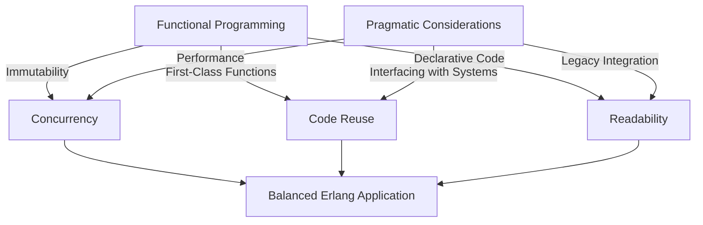

## 24.8 Balancing Functional and Pragmatic Approaches

In the world of software development, especially when working with a language like Erlang, developers often find themselves at the crossroads of functional purity and pragmatic necessity. This section aims to explore the delicate balance between adhering to functional programming principles and making practical decisions that align with project goals and constraints.

### The Importance of Functional Programming in Erlang

Erlang is a language that embraces the functional programming paradigm, which emphasizes immutability, first-class functions, and declarative code. These principles lead to code that is often more predictable, easier to test, and less prone to certain types of bugs. Let's delve into why these principles are crucial:

1. **Immutability**: In Erlang, data structures are immutable, meaning once they are created, they cannot be changed. This leads to safer concurrent programming since there is no risk of shared mutable state.

2. **First-Class Functions**: Functions in Erlang can be passed around as arguments, returned from other functions, and assigned to variables. This allows for higher-order functions and promotes code reuse and abstraction.

3. **Declarative Code**: Functional programming encourages writing code that expresses the logic of computation without describing its control flow. This can lead to more concise and readable code.

### Scenarios Where Pragmatic Considerations Influence Design Choices

While functional programming offers many benefits, there are scenarios where pragmatic considerations might lead developers to deviate from pure functional principles:

- **Performance Optimization**: Sometimes, achieving optimal performance requires mutable state or side effects. For example, using ETS (Erlang Term Storage) for in-memory storage can provide significant performance benefits despite introducing mutable state.

- **Interfacing with External Systems**: When interacting with databases, file systems, or other external systems, side effects are unavoidable. In these cases, it's crucial to manage side effects carefully and isolate them as much as possible.

- **Legacy Code Integration**: When integrating with existing systems or codebases that do not follow functional principles, it may be necessary to adopt a more pragmatic approach to ensure compatibility and maintainability.

### Balancing Purity with Performance or Simplicity

Finding the right balance between functional purity and pragmatic needs often involves trade-offs. Here are some strategies to achieve this balance:

#### 1. Isolating Side Effects

One effective strategy is to isolate side effects from the core logic of your application. This can be achieved by:

- **Using Pure Functions**: Keep the core logic of your application pure, and handle side effects at the boundaries of your system.

- **Functional Core, Imperative Shell**: This pattern involves having a pure functional core that handles the business logic, while an imperative shell manages side effects like I/O operations.

#### 2. Leveraging Erlang's Concurrency Model

Erlang's lightweight process model allows you to encapsulate state and side effects within processes, providing a way to manage mutable state without compromising the functional nature of your code.

```erlang
-module(counter).
-export([start/0, increment/1, get_count/1]).

start() ->
    spawn(fun() -> loop(0) end).

increment(Pid) ->
    Pid ! {increment, self()},
    receive
        {ok, NewCount} -> NewCount
    end.

get_count(Pid) ->
    Pid ! {get_count, self()},
    receive
        {count, Count} -> Count
    end.

loop(Count) ->
    receive
        {increment, From} ->
            NewCount = Count + 1,
            From ! {ok, NewCount},
            loop(NewCount);
        {get_count, From} ->
            From ! {count, Count},
            loop(Count)
    end.
```

*In this example, the counter process encapsulates state, allowing for mutable state management without side effects leaking into the rest of the application.*

#### 3. Embracing ETS for Performance

ETS provides a way to store large amounts of data in-memory with fast access times. While it introduces mutable state, it can be a pragmatic choice for performance-critical applications.

```erlang
-module(ets_example).
-export([store_data/2, fetch_data/1]).

store_data(Key, Value) ->
    Table = ets:new(my_table, [named_table, public]),
    ets:insert(Table, {Key, Value}).

fetch_data(Key) ->
    case ets:lookup(my_table, Key) of
        [{_, Value}] -> Value;
        [] -> undefined
    end.
```

*This example demonstrates using ETS for fast data storage and retrieval, a pragmatic choice when performance is a priority.*

### Encouraging Thoughtful Decision-Making Based on Project Needs

When deciding between functional purity and pragmatic solutions, consider the following:

- **Project Requirements**: Understand the specific needs and constraints of your project. Is performance a critical factor? Are there existing systems you need to integrate with?

- **Team Expertise**: Consider the expertise of your team. If your team is more comfortable with functional programming, it might be beneficial to lean towards functional solutions.

- **Long-Term Maintainability**: Evaluate the long-term impact of your decisions. While a pragmatic solution might be quicker to implement, a functional approach could lead to more maintainable code in the long run.

### The Value of Flexibility and Adaptability

In software development, flexibility and adaptability are key. Being rigidly attached to a single paradigm can limit your ability to respond to changing requirements or new insights. Here are some tips to maintain flexibility:

- **Be Open to Change**: As new information becomes available, be willing to revisit and revise your design decisions.

- **Continuous Learning**: Stay informed about new developments in both functional programming and pragmatic approaches. This knowledge can help you make more informed decisions.

- **Collaborative Decision-Making**: Engage your team in discussions about design choices. Diverse perspectives can lead to more balanced and effective solutions.

### Visualizing the Balance

Let's use a diagram to visualize the balance between functional and pragmatic approaches in Erlang development:



*This diagram illustrates how functional programming principles and pragmatic considerations can converge to create a balanced Erlang application.*

### Try It Yourself

Experiment with the code examples provided. Try modifying the `counter` module to include a decrement function. Consider how you might use ETS to store additional metadata about each counter.

### Knowledge Check

- What are the benefits of immutability in Erlang?
- How can side effects be isolated in a functional application?
- When might it be appropriate to use ETS in an Erlang application?

### Embrace the Journey

Remember, finding the right balance between functional and pragmatic approaches is an ongoing journey. As you gain experience, you'll develop a deeper understanding of when to prioritize functional purity and when to embrace pragmatic solutions. Keep experimenting, stay curious, and enjoy the process of crafting robust and efficient Erlang applications.

## Quiz: Balancing Functional and Pragmatic Approaches



### What is a key benefit of immutability in Erlang?

- [x] It enhances concurrency safety.
- [ ] It allows for mutable state.
- [ ] It simplifies side effects.
- [ ] It increases code verbosity.

> **Explanation:** Immutability enhances concurrency safety by eliminating shared mutable state, reducing the risk of race conditions.

### How can side effects be managed in a functional application?

- [x] By isolating them at the system boundaries.
- [ ] By integrating them into the core logic.
- [ ] By avoiding them entirely.
- [ ] By using mutable state.

> **Explanation:** Side effects should be isolated at the system boundaries to maintain the purity of the core logic.

### When is it appropriate to use ETS in Erlang?

- [x] When performance is a critical factor.
- [ ] When immutability is required.
- [ ] When side effects need to be avoided.
- [ ] When interfacing with external systems.

> **Explanation:** ETS is appropriate when performance is critical, as it provides fast in-memory data storage.

### What is a strategy for balancing functional purity with pragmatic needs?

- [x] Using a functional core and an imperative shell.
- [ ] Avoiding functional programming principles.
- [ ] Embracing mutable state throughout the application.
- [ ] Ignoring performance considerations.

> **Explanation:** A functional core with an imperative shell allows for maintaining purity while managing side effects pragmatically.

### Why is flexibility important in software development?

- [x] It allows for adaptation to changing requirements.
- [ ] It ensures strict adherence to one paradigm.
- [ ] It eliminates the need for decision-making.
- [ ] It simplifies code complexity.

> **Explanation:** Flexibility allows developers to adapt to changing requirements and make informed decisions.

### What should be considered when making design decisions?

- [x] Project requirements and constraints.
- [ ] Only functional programming principles.
- [ ] Only performance metrics.
- [ ] Personal preferences.

> **Explanation:** Design decisions should consider project requirements, constraints, and team expertise.

### How can team expertise influence design choices?

- [x] It can guide the choice between functional and pragmatic approaches.
- [ ] It should be ignored in favor of strict paradigms.
- [ ] It only affects performance considerations.
- [ ] It is irrelevant to design decisions.

> **Explanation:** Team expertise can guide the choice between functional and pragmatic approaches, ensuring effective solutions.

### What is the role of continuous learning in balancing approaches?

- [x] It helps make informed decisions.
- [ ] It enforces strict adherence to paradigms.
- [ ] It is unnecessary for experienced developers.
- [ ] It simplifies code complexity.

> **Explanation:** Continuous learning helps developers stay informed and make well-rounded design decisions.

### What is a benefit of collaborative decision-making?

- [x] It brings diverse perspectives to design choices.
- [ ] It eliminates the need for individual input.
- [ ] It simplifies decision-making processes.
- [ ] It ensures strict adherence to functional principles.

> **Explanation:** Collaborative decision-making brings diverse perspectives, leading to more balanced solutions.

### True or False: Pragmatic considerations should never influence design choices in Erlang.

- [ ] True
- [x] False

> **Explanation:** Pragmatic considerations are important and can influence design choices to meet project needs effectively.


