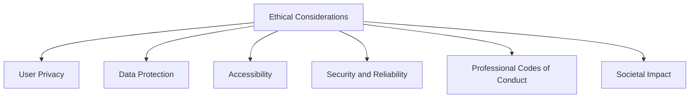

## 24.9 Ethical Considerations in Software Development

In the rapidly evolving world of software development, ethical considerations have become increasingly important. As developers, we hold the power to shape the digital landscape, and with that power comes the responsibility to ensure that our creations are ethical, secure, and beneficial to society. This section delves into the ethical responsibilities of software developers, with a particular focus on Erlang applications. We will explore principles such as user privacy, data protection, and accessibility, and discuss how to approach ethical dilemmas in software development.

### Understanding Ethical Responsibilities

Ethical software development involves creating applications that respect user rights, protect data, and contribute positively to society. Here are some key principles to consider:

1. **User Privacy**: Protecting user privacy is paramount. This involves collecting only necessary data, ensuring data is stored securely, and being transparent about how data is used.

2. **Data Protection**: Implement robust security measures to protect data from unauthorized access and breaches. This includes encryption, secure authentication, and regular security audits.

3. **Accessibility**: Ensure that software is accessible to all users, including those with disabilities. This involves designing interfaces that are easy to navigate and providing alternative ways to access content.

4. **Security and Reliability**: Write secure and reliable software that users can trust. This includes following best practices for coding, testing, and deployment.

5. **Professional Codes of Conduct**: Adhere to professional codes of conduct, such as those provided by organizations like the ACM or IEEE. These codes provide guidelines for ethical behavior in software development.

6. **Societal Impact**: Consider the broader impact of software on society. This includes thinking about how software can be used for good and avoiding applications that could harm individuals or communities.

### User Privacy in Erlang Applications

Erlang, known for its concurrency and fault-tolerance, is often used in applications where user privacy is critical. Here are some considerations for ensuring privacy in Erlang applications:

- **Data Minimization**: Collect only the data that is necessary for the application to function. Avoid storing sensitive information unless absolutely required.

- **Anonymization**: Where possible, anonymize user data to protect privacy. This can involve removing personally identifiable information (PII) or using pseudonyms.

- **Transparency**: Be transparent with users about what data is collected and how it is used. Provide clear privacy policies and obtain user consent where necessary.

#### Code Example: Anonymizing User Data

```erlang
% Function to anonymize user data by removing PII
anonymize_user_data(UserData) ->
    % Remove fields containing PII
    maps:remove([name, email, phone], UserData).
```

### Data Protection Strategies

Data protection is a critical aspect of ethical software development. In Erlang, there are several strategies you can employ to protect user data:

- **Encryption**: Use encryption to protect data both at rest and in transit. Erlang's `crypto` module provides functions for implementing encryption.

- **Secure Authentication**: Implement secure authentication mechanisms, such as multi-factor authentication, to protect user accounts.

- **Regular Security Audits**: Conduct regular security audits to identify and address vulnerabilities in your application.

#### Code Example: Encrypting Data with Erlang's Crypto Module

```erlang
% Encrypt data using AES encryption
encrypt_data(Data, Key) ->
    crypto:block_encrypt(aes_cbc256, Key, <<0:128>>, Data).
```

### Ensuring Accessibility

Accessibility is about making software usable for everyone, including people with disabilities. Here are some ways to ensure accessibility in Erlang applications:

- **User Interface Design**: Design interfaces that are easy to navigate and understand. Use clear labels, large fonts, and high-contrast colors.

- **Alternative Access Methods**: Provide alternative ways to access content, such as screen readers or keyboard navigation.

- **Testing for Accessibility**: Test your application with users who have disabilities to identify and address accessibility issues.

### Ethical Dilemmas in Software Development

Software developers often face ethical dilemmas, such as balancing user privacy with business needs or deciding whether to implement features that could be misused. Here are some strategies for approaching these dilemmas:

- **Consult Stakeholders**: Involve stakeholders, including users, in decision-making processes to understand different perspectives.

- **Evaluate Impact**: Consider the potential impact of your decisions on users and society. Aim to minimize harm and maximize benefits.

- **Seek Guidance**: Refer to professional codes of conduct and seek guidance from peers or mentors when facing ethical dilemmas.

### Adhering to Professional Codes of Conduct

Professional codes of conduct provide guidelines for ethical behavior in software development. Here are some key principles from the ACM Code of Ethics:

- **Contribute to Society**: Aim to contribute positively to society and avoid harm.

- **Be Honest and Trustworthy**: Be honest in your work and build trust with users and colleagues.

- **Respect Privacy**: Respect the privacy of users and colleagues and protect confidential information.

- **Maintain Competence**: Continuously improve your skills and knowledge to provide high-quality work.

### The Broader Impact of Software on Society

Software has a profound impact on society, influencing everything from communication to healthcare. As developers, we have a responsibility to consider this impact and strive to create software that benefits society. Here are some ways to do this:

- **Promote Inclusivity**: Design software that is inclusive and accessible to all users, regardless of their background or abilities.

- **Support Sustainability**: Consider the environmental impact of your software and strive to minimize energy consumption and waste.

- **Encourage Positive Use**: Design software that encourages positive behavior and discourages misuse or harm.

### Conclusion

Ethical considerations are an essential part of software development. By focusing on user privacy, data protection, accessibility, and the broader impact of software on society, we can create applications that are not only functional but also ethical and beneficial. As we continue to develop software, let's remember our responsibility to users and society and strive to uphold the highest ethical standards.

### Try It Yourself

To reinforce your understanding of ethical considerations in software development, try the following exercises:

1. **Review a Privacy Policy**: Find a privacy policy for a popular application and evaluate it based on the principles discussed in this section. Consider how well it addresses user privacy and transparency.

2. **Conduct a Security Audit**: Choose an Erlang application and conduct a security audit. Identify potential vulnerabilities and suggest improvements.

3. **Test for Accessibility**: Test an application for accessibility using tools like screen readers or keyboard navigation. Identify any issues and suggest ways to improve accessibility.

4. **Discuss an Ethical Dilemma**: Think of an ethical dilemma you have faced or might face in software development. Discuss it with a colleague or mentor and consider different approaches to resolving it.

### Visualizing Ethical Considerations

Below is a diagram illustrating the key ethical considerations in software development:



This diagram highlights the interconnected nature of ethical considerations and their importance in software development.

### References and Further Reading

- [ACM Code of Ethics](https://www.acm.org/code-of-ethics)
- [IEEE Code of Ethics](https://www.ieee.org/about/corporate/governance/p7-8.html)
- [W3C Web Accessibility Initiative](https://www.w3.org/WAI/)
- [GDPR Compliance](https://gdpr.eu/)
- [OWASP Top Ten Security Risks](https://owasp.org/www-project-top-ten/)

### Knowledge Check

Reflect on the following questions to test your understanding of ethical considerations in software development:

- What are the key principles of ethical software development?
- How can you ensure user privacy in Erlang applications?
- What strategies can you use to protect data in your applications?
- Why is accessibility important, and how can you ensure your software is accessible?
- How can professional codes of conduct guide ethical decision-making?

### Embrace the Journey

Remember, ethical software development is an ongoing journey. As you continue to develop your skills and knowledge, keep these ethical considerations in mind and strive to create software that is not only functional but also ethical and beneficial to society. Keep experimenting, stay curious, and enjoy the journey!

## Quiz: Ethical Considerations in Software Development



### Which of the following is a key principle of ethical software development?

- [x] User Privacy
- [ ] Profit Maximization
- [ ] Feature Overload
- [ ] Rapid Deployment

> **Explanation:** User privacy is a fundamental principle of ethical software development, ensuring that user data is protected and used responsibly.

### What is an effective way to protect user data in Erlang applications?

- [x] Encryption
- [ ] Storing data in plain text
- [ ] Ignoring security updates
- [ ] Disabling authentication

> **Explanation:** Encryption is a crucial method for protecting user data, ensuring that it remains secure both at rest and in transit.

### How can you ensure accessibility in your software?

- [x] Design interfaces that are easy to navigate
- [ ] Use complex navigation structures
- [ ] Ignore user feedback
- [ ] Prioritize aesthetics over functionality

> **Explanation:** Designing interfaces that are easy to navigate is essential for ensuring accessibility, making software usable for all users.

### What should you do when facing an ethical dilemma in software development?

- [x] Consult stakeholders
- [ ] Make a decision without input
- [ ] Ignore the dilemma
- [ ] Prioritize profit

> **Explanation:** Consulting stakeholders helps gather diverse perspectives and make informed decisions when facing ethical dilemmas.

### Which of the following is part of adhering to professional codes of conduct?

- [x] Respect Privacy
- [ ] Prioritize speed over quality
- [ ] Ignore user feedback
- [ ] Focus solely on technical skills

> **Explanation:** Respecting privacy is a key aspect of adhering to professional codes of conduct, ensuring that user data is handled responsibly.

### What is a potential impact of software on society?

- [x] Promoting inclusivity
- [ ] Increasing inequality
- [ ] Encouraging negative behavior
- [ ] Limiting access to information

> **Explanation:** Software can promote inclusivity by being accessible and beneficial to all users, regardless of their background or abilities.

### How can you ensure your software is secure and reliable?

- [x] Follow best practices for coding and testing
- [ ] Skip testing to save time
- [ ] Use outdated libraries
- [ ] Ignore security vulnerabilities

> **Explanation:** Following best practices for coding and testing is essential for ensuring that software is secure and reliable.

### Why is transparency important in software development?

- [x] It builds trust with users
- [ ] It complicates user interactions
- [ ] It reduces accountability
- [ ] It hides important information

> **Explanation:** Transparency builds trust with users by clearly communicating how their data is collected and used.

### What is a benefit of conducting regular security audits?

- [x] Identifying and addressing vulnerabilities
- [ ] Ignoring potential threats
- [ ] Reducing development time
- [ ] Increasing complexity

> **Explanation:** Regular security audits help identify and address vulnerabilities, ensuring that software remains secure over time.

### True or False: Ethical software development is only concerned with technical aspects.

- [ ] True
- [x] False

> **Explanation:** Ethical software development encompasses both technical and non-technical aspects, including user privacy, data protection, and societal impact.




