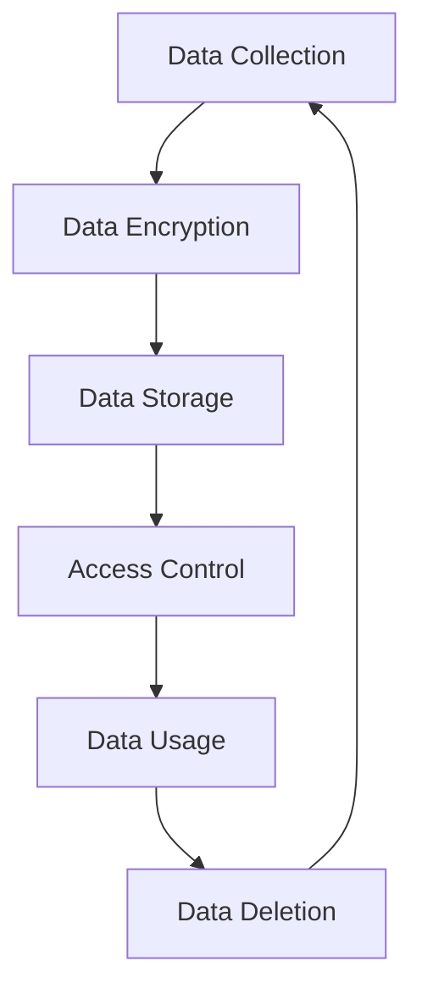

## 25.1 Understanding Compliance Requirements (e.g., GDPR, HIPAA)

In today's rapidly evolving digital landscape, understanding compliance requirements is crucial for software developers. Regulatory frameworks like the General Data Protection Regulation (GDPR) and the Health Insurance Portability and Accountability Act (HIPAA) play a significant role in shaping how software is developed, deployed, and maintained. This section delves into the essence of regulatory compliance, providing insights into key regulations, their implications, and best practices for ensuring compliance in software development.

### What is Regulatory Compliance in Software?

Regulatory compliance in software refers to the adherence to laws, regulations, guidelines, and specifications relevant to business processes. In the context of software development, it involves ensuring that applications and systems meet the legal standards set by governing bodies. Compliance is not just about avoiding penalties; it's about building trust with users by safeguarding their data and privacy.

### Overview of Key Regulations

#### General Data Protection Regulation (GDPR)

The GDPR is a comprehensive data protection law enacted by the European Union (EU) to protect the privacy and personal data of EU citizens. It applies to all companies processing the personal data of individuals residing in the EU, regardless of the company's location.

**Key Aspects of GDPR:**

- **Data Protection Principles**: GDPR outlines principles such as lawfulness, fairness, transparency, purpose limitation, data minimization, accuracy, storage limitation, integrity, and confidentiality.
- **Rights of Data Subjects**: Individuals have rights such as access to their data, rectification, erasure (right to be forgotten), restriction of processing, data portability, and objection.
- **Data Breach Notifications**: Organizations must notify the relevant supervisory authority within 72 hours of becoming aware of a data breach.
- **Data Protection Officers (DPOs)**: Certain organizations are required to appoint a DPO to oversee data protection strategies and compliance.

#### Health Insurance Portability and Accountability Act (HIPAA)

HIPAA is a U.S. law designed to provide privacy standards to protect patients' medical records and other health information provided to health plans, doctors, hospitals, and other healthcare providers.

**Key Aspects of HIPAA:**

- **Privacy Rule**: Establishes national standards for the protection of individually identifiable health information.
- **Security Rule**: Sets standards for the protection of electronic protected health information (ePHI) that is created, received, used, or maintained.
- **Breach Notification Rule**: Requires covered entities to notify affected individuals, the Secretary of Health and Human Services, and, in some cases, the media of a breach of unsecured PHI.

#### Other Relevant Regulations

- **California Consumer Privacy Act (CCPA)**: A state statute intended to enhance privacy rights and consumer protection for residents of California, USA.
- **Payment Card Industry Data Security Standard (PCI DSS)**: A set of security standards designed to ensure that all companies that accept, process, store, or transmit credit card information maintain a secure environment.

### Implications of Non-Compliance

Non-compliance with regulatory requirements can lead to severe consequences, including:

- **Legal Repercussions**: Organizations may face lawsuits, fines, and penalties. For instance, GDPR violations can result in fines up to €20 million or 4% of the annual global turnover, whichever is higher.
- **Financial Losses**: Beyond fines, non-compliance can lead to financial losses due to reputational damage, loss of customer trust, and operational disruptions.
- **Operational Challenges**: Non-compliance can result in increased scrutiny from regulators, leading to operational challenges and the need for corrective actions.

### Proactive Learning and Staying Updated

To navigate the complex landscape of compliance, developers and organizations must engage in proactive learning and stay updated on regulatory changes. Here are some strategies:

- **Continuous Education**: Attend workshops, webinars, and training sessions focused on compliance and data protection.
- **Subscribe to Regulatory Updates**: Follow updates from regulatory bodies and industry experts to stay informed about changes in compliance requirements.
- **Leverage Technology**: Use compliance management software to automate compliance processes and monitor adherence to regulations.
- **Engage with Legal Experts**: Collaborate with legal experts to understand the implications of regulations and ensure that software development practices align with legal requirements.

### Resources for Staying Updated

- **Official Regulatory Websites**: Visit the official websites of regulatory bodies such as the European Data Protection Board (EDPB) and the U.S. Department of Health & Human Services (HHS) for authoritative information.
- **Industry Publications**: Subscribe to industry publications and newsletters that focus on compliance and data protection.
- **Professional Networks**: Join professional networks and forums where compliance professionals share insights and best practices.

### Code Examples: Implementing Compliance in Erlang

Let's explore how we can implement some compliance-related features in Erlang. We'll focus on data encryption, a critical aspect of both GDPR and HIPAA compliance.

```erlang
-module(data_security).
-export([encrypt_data/2, decrypt_data/2]).

% Import the crypto module for encryption and decryption
-include_lib("crypto/include/crypto.hrl").

% Function to encrypt data using AES algorithm
encrypt_data(Key, PlainText) ->
    % Generate a random initialization vector (IV)
    IV = crypto:strong_rand_bytes(16),
    % Encrypt the plaintext using the key and IV
    {ok, CipherText} = crypto:block_encrypt(aes_cbc256, Key, IV, PlainText),
    % Return the IV and ciphertext
    {IV, CipherText}.

% Function to decrypt data using AES algorithm
decrypt_data(Key, {IV, CipherText}) ->
    % Decrypt the ciphertext using the key and IV
    {ok, PlainText} = crypto:block_decrypt(aes_cbc256, Key, IV, CipherText),
    % Return the plaintext
    PlainText.
```

**Explanation:**

- **AES Encryption**: We use the AES algorithm for encrypting and decrypting data. This is a common practice for protecting sensitive information.
- **Initialization Vector (IV)**: A random IV is generated for each encryption operation to ensure that the same plaintext will result in different ciphertexts, enhancing security.

### Try It Yourself

Experiment with the code by modifying the encryption key or plaintext. Observe how changes affect the output and consider how this encryption mechanism can be integrated into larger systems to ensure data security.

### Visualizing Compliance Processes

To better understand the compliance process, let's visualize the data protection workflow using a Mermaid.js flowchart.



**Description**: This flowchart represents a typical data protection workflow, starting from data collection, followed by encryption, storage, access control, usage, and eventual deletion.

### Knowledge Check

- **Question**: What are the key principles of GDPR?
- **Question**: How does HIPAA's Security Rule differ from its Privacy Rule?
- **Question**: What are the potential consequences of non-compliance with GDPR?

### Summary

Understanding compliance requirements is essential for developing secure and trustworthy software. By familiarizing ourselves with regulations like GDPR and HIPAA, we can ensure that our applications not only meet legal standards but also protect user data effectively. Remember, compliance is an ongoing process that requires continuous learning and adaptation.

### Embrace the Journey

As we continue to explore the world of compliance, let's remain curious and proactive. The landscape of regulations is ever-changing, and staying informed is key to success. Keep experimenting, engage with the community, and enjoy the journey of building compliant software!

## Quiz: Understanding Compliance Requirements (e.g., GDPR, HIPAA)



### What is the primary purpose of GDPR?

- [x] To protect the privacy and personal data of EU citizens
- [ ] To regulate financial transactions in the EU
- [ ] To standardize software development practices
- [ ] To enforce copyright laws

> **Explanation:** GDPR is designed to protect the privacy and personal data of individuals residing in the EU.

### Which of the following is a key aspect of HIPAA?

- [ ] Data portability
- [x] Privacy Rule
- [ ] Right to be forgotten
- [ ] Data minimization

> **Explanation:** HIPAA's Privacy Rule establishes national standards for the protection of individually identifiable health information.

### What is a potential consequence of non-compliance with GDPR?

- [ ] Increased customer trust
- [x] Legal penalties and fines
- [ ] Enhanced data security
- [ ] Improved software performance

> **Explanation:** Non-compliance with GDPR can result in legal penalties and fines.

### What is the role of a Data Protection Officer (DPO) under GDPR?

- [x] To oversee data protection strategies and compliance
- [ ] To manage financial transactions
- [ ] To develop software applications
- [ ] To enforce copyright laws

> **Explanation:** A DPO is responsible for overseeing data protection strategies and ensuring compliance with GDPR.

### Which regulation focuses on the protection of credit card information?

- [ ] GDPR
- [ ] HIPAA
- [x] PCI DSS
- [ ] CCPA

> **Explanation:** PCI DSS is a set of security standards designed to protect credit card information.

### What is the significance of an Initialization Vector (IV) in data encryption?

- [x] It ensures that the same plaintext results in different ciphertexts
- [ ] It increases the speed of encryption
- [ ] It reduces the size of the encrypted data
- [ ] It simplifies the encryption process

> **Explanation:** An IV ensures that the same plaintext will result in different ciphertexts, enhancing security.

### How often must organizations notify authorities of a data breach under GDPR?

- [ ] Within 24 hours
- [ ] Within 48 hours
- [x] Within 72 hours
- [ ] Within one week

> **Explanation:** GDPR requires organizations to notify the relevant supervisory authority within 72 hours of becoming aware of a data breach.

### What is the purpose of the Breach Notification Rule under HIPAA?

- [x] To require notification of affected individuals and authorities in case of a breach
- [ ] To standardize encryption methods
- [ ] To regulate financial transactions
- [ ] To enforce copyright laws

> **Explanation:** The Breach Notification Rule requires covered entities to notify affected individuals and authorities in case of a breach of unsecured PHI.

### Which of the following is a proactive strategy for staying updated on compliance matters?

- [x] Attending workshops and training sessions
- [ ] Ignoring regulatory updates
- [ ] Relying solely on outdated resources
- [ ] Avoiding collaboration with legal experts

> **Explanation:** Attending workshops and training sessions is a proactive strategy for staying updated on compliance matters.

### True or False: Compliance is a one-time process that does not require continuous adaptation.

- [ ] True
- [x] False

> **Explanation:** Compliance is an ongoing process that requires continuous learning and adaptation to stay aligned with changing regulations.




