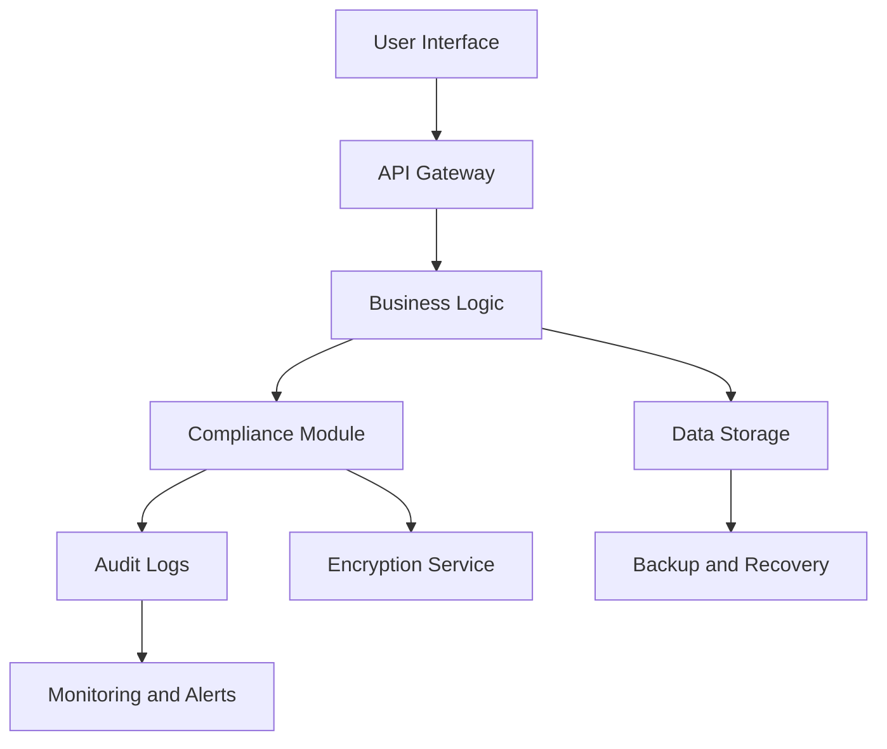

## 25.10 Case Studies in Regulated Industries

In this section, we delve into the application of Erlang in regulated industries, focusing on finance, healthcare, and telecommunications. These industries are characterized by stringent compliance requirements, which necessitate robust, scalable, and fault-tolerant systems. Erlang, with its inherent strengths in concurrency and reliability, provides a compelling solution for these challenges. Through detailed case studies, we will explore how Erlang has been leveraged to meet compliance requirements, the lessons learned, and best practices that can be applied to your own projects.

### Case Study 1: Financial Services

#### Compliance Requirements

In the financial sector, compliance with regulations such as the General Data Protection Regulation (GDPR), Payment Card Industry Data Security Standard (PCI DSS), and Sarbanes-Oxley Act (SOX) is critical. These regulations mandate strict data protection, transaction security, and auditability.

#### Erlang's Role

Erlang's ability to handle massive concurrency makes it ideal for financial applications that require real-time transaction processing and monitoring. Its "let it crash" philosophy ensures that systems can recover gracefully from failures, maintaining uptime and reliability.

**Key Features Utilized:**

- **Concurrency:** Erlang's lightweight processes allow for handling thousands of transactions simultaneously.
- **Fault Tolerance:** With OTP's supervision trees, systems can recover from failures without downtime.
- **Hot Code Swapping:** Enables updates without stopping the system, crucial for maintaining compliance without interrupting service.

#### Implementation Example

```erlang
-module(financial_service).
-behaviour(gen_server).

%% API
-export([start_link/0, process_transaction/1]).

%% gen_server callbacks
-export([init/1, handle_call/3, handle_cast/2, terminate/2, code_change/3]).

start_link() ->
    gen_server:start_link({local, ?MODULE}, ?MODULE, [], []).

process_transaction(Transaction) ->
    gen_server:call(?MODULE, {process, Transaction}).

init([]) ->
    {ok, #state{transactions = []}}.

handle_call({process, Transaction}, _From, State) ->
    %% Validate and process transaction
    {reply, ok, State#state{transactions = [Transaction | State#state.transactions]}}.

handle_cast(_Msg, State) ->
    {noreply, State}.

terminate(_Reason, _State) ->
    ok.

code_change(_OldVsn, State, _Extra) ->
    {ok, State}.
```

#### Lessons Learned

- **Scalability:** Erlang's architecture supports scaling both vertically and horizontally, essential for handling increased transaction loads.
- **Security:** Implementing encryption and secure communication channels is straightforward with Erlang's `crypto` and `ssl` modules.
- **Auditability:** Erlang's logging and tracing capabilities facilitate compliance with audit requirements.

#### Best Practices

- **Regular Audits:** Conduct regular security and compliance audits to ensure adherence to regulations.
- **Continuous Monitoring:** Implement real-time monitoring to detect and respond to anomalies promptly.
- **Data Encryption:** Use strong encryption for data at rest and in transit to protect sensitive information.

### Case Study 2: Healthcare Systems

#### Compliance Requirements

Healthcare systems must comply with regulations like the Health Insurance Portability and Accountability Act (HIPAA) and the Health Information Technology for Economic and Clinical Health Act (HITECH), which focus on patient data privacy and security.

#### Erlang's Role

Erlang's robustness and fault tolerance are critical in healthcare applications where system downtime can have severe consequences. Its ability to handle distributed systems makes it suitable for managing patient data across multiple locations.

**Key Features Utilized:**

- **Distributed Systems:** Erlang's distributed nature allows for seamless data sharing across healthcare facilities.
- **Fault Tolerance:** Ensures continuous operation even in the event of hardware or software failures.
- **Concurrency:** Supports real-time data processing for patient monitoring and diagnostics.

#### Implementation Example

```erlang
-module(healthcare_system).
-behaviour(gen_server).

%% API
-export([start_link/0, update_patient_record/2]).

%% gen_server callbacks
-export([init/1, handle_call/3, handle_cast/2, terminate/2, code_change/3]).

start_link() ->
    gen_server:start_link({local, ?MODULE}, ?MODULE, [], []).

update_patient_record(PatientId, Record) ->
    gen_server:call(?MODULE, {update, PatientId, Record}).

init([]) ->
    {ok, #state{records = #{}}}.

handle_call({update, PatientId, Record}, _From, State) ->
    %% Update patient record
    NewRecords = maps:put(PatientId, Record, State#state.records),
    {reply, ok, State#state{records = NewRecords}}.

handle_cast(_Msg, State) ->
    {noreply, State}.

terminate(_Reason, _State) ->
    ok.

code_change(_OldVsn, State, _Extra) ->
    {ok, State}.
```

#### Lessons Learned

- **Data Privacy:** Implement strict access controls and audit trails to protect patient data.
- **Interoperability:** Ensure systems can communicate with other healthcare applications and devices.
- **Reliability:** Design systems to handle failures gracefully, ensuring continuous availability.

#### Best Practices

- **Access Control:** Implement role-based access control to limit data access to authorized personnel.
- **Data Encryption:** Encrypt patient data both at rest and in transit.
- **Regular Updates:** Keep systems updated with the latest security patches and compliance requirements.

### Case Study 3: Telecommunications

#### Compliance Requirements

Telecommunications companies must comply with regulations such as the Federal Communications Commission (FCC) rules and the European Telecommunications Standards Institute (ETSI) standards, which focus on data privacy, security, and service availability.

#### Erlang's Role

Erlang's origins in telecommunications make it a natural fit for building scalable, reliable systems that handle high volumes of concurrent calls and messages.

**Key Features Utilized:**

- **Scalability:** Erlang's architecture supports massive scalability, essential for handling millions of users.
- **Reliability:** With built-in fault tolerance, systems can maintain service availability even during failures.
- **Real-Time Processing:** Supports real-time call processing and message handling.

#### Implementation Example

```erlang
-module(telecom_service).
-behaviour(gen_server).

%% API
-export([start_link/0, handle_call/2]).

%% gen_server callbacks
-export([init/1, handle_call/3, handle_cast/2, terminate/2, code_change/3]).

start_link() ->
    gen_server:start_link({local, ?MODULE}, ?MODULE, [], []).

handle_call(CallData) ->
    gen_server:call(?MODULE, {call, CallData}).

init([]) ->
    {ok, #state{calls = []}}.

handle_call({call, CallData}, _From, State) ->
    %% Process call data
    {reply, ok, State#state{calls = [CallData | State#state.calls]}}.

handle_cast(_Msg, State) ->
    {noreply, State}.

terminate(_Reason, _State) ->
    ok.

code_change(_OldVsn, State, _Extra) ->
    {ok, State}.
```

#### Lessons Learned

- **Scalability:** Design systems to scale horizontally to accommodate growing user bases.
- **Security:** Implement strong authentication and encryption to protect user data.
- **Compliance:** Stay updated with regulatory changes and ensure systems remain compliant.

#### Best Practices

- **Network Security:** Use firewalls and intrusion detection systems to protect against unauthorized access.
- **Data Encryption:** Encrypt communications to protect user privacy.
- **Regular Compliance Checks:** Conduct regular compliance checks to ensure adherence to regulations.

### Visualizing Compliance Solutions

To better understand how Erlang's features are applied in these industries, let's visualize the architecture of a typical Erlang-based compliance solution.



**Diagram Description:** This diagram illustrates a typical Erlang-based compliance solution architecture. The user interface interacts with the API gateway, which routes requests to the business logic. The business logic communicates with data storage and the compliance module, which handles audit logs and encryption services. Monitoring and alerts ensure system health and compliance.

### Key Takeaways

- **Erlang's Strengths:** Erlang's concurrency, fault tolerance, and scalability make it ideal for regulated industries.
- **Compliance Challenges:** Understanding and addressing compliance requirements is crucial for success.
- **Best Practices:** Implementing best practices in security, scalability, and reliability ensures compliance and system robustness.

### Try It Yourself

Experiment with the provided code examples by modifying them to handle different types of data or transactions. Consider implementing additional features such as logging, encryption, or access control to enhance compliance.

### References and Links

- [GDPR Compliance](https://gdpr-info.eu/)
- [HIPAA Compliance](https://www.hhs.gov/hipaa/index.html)
- [FCC Regulations](https://www.fcc.gov/regulations)

## Quiz: Case Studies in Regulated Industries



### Which Erlang feature is crucial for handling massive concurrency in financial applications?

- [x] Lightweight processes
- [ ] Hot code swapping
- [ ] Fault tolerance
- [ ] Distributed systems

> **Explanation:** Erlang's lightweight processes allow it to handle massive concurrency, which is crucial for financial applications that require real-time transaction processing.

### What is a key benefit of Erlang's "let it crash" philosophy?

- [x] Ensures systems can recover gracefully from failures
- [ ] Enables hot code swapping
- [ ] Supports real-time processing
- [ ] Facilitates data encryption

> **Explanation:** The "let it crash" philosophy ensures that systems can recover gracefully from failures, maintaining uptime and reliability.

### Which Erlang feature is particularly beneficial for healthcare systems requiring distributed data sharing?

- [ ] Hot code swapping
- [ ] Fault tolerance
- [x] Distributed systems
- [ ] Lightweight processes

> **Explanation:** Erlang's distributed systems capability allows for seamless data sharing across healthcare facilities, which is essential for managing patient data.

### In telecommunications, what Erlang feature supports handling high volumes of concurrent calls?

- [ ] Hot code swapping
- [x] Scalability
- [ ] Fault tolerance
- [ ] Real-time processing

> **Explanation:** Erlang's scalability supports handling high volumes of concurrent calls, making it ideal for telecommunications.

### What is a best practice for ensuring data privacy in healthcare systems?

- [x] Implementing role-based access control
- [ ] Using lightweight processes
- [ ] Conducting regular compliance checks
- [ ] Implementing hot code swapping

> **Explanation:** Implementing role-based access control limits data access to authorized personnel, ensuring data privacy.

### Which Erlang feature allows updates without stopping the system?

- [ ] Fault tolerance
- [x] Hot code swapping
- [ ] Lightweight processes
- [ ] Distributed systems

> **Explanation:** Hot code swapping enables updates without stopping the system, crucial for maintaining compliance without interrupting service.

### What is a common compliance requirement in the financial sector?

- [x] Data protection
- [ ] Real-time processing
- [ ] Role-based access control
- [ ] Distributed systems

> **Explanation:** Data protection is a common compliance requirement in the financial sector, mandated by regulations such as GDPR and PCI DSS.

### Which Erlang feature supports real-time data processing in healthcare systems?

- [ ] Hot code swapping
- [ ] Fault tolerance
- [x] Concurrency
- [ ] Distributed systems

> **Explanation:** Erlang's concurrency supports real-time data processing, which is essential for patient monitoring and diagnostics.

### What is a key lesson learned from using Erlang in telecommunications?

- [x] Design systems to scale horizontally
- [ ] Implement role-based access control
- [ ] Conduct regular compliance checks
- [ ] Use lightweight processes

> **Explanation:** Designing systems to scale horizontally accommodates growing user bases, a key lesson learned from using Erlang in telecommunications.

### True or False: Erlang's fault tolerance ensures continuous operation even in the event of hardware or software failures.

- [x] True
- [ ] False

> **Explanation:** Erlang's fault tolerance ensures continuous operation even in the event of hardware or software failures, making it ideal for regulated industries.



Remember, this is just the beginning. As you progress, you'll build more complex and interactive systems. Keep experimenting, stay curious, and enjoy the journey!
