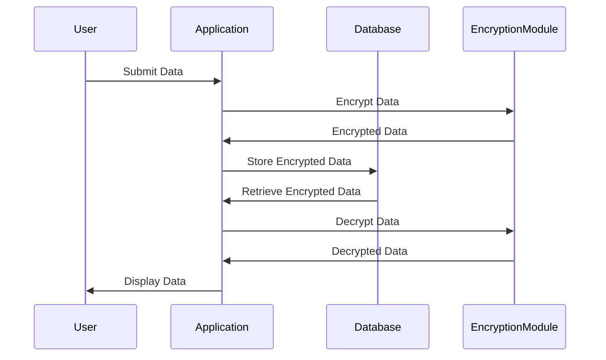

## 25.2 Data Protection and Privacy in Erlang Applications

In today's digital age, data protection and privacy have become paramount concerns for developers and organizations alike. As we delve into the world of Erlang applications, it is crucial to understand how to handle personal and sensitive data responsibly. This section will guide you through best practices, techniques, and principles to ensure your Erlang applications align with legal requirements and protect user privacy.

### Understanding Data Protection and Privacy

Data protection refers to the practices and processes put in place to safeguard personal data from unauthorized access, use, disclosure, disruption, modification, or destruction. Privacy, on the other hand, is about ensuring that individuals have control over their personal information and how it is used.

#### Key Concepts

- **Personal Data**: Any information relating to an identified or identifiable person.
- **Sensitive Data**: Data that requires extra protection, such as health information, financial details, or biometric data.
- **Data Minimization**: The principle of collecting only the data necessary for a specific purpose.
- **Anonymization**: The process of removing personally identifiable information from data sets.

### Best Practices for Handling Personal and Sensitive Data

1. **Data Minimization**

   - **Collect Only What You Need**: Implement data minimization by collecting only the data necessary for your application's functionality.
   - **Regularly Review Data**: Periodically review the data you collect and store to ensure it remains relevant and necessary.

2. **Anonymization and Pseudonymization**

   - **Anonymize Data**: Use techniques to remove personally identifiable information from data sets.
   - **Pseudonymize Data**: Replace private identifiers with fake identifiers or pseudonyms to protect user identities.

3. **User Consent and Transparency**

   - **Obtain Explicit Consent**: Ensure users provide explicit consent before collecting their data.
   - **Be Transparent**: Clearly communicate how user data will be used, stored, and shared.

4. **Privacy by Design**

   - **Integrate Privacy from the Start**: Incorporate privacy considerations into the design and architecture of your application from the outset.
   - **Conduct Privacy Impact Assessments**: Regularly assess the privacy implications of your application and make necessary adjustments.

### Implementing Data Minimization and Anonymization in Erlang

Let's explore how to implement data minimization and anonymization in Erlang applications with practical examples.

#### Data Minimization Example

```erlang
-module(data_minimization).
-export([collect_user_data/1]).

% Function to collect only necessary user data
collect_user_data(UserInput) ->
    % Extract only the necessary fields
    {Name, Email} = {maps:get(name, UserInput), maps:get(email, UserInput)},
    % Return minimized data
    #{name => Name, email => Email}.
```

In this example, we define a function `collect_user_data/1` that extracts only the necessary fields (`name` and `email`) from the user's input, demonstrating data minimization.

#### Anonymization Example

```erlang
-module(data_anonymization).
-export([anonymize_data/1]).

% Function to anonymize user data
anonymize_data(UserData) ->
    % Remove personally identifiable information
    #{name => "Anonymous", email => "anonymous@example.com", data => maps:get(data, UserData)}.
```

Here, the `anonymize_data/1` function replaces the user's name and email with generic values, effectively anonymizing the data.

### Encryption Techniques for Data Protection

Encryption is a critical component of data protection, ensuring that data remains secure both at rest and in transit.

#### Data at Rest Encryption

Data at rest refers to data stored on a device or server. Encrypting data at rest protects it from unauthorized access.

```erlang
-module(data_encryption).
-export([encrypt_data/1, decrypt_data/1]).

% Use Erlang's crypto module for encryption
encrypt_data(Data) ->
    Key = <<"my_secret_key">>,
    crypto:block_encrypt(aes_cbc256, Key, <<"initialization_vector">>, Data).

decrypt_data(EncryptedData) ->
    Key = <<"my_secret_key">>,
    crypto:block_decrypt(aes_cbc256, Key, <<"initialization_vector">>, EncryptedData).
```

In this example, we use Erlang's `crypto` module to encrypt and decrypt data using the AES algorithm.

#### Data in Transit Encryption

Data in transit refers to data being transmitted over a network. Encrypting data in transit ensures it cannot be intercepted or tampered with.

```erlang
-module(ssl_example).
-export([start_ssl_server/0]).

% Start an SSL server
start_ssl_server() ->
    ssl:start(),
    {ok, ListenSocket} = ssl:listen(443, [{certfile, "server_cert.pem"}, {keyfile, "server_key.pem"}]),
    accept_connections(ListenSocket).

accept_connections(ListenSocket) ->
    {ok, Socket} = ssl:transport_accept(ListenSocket),
    ssl:ssl_accept(Socket),
    spawn(fun() -> handle_connection(Socket) end),
    accept_connections(ListenSocket).

handle_connection(Socket) ->
    ssl:recv(Socket, 0),
    ssl:close(Socket).
```

This example demonstrates setting up an SSL server to encrypt data in transit using Erlang's `ssl` module.

### Importance of User Consent and Transparency

User consent and transparency are fundamental to building trust and ensuring compliance with data protection regulations.

#### Obtaining User Consent

- **Explicit Consent**: Use clear and concise language to obtain explicit consent from users before collecting their data.
- **Opt-In Mechanisms**: Implement opt-in mechanisms for data collection, allowing users to actively choose to share their data.

#### Transparency in Data Practices

- **Privacy Policies**: Provide comprehensive privacy policies that explain how user data is collected, used, and shared.
- **User Access**: Allow users to access, modify, or delete their data as required by data protection regulations.

### Incorporating Privacy by Design Principles

Privacy by design is an approach that integrates privacy into the development process from the beginning.

#### Key Principles

- **Proactive, Not Reactive**: Anticipate and prevent privacy risks before they occur.
- **Privacy as the Default Setting**: Ensure privacy settings are enabled by default.
- **End-to-End Security**: Implement strong security measures throughout the data lifecycle.

### Try It Yourself

Now that we've covered the basics, try modifying the code examples to suit your application's needs. Experiment with different encryption algorithms, or implement additional data minimization techniques. Remember, the goal is to protect user data while maintaining functionality.

### Visualizing Data Protection in Erlang Applications

To better understand the flow of data protection in Erlang applications, let's visualize the process using a sequence diagram.



This diagram illustrates the process of encrypting and decrypting data in an Erlang application, ensuring data protection at every step.

### References and Links

For further reading on data protection and privacy, consider the following resources:

- [General Data Protection Regulation (GDPR)](https://gdpr-info.eu/)
- [Erlang Crypto Module Documentation](https://erlang.org/doc/man/crypto.html)
- [SSL and TLS in Erlang](https://erlang.org/doc/apps/ssl/)

### Knowledge Check

- What is the difference between data minimization and anonymization?
- How can you ensure user consent is obtained before collecting data?
- Why is encryption important for data protection?

### Embrace the Journey

Remember, data protection and privacy are ongoing processes. As you develop your Erlang applications, continue to prioritize user privacy and stay informed about evolving regulations. Keep experimenting, stay curious, and enjoy the journey!

### Quiz: Data Protection and Privacy in Erlang Applications



### What is the primary goal of data minimization?

- [x] To collect only the data necessary for a specific purpose
- [ ] To collect as much data as possible
- [ ] To anonymize all collected data
- [ ] To encrypt all data

> **Explanation:** Data minimization aims to collect only the data necessary for a specific purpose, reducing the risk of data breaches and privacy violations.

### Which Erlang module is commonly used for encryption?

- [x] crypto
- [ ] ssl
- [ ] maps
- [ ] lists

> **Explanation:** The `crypto` module in Erlang provides functions for encryption and decryption.

### What is the purpose of anonymization?

- [x] To remove personally identifiable information from data sets
- [ ] To encrypt data
- [ ] To collect more data
- [ ] To ensure data integrity

> **Explanation:** Anonymization involves removing personally identifiable information from data sets to protect user privacy.

### How can user consent be obtained effectively?

- [x] By using clear and concise language
- [ ] By collecting data without informing users
- [ ] By using complex legal jargon
- [ ] By assuming consent

> **Explanation:** User consent should be obtained using clear and concise language to ensure users understand what they are agreeing to.

### What is a key principle of privacy by design?

- [x] Privacy as the default setting
- [ ] Collecting as much data as possible
- [ ] Ignoring user consent
- [ ] Delaying privacy considerations

> **Explanation:** Privacy by design emphasizes privacy as the default setting, ensuring users' data is protected by default.

### What is the role of the `ssl` module in Erlang?

- [x] To encrypt data in transit
- [ ] To encrypt data at rest
- [ ] To anonymize data
- [ ] To collect user data

> **Explanation:** The `ssl` module in Erlang is used to encrypt data in transit, ensuring secure communication over networks.

### Why is transparency important in data practices?

- [x] To build trust with users
- [ ] To collect more data
- [ ] To avoid encryption
- [ ] To anonymize data

> **Explanation:** Transparency in data practices helps build trust with users by clearly communicating how their data is used and protected.

### What is the benefit of using pseudonymization?

- [x] It protects user identities by replacing private identifiers with pseudonyms
- [ ] It encrypts data
- [ ] It collects more data
- [ ] It ensures data integrity

> **Explanation:** Pseudonymization protects user identities by replacing private identifiers with pseudonyms, enhancing privacy.

### What should be included in a privacy policy?

- [x] How user data is collected, used, and shared
- [ ] Complex legal jargon
- [ ] Encryption algorithms
- [ ] Anonymization techniques

> **Explanation:** A privacy policy should clearly explain how user data is collected, used, and shared to ensure transparency and compliance.

### True or False: Privacy by design should be integrated into the development process from the beginning.

- [x] True
- [ ] False

> **Explanation:** Privacy by design should be integrated into the development process from the beginning to proactively address privacy concerns.



By following these guidelines and best practices, you can ensure that your Erlang applications prioritize data protection and privacy, building trust with users and complying with legal requirements.
