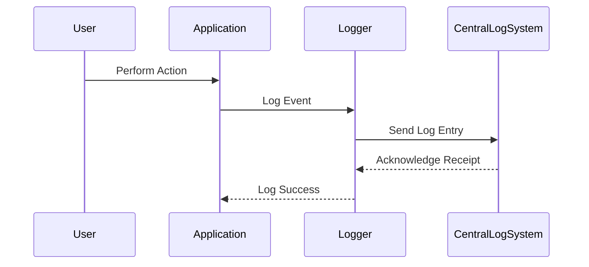

## 25.3 Audit Logging and Monitoring

In today's digital landscape, audit logging and monitoring are essential components of any robust security strategy. They not only help in meeting compliance standards but also play a crucial role in detecting and responding to security incidents. In this section, we will explore how to implement effective audit logging and monitoring in Erlang applications, ensuring that your systems are both secure and compliant.

### Understanding Audit Logging

Audit logs are records of events that occur within a system. They provide a trail of user actions and system events that can be used to detect anomalies, investigate incidents, and demonstrate compliance with regulatory requirements. 

#### Purpose of Audit Logs

1. **Compliance**: Many regulations, such as GDPR, HIPAA, and PCI-DSS, require organizations to maintain detailed logs of user activities and system events.
2. **Security**: Audit logs help in identifying unauthorized access and potential security breaches.
3. **Operational Insight**: Logs provide valuable insights into system performance and user behavior, aiding in optimization and troubleshooting.

### Guidelines for Logging User Actions and System Events

When implementing audit logging, it's important to follow best practices to ensure that logs are comprehensive, secure, and useful.

#### Key Considerations

- **Identify What to Log**: Determine which events are critical to log. This typically includes user logins, data access, configuration changes, and system errors.
- **Ensure Log Integrity**: Protect logs from tampering by using secure storage and access controls.
- **Maintain Log Consistency**: Use a consistent format for logs to facilitate analysis and correlation.
- **Consider Log Retention**: Define a retention policy that balances compliance requirements with storage costs.

#### Sample Erlang Code for Logging

Below is an example of how you might implement a simple logging mechanism in Erlang:

```erlang
-module(audit_logger).
-export([log_event/2]).

% Log an event with a timestamp
log_event(EventType, Details) ->
    Timestamp = calendar:universal_time(),
    LogEntry = {Timestamp, EventType, Details},
    io:format("~p~n", [LogEntry]),
    % Here you would typically write the log entry to a file or a database
    ok.
```

### Tools and Frameworks for Centralized Logging and Analysis

Centralized logging solutions allow you to aggregate logs from multiple sources, making it easier to analyze and correlate events across your system.

#### Popular Tools

- **Logstash**: A powerful tool for collecting, processing, and forwarding logs.
- **Elasticsearch**: A search engine that can be used to store and analyze logs.
- **Kibana**: A visualization tool that works with Elasticsearch to provide insights into log data.

#### Integrating Erlang with Centralized Logging

To integrate Erlang applications with centralized logging solutions, you can use libraries such as `lager` or `logger`. These libraries provide structured logging capabilities and can be configured to send logs to external systems.

```erlang
% Example configuration for lager
{lager, [
    {handlers, [
        {lager_console_backend, info},
        {lager_file_backend, [
            {"error.log", error, 10485760, "$D0", 5},
            {"console.log", info, 10485760, "$D0", 5}
        ]}
    ]}
]}.
```

### Log Retention and Accessibility

Log retention policies are crucial for compliance and operational efficiency. They determine how long logs are kept and how they are accessed.

#### Best Practices

- **Define Retention Periods**: Set retention periods based on regulatory requirements and business needs.
- **Ensure Accessibility**: Make sure logs are easily accessible for audits and investigations.
- **Automate Archival and Deletion**: Use automated processes to archive old logs and delete them when they are no longer needed.

### Protecting Logs from Tampering

Logs must be protected from unauthorized access and tampering to ensure their integrity and reliability.

#### Security Measures

- **Access Controls**: Implement strict access controls to limit who can view or modify logs.
- **Encryption**: Use encryption to protect logs both in transit and at rest.
- **Integrity Checks**: Implement checksums or digital signatures to detect tampering.

### Visualizing Audit Logging and Monitoring

To better understand the flow of audit logging and monitoring, let's visualize the process using a sequence diagram.



This diagram illustrates how user actions are logged by the application and sent to a centralized logging system for analysis and storage.

### Knowledge Check

Before we conclude, let's reinforce what we've learned:

- **What are the key purposes of audit logs?**
- **How can you ensure the integrity of logs?**
- **What tools can be used for centralized logging in Erlang applications?**

### Conclusion

Audit logging and monitoring are critical components of any secure and compliant system. By implementing effective logging practices and using the right tools, you can gain valuable insights into your system's operations and ensure compliance with regulatory requirements. Remember, this is just the beginning. As you progress, you'll build more complex and secure systems. Keep experimenting, stay curious, and enjoy the journey!

## Quiz: Audit Logging and Monitoring



### What is the primary purpose of audit logs?

- [x] To provide a trail of user actions and system events
- [ ] To store user passwords securely
- [ ] To replace system backups
- [ ] To enhance the graphical user interface

> **Explanation:** Audit logs are used to record user actions and system events for compliance, security, and operational insights.

### Which of the following is NOT a best practice for logging?

- [ ] Ensuring log integrity
- [ ] Maintaining log consistency
- [x] Logging every single system event
- [ ] Defining log retention policies

> **Explanation:** Logging every single system event can lead to excessive data and make it difficult to find relevant information.

### What tool is commonly used for visualizing log data?

- [ ] Logstash
- [ ] Elasticsearch
- [x] Kibana
- [ ] Redis

> **Explanation:** Kibana is a visualization tool that works with Elasticsearch to provide insights into log data.

### How can you protect logs from tampering?

- [x] Implement access controls
- [ ] Store logs in plain text
- [ ] Allow all users to modify logs
- [ ] Disable logging

> **Explanation:** Implementing access controls helps protect logs from unauthorized access and tampering.

### What is a key benefit of centralized logging?

- [x] Easier analysis and correlation of events
- [ ] Increased storage costs
- [ ] Slower system performance
- [ ] Reduced data security

> **Explanation:** Centralized logging allows for easier analysis and correlation of events across multiple sources.

### Which Erlang library can be used for structured logging?

- [x] lager
- [ ] cowboy
- [ ] mochiweb
- [ ] rebar3

> **Explanation:** The `lager` library provides structured logging capabilities for Erlang applications.

### What should be considered when defining log retention policies?

- [x] Regulatory requirements
- [x] Business needs
- [ ] Personal preferences
- [ ] Random selection

> **Explanation:** Log retention policies should be based on regulatory requirements and business needs.

### What is a common method for ensuring log integrity?

- [x] Using checksums or digital signatures
- [ ] Deleting logs regularly
- [ ] Allowing public access to logs
- [ ] Storing logs in multiple locations

> **Explanation:** Checksums or digital signatures can be used to detect tampering and ensure log integrity.

### True or False: Encryption should be used to protect logs both in transit and at rest.

- [x] True
- [ ] False

> **Explanation:** Encryption helps protect logs from unauthorized access both during transmission and when stored.

### What is the role of the `logger` in the provided sequence diagram?

- [x] To log events and send them to the central logging system
- [ ] To perform user actions
- [ ] To replace the application
- [ ] To visualize log data

> **Explanation:** The `logger` logs events and sends them to the central logging system for analysis and storage.




