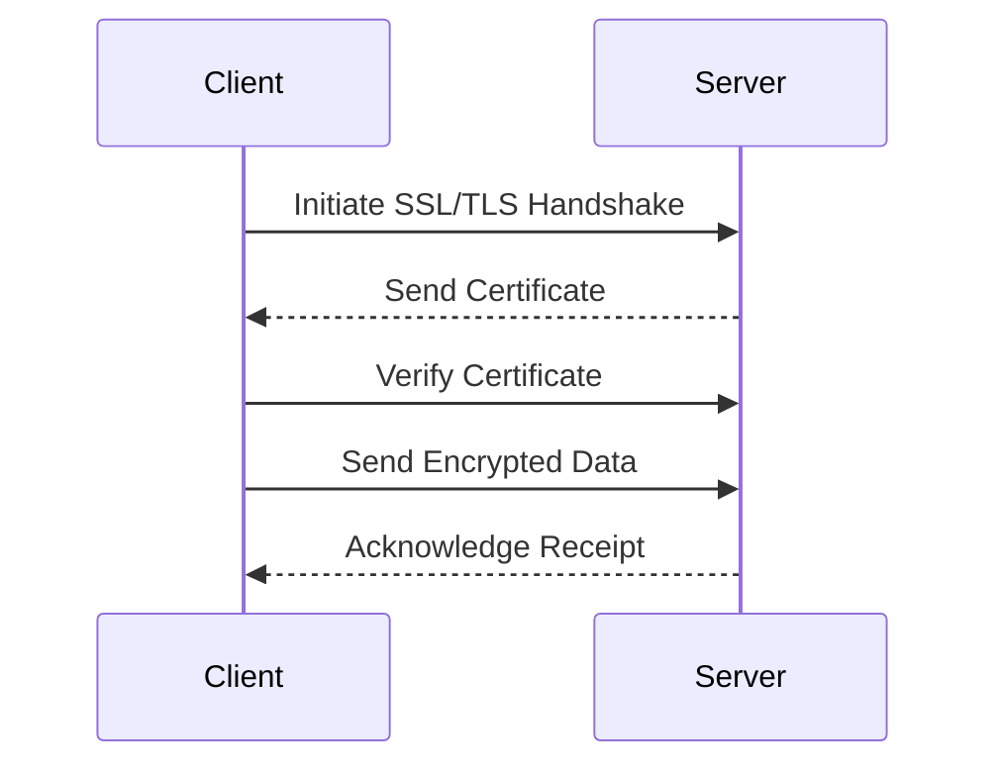

## 25.4 Secure Data Storage and Transmission

In today's digital landscape, securing data during storage and transmission is paramount to comply with regulatory requirements and protect sensitive information. This section delves into the methods and best practices for achieving secure data storage and transmission in Erlang applications. We will explore encryption techniques, key management practices, the use of SSL/TLS for secure communications, and strategies for securely storing data in databases and file systems. Additionally, we will discuss considerations for backup and recovery processes and the importance of regular security assessments.

### Introduction to Data Security

Data security involves protecting data from unauthorized access and corruption throughout its lifecycle. This includes securing data at rest (stored data) and data in transit (data being transmitted over networks). In Erlang applications, leveraging the language's concurrent and distributed nature can enhance security measures, but it also requires careful planning and implementation.

### Encryption Methods and Key Management

Encryption is the process of converting data into a coded format to prevent unauthorized access. It is a fundamental aspect of data security, both for data at rest and in transit.

#### Symmetric vs. Asymmetric Encryption

- **Symmetric Encryption**: Uses the same key for both encryption and decryption. It is fast and suitable for encrypting large amounts of data. However, key management can be challenging since the key must be shared securely between parties.
  
- **Asymmetric Encryption**: Uses a pair of keys (public and private) for encryption and decryption. It is more secure for key exchange but slower than symmetric encryption. It is often used to encrypt symmetric keys for secure transmission.

#### Implementing Encryption in Erlang

Erlang provides the `crypto` module, which offers a variety of cryptographic functions. Here's an example of using symmetric encryption with the AES algorithm:

```erlang
-module(encryption_example).
-export([encrypt/2, decrypt/2]).

% Encrypt data using AES
encrypt(Data, Key) ->
    IV = crypto:strong_rand_bytes(16), % Generate a random initialization vector
    {ok, CipherText} = crypto:block_encrypt(aes_cbc256, Key, IV, Data),
    {IV, CipherText}.

% Decrypt data using AES
decrypt({IV, CipherText}, Key) ->
    {ok, PlainText} = crypto:block_decrypt(aes_cbc256, Key, IV, CipherText),
    PlainText.
```

**Key Management Practices**

Effective key management is crucial for maintaining the security of encrypted data. Consider the following practices:

- **Key Rotation**: Regularly update encryption keys to minimize the risk of key compromise.
- **Secure Storage**: Store keys in a secure location, such as a hardware security module (HSM) or a secure key management service.
- **Access Control**: Limit access to encryption keys to authorized personnel only.

### Secure Communication with SSL/TLS

SSL (Secure Sockets Layer) and TLS (Transport Layer Security) are protocols that provide secure communication over a network. They encrypt data in transit, ensuring confidentiality and integrity.

#### Setting Up SSL/TLS in Erlang

Erlang's `ssl` module allows you to establish secure connections using SSL/TLS. Here's an example of setting up a secure server:

```erlang
-module(ssl_server).
-export([start/0]).

start() ->
    {ok, ListenSocket} = ssl:listen(8443, [{certfile, "server.crt"}, {keyfile, "server.key"}, {reuseaddr, true}]),
    accept(ListenSocket).

accept(ListenSocket) ->
    {ok, Socket} = ssl:transport_accept(ListenSocket),
    ssl:ssl_accept(Socket),
    spawn(fun() -> handle_connection(Socket) end),
    accept(ListenSocket).

handle_connection(Socket) ->
    ssl:recv(Socket, 0),
    ssl:send(Socket, "Hello, secure world!"),
    ssl:close(Socket).
```

**Considerations for SSL/TLS**

- **Certificate Management**: Use valid and trusted certificates. Regularly update and renew certificates to maintain trust.
- **Protocol Versions**: Use the latest versions of TLS to avoid vulnerabilities present in older versions.
- **Cipher Suites**: Choose strong cipher suites to ensure robust encryption.

### Secure Data Storage

Securing data at rest involves protecting stored data from unauthorized access and ensuring its integrity.

#### Database Security

When storing data in databases, consider the following security measures:

- **Encryption**: Encrypt sensitive data fields in the database. Use database-level encryption if supported.
- **Access Control**: Implement strict access controls and authentication mechanisms to restrict database access.
- **Audit Logging**: Enable audit logging to track access and modifications to the database.

#### File System Security

For data stored in file systems, apply these security practices:

- **File Encryption**: Encrypt files containing sensitive data. Use tools like `gpg` or `openssl` for file encryption.
- **Access Permissions**: Set appropriate file permissions to restrict access to authorized users only.
- **Regular Backups**: Perform regular backups of critical data and store them securely.

### Backup and Recovery Processes

Backup and recovery processes are essential for data protection and business continuity. Consider the following:

- **Regular Backups**: Schedule regular backups of critical data. Use automated tools to ensure consistency and reliability.
- **Secure Storage**: Store backups in a secure location, preferably offsite or in a cloud-based service with strong security measures.
- **Recovery Testing**: Regularly test recovery procedures to ensure data can be restored quickly and accurately in case of data loss.

### Security Assessments and Audits

Regular security assessments and audits are crucial for identifying vulnerabilities and ensuring compliance with security policies. Consider the following:

- **Vulnerability Scanning**: Use automated tools to scan for vulnerabilities in your systems and applications.
- **Penetration Testing**: Conduct penetration tests to simulate attacks and identify weaknesses in your security defenses.
- **Compliance Audits**: Perform regular audits to ensure compliance with regulatory requirements and industry standards.

### Visualizing Secure Data Transmission

To better understand the flow of secure data transmission, let's visualize the process using a sequence diagram:



**Diagram Description**: This sequence diagram illustrates the process of establishing a secure connection using SSL/TLS. The client initiates the handshake, verifies the server's certificate, and then sends encrypted data.

### Encouragement for Security Practices

Remember, securing data storage and transmission is an ongoing process. As threats evolve, so must your security measures. Stay informed about the latest security trends and best practices, and continuously assess and improve your security posture.

### Knowledge Check

- What is the difference between symmetric and asymmetric encryption?
- How can you securely store encryption keys?
- What are the key considerations when setting up SSL/TLS for secure communication?
- Why is it important to regularly test backup and recovery processes?

### Conclusion

Securing data storage and transmission is critical for protecting sensitive information and ensuring compliance with regulatory requirements. By implementing robust encryption methods, managing keys effectively, using SSL/TLS for secure communications, and regularly assessing your security measures, you can safeguard your data and maintain trust with your users.

## Quiz: Secure Data Storage and Transmission



### What is the primary purpose of encryption in data security?

- [x] To prevent unauthorized access to data
- [ ] To increase data storage capacity
- [ ] To improve data transmission speed
- [ ] To reduce data redundancy

> **Explanation:** Encryption is used to protect data from unauthorized access by converting it into a coded format.

### Which encryption method uses a pair of keys for encryption and decryption?

- [ ] Symmetric Encryption
- [x] Asymmetric Encryption
- [ ] Hashing
- [ ] Block Encryption

> **Explanation:** Asymmetric encryption uses a pair of keys (public and private) for encryption and decryption.

### What is a key consideration when managing encryption keys?

- [x] Key Rotation
- [ ] Data Compression
- [ ] File Fragmentation
- [ ] Data Redundancy

> **Explanation:** Key rotation involves regularly updating encryption keys to minimize the risk of key compromise.

### Which protocol is used for secure communication over a network?

- [ ] HTTP
- [x] SSL/TLS
- [ ] FTP
- [ ] SMTP

> **Explanation:** SSL/TLS are protocols used to provide secure communication over a network.

### What is an essential practice for securing data stored in databases?

- [x] Encryption
- [ ] Data Duplication
- [ ] Data Fragmentation
- [ ] Data Compression

> **Explanation:** Encrypting sensitive data fields in the database is essential for securing stored data.

### Why is it important to perform regular backups?

- [x] To ensure data can be restored in case of data loss
- [ ] To increase data redundancy
- [ ] To improve data transmission speed
- [ ] To reduce data storage costs

> **Explanation:** Regular backups ensure that data can be restored quickly and accurately in case of data loss.

### What is the role of audit logging in database security?

- [x] To track access and modifications to the database
- [ ] To compress data for storage
- [ ] To encrypt data for transmission
- [ ] To fragment data for redundancy

> **Explanation:** Audit logging tracks access and modifications to the database, helping to ensure security and compliance.

### What is a benefit of using SSL/TLS for secure communications?

- [x] Ensures confidentiality and integrity of data in transit
- [ ] Increases data storage capacity
- [ ] Reduces data transmission speed
- [ ] Improves data redundancy

> **Explanation:** SSL/TLS encrypts data in transit, ensuring its confidentiality and integrity.

### What should be regularly tested to ensure data protection?

- [x] Backup and recovery processes
- [ ] Data compression algorithms
- [ ] Data fragmentation techniques
- [ ] Data redundancy methods

> **Explanation:** Regularly testing backup and recovery processes ensures data can be restored in case of data loss.

### True or False: Asymmetric encryption is faster than symmetric encryption.

- [ ] True
- [x] False

> **Explanation:** Asymmetric encryption is generally slower than symmetric encryption due to the complexity of key operations.



Remember, this is just the beginning. As you progress, you'll build more secure and robust applications. Keep experimenting, stay curious, and enjoy the journey!
