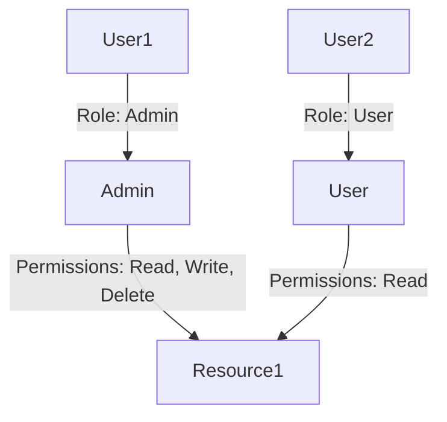
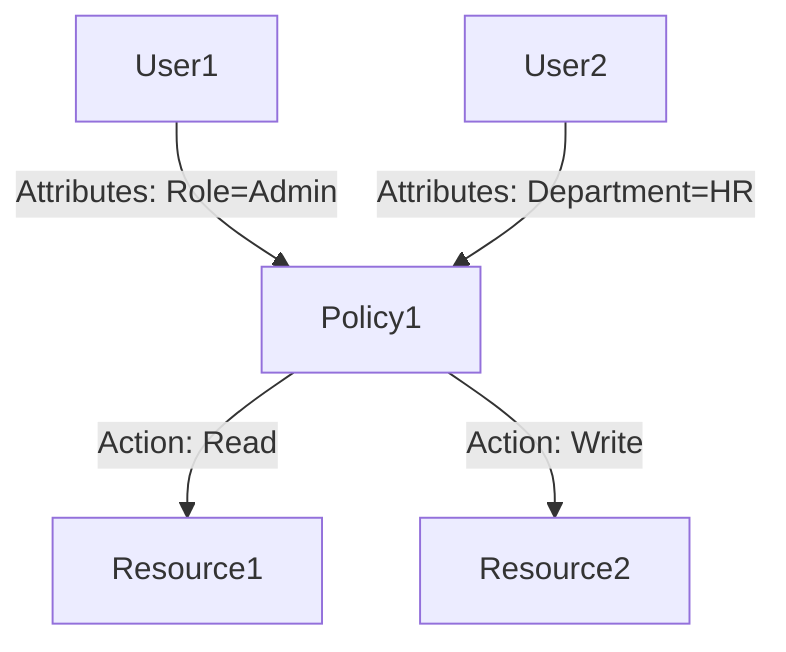

## 25.5 Access Control and Identity Management

In today's digital landscape, safeguarding sensitive data is paramount. Access control and identity management are critical components of any secure application, ensuring that only authorized individuals can access specific resources. In this section, we will explore how to implement these mechanisms in Erlang applications, leveraging its functional and concurrent programming paradigms.

### Understanding Authentication and Authorization

**Authentication** is the process of verifying the identity of a user or system. It answers the question, "Who are you?" Common methods include passwords, biometrics, and tokens.

**Authorization**, on the other hand, determines what an authenticated user is allowed to do. It answers the question, "What are you allowed to do?" This involves checking permissions and roles to ensure that users can only access resources they are permitted to.

#### Key Concepts:

- **Authentication**: Verifying the identity of a user or system.
- **Authorization**: Determining access rights to resources.
- **Identity Management**: Managing user identities and their access rights.

### Role-Based Access Control (RBAC)

**Role-Based Access Control (RBAC)** is a widely used model where access permissions are assigned to roles rather than individual users. Users are then assigned roles, which simplifies management and enhances security.

#### Implementing RBAC in Erlang

To implement RBAC in Erlang, we can use a combination of modules and data structures to define roles and permissions. Here's a basic example:

```erlang
-module(rbac).
-export([assign_role/2, check_permission/3]).

% Define roles and permissions
-define(ROLES, #{admin => [read, write, delete], user => [read]}).

% Assign a role to a user
assign_role(User, Role) ->
    ets:insert(user_roles, {User, Role}).

% Check if a user has a specific permission
check_permission(User, Permission) ->
    case ets:lookup(user_roles, User) of
        [{_, Role}] ->
            Permissions = maps:get(Role, ?ROLES, []),
            lists:member(Permission, Permissions);
        [] ->
            false
    end.
```

In this example, we use an ETS table to store user roles and a map to define role permissions. The `check_permission/3` function verifies if a user has the necessary permission.

### Attribute-Based Access Control (ABAC)

**Attribute-Based Access Control (ABAC)** is a more flexible model that uses attributes (e.g., user, resource, environment) to determine access rights. This model allows for fine-grained access control policies.

#### Implementing ABAC in Erlang

Implementing ABAC involves defining policies based on attributes and evaluating these policies at runtime. Here's a simplified example:

```erlang
-module(abac).
-export([evaluate_policy/3]).

% Define a policy
-define(POLICY, fun(User, Resource, Action) ->
    User#user.role =:= admin orelse
    (User#user.department =:= Resource#resource.department andalso Action =:= read)
end).

% Evaluate a policy
evaluate_policy(User, Resource, Action) ->
    Policy = ?POLICY,
    Policy(User, Resource, Action).
```

In this example, we define a policy as a function that checks user and resource attributes to determine access rights.

### Best Practices for Password Management

Effective password management is crucial for securing user accounts. Here are some best practices:

- **Use Strong Passwords**: Encourage users to create complex passwords with a mix of characters.
- **Store Passwords Securely**: Use hashing algorithms like bcrypt to store passwords securely.
- **Implement Multi-Factor Authentication (MFA)**: Add an extra layer of security by requiring additional verification methods.

#### Example: Password Hashing in Erlang

```erlang
-module(password).
-export([hash_password/1, verify_password/2]).

% Hash a password
hash_password(Password) ->
    bcrypt:hashpw(Password, bcrypt:gen_salt()).

% Verify a password
verify_password(Password, Hash) ->
    bcrypt:checkpw(Password, Hash).
```

In this example, we use the `bcrypt` library to hash and verify passwords, ensuring they are stored securely.

### Monitoring and Auditing Access Attempts

Monitoring and auditing access attempts are essential for detecting unauthorized access and ensuring compliance with security policies. Implement logging mechanisms to track access attempts and review logs regularly.

#### Example: Logging Access Attempts

```erlang
-module(access_logger).
-export([log_access_attempt/3]).

% Log an access attempt
log_access_attempt(User, Resource, Result) ->
    io:format("User ~p attempted to access ~p: ~p~n", [User, Resource, Result]).
```

This simple logging function records each access attempt, which can be reviewed for suspicious activity.

### Visualizing Access Control Models

To better understand the flow of access control, let's visualize the RBAC and ABAC models using Mermaid.js diagrams.

#### RBAC Model



#### ABAC Model



These diagrams illustrate how users, roles, and policies interact in each model.

### Try It Yourself

Experiment with the code examples provided. Try adding new roles or policies, and test how the access control mechanisms respond. Modify the logging function to include timestamps or additional information.

### References and Further Reading

- [OWASP Authentication Cheat Sheet](https://cheatsheetseries.owasp.org/cheatsheets/Authentication_Cheat_Sheet.html)
- [NIST Digital Identity Guidelines](https://pages.nist.gov/800-63-3/)
- [Erlang bcrypt Library](https://github.com/erlangpack/bcrypt)

### Knowledge Check

- What is the difference between authentication and authorization?
- How does RBAC simplify access management?
- Why is password hashing important?
- What are the benefits of using ABAC over RBAC?
- How can monitoring access attempts enhance security?

### Embrace the Journey

Remember, implementing access control and identity management is an ongoing process. Stay informed about the latest security practices and continuously improve your systems. Keep experimenting, stay curious, and enjoy the journey!

## Quiz: Access Control and Identity Management



### What is the primary purpose of authentication?

- [x] Verifying the identity of a user or system
- [ ] Determining access rights to resources
- [ ] Managing user roles
- [ ] Logging access attempts

> **Explanation:** Authentication is the process of verifying the identity of a user or system.

### What does RBAC stand for?

- [x] Role-Based Access Control
- [ ] Resource-Based Access Control
- [ ] Role-Based Authentication Control
- [ ] Resource-Based Authentication Control

> **Explanation:** RBAC stands for Role-Based Access Control, where access permissions are assigned to roles.

### Which model uses attributes to determine access rights?

- [x] Attribute-Based Access Control (ABAC)
- [ ] Role-Based Access Control (RBAC)
- [ ] Permission-Based Access Control (PBAC)
- [ ] Identity-Based Access Control (IBAC)

> **Explanation:** ABAC uses attributes to determine access rights, allowing for fine-grained policies.

### Why is password hashing important?

- [x] To securely store passwords
- [ ] To simplify password management
- [ ] To enhance user experience
- [ ] To reduce server load

> **Explanation:** Password hashing is important for securely storing passwords, preventing unauthorized access.

### What is a benefit of using multi-factor authentication (MFA)?

- [x] Adds an extra layer of security
- [ ] Simplifies user login process
- [ ] Reduces server load
- [ ] Enhances password complexity

> **Explanation:** MFA adds an extra layer of security by requiring additional verification methods.

### What should be included in access logs?

- [x] User identity, resource accessed, and result of access attempt
- [ ] Only successful access attempts
- [ ] Only failed access attempts
- [ ] User identity and password

> **Explanation:** Access logs should include user identity, resource accessed, and result of access attempt for comprehensive monitoring.

### How can monitoring access attempts enhance security?

- [x] By detecting unauthorized access
- [ ] By simplifying user management
- [ ] By reducing server load
- [ ] By enhancing user experience

> **Explanation:** Monitoring access attempts can enhance security by detecting unauthorized access and ensuring compliance.

### What is a key advantage of ABAC over RBAC?

- [x] Allows for more fine-grained access control
- [ ] Simplifies role management
- [ ] Reduces server load
- [ ] Enhances password complexity

> **Explanation:** ABAC allows for more fine-grained access control by using attributes to determine access rights.

### What is the role of identity management?

- [x] Managing user identities and their access rights
- [ ] Simplifying password management
- [ ] Enhancing user experience
- [ ] Reducing server load

> **Explanation:** Identity management involves managing user identities and their access rights.

### True or False: Authorization determines what an authenticated user is allowed to do.

- [x] True
- [ ] False

> **Explanation:** Authorization determines what an authenticated user is allowed to do, based on their permissions and roles.


