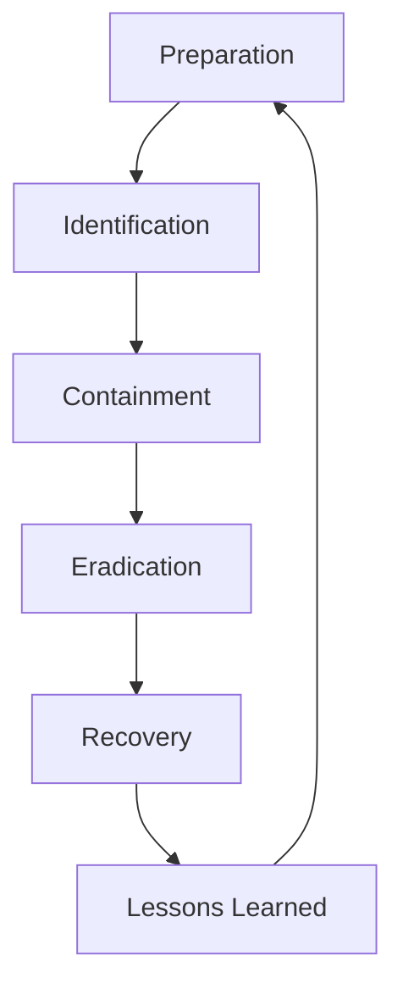

## 25.6 Incident Response Planning

In today's digital landscape, the ability to swiftly and effectively respond to security incidents is crucial for maintaining the integrity and trustworthiness of your applications. This section will guide you through the essentials of incident response planning, focusing on the unique aspects of Erlang applications. We'll explore the importance of having a documented plan, the steps involved in preparing for and responding to incidents, and the role of post-incident analysis and improvement.

### The Importance of a Documented Incident Response Plan

A documented incident response plan (IRP) is a critical component of an organization's security strategy. It provides a structured approach to handling incidents, ensuring that all stakeholders understand their roles and responsibilities. The plan helps minimize damage, reduce recovery time, and maintain compliance with regulatory requirements.

#### Key Benefits of an IRP

- **Swift Response**: A well-documented plan enables quick action, reducing the impact of incidents.
- **Clear Communication**: Defines communication protocols to ensure all parties are informed.
- **Regulatory Compliance**: Helps meet legal and regulatory obligations.
- **Continuous Improvement**: Facilitates learning from past incidents to improve future responses.

### Steps in Preparing for and Responding to Incidents

Incident response involves several key steps, each crucial for effective management and resolution. Let's delve into these steps:

#### 1. Preparation

Preparation is the foundation of an effective incident response. It involves establishing policies, procedures, and tools to handle incidents efficiently.

- **Develop Policies**: Create policies that define what constitutes an incident and outline the response process.
- **Assemble a Response Team**: Form a cross-functional team with clear roles and responsibilities.
- **Conduct Training**: Regularly train team members on the IRP and conduct drills to test readiness.
- **Implement Monitoring Tools**: Use tools to detect and alert on potential incidents.

#### 2. Identification

The identification phase involves detecting and confirming incidents. This step is crucial for initiating a timely response.

- **Monitor Systems**: Continuously monitor systems for unusual activity or breaches.
- **Analyze Alerts**: Investigate alerts to determine if they represent a genuine incident.
- **Document Findings**: Record details of the incident, including time, nature, and scope.

#### 3. Containment

Containment aims to limit the impact of an incident and prevent further damage.

- **Short-Term Containment**: Implement immediate measures to isolate affected systems.
- **Long-Term Containment**: Develop strategies for maintaining business operations while addressing the incident.
- **Communication Protocols**: Ensure clear communication with stakeholders about containment measures.

#### 4. Eradication

Eradication involves removing the root cause of the incident and ensuring it does not recur.

- **Identify Root Cause**: Conduct a thorough investigation to understand the cause.
- **Remove Threats**: Eliminate malware, unauthorized access, or other threats.
- **Patch Vulnerabilities**: Apply patches or updates to prevent future incidents.

#### 5. Recovery

The recovery phase focuses on restoring systems and operations to normal.

- **Restore Systems**: Reinstall clean backups and verify system integrity.
- **Monitor for Recurrence**: Keep a close watch on systems for signs of recurring issues.
- **Communicate Status**: Update stakeholders on recovery progress and system status.

#### 6. Lessons Learned

Post-incident analysis is vital for improving future responses and preventing similar incidents.

- **Conduct a Post-Mortem**: Analyze the incident response to identify strengths and weaknesses.
- **Update the IRP**: Revise the plan based on lessons learned.
- **Share Insights**: Communicate findings with the team to enhance collective knowledge.

### Guidelines for Communication, Containment, and Remediation

Effective communication, containment, and remediation are critical components of incident response. Here are some guidelines to follow:

#### Communication

- **Establish Clear Channels**: Define communication channels for internal and external stakeholders.
- **Regular Updates**: Provide timely updates to keep everyone informed.
- **Transparency**: Be transparent about the incident's impact and response efforts.

#### Containment

- **Isolate Affected Systems**: Quickly isolate compromised systems to prevent spread.
- **Limit Access**: Restrict access to sensitive data and systems during containment.
- **Document Actions**: Keep detailed records of containment measures for future reference.

#### Remediation

- **Thorough Investigation**: Conduct a comprehensive investigation to understand the incident fully.
- **Implement Fixes**: Apply necessary fixes to address vulnerabilities and prevent recurrence.
- **Verify Effectiveness**: Test remediation efforts to ensure they are effective.

### The Role of Post-Incident Analysis and Improvement

Post-incident analysis is a critical step in the incident response process. It involves reviewing the incident and the response to identify areas for improvement.

- **Identify Gaps**: Analyze the response to identify gaps or weaknesses in the plan.
- **Implement Improvements**: Update policies, procedures, and tools based on findings.
- **Foster a Learning Culture**: Encourage a culture of continuous learning and improvement.

### Regular Reviews and Drills

To keep the incident response plan effective, regular reviews and drills are essential.

- **Conduct Regular Reviews**: Periodically review the IRP to ensure it remains relevant and effective.
- **Perform Drills**: Conduct regular drills to test the team's readiness and the plan's effectiveness.
- **Update the Plan**: Revise the plan based on feedback from reviews and drills.

### Code Example: Monitoring and Alerting in Erlang

Let's look at a simple Erlang code example that demonstrates how to set up monitoring and alerting for potential incidents.

```erlang
-module(monitor).
-export([start_monitoring/0, check_system/0]).

% Start monitoring process
start_monitoring() ->
    spawn(fun() -> monitor_loop() end).

% Monitor loop
monitor_loop() ->
    check_system(),
    timer:sleep(5000), % Check every 5 seconds
    monitor_loop().

% Check system status
check_system() ->
    case system_status() of
        ok -> 
            io:format("System is healthy~n");
        warning -> 
            io:format("System warning detected~n"),
            alert("Warning detected in system");
        critical -> 
            io:format("Critical issue detected~n"),
            alert("Critical issue detected in system")
    end.

% Simulate system status check
system_status() ->
    % Randomly simulate system status
    case random:uniform(3) of
        1 -> ok;
        2 -> warning;
        3 -> critical
    end.

% Send alert
alert(Message) ->
    io:format("ALERT: ~s~n", [Message]).
```

#### Explanation

- **Monitoring Process**: The `start_monitoring/0` function spawns a process that continuously checks the system status.
- **System Check**: The `check_system/0` function simulates a system status check and logs the result.
- **Alerting**: If a warning or critical issue is detected, an alert is sent using the `alert/1` function.

### Try It Yourself

Experiment with the code by modifying the `system_status/0` function to simulate different scenarios. Try adjusting the frequency of checks or adding more detailed alerting mechanisms.

### Visualizing the Incident Response Workflow

Below is a Mermaid.js diagram that illustrates the incident response workflow, from preparation to post-incident analysis.



**Diagram Description**: This flowchart represents the cyclical nature of incident response, emphasizing continuous improvement through lessons learned.

### References and Further Reading

- [NIST Computer Security Incident Handling Guide](https://nvlpubs.nist.gov/nistpubs/SpecialPublications/NIST.SP.800-61r2.pdf)
- [SANS Institute Incident Handling Step-by-Step](https://www.sans.org/reading-room/whitepapers/incident/incident-handling-step-step-1293)
- [OWASP Incident Response](https://owasp.org/www-community/Incident_Response)

### Knowledge Check

- **What are the key steps in incident response?**
- **Why is post-incident analysis important?**
- **How can regular drills improve incident response?**

### Embrace the Journey

Remember, incident response planning is an ongoing process. As you develop and refine your plan, you'll build a more resilient and secure application environment. Keep learning, stay vigilant, and embrace the journey toward better security and compliance.

## Quiz: Incident Response Planning



### What is the primary goal of an incident response plan?

- [x] To minimize damage and recovery time
- [ ] To increase system complexity
- [ ] To delay response to incidents
- [ ] To eliminate the need for monitoring

> **Explanation:** The primary goal of an incident response plan is to minimize damage and recovery time, ensuring swift and effective handling of incidents.

### Which phase involves removing the root cause of an incident?

- [ ] Identification
- [ ] Containment
- [x] Eradication
- [ ] Recovery

> **Explanation:** The eradication phase involves removing the root cause of an incident to prevent recurrence.

### Why is post-incident analysis crucial?

- [x] It helps identify areas for improvement
- [ ] It delays the response process
- [ ] It increases the complexity of the plan
- [ ] It reduces transparency

> **Explanation:** Post-incident analysis is crucial because it helps identify areas for improvement, enhancing future responses.

### What should be done during the containment phase?

- [x] Isolate affected systems
- [ ] Conduct a post-mortem
- [ ] Restore systems
- [ ] Remove threats

> **Explanation:** During the containment phase, affected systems should be isolated to prevent the spread of the incident.

### How often should the incident response plan be reviewed?

- [x] Regularly
- [ ] Once a year
- [ ] Only after an incident
- [ ] Never

> **Explanation:** The incident response plan should be reviewed regularly to ensure it remains effective and relevant.

### What is the role of communication in incident response?

- [x] To keep stakeholders informed
- [ ] To increase system complexity
- [ ] To delay response efforts
- [ ] To eliminate the need for monitoring

> **Explanation:** Communication plays a crucial role in keeping stakeholders informed and ensuring a coordinated response effort.

### What is the first step in the incident response process?

- [x] Preparation
- [ ] Identification
- [ ] Containment
- [ ] Recovery

> **Explanation:** Preparation is the first step in the incident response process, laying the groundwork for effective handling of incidents.

### What is the purpose of conducting drills?

- [x] To test the team's readiness
- [ ] To increase system complexity
- [ ] To delay response efforts
- [ ] To eliminate the need for monitoring

> **Explanation:** Conducting drills helps test the team's readiness and the effectiveness of the incident response plan.

### What should be done after an incident is resolved?

- [x] Conduct a post-mortem analysis
- [ ] Increase system complexity
- [ ] Delay response efforts
- [ ] Eliminate monitoring

> **Explanation:** After an incident is resolved, a post-mortem analysis should be conducted to identify areas for improvement.

### True or False: An incident response plan should be static and never updated.

- [ ] True
- [x] False

> **Explanation:** An incident response plan should be dynamic and regularly updated to remain effective and relevant.


