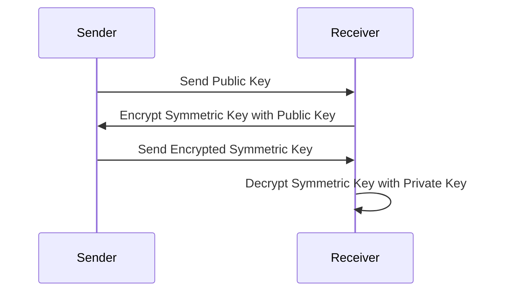

## 25.7 Encryption and Key Management

In today's digital landscape, securing sensitive data is paramount. Encryption and key management are critical components of a robust security strategy. In this section, we will explore encryption methods, key management practices, and how to implement them in Erlang, ensuring compliance with standards like PCI DSS.

### Understanding Encryption

Encryption is the process of converting plaintext into ciphertext, making it unreadable to unauthorized users. There are two primary types of encryption: symmetric and asymmetric.

#### Symmetric Encryption

Symmetric encryption uses a single key for both encryption and decryption. It is fast and efficient, making it suitable for encrypting large amounts of data. However, the challenge lies in securely sharing the key between parties.

**Example of Symmetric Encryption in Erlang:**

```erlang
-module(symmetric_example).
-export([encrypt/2, decrypt/2]).

% Encrypts data using a symmetric key
encrypt(Key, Data) ->
    crypto:block_encrypt(aes_cbc256, Key, <<0:128>>, Data).

% Decrypts data using a symmetric key
decrypt(Key, EncryptedData) ->
    crypto:block_decrypt(aes_cbc256, Key, <<0:128>>, EncryptedData).
```

In this example, we use the AES (Advanced Encryption Standard) algorithm with a 256-bit key in CBC (Cipher Block Chaining) mode. The `crypto` module in Erlang provides the necessary functions for encryption and decryption.

#### Asymmetric Encryption

Asymmetric encryption, also known as public-key cryptography, uses a pair of keys: a public key for encryption and a private key for decryption. This method is more secure for key exchange but is computationally intensive.

**Example of Asymmetric Encryption in Erlang:**

```erlang
-module(asymmetric_example).
-export([generate_keys/0, encrypt/2, decrypt/2]).

% Generates a pair of RSA keys
generate_keys() ->
    {PublicKey, PrivateKey} = crypto:generate_key(rsa, 2048),
    {PublicKey, PrivateKey}.

% Encrypts data using the public key
encrypt(PublicKey, Data) ->
    crypto:public_encrypt(rsa, Data, PublicKey).

% Decrypts data using the private key
decrypt(PrivateKey, EncryptedData) ->
    crypto:private_decrypt(rsa, EncryptedData, PrivateKey).
```

Here, we use RSA (Rivest-Shamir-Adleman) encryption to generate a pair of keys and perform encryption and decryption.

### Key Management

Effective key management is crucial for maintaining the security of encrypted data. It involves key generation, distribution, rotation, revocation, and secure storage.

#### Key Generation

Key generation is the process of creating cryptographic keys. In Erlang, you can use the `crypto` module to generate keys for both symmetric and asymmetric encryption.

**Example of Key Generation:**

```erlang
-module(key_management).
-export([generate_symmetric_key/0, generate_asymmetric_keys/0]).

% Generates a symmetric key
generate_symmetric_key() ->
    crypto:strong_rand_bytes(32).

% Generates a pair of asymmetric keys
generate_asymmetric_keys() ->
    crypto:generate_key(rsa, 2048).
```

#### Key Distribution

Secure key distribution ensures that keys are shared only with authorized parties. Asymmetric encryption is often used to securely exchange symmetric keys.

**Diagram: Key Distribution Process**



#### Key Rotation

Regularly rotating keys minimizes the risk of key compromise. Implement automated processes to rotate keys and update systems accordingly.

#### Key Revocation

Key revocation is the process of invalidating keys that are no longer secure. Maintain a revocation list and ensure systems check this list before using a key.

#### Secure Key Storage

Store keys securely to prevent unauthorized access. Use hardware security modules (HSMs) or secure key vaults to protect keys.

**Example of Secure Key Storage:**

```erlang
-module(secure_storage).
-export([store_key/2, retrieve_key/1]).

% Stores a key securely
store_key(KeyId, Key) ->
    ets:new(KeyId, [named_table, public]),
    ets:insert(KeyId, {key, Key}).

% Retrieves a key securely
retrieve_key(KeyId) ->
    case ets:lookup(KeyId, key) of
        [{key, Key}] -> Key;
        [] -> undefined
    end.
```

### Compliance with Standards

Compliance with standards like PCI DSS is essential for organizations handling sensitive data. These standards provide guidelines for encryption and key management.

#### PCI DSS Key Management Requirements

- **Key Generation**: Use strong cryptographic algorithms and secure methods for key generation.
- **Key Distribution**: Ensure keys are distributed securely and only to authorized parties.
- **Key Storage**: Store keys securely to prevent unauthorized access.
- **Key Rotation**: Regularly rotate keys to minimize the risk of compromise.
- **Key Revocation**: Implement processes for key revocation and maintain a revocation list.

### Knowledge Check

- What is the difference between symmetric and asymmetric encryption?
- How can you securely store cryptographic keys in Erlang?
- Why is key rotation important in key management?
- What are the key management requirements of PCI DSS?

### Try It Yourself

Experiment with the provided code examples by modifying the encryption algorithms or key sizes. Test the impact of these changes on the encryption and decryption processes.

### Conclusion

Encryption and key management are vital for securing data and ensuring compliance with industry standards. By understanding and implementing these practices in Erlang, you can protect sensitive information and maintain the trust of your users.

Remember, this is just the beginning. As you progress, you'll build more secure and robust applications. Keep experimenting, stay curious, and enjoy the journey!

## Quiz: Encryption and Key Management



### What is the primary difference between symmetric and asymmetric encryption?

- [x] Symmetric encryption uses one key for both encryption and decryption, while asymmetric encryption uses a pair of keys.
- [ ] Symmetric encryption is slower than asymmetric encryption.
- [ ] Asymmetric encryption uses the same key for encryption and decryption.
- [ ] Symmetric encryption is more secure than asymmetric encryption.

> **Explanation:** Symmetric encryption uses a single key for both encryption and decryption, whereas asymmetric encryption uses a pair of keys: a public key and a private key.

### Which Erlang module is commonly used for encryption and decryption?

- [x] crypto
- [ ] ssl
- [ ] gen_server
- [ ] ets

> **Explanation:** The `crypto` module in Erlang provides functions for encryption and decryption.

### Why is key rotation important?

- [x] To minimize the risk of key compromise.
- [ ] To increase the speed of encryption.
- [ ] To reduce the size of the encrypted data.
- [ ] To make the encryption process more complex.

> **Explanation:** Regularly rotating keys helps minimize the risk of key compromise by limiting the amount of data encrypted with a single key.

### What is the purpose of key revocation?

- [x] To invalidate keys that are no longer secure.
- [ ] To generate new keys.
- [ ] To encrypt data faster.
- [ ] To store keys securely.

> **Explanation:** Key revocation is the process of invalidating keys that are no longer secure or have been compromised.

### How can you securely store keys in Erlang?

- [x] Using ETS tables with proper access controls.
- [ ] Storing them in plain text files.
- [ ] Using the `gen_server` module.
- [ ] Encrypting them with a weak algorithm.

> **Explanation:** Securely storing keys can be achieved using ETS tables with proper access controls to prevent unauthorized access.

### What is the role of a Hardware Security Module (HSM)?

- [x] To securely store and manage cryptographic keys.
- [ ] To encrypt data faster.
- [ ] To generate random numbers.
- [ ] To provide network security.

> **Explanation:** A Hardware Security Module (HSM) is used to securely store and manage cryptographic keys, ensuring they are protected from unauthorized access.

### Which standard provides guidelines for encryption and key management?

- [x] PCI DSS
- [ ] ISO 9001
- [ ] IEEE 802.11
- [ ] HTML5

> **Explanation:** PCI DSS provides guidelines for encryption and key management, especially for organizations handling payment card data.

### What is the benefit of using asymmetric encryption for key exchange?

- [x] It allows secure exchange of symmetric keys without sharing the private key.
- [ ] It speeds up the encryption process.
- [ ] It reduces the size of the encrypted data.
- [ ] It eliminates the need for encryption.

> **Explanation:** Asymmetric encryption allows secure exchange of symmetric keys without sharing the private key, ensuring secure communication.

### What is the purpose of a revocation list?

- [x] To maintain a list of keys that have been revoked and should not be used.
- [ ] To store all active keys.
- [ ] To generate new keys.
- [ ] To encrypt data.

> **Explanation:** A revocation list maintains a list of keys that have been revoked and should not be used, ensuring that compromised keys are not utilized.

### True or False: Asymmetric encryption is faster than symmetric encryption.

- [ ] True
- [x] False

> **Explanation:** Asymmetric encryption is generally slower than symmetric encryption due to the complexity of the algorithms and the use of larger key sizes.


