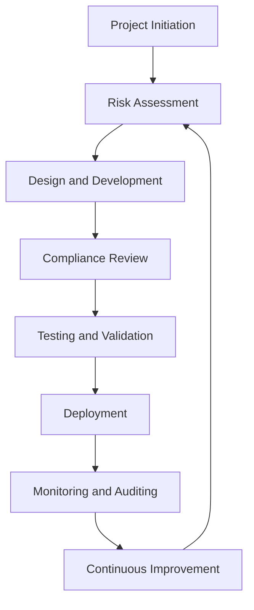

## 25.8 Best Practices for Regulatory Compliance

In today's digital landscape, regulatory compliance is not just a legal obligation but a critical component of building trust with users and stakeholders. As developers working with Erlang, understanding and implementing best practices for regulatory compliance is essential. This section will guide you through key compliance requirements, provide actionable guidelines, and emphasize the importance of integrating compliance into the development lifecycle.

### Understanding Key Compliance Requirements

Before diving into best practices, it's crucial to understand the regulatory landscape that affects software development. Regulations such as the General Data Protection Regulation (GDPR), Health Insurance Portability and Accountability Act (HIPAA), and Payment Card Industry Data Security Standard (PCI DSS) impose specific requirements on how data is handled, stored, and transmitted.

#### GDPR

The GDPR is a comprehensive data protection regulation that applies to organizations operating within the European Union (EU) or handling the data of EU citizens. Key requirements include:

- **Data Minimization**: Collect only the data necessary for the intended purpose.
- **Consent**: Obtain explicit consent from users before processing their data.
- **Right to Access**: Allow users to access their data and obtain information about how it is used.
- **Data Breach Notification**: Notify authorities and affected individuals of data breaches within 72 hours.

#### HIPAA

HIPAA is a U.S. regulation that protects the privacy and security of health information. Key requirements include:

- **Privacy Rule**: Protects individuals' medical records and other personal health information.
- **Security Rule**: Sets standards for securing electronic protected health information (ePHI).
- **Breach Notification Rule**: Requires covered entities to notify affected individuals of breaches.

#### PCI DSS

PCI DSS is a set of security standards designed to protect cardholder data. Key requirements include:

- **Secure Network**: Implement and maintain a secure network to protect cardholder data.
- **Access Control**: Restrict access to cardholder data to only those who need it.
- **Monitoring and Testing**: Regularly monitor and test networks to ensure security.

### Actionable Guidelines for Developers and Organizations

Achieving compliance requires a proactive approach. Here are some actionable guidelines to help you and your organization stay compliant:

#### 1. Conduct Regular Risk Assessments

Regularly assess risks to identify potential vulnerabilities in your systems. This involves:

- **Identifying Assets**: List all assets, including data, software, and hardware.
- **Assessing Threats**: Identify potential threats to each asset.
- **Evaluating Impact**: Determine the potential impact of each threat.
- **Mitigating Risks**: Implement measures to mitigate identified risks.

#### 2. Implement Data Protection Measures

Protecting data is at the core of most regulations. Implement the following measures:

- **Encryption**: Use strong encryption to protect data at rest and in transit.
- **Access Controls**: Implement role-based access controls to limit data access.
- **Data Anonymization**: Anonymize data where possible to protect user privacy.

#### 3. Develop a Comprehensive Privacy Policy

A clear and comprehensive privacy policy is essential for compliance. Ensure your policy:

- **Explains Data Collection**: Clearly explain what data is collected and why.
- **Describes Data Usage**: Detail how data will be used and shared.
- **Outlines User Rights**: Inform users of their rights regarding their data.

#### 4. Establish Incident Response Procedures

Prepare for potential data breaches by establishing incident response procedures:

- **Define Roles**: Assign roles and responsibilities for incident response.
- **Create a Communication Plan**: Develop a plan for communicating with stakeholders during an incident.
- **Test Procedures**: Regularly test your incident response procedures to ensure effectiveness.

#### 5. Maintain Comprehensive Documentation

Documentation is critical for demonstrating compliance. Maintain documentation for:

- **Data Processing Activities**: Document all data processing activities and their purposes.
- **Security Measures**: Record all security measures implemented to protect data.
- **Training Programs**: Keep records of all training programs conducted.

### The Role of Training and Awareness Programs

Training and awareness programs are vital for ensuring that all team members understand compliance requirements and their roles in maintaining compliance.

#### 1. Conduct Regular Training Sessions

Regular training sessions help keep team members informed about the latest compliance requirements and best practices. Topics to cover include:

- **Data Protection**: Teach team members how to protect data and recognize potential threats.
- **Incident Response**: Train team members on how to respond to data breaches and other incidents.
- **Regulatory Updates**: Keep team members informed about changes to relevant regulations.

#### 2. Foster a Culture of Compliance

Encourage a culture of compliance within your organization by:

- **Leading by Example**: Ensure leadership demonstrates a commitment to compliance.
- **Encouraging Reporting**: Create an environment where team members feel comfortable reporting potential compliance issues.
- **Recognizing Compliance Efforts**: Acknowledge and reward team members who contribute to compliance efforts.

### Importance of Documentation and Evidence Gathering

Documentation and evidence gathering are essential for demonstrating compliance and preparing for audits.

#### 1. Maintain Accurate Records

Keep accurate records of all compliance-related activities, including:

- **Data Processing**: Document all data processing activities and their purposes.
- **Security Measures**: Record all security measures implemented to protect data.
- **Training Programs**: Keep records of all training programs conducted.

#### 2. Conduct Regular Audits

Regular audits help ensure compliance and identify areas for improvement. Audits should:

- **Review Documentation**: Verify that all documentation is accurate and up-to-date.
- **Assess Compliance**: Evaluate compliance with relevant regulations.
- **Identify Gaps**: Identify any gaps in compliance and develop plans to address them.

### Integrating Compliance Considerations into the Development Lifecycle

Integrating compliance considerations into the development lifecycle helps ensure that compliance is maintained throughout the development process.

#### 1. Incorporate Compliance into Design and Development

Consider compliance requirements during the design and development phases by:

- **Conducting Privacy Impact Assessments**: Assess the impact of new features on user privacy.
- **Implementing Secure Coding Practices**: Follow secure coding practices to protect data.
- **Reviewing Code for Compliance**: Regularly review code to ensure compliance with relevant regulations.

#### 2. Use Automated Tools for Compliance Monitoring

Automated tools can help monitor compliance and identify potential issues. Consider using tools for:

- **Vulnerability Scanning**: Regularly scan systems for vulnerabilities.
- **Compliance Reporting**: Generate compliance reports to demonstrate adherence to regulations.
- **Security Monitoring**: Monitor systems for potential security threats.

### Visualizing Compliance Integration

To better understand how compliance can be integrated into the development lifecycle, consider the following diagram:

**Diagram Description**: This flowchart illustrates the integration of compliance into the development lifecycle, starting with project initiation and risk assessment, followed by design and development, compliance review, testing and validation, deployment, monitoring and auditing, and continuous improvement.

### Conclusion

Achieving and maintaining regulatory compliance is a continuous process that requires a proactive approach. By understanding key compliance requirements, implementing actionable guidelines, and integrating compliance considerations into the development lifecycle, you can ensure that your Erlang applications remain compliant with relevant regulations. Remember, compliance is not just a legal obligation but a critical component of building trust with users and stakeholders.

### Encouragement for Continuous Learning

As you continue your journey in Erlang development, remember that compliance is an ongoing process. Stay informed about changes to relevant regulations, continuously improve your compliance practices, and foster a culture of compliance within your organization. Keep experimenting, stay curious, and enjoy the journey!

## Quiz: Best Practices for Regulatory Compliance



### What is the primary goal of GDPR?

- [x] Protecting the privacy and personal data of EU citizens
- [ ] Ensuring financial transparency
- [ ] Regulating international trade
- [ ] Monitoring environmental impact

> **Explanation:** The General Data Protection Regulation (GDPR) aims to protect the privacy and personal data of individuals within the European Union.

### Which of the following is a key requirement of HIPAA?

- [ ] Data Minimization
- [x] Protecting electronic protected health information (ePHI)
- [ ] Secure Network Implementation
- [ ] Payment Card Security

> **Explanation:** HIPAA requires the protection of electronic protected health information (ePHI) through its Security Rule.

### What is a primary focus of PCI DSS?

- [ ] Protecting health information
- [x] Securing cardholder data
- [ ] Ensuring data portability
- [ ] Regulating data collection

> **Explanation:** PCI DSS focuses on securing cardholder data to protect against fraud and breaches.

### What should be included in a comprehensive privacy policy?

- [x] Explanation of data collection and usage
- [ ] Financial statements
- [ ] Employee records
- [ ] Marketing strategies

> **Explanation:** A comprehensive privacy policy should explain what data is collected, how it is used, and the rights of users regarding their data.

### How often should risk assessments be conducted?

- [x] Regularly
- [ ] Once a year
- [ ] Every five years
- [ ] Only when required by law

> **Explanation:** Regular risk assessments help identify and mitigate potential vulnerabilities in systems.

### What is the purpose of incident response procedures?

- [ ] To increase sales
- [x] To prepare for and respond to data breaches
- [ ] To develop new products
- [ ] To conduct market research

> **Explanation:** Incident response procedures are designed to prepare for and respond to data breaches and other security incidents.

### Why is documentation important for compliance?

- [x] It demonstrates compliance and prepares for audits
- [ ] It increases marketing reach
- [ ] It reduces development time
- [ ] It improves user experience

> **Explanation:** Documentation is critical for demonstrating compliance and preparing for audits.

### What role do training and awareness programs play in compliance?

- [x] They ensure team members understand compliance requirements
- [ ] They increase product sales
- [ ] They reduce production costs
- [ ] They improve design aesthetics

> **Explanation:** Training and awareness programs ensure that team members understand compliance requirements and their roles in maintaining compliance.

### How can compliance be integrated into the development lifecycle?

- [x] By considering compliance during design and development
- [ ] By focusing solely on marketing
- [ ] By ignoring security measures
- [ ] By reducing documentation

> **Explanation:** Integrating compliance into the development lifecycle involves considering compliance requirements during design and development.

### True or False: Compliance is a one-time effort.

- [ ] True
- [x] False

> **Explanation:** Compliance is an ongoing process that requires continuous monitoring and improvement.



