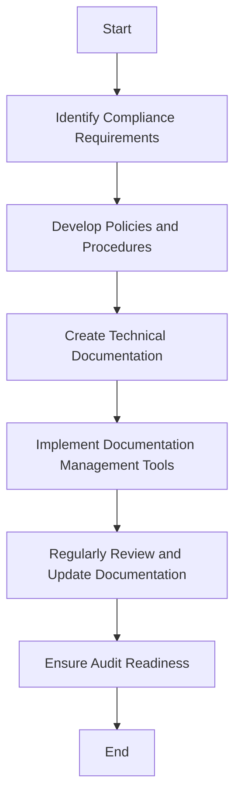

## 25.9 Documenting Compliance Efforts

In today's regulatory landscape, documenting compliance efforts is not just a best practice but a necessity. For Erlang developers, understanding how to effectively document compliance activities can ensure that applications meet legal and regulatory requirements, thereby avoiding potential fines and reputational damage. This section will guide you through the types of documentation required for audits, provide examples of policies and procedures, discuss tools for managing compliance documentation, and highlight the importance of updates and version control.

### Understanding Compliance Documentation

Compliance documentation serves as a record of your organization's adherence to legal, regulatory, and industry standards. It provides evidence during audits and helps maintain transparency and accountability. Let's explore the different types of documentation you may need:

#### Types of Compliance Documentation

1. **Policies and Procedures**: These documents outline the rules and guidelines your organization follows to comply with regulations. They should be clear, concise, and accessible to all employees.

2. **Technical Documentation**: This includes system architecture diagrams, data flow charts, and code documentation that demonstrate how your software meets compliance requirements.

3. **Audit Trails**: Logs and records that track changes and access to sensitive data, ensuring that all actions are traceable.

4. **Training Records**: Documentation of compliance training sessions attended by employees, ensuring that everyone is aware of their responsibilities.

5. **Incident Reports**: Records of any compliance breaches or incidents, along with the steps taken to resolve them.

6. **Risk Assessments**: Evaluations of potential compliance risks and the measures implemented to mitigate them.

### Examples of Policies and Procedures

Creating comprehensive policies and procedures is crucial for compliance. Here are some examples:

- **Data Protection Policy**: Outlines how your organization handles personal data, ensuring compliance with regulations like GDPR.

- **Access Control Policy**: Defines who has access to sensitive information and how access is granted and revoked.

- **Incident Response Plan**: Details the steps to take in the event of a data breach or compliance incident.

- **Code of Conduct**: Sets expectations for employee behavior and compliance with legal and ethical standards.

### Technical Documentation in Erlang

For Erlang developers, technical documentation is a key component of compliance efforts. Here are some elements to include:

- **System Architecture Diagrams**: Visual representations of your system's components and their interactions.

- **Data Flow Charts**: Diagrams showing how data moves through your system, highlighting points of data collection, processing, and storage.

- **Code Documentation**: Comments and annotations within your codebase that explain how compliance requirements are met.

#### Example: Documenting Data Flow in Erlang

```erlang
%% Data Flow Example
%% This module demonstrates how data is processed in compliance with GDPR.

-module(data_flow).
-export([process_data/1]).

%% @doc Process user data in compliance with GDPR.
%% @spec process_data(map()) -> ok | {error, term()}.
process_data(UserData) ->
    %% Step 1: Validate data
    case validate_data(UserData) of
        ok ->
            %% Step 2: Anonymize data
            AnonymizedData = anonymize(UserData),
            %% Step 3: Store data securely
            store_data(AnonymizedData),
            ok;
        {error, Reason} ->
            {error, Reason}
    end.

%% Validate user data
validate_data(Data) ->
    %% Ensure all required fields are present
    case maps:is_key(name, Data) andalso maps:is_key(email, Data) of
        true -> ok;
        false -> {error, missing_fields}
    end.

%% Anonymize user data
anonymize(Data) ->
    %% Remove personally identifiable information
    maps:remove(email, Data).

%% Store data securely
store_data(Data) ->
    %% Store data in a secure database
    secure_db:insert(Data).
```

### Tools for Managing Compliance Documentation

Managing compliance documentation can be challenging, but several tools can help streamline the process:

- **Document Management Systems (DMS)**: Tools like SharePoint or Confluence allow you to store, organize, and share documents securely.

- **Version Control Systems**: Git and other version control systems help track changes to documentation, ensuring that you can revert to previous versions if needed.

- **Compliance Management Software**: Solutions like LogicGate or VComply offer features specifically designed for managing compliance efforts, including risk assessments and audit trails.

### Importance of Documentation Updates and Version Control

Keeping your documentation up-to-date is crucial for maintaining compliance. Here are some best practices:

- **Regular Reviews**: Schedule regular reviews of your documentation to ensure it reflects current practices and regulations.

- **Version Control**: Use version control systems to track changes and maintain a history of your documentation.

- **Change Management**: Implement a change management process to ensure that updates are reviewed and approved before implementation.

### Encouraging Transparency and Accountability

Transparency and accountability are key to successful compliance efforts. Here are some ways to promote these values:

- **Open Access**: Ensure that all employees have access to compliance documentation and understand their responsibilities.

- **Clear Communication**: Communicate changes to policies and procedures clearly and promptly.

- **Audit Readiness**: Maintain documentation in a state that is ready for audit at any time, demonstrating your commitment to compliance.

### Visualizing Compliance Documentation Processes

To better understand the flow of compliance documentation, let's visualize the process using a Mermaid.js diagram:



This diagram illustrates the continuous cycle of documenting compliance efforts, from identifying requirements to ensuring audit readiness.

### References and Further Reading

- [GDPR Compliance Guide](https://gdpr.eu/)
- [ISO 27001 Information Security Management](https://www.iso.org/iso-27001-information-security.html)
- [NIST Cybersecurity Framework](https://www.nist.gov/cyberframework)

### Knowledge Check

- What are the key types of compliance documentation?
- How can version control systems aid in managing compliance documentation?
- Why is it important to regularly update compliance documentation?

### Embrace the Journey

Documenting compliance efforts is an ongoing process that requires diligence and attention to detail. By following the best practices outlined in this section, you can ensure that your Erlang applications remain compliant and ready for audit. Remember, this is just the beginning. As you progress, you'll build more robust and compliant systems. Keep experimenting, stay curious, and enjoy the journey!

## Quiz: Documenting Compliance Efforts



### What is the primary purpose of compliance documentation?

- [x] To provide evidence of adherence to legal and regulatory standards
- [ ] To increase the complexity of software systems
- [ ] To replace technical documentation
- [ ] To serve as a marketing tool

> **Explanation:** Compliance documentation serves as a record of adherence to legal and regulatory standards, providing evidence during audits.

### Which of the following is an example of technical documentation?

- [x] System architecture diagrams
- [ ] Employee training records
- [ ] Incident response plans
- [ ] Data protection policies

> **Explanation:** Technical documentation includes system architecture diagrams, data flow charts, and code documentation.

### What tool can help track changes to compliance documentation?

- [x] Version control systems like Git
- [ ] Email communication
- [ ] Manual record-keeping
- [ ] Social media platforms

> **Explanation:** Version control systems like Git help track changes to documentation, ensuring a history of updates.

### Why is it important to regularly review compliance documentation?

- [x] To ensure it reflects current practices and regulations
- [ ] To increase the volume of documentation
- [ ] To confuse auditors
- [ ] To reduce employee access

> **Explanation:** Regular reviews ensure that documentation reflects current practices and regulations, maintaining compliance.

### What is a benefit of using document management systems?

- [x] Secure storage and organization of documents
- [ ] Increased manual effort
- [ ] Reduced transparency
- [ ] Limited access to documents

> **Explanation:** Document management systems provide secure storage and organization of documents, facilitating compliance efforts.

### Which of the following promotes transparency in compliance efforts?

- [x] Open access to compliance documentation
- [ ] Restricting access to management only
- [ ] Keeping documentation secret
- [ ] Ignoring employee feedback

> **Explanation:** Open access to compliance documentation promotes transparency and accountability.

### What should be included in a data protection policy?

- [x] Guidelines for handling personal data
- [ ] Marketing strategies
- [ ] Employee vacation schedules
- [ ] Social media policies

> **Explanation:** A data protection policy outlines guidelines for handling personal data, ensuring compliance with regulations like GDPR.

### How can audit trails aid in compliance efforts?

- [x] By providing logs and records of changes and access to data
- [ ] By reducing the need for documentation
- [ ] By serving as a substitute for policies
- [ ] By complicating the audit process

> **Explanation:** Audit trails provide logs and records of changes and access to data, ensuring traceability and accountability.

### What is the role of incident reports in compliance documentation?

- [x] To record compliance breaches and resolution steps
- [ ] To replace technical documentation
- [ ] To serve as a marketing tool
- [ ] To increase system complexity

> **Explanation:** Incident reports record compliance breaches and the steps taken to resolve them, maintaining accountability.

### True or False: Compliance documentation should be kept secret from employees.

- [ ] True
- [x] False

> **Explanation:** Compliance documentation should be accessible to employees to ensure transparency and accountability.


