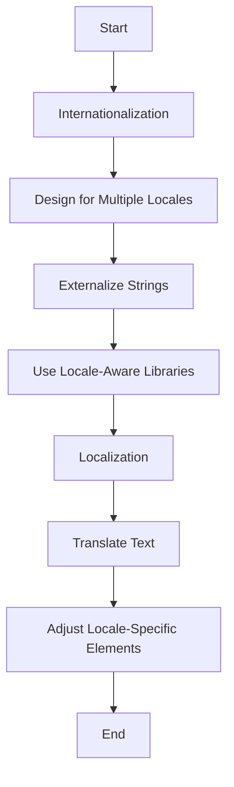

## 26.1 Introduction to i18n and l10n in Erlang

In today's interconnected world, creating applications that cater to a global audience is more important than ever. This is where internationalization (i18n) and localization (l10n) come into play. In this section, we will delve into these concepts, their significance, and how they can be implemented in Erlang applications.

### Understanding Internationalization (i18n) and Localization (l10n)

**Internationalization (i18n)** is the process of designing software applications in a way that they can be easily adapted to various languages and regions without requiring engineering changes. It involves preparing the codebase to support multiple languages, character sets, and cultural conventions.

**Localization (l10n)**, on the other hand, is the adaptation of an application to meet the language, cultural, and other requirements of a specific target market. This includes translating text, adjusting date and time formats, currency symbols, and other locale-specific elements.

#### Key Differences

- **Scope**: Internationalization is a broader concept that involves designing the software architecture to support multiple locales, while localization is the specific adaptation to a particular locale.
- **Timing**: Internationalization is typically done during the initial development phase, whereas localization occurs after the application has been internationalized.
- **Focus**: Internationalization focuses on the technical aspects of supporting multiple languages, while localization deals with cultural and linguistic nuances.

### Why i18n and l10n Matter

For modern applications aiming for a worldwide user base, i18n and l10n are critical. Here are some reasons why:

- **Market Reach**: By supporting multiple languages and regions, applications can reach a broader audience, increasing their market potential.
- **User Experience**: Users are more likely to engage with applications that are available in their native language and adhere to their cultural norms.
- **Compliance**: Some regions have legal requirements for language support, making i18n and l10n necessary for compliance.
- **Competitive Advantage**: Offering a localized experience can differentiate an application from competitors who only support a single language.

### Challenges in Internationalizing Erlang Applications

Internationalizing Erlang applications presents unique challenges due to the language's specific characteristics:

- **String Handling**: Erlang's string handling can be complex, especially when dealing with multi-byte character sets like UTF-8.
- **Date and Time Formatting**: Erlang's native support for date and time formatting may not cover all locale-specific requirements.
- **Cultural Nuances**: Adapting applications to different cultural contexts requires more than just translating text; it involves understanding and implementing cultural nuances.

### Erlang's Capabilities and Tools for i18n and l10n

Erlang offers several capabilities and tools to support internationalization and localization:

- **Unicode Support**: Erlang has built-in support for Unicode, allowing for the representation of a wide range of characters from different languages.
- **Libraries**: Libraries like `erl_gettext` and `linguist` provide functionality for managing translations and locale-specific data.
- **Custom Modules**: Developers can create custom modules to handle specific i18n and l10n requirements, such as date formatting and currency conversion.

#### Example: Using `erl_gettext` for Localization

```erlang
-module(my_app).
-export([start/0]).

start() ->
    %% Load translations
    erl_gettext:bindtextdomain("my_app", "locale"),
    erl_gettext:textdomain("my_app"),
    
    %% Get translated string
    HelloWorld = erl_gettext:gettext("Hello, World!"),
    io:format("~s~n", [HelloWorld]).
```

In this example, we use the `erl_gettext` library to load translations from the "locale" directory and retrieve a translated string for "Hello, World!".

### Consider i18n and l10n Early in Development

To avoid costly refactoring, it's crucial to consider internationalization and localization early in the development process. Here are some best practices:

- **Design for Flexibility**: Use flexible data structures and design patterns that can easily accommodate multiple languages and locales.
- **Externalize Strings**: Store user-facing strings in external files or databases, making them easier to translate and update.
- **Use Locale-Aware Libraries**: Leverage libraries that are designed to handle locale-specific data, such as date and time formats.

### Visualizing the i18n and l10n Process



This flowchart illustrates the process of internationalizing and localizing an application, starting with designing for multiple locales and ending with adjusting locale-specific elements.

### Try It Yourself

Experiment with the `erl_gettext` library by adding translations for different languages. Modify the example code to display messages in various languages based on user input or system settings.

### Knowledge Check

- What are the main differences between internationalization and localization?
- Why is it important to consider i18n and l10n early in the development process?
- What challenges might you face when internationalizing an Erlang application?

### Conclusion

Internationalization and localization are essential for creating applications that cater to a global audience. By understanding the differences between these concepts and leveraging Erlang's capabilities, developers can build applications that are both accessible and user-friendly across different languages and cultures. Remember, this is just the beginning. As you progress, you'll build more complex and interactive applications. Keep experimenting, stay curious, and enjoy the journey!

## Quiz: Introduction to i18n and l10n in Erlang



### What is the primary focus of internationalization (i18n)?

- [x] Designing software to support multiple languages and regions
- [ ] Translating text for specific locales
- [ ] Adjusting date and time formats
- [ ] Implementing cultural nuances

> **Explanation:** Internationalization focuses on designing software to support multiple languages and regions without requiring engineering changes.

### Which of the following is a key difference between i18n and l10n?

- [x] i18n is about designing for multiple locales, while l10n is about adapting to a specific locale
- [ ] i18n involves translating text, while l10n involves designing software architecture
- [ ] i18n is done after localization, while l10n is done during initial development
- [ ] i18n focuses on cultural nuances, while l10n focuses on technical aspects

> **Explanation:** Internationalization is about designing for multiple locales, while localization is about adapting to a specific locale.

### Why is it important to consider i18n and l10n early in the development process?

- [x] To avoid costly refactoring
- [ ] To ensure compliance with legal requirements
- [ ] To differentiate from competitors
- [ ] To increase market potential

> **Explanation:** Considering i18n and l10n early helps avoid costly refactoring later in the development process.

### What is a common challenge in internationalizing Erlang applications?

- [x] String handling with multi-byte character sets
- [ ] Lack of support for Unicode
- [ ] Difficulty in translating text
- [ ] Limited libraries for localization

> **Explanation:** String handling with multi-byte character sets like UTF-8 can be complex in Erlang.

### Which Erlang library is commonly used for managing translations?

- [x] erl_gettext
- [ ] erl_l10n
- [ ] erl_i18n
- [ ] erl_translate

> **Explanation:** The `erl_gettext` library is commonly used for managing translations in Erlang applications.

### What is the role of localization (l10n)?

- [x] Adapting an application to meet the requirements of a specific target market
- [ ] Designing software to support multiple languages
- [ ] Translating text for all locales
- [ ] Implementing technical aspects of language support

> **Explanation:** Localization involves adapting an application to meet the language, cultural, and other requirements of a specific target market.

### How can developers handle locale-specific data in Erlang?

- [x] Use locale-aware libraries
- [ ] Hardcode locale-specific data
- [ ] Ignore locale-specific requirements
- [ ] Use only built-in Erlang functions

> **Explanation:** Developers should use locale-aware libraries to handle locale-specific data effectively.

### What is a best practice for internationalizing applications?

- [x] Externalize user-facing strings
- [ ] Hardcode translations in the codebase
- [ ] Focus only on major languages
- [ ] Delay i18n until after initial development

> **Explanation:** Externalizing user-facing strings makes them easier to translate and update.

### What does the `erl_gettext` library provide?

- [x] Functionality for managing translations and locale-specific data
- [ ] Built-in support for Unicode
- [ ] Tools for designing software architecture
- [ ] Libraries for cultural adaptation

> **Explanation:** The `erl_gettext` library provides functionality for managing translations and locale-specific data.

### True or False: Localization should be considered only after an application is fully developed.

- [ ] True
- [x] False

> **Explanation:** Localization should be considered early in the development process to avoid costly refactoring and ensure a seamless user experience.




