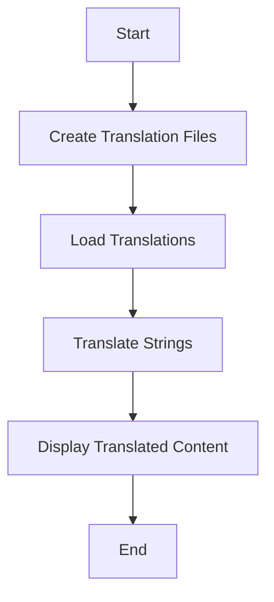

## 26.2 Using Localization Libraries (`erl_gettext`, `linguist`)

Localization is a crucial aspect of modern software development, allowing applications to reach a global audience by supporting multiple languages and regional preferences. In Erlang, localization can be efficiently managed using libraries such as `erl_gettext` and `linguist`. These libraries provide tools for handling translations, managing message catalogs, and integrating language support into applications.

### Introduction to `erl_gettext`

[`erl_gettext`](https://github.com/mbucsik/erl_gettext) is an Erlang library inspired by the GNU `gettext` utilities, which are widely used for internationalization and localization. It provides a framework for managing translation files and message catalogs, allowing developers to easily translate strings within their applications.

#### Key Features of `erl_gettext`

- **Message Catalogs**: `erl_gettext` uses PO (Portable Object) files to store translations. These files contain original strings and their corresponding translations.
- **Plural Forms**: The library supports pluralization, allowing different translations based on the quantity.
- **Contextual Translations**: Developers can provide context for translations, ensuring accuracy in different scenarios.
- **Dynamic Language Switching**: Applications can switch languages at runtime, providing a seamless user experience.

### Managing Translation Files with `erl_gettext`

To use `erl_gettext`, you need to create and manage translation files. These files are typically stored in a `locale` directory within your project. Here's a step-by-step guide to setting up `erl_gettext` in an Erlang application:

1. **Install `erl_gettext`**: Add `erl_gettext` to your project's dependencies in the `rebar.config` file.

   ```erlang
   {deps, [
       {erl_gettext, ".*", {git, "https://github.com/mbucsik/erl_gettext.git", {branch, "master"}}}
   ]}.
   ```

2. **Create PO Files**: For each language you want to support, create a PO file in the `locale` directory. The file should be named according to the language code, e.g., `en.po` for English.

   Example `en.po` file:

   ```
   msgid "hello_world"
   msgstr "Hello, World!"

   msgid "goodbye"
   msgstr "Goodbye!"
   ```

3. **Load Translations**: Use `erl_gettext` to load translations at the start of your application.

   ```erlang
   -module(my_app).
   -export([start/0]).

   start() ->
       erl_gettext:load("locale", "en"),
       io:format("~s~n", [erl_gettext:gettext("hello_world")]).
   ```

4. **Translate Strings**: Use `erl_gettext:gettext/1` to translate strings in your application.

   ```erlang
   io:format("~s~n", [erl_gettext:gettext("goodbye")]).
   ```

### Introduction to `linguist`

[`linguist`](https://github.com/ErlyORM/linguist) is another powerful localization library for Erlang. It offers a more flexible approach to managing translations and supports various formats, including JSON and YAML.

#### Key Features of `linguist`

- **Multiple Formats**: Supports JSON, YAML, and PO files for storing translations.
- **Fallback Mechanism**: Provides fallback translations if a specific translation is not available.
- **Integration with ErlyORM**: Seamlessly integrates with the ErlyORM library for database-backed applications.
- **Dynamic Language Loading**: Allows loading and switching languages at runtime.

### Integrating `linguist` into an Erlang Application

Here's how you can integrate `linguist` into your Erlang application:

1. **Install `linguist`**: Add `linguist` to your project's dependencies in the `rebar.config` file.

   ```erlang
   {deps, [
       {linguist, ".*", {git, "https://github.com/ErlyORM/linguist.git", {branch, "master"}}}
   ]}.
   ```

2. **Create Translation Files**: Create translation files in your preferred format (JSON, YAML, or PO) and store them in a `locales` directory.

   Example `en.json` file:

   ```json
   {
       "hello_world": "Hello, World!",
       "goodbye": "Goodbye!"
   }
   ```

3. **Load Translations**: Use `linguist` to load translations at the start of your application.

   ```erlang
   -module(my_app).
   -export([start/0]).

   start() ->
       linguist:load("locales", "en"),
       io:format("~s~n", [linguist:gettext("hello_world")]).
   ```

4. **Translate Strings**: Use `linguist:gettext/1` to translate strings in your application.

   ```erlang
   io:format("~s~n", [linguist:gettext("goodbye")]).
   ```

### Best Practices for Localization in Erlang

- **Consistent Naming**: Use consistent naming conventions for message IDs across your application.
- **Contextual Information**: Provide context for translations to ensure accuracy.
- **Regular Updates**: Keep translation files updated with new strings as your application evolves.
- **Testing**: Test your application in different languages to ensure translations are displayed correctly.
- **Fallbacks**: Implement fallback mechanisms to handle missing translations gracefully.

### Visualizing the Localization Process

Below is a flowchart illustrating the localization process using `erl_gettext` and `linguist`.



**Description**: This flowchart represents the steps involved in localizing an application using `erl_gettext` or `linguist`. It starts with creating translation files, loading them, translating strings, and displaying the translated content.

### Try It Yourself

Experiment with the provided examples by modifying the translation files or adding new languages. Try switching languages at runtime and observe how the application adapts.

### Knowledge Check

- What are the key differences between `erl_gettext` and `linguist`?
- How do you handle plural forms in `erl_gettext`?
- What formats does `linguist` support for translation files?

### Conclusion

Localization is an essential aspect of building globally accessible applications. By leveraging libraries like `erl_gettext` and `linguist`, Erlang developers can efficiently manage translations and provide a seamless user experience across different languages. Remember, this is just the beginning. As you progress, you'll build more complex and interactive applications. Keep experimenting, stay curious, and enjoy the journey!

## Quiz: Using Localization Libraries (`erl_gettext`, `linguist`)



### What is the primary purpose of `erl_gettext`?

- [x] To manage translation files and message catalogs in Erlang applications.
- [ ] To compile Erlang code.
- [ ] To handle HTTP requests.
- [ ] To manage database connections.

> **Explanation:** `erl_gettext` is used for managing translation files and message catalogs, facilitating localization in Erlang applications.

### Which file format is NOT supported by `linguist`?

- [ ] JSON
- [ ] YAML
- [x] XML
- [ ] PO

> **Explanation:** `linguist` supports JSON, YAML, and PO files, but not XML.

### How can you switch languages at runtime using `erl_gettext`?

- [x] By loading a different translation file with `erl_gettext:load/2`.
- [ ] By recompiling the application.
- [ ] By restarting the Erlang VM.
- [ ] By modifying the source code.

> **Explanation:** `erl_gettext` allows dynamic language switching by loading different translation files at runtime.

### What is a key feature of `linguist`?

- [x] Supports multiple translation file formats.
- [ ] Provides a built-in web server.
- [ ] Manages user authentication.
- [ ] Compiles Erlang code.

> **Explanation:** `linguist` supports multiple formats for translation files, including JSON, YAML, and PO.

### Which library provides a fallback mechanism for missing translations?

- [ ] `erl_gettext`
- [x] `linguist`
- [ ] `erlang`
- [ ] `rebar3`

> **Explanation:** `linguist` provides a fallback mechanism to handle missing translations gracefully.

### What is the purpose of message IDs in localization?

- [x] To uniquely identify strings for translation.
- [ ] To store user data.
- [ ] To manage database connections.
- [ ] To compile Erlang code.

> **Explanation:** Message IDs uniquely identify strings that need to be translated, ensuring consistency across translations.

### How do you handle plural forms in `erl_gettext`?

- [x] By using pluralization rules in PO files.
- [ ] By writing custom Erlang functions.
- [ ] By using JSON files.
- [ ] By recompiling the application.

> **Explanation:** `erl_gettext` handles plural forms using pluralization rules defined in PO files.

### What is a best practice for managing translation files?

- [x] Keep them updated with new strings as the application evolves.
- [ ] Store them in a database.
- [ ] Compile them into the application binary.
- [ ] Ignore them after initial setup.

> **Explanation:** Regularly updating translation files ensures that all strings are translated as the application evolves.

### Which library integrates with ErlyORM for database-backed applications?

- [ ] `erl_gettext`
- [x] `linguist`
- [ ] `erlang`
- [ ] `rebar3`

> **Explanation:** `linguist` integrates with ErlyORM, making it suitable for database-backed applications.

### True or False: `erl_gettext` can only handle English translations.

- [ ] True
- [x] False

> **Explanation:** `erl_gettext` can handle translations for multiple languages, not just English.




