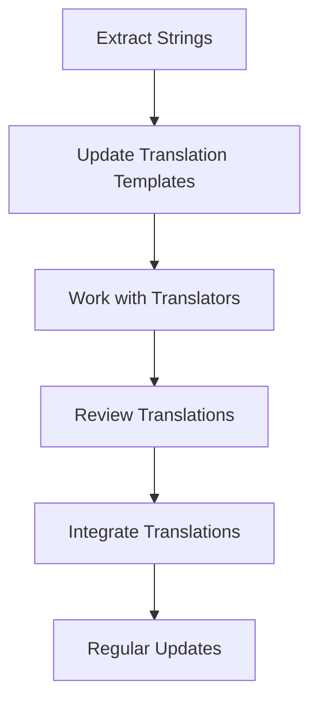

## 26.3 Managing Translation Files

In today's globalized world, creating software that caters to a diverse audience is essential. This involves translating your application into multiple languages, a process known as localization. In Erlang, managing translation files efficiently is crucial to ensure that translations remain accurate and up-to-date. This section will guide you through the best practices for organizing and maintaining translation files, the structure and format of these files, and the tools available to assist in this process.

### Understanding Translation Files in Erlang

Translation files are the backbone of any localization effort. They store the text strings of your application in different languages. In Erlang, these files are typically structured in a way that allows easy access and modification. Let's explore the common formats and structures used in Erlang localization libraries.

#### Structure and Format of Translation Files

Translation files in Erlang are often stored in formats such as `.po`, `.pot`, or `.json`. Each format has its own advantages and is chosen based on the specific needs of the project.

- **PO and POT Files**: These are standard formats used in many localization projects. PO files contain the actual translations, while POT files serve as templates. Each entry in a PO file typically includes a unique identifier, the original text, and the translated text.

  ```plaintext
  msgid "Hello, World!"
  msgstr "Hola, Mundo!"
  ```

- **JSON Files**: JSON is a lightweight data-interchange format that's easy to read and write. It's commonly used for storing translations in a key-value format.

  ```json
  {
    "hello_world": "Hola, Mundo!"
  }
  ```

- **Custom Formats**: Some projects may use custom formats tailored to their specific needs. These formats often provide additional metadata or support complex data structures.

#### Organizing Translation Files

Proper organization of translation files within your project directory is crucial for maintaining clarity and ease of access. Here are some guidelines to help you organize your translation files effectively:

1. **Directory Structure**: Create a dedicated directory for localization files. This keeps them separate from the rest of your codebase and makes them easy to locate.

   ```
   /project_root
   ├── /src
   ├── /include
   ├── /locales
   │   ├── en
   │   │   └── messages.po
   │   ├── es
   │   │   └── messages.po
   │   └── fr
   │       └── messages.po
   ```

2. **Naming Conventions**: Use consistent naming conventions for your translation files. This helps in identifying the language and purpose of each file quickly.

3. **Version Control**: Store translation files in a version control system like Git. This allows you to track changes, collaborate with translators, and revert to previous versions if needed.

### Workflow for Updating Translations

Keeping translations up-to-date is an ongoing process that involves collaboration between developers and translators. Here's a recommended workflow for managing translation updates:

1. **Extract Strings**: Regularly extract new strings from your codebase and add them to your translation files. This ensures that all text in your application is available for translation.

2. **Update Translation Templates**: Use tools like `gettext` to update your translation templates (POT files) with the latest strings. This serves as a reference for translators.

3. **Work with Translators**: Share the updated translation templates with your translators. Provide context for each string to help them understand its usage within the application.

4. **Review Translations**: Once translations are complete, review them for accuracy and consistency. This step is crucial to ensure that the translations align with the intended meaning of the original text.

5. **Integrate Translations**: After review, integrate the translations back into your project. Test your application to ensure that the translations are displayed correctly.

6. **Regular Updates**: Schedule regular updates to your translation files. This helps in catching any new strings that may have been added to the codebase since the last update.

### Tools for Managing Translations

Several tools can assist in managing translations in Erlang projects. These tools streamline the process of extracting, updating, and integrating translations.

#### Translation Management Systems

- **Transifex**: A cloud-based localization platform that supports collaboration between developers and translators. It integrates with version control systems and provides a user-friendly interface for managing translations.

- **Crowdin**: Another popular localization platform that offers features like translation memory, glossary management, and real-time collaboration.

#### Command-Line Tools

- **gettext**: A widely used tool for managing translation files. It provides utilities for extracting strings, updating translation templates, and compiling translations.

  ```bash
  xgettext -o locales/messages.pot src/*.erl
  ```

- **Erlang-specific Tools**: Some Erlang libraries, such as `erl_gettext`, offer built-in support for managing translations. These libraries provide functions for loading and retrieving translations at runtime.

### Maintaining Consistency Across Languages

Consistency is key to a successful localization effort. Here are some tips to maintain consistency across different languages:

- **Translation Memory**: Use translation memory tools to store previously translated strings. This helps in maintaining consistency across similar strings and reduces the workload for translators.

- **Glossary Management**: Create a glossary of common terms used in your application. This ensures that translators use consistent terminology across all translations.

- **Regular Reviews**: Schedule regular reviews of your translations to catch any inconsistencies or errors. Involve native speakers in the review process to ensure cultural appropriateness.

### Visualizing the Translation Workflow

To better understand the translation workflow, let's visualize the process using a flowchart.



**Figure 1**: Translation Workflow in Erlang Projects

This flowchart illustrates the cyclical nature of managing translations, emphasizing the importance of regular updates and collaboration.

### Conclusion

Managing translation files in Erlang requires careful planning and organization. By following the best practices outlined in this section, you can ensure that your translations remain accurate and up-to-date. Remember to leverage tools and platforms that facilitate collaboration and streamline the localization process. As you continue to expand your application's reach, maintaining consistency across languages will be crucial to providing a seamless user experience.

### Try It Yourself

To get hands-on experience with managing translation files, try modifying the code examples provided in this section. Experiment with different file formats and tools to see how they fit into your workflow. Remember, the key to successful localization is continuous improvement and adaptation.

## Quiz: Managing Translation Files



### Which of the following is a common format for translation files in Erlang?

- [x] PO
- [ ] XML
- [ ] CSV
- [ ] YAML

> **Explanation:** PO files are commonly used for storing translations in Erlang projects.

### What is the purpose of a POT file?

- [x] It serves as a template for translations.
- [ ] It contains the actual translations.
- [ ] It is used for testing translations.
- [ ] It stores metadata about translations.

> **Explanation:** POT files are templates that contain the original text strings to be translated.

### Why is it important to use consistent naming conventions for translation files?

- [x] To quickly identify the language and purpose of each file.
- [ ] To reduce file size.
- [ ] To improve translation accuracy.
- [ ] To enhance security.

> **Explanation:** Consistent naming conventions help in organizing and identifying translation files easily.

### Which tool is commonly used for extracting strings from Erlang code?

- [x] gettext
- [ ] Transifex
- [ ] Crowdin
- [ ] Git

> **Explanation:** `gettext` is a command-line tool used for extracting strings from code.

### What is the benefit of using a translation memory?

- [x] It helps maintain consistency across similar strings.
- [ ] It reduces file size.
- [ ] It improves translation speed.
- [ ] It enhances security.

> **Explanation:** Translation memory stores previously translated strings to maintain consistency.

### Which of the following is a cloud-based localization platform?

- [x] Transifex
- [ ] gettext
- [ ] erl_gettext
- [ ] Git

> **Explanation:** Transifex is a cloud-based platform that facilitates collaboration between developers and translators.

### What is the role of a glossary in translation management?

- [x] To ensure consistent terminology across translations.
- [ ] To store translation files.
- [ ] To test translations.
- [ ] To enhance security.

> **Explanation:** A glossary helps maintain consistent terminology across different translations.

### Why is it important to schedule regular reviews of translations?

- [x] To catch inconsistencies or errors.
- [ ] To reduce file size.
- [ ] To improve translation speed.
- [ ] To enhance security.

> **Explanation:** Regular reviews help identify and correct inconsistencies or errors in translations.

### What is the main advantage of using version control for translation files?

- [x] It allows tracking changes and collaboration.
- [ ] It reduces file size.
- [ ] It improves translation speed.
- [ ] It enhances security.

> **Explanation:** Version control systems like Git help track changes and facilitate collaboration.

### True or False: JSON is a common format for storing translations in Erlang.

- [x] True
- [ ] False

> **Explanation:** JSON is a lightweight data-interchange format commonly used for storing translations.



Remember, managing translation files is an ongoing process that requires collaboration and regular updates. Keep experimenting, stay curious, and enjoy the journey of making your application accessible to a global audience!
