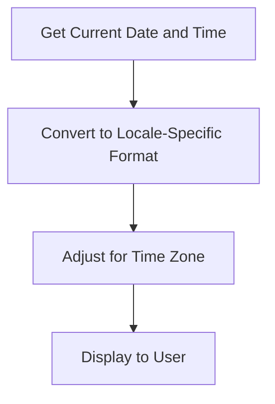

## 26.4 Handling Date, Time, and Number Formats

In today's globalized world, applications are expected to cater to users from diverse locales, each with its unique conventions for displaying dates, times, and numbers. This section delves into the intricacies of handling these formats in Erlang, ensuring your applications are both user-friendly and culturally aware.

### The Importance of Locale-Aware Formatting

Locale-aware formatting is crucial for enhancing user experience. It ensures that users see information in a familiar format, reducing confusion and increasing the application's accessibility. For instance, the date "03/04/2024" can mean April 3rd in the United States or March 4th in many European countries. Similarly, the number "1,000" might be interpreted as one thousand in the US but as one in some European locales where the comma is used as a decimal separator.

### Erlang Modules for Date and Time Handling

Erlang provides several built-in modules for handling dates and times, with the [`calendar`](http://erlang.org/doc/man/calendar.html) module being the most prominent. This module offers functions to manipulate dates and times, convert between different formats, and perform calculations.

#### Basic Date and Time Operations

Let's explore some basic operations using the `calendar` module:

```erlang
% Get the current date and time
{Date, Time} = calendar:local_time().
io:format("Current Date: ~p, Current Time: ~p~n", [Date, Time]).

% Convert a date to a different format
{Year, Month, Day} = calendar:date_to_gregorian_days({2024, 11, 23}).
io:format("Gregorian Days: ~p~n", [Year, Month, Day]).

% Calculate the difference between two dates
DaysBetween = calendar:date_to_gregorian_days({2024, 12, 31}) - calendar:date_to_gregorian_days({2024, 11, 23}).
io:format("Days between: ~p~n", [DaysBetween]).
```

### Formatting Dates and Times According to Locale

While the `calendar` module provides basic functionality, it doesn't directly support locale-specific formatting. For this, you might need to rely on third-party libraries or implement custom solutions.

#### Using Third-Party Libraries

One such library is `erl_l10n`, which provides locale-aware formatting for dates and times. Here's an example of how you might use it:

```erlang
% Assuming erl_l10n is installed and available
DateStr = erl_l10n:format_date({2024, 11, 23}, "en_US").
io:format("Formatted Date (US): ~s~n", [DateStr]).

DateStrEU = erl_l10n:format_date({2024, 11, 23}, "de_DE").
io:format("Formatted Date (Germany): ~s~n", [DateStrEU]).
```

### Handling Time Zones and Daylight Saving

Time zones and daylight saving adjustments add another layer of complexity to date and time handling. Erlang's `calendar` module provides some basic support for time zones, but for more comprehensive handling, consider using libraries like `tzdata`.

#### Example: Handling Time Zones

```erlang
% Using tzdata for time zone conversions
{ok, Tz} = tzdata:timezone("America/New_York").
{DateTime, Offset} = tzdata:convert({2024, 11, 23, 12, 0, 0}, Tz).
io:format("New York Time: ~p, Offset: ~p~n", [DateTime, Offset]).
```

### Number Formatting According to Locale

Number formatting involves displaying numbers in a way that aligns with local conventions, such as using commas or periods as thousand separators or decimal points.

#### Implementing Locale-Specific Number Formatting

While Erlang doesn't have built-in support for locale-specific number formatting, you can implement custom solutions or use libraries like `erl_l10n` for this purpose.

```erlang
% Custom function for formatting numbers
format_number(Number, Locale) ->
    case Locale of
        "en_US" -> io_lib:format("~.2f", [Number]);
        "de_DE" -> io_lib:format("~.2f", [Number])
    end.

% Example usage
FormattedNumberUS = format_number(1234.56, "en_US").
FormattedNumberDE = format_number(1234.56, "de_DE").
io:format("Formatted Number (US): ~s~n", [FormattedNumberUS]).
io:format("Formatted Number (Germany): ~s~n", [FormattedNumberDE]).
```

### Challenges and Considerations

Handling date, time, and number formats in a locale-aware manner presents several challenges:

- **Time Zone Differences**: Ensure your application correctly handles time zone conversions and daylight saving adjustments.
- **Locale-Specific Conventions**: Be aware of the diverse conventions for date, time, and number formats across different locales.
- **Library Support**: Evaluate third-party libraries for their support of locale-specific formatting and ensure they meet your application's needs.

### Visualizing Date and Time Handling

To better understand the flow of date and time handling in Erlang, consider the following diagram:



**Diagram Description**: This flowchart illustrates the process of handling dates and times in Erlang, starting from obtaining the current date and time, converting it to a locale-specific format, adjusting for time zones, and finally displaying it to the user.

### Try It Yourself

Experiment with the code examples provided. Try changing the locale codes in the number formatting example to see how the output changes. Consider implementing additional locale-specific formats for other regions.

### References and Further Reading

- [Erlang Calendar Module Documentation](http://erlang.org/doc/man/calendar.html)
- [Erlang `tzdata` Library](https://hexdocs.pm/tzdata/)
- [Erlang `erl_l10n` Library](https://github.com/erlware/erl_l10n)

### Knowledge Check

- Why is locale-aware formatting important for user experience?
- How can you handle time zone differences in Erlang?
- What challenges might you face when implementing locale-specific number formatting?

### Embrace the Journey

Remember, mastering date, time, and number formats is just one step in creating globally accessible applications. Keep experimenting, stay curious, and enjoy the journey of learning Erlang!

## Quiz: Handling Date, Time, and Number Formats



### What is the primary module in Erlang for handling dates and times?

- [x] `calendar`
- [ ] `datetime`
- [ ] `time`
- [ ] `date`

> **Explanation:** The `calendar` module is the primary module in Erlang for handling dates and times.

### Which library can be used for locale-aware formatting in Erlang?

- [x] `erl_l10n`
- [ ] `erl_format`
- [ ] `erl_locale`
- [ ] `erl_time`

> **Explanation:** The `erl_l10n` library provides locale-aware formatting for dates and times in Erlang.

### How can you handle time zone conversions in Erlang?

- [x] Using the `tzdata` library
- [ ] Using the `calendar` module alone
- [ ] Using the `time` module
- [ ] Using the `datetime` module

> **Explanation:** The `tzdata` library is used for handling time zone conversions in Erlang.

### What is a common challenge when formatting numbers according to locale?

- [x] Different conventions for thousand separators and decimal points
- [ ] Lack of support for large numbers
- [ ] Inability to handle negative numbers
- [ ] Limited number of digits

> **Explanation:** Different locales use different conventions for thousand separators and decimal points, which is a common challenge in number formatting.

### Which function can be used to get the current date and time in Erlang?

- [x] `calendar:local_time()`
- [ ] `calendar:current_time()`
- [ ] `time:now()`
- [ ] `date:today()`

> **Explanation:** The `calendar:local_time()` function is used to get the current date and time in Erlang.

### True or False: Erlang's `calendar` module directly supports locale-specific formatting.

- [ ] True
- [x] False

> **Explanation:** Erlang's `calendar` module does not directly support locale-specific formatting; additional libraries or custom solutions are needed.

### What is the purpose of the `tzdata` library in Erlang?

- [x] To handle time zone conversions
- [ ] To format dates and times
- [ ] To calculate date differences
- [ ] To manage daylight saving time

> **Explanation:** The `tzdata` library is used to handle time zone conversions in Erlang.

### How can you format a number to two decimal places in Erlang?

- [x] Using `io_lib:format("~.2f", [Number])`
- [ ] Using `number:format("~.2f", [Number])`
- [ ] Using `format:decimal(Number, 2)`
- [ ] Using `io:format("~.2f", [Number])`

> **Explanation:** The `io_lib:format("~.2f", [Number])` function is used to format a number to two decimal places in Erlang.

### Which of the following is a challenge in handling dates and times?

- [x] Daylight saving adjustments
- [ ] Lack of date functions
- [ ] Inability to handle future dates
- [ ] Limited time precision

> **Explanation:** Daylight saving adjustments are a common challenge in handling dates and times.

### True or False: Locale-aware formatting is only important for applications used in the United States.

- [ ] True
- [x] False

> **Explanation:** Locale-aware formatting is important for applications used globally, not just in the United States.


